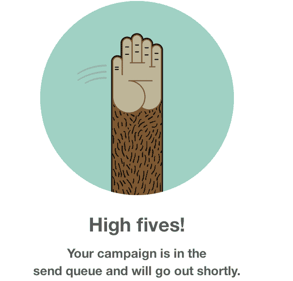
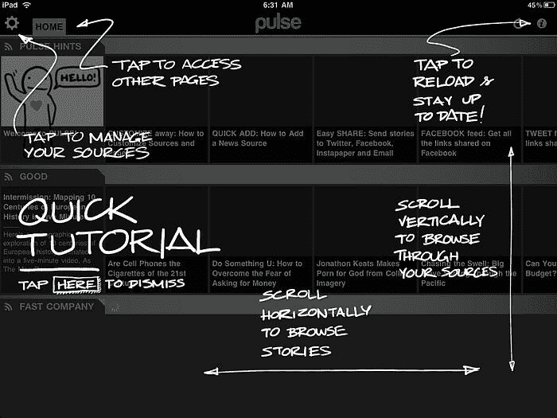
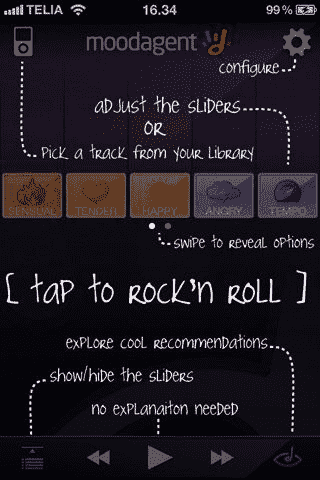

# 用户入职的 5 个最大错误

> 原文：<http://web.archive.org/web/20230307163032/https://www.netguru.com/blog/5-biggest-mistakes-in-user-onboarding>

 将全新客户转化为回头客、活跃用户和固定用户可能是任何企业的终极挑战。无论你是在餐饮业，卖二手车，还是为你挑剔的客户开发新的应用程序和软件，你提供的服务和产品的第一时间体验就是一切。

虽然不一定容易，但提高品牌知名度并说服客户第一次抓住你的机会是相对简单的——社交媒体营销可以覆盖许多基础，让你的品牌“在那里”只是一个创造性坚持的问题。

但是，一旦你建立了自己的网络形象，人们开始品尝你的食物，试驾你的汽车，或者下载你的应用程序，现在就是赢得或失去回头客的时候了，你的企业的真正声誉要么成功，要么失败。

是的，这是 [用户入职](http://web.archive.org/web/20221225121330/https://www.netguru.com/blog/great-user-onboarding) 阶段，也是整个转化过程中最危险的阶段之一。如果菜单和价格在你的餐馆里变得不必要的复杂，你的顾客可能不会喜欢这些食物。如果二手车销售人员在试驾过程中不能保持安静，那么潜在客户就不会享受试驾的乐趣。

当谈到让新用户加入数字平台时，需要协商的地方就更多了。但是，与其为你自己寻找这些是什么，不如你有先见之明绕过它们，这正是我们写这篇博文的原因……

## 不惜一切代价避免的 5 个最大的用户入门错误

### #1。向用户请求过多信息

这是一个非常常见的错误，从应用程序到联系表单再到登录页面，这种错误随处可见。对于一个潜在的新用户来说，没有什么比被一个长得离谱的表格打断更令人沮丧的了，这个表格要求填写姓名、电子邮件、出生日期、国籍、职业和内腿尺寸。这些信息在入职阶段几乎毫无用处。的确，这些信息在你以后尝试追加销售时会变得有用，但目前，你希望你的用户拥有的只是一个很棒的初次体验。所以， **暂且匿名** 。

## #2。没有用户参与

出色的用户入门通常会附带一个迷你的可选教程，供用户在学习产品的基础知识时使用。然而，做这件事有好的方法和坏的方法——你可能犯的最严重的错误之一就是没有让用户参与进来。随着用户的学习，你需要确保他们得到“成功”信息的奖励，并知道完成下一阶段的好处。事实上，新用户不希望在教程上停留太久，因此，不仅教程需要简短，还需要有某种指示他们正在取得的进展的指标。

[帮侦察兵博客](http://web.archive.org/web/20221225121330/http://www.helpscout.net/blog/user-onboarding-mistakes/) 是这样说的:

> “我觉得奇怪的是，在很多情况下，当一个用户不顾一切地在别人的应用程序中记录了他们的第一次真正的胜利，公司却没有去庆祝。用户完成一项重要任务的那一刻，是你在他们和你的公司之间建立积极情感联系的绝佳机会。”
> 
> “通过承认他们的进步并给他们一个形象的击掌，让你的用户知道他们做得很好！”

### 

[美钦高五](http://web.archive.org/web/20221225121330/http://mailchimp.com/)

### #3。一个屏幕上信息太多 

你对你的应用感到满意，你对 bit 感到兴奋，因为它不仅能做 A、B、C，还能做 X、Y 和 Z，你急切地想让你的新用户知道一切。但是，不幸的是，当你试图将所有这些信息塞进一个太小的空间时，你所做的就是创建一个过度拥挤的屏幕，这将看起来杂乱无章，非常令人不快。举例来说，这对于一个新用户来说是太多的信息了。

的确，与其一开始就把所有这些信息都告诉你的用户，你真正需要的是“快速获得惊喜”的因素。有一个来自[恒接触](http://web.archive.org/web/20221225121330/http://www.constantcontact.com/index.jsp)的盖尔古德曼的[伟大演讲](http://web.archive.org/web/20221225121330/http://businessofsoftware.org/2013/02/gail-goodman-constant-contact-how-to-negotiate-the-long-slow-saas-ramp-of-death/)。她描述了“哇！”当用户理解了一个结果并被它所震撼的时候，同时体验到它的乐趣。下面是她的演讲视频(50 分钟)。

#4。假设用户能够“搞清楚”

没错，一些新用户讨厌在教程中跳来跳去，不管应用程序有多复杂。但是，其他人实际上喜欢花 30 秒左右的时间来掌握基本知识。这就是为什么首先要有一个教程，其次要让它可选。最好的建议是让教程自动出现，给用户一个清晰的选项，如果他/她想的话，可以“跳过这一步”。

#5。不征求反馈

##### 这是一句老话，但是假设真的会让“你”和“我”变成“蠢驴”。许多新应用的创造者和发行者认为，因为 *他们* 知道应用如何工作，那么其他人也会知道。作为专员或创建者，你将是整个创建过程的一部分，因此，从你的经验(和对你孩子的热情)中，你将知道如何最有效地利用应用程序。然而，你要说服的是你的用户，这意味着你需要在尽可能早的阶段征求反馈。只有倾听用户的意见，并根据他们的建议进行修改，你才能将你的应用从潜在的伟大变成真正的伟大。

你熟悉预期设计吗？它的前提是选择越少越好。它的主要优势是技术预见了你的一举一动，所以你不必自己做出选择。详情及实例阅读更多:[为什么少(选项)就是多——预期设计 101](/web/20221225121330/https://www.netguru.com/blog/anticipatory-design-part-1)

### #5\. Not Soliciting Feedback

It’s an old saying, but to assume really does make an ‘ass’ out of ‘u’ and ‘me’. Many creators and distributors of new apps believe that because *they* know how the app works, then everyone else will as well. As the commissioner or creator, you will have been a part of the whole creation process, and so, from your experience (and enthusiasm for your baby) you will know how to make the most efficient use of the app as it stands. However, it’s your users who you are trying to convince and onboard, and that means that you need to solicit feedback at the earliest possible stage. **Only by listening to your users and making the alterations that they suggest will you whittle down your app from something potentially great, to something actually great.**

Are you familiar with Anticipatory Design? It's based on the premise that less (choice) is more. Its main advantage is that technology anticipates your every move, so you don't have to make choices by yourself. Read more for details and examples: [Why Less (Options) is More - Anticipatory Design 101](/web/20221225121330/https://www.netguru.com/blog/anticipatory-design-part-1)