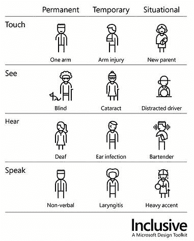
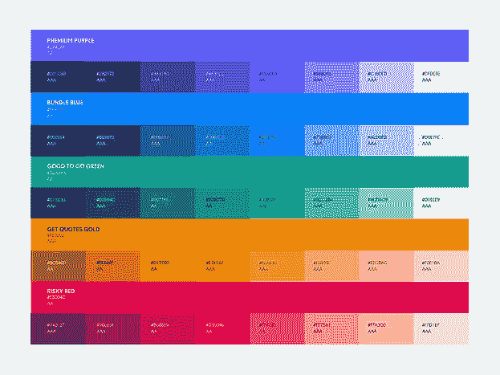
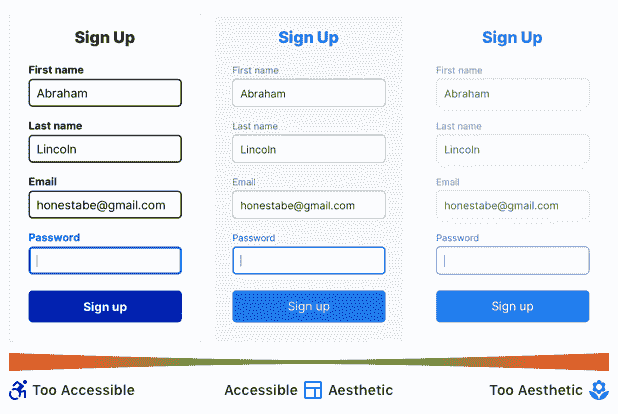
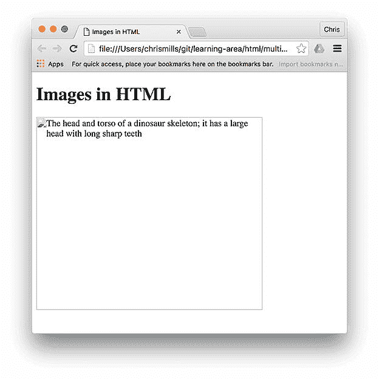
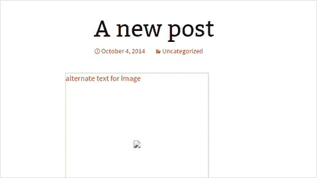
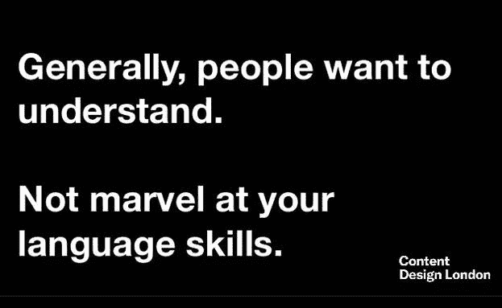
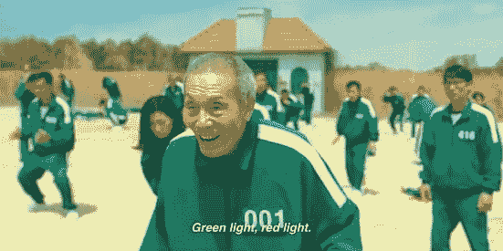
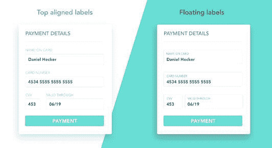

# 可访问性不仅仅是对比

> 原文：<http://web.archive.org/web/20230307163032/https://www.netguru.com/blog/accessibility-more-than-contrast>

 各种商业环境鼓励我们认识和赞美其他文化和人群。这也让我们更加了解残疾人以及他们在访问网络或使用数字产品时可能遇到的问题。

在 Netguru，我们关心可访问性及其作用——我们的目标是创造每个人都可以使用和访问的产品。通常，这意味着确保数字产品能够为那些原本根本无法使用它们的人所用。有时这些只是微小的变化——比如使用正确的对比度。然而，可访问性远不止于此。

它可以提高产品对每个人的可用性:对于那些在明亮的阳光下使用手机的人——有合适的对比度；对于那些在公共场所的人——有字幕；对于那些网络连接不好的人——使用替代文本等。

## 什么是可访问性？

总的来说，数字世界的无障碍意味着确保残疾人能够使用数字解决方案。这包括听觉、视觉、言语、身体和认知、学习和神经残疾。

让数字世界变得无障碍是一件体面的、人性化的事情——仅此一点就足够了。

但事实往往并非如此，所以让我们看看为什么可访问性应该成为我们关注的问题的其他原因:

1.  世界人口的 15%([超过 10 亿人](http://web.archive.org/web/20220926194901/https://www.who.int/news-room/fact-sheets/detail/disability-and-health)！)带着某种残疾生活。创建不可访问的解决方案意味着你不让他们使用你的产品。是的，残疾人是你的目标群体，并且使用(或试图使用)你的产品。并非所有的残疾都是可见的，某些残疾在谷歌分析统计中无法观察到。
2.  研究表明，残疾人是非常忠诚的顾客。一旦他们找到了考虑到他们需求的解决方案，他们并不真的愿意改变它或尝试新的解决方案。
3.  All of us become temporarily or situationally disabled sometimes due to an accident or circumstances like bright sunlight, a loud environment, etc. Roughly 20% of internet users will have or will develop a form of disability throughout their lifetime. It has been beautifully captured by Inclusive: A Microsoft Design Toolkit.
    

    微软的包容性残疾解决方案:微软设计工具包。

4.  我们为未来的自己设计。如果我们不认真对待可访问性，当我们长大后，没有人会为我们创建可访问的软件。
5.  我们讨厌这个原因，但有时这是唯一可行的原因:在一些国家，法律强制要求访问数字产品，尽管法律有时不是很明确，但巨额罚款并不罕见。目前，这种现象在美国和加拿大最为常见，但欧盟国家也在朝着同样的方向发展。

## 好的，让我们看看对比的作用

保持正确的对比度是 WCAG 准则之一。如果你不知道 WCAG 准则是什么，它们是软件创作者应该遵循的一套标准，以确保他们的产品对每个人都是可访问的。元素(主要是文本和背景)的最小对比度是指导方针之一，并且经常被认为是唯一的一个。

对比度对于确保应用程序或网站的可读性至关重要，而且也很容易实现。像 Pika 这样的颜色选择器和像...嗯……对比检查，你的朋友在这里，老实说，没有理由不选择适当的颜色组合。

对于 AA(中等)级 WCAG 一致性，文本与背景的对比度应为 4.5:1(对于大字体，可以更小，为 3:1)。以一种漂亮的方式实现并不是很难——看看下面斑马做的调色盘。创建辅助调色板的另一个选项是使用颜色安全工具。

这是一个由斑马创造的美丽且易于使用的调色板的例子..

然而，可访问的网站往往是丑陋的！然而，这并不是因为 WCAG——正如你将在本文中看到的，许多辅助功能是不可见的。保持对比不会神奇地让网站变得丑陋——考虑下面这个例子，它来自一篇关于[审美-可及性悖论](http://web.archive.org/web/20220926194901/https://uxmovement.com/thinking/the-aesthetic-accessibility-paradox/)的精彩文章。

中间的形式是一个容易理解且审美愉悦的设计的例子。

对比是一个简单的解决办法，也是一个很好的起点。为了以可访问性开始你的旅程，并确保数字产品至少基本上考虑到所有用户的需求，你需要多一点努力。

继续读下去，看看如何开始以一种有意义的方式实现可访问性，并且经常在你的网站上看不到它！

## 让您的数字产品更易访问

### 图像的替代文本

Alt text 允许屏幕阅读器和其他辅助技术阅读图像的描述或跳过它(如果图像纯粹是装饰性的)。否则，屏幕阅读器将读取图像的源路径，正如您可能想象的那样，这对用户来说通常不是很有用。

替代文本在网站上不可见。它是在代码中设置的，但通常需要由设计师、编辑或企业所有者交付给开发人员。

根据上下文的不同，同一张图片可能会有不同的描述 —主要是因为我们不希望替代文本重复网站或文章中已经说过的信息。

替代文本不仅对使用屏幕阅读器的人有用，对那些网络连接不好但仍想了解网站内容的人也有用。

写得好的 alt 文本可以帮助我们理解图像中的内容，即使我们看不到它。

来源:MDN 网络文档

没有替代文字就无法理解图片中的内容。

来源:创意混合

术语

每个行业都有自己的行话，对于业外人士来说可能无法理解。将它保持在最低限度，这样就没有人(或感觉)被排除在外，提高了内容的可读性，让更多的人可以理解，从而为他们带来更多的价值。

这方面的其他良好实践包括:保持导航和内容结构简单；添加图像、视频或交互式内容来解释复杂的主题；以及扩展第一次出现在文本中的首字母缩写词和缩略语。这些网站不仅为有认知障碍的人服务，也为那些用外语阅读的人、匆匆忙忙的人或经历认知超负荷的人服务，这些日子我们许多人都在与认知超负荷作斗争。

Source: Creative Blend

### Lingo

来源:[可访问性是可用性展示](http://web.archive.org/web/20220926194901/https://pt.slideshare.net/SarahRichards2/accessibility-is-usability-141044747/28)

语言

说到语言——屏幕阅读器可以阅读多种语言的文本，但是为了正确阅读，他们需要知道一个站点使用的是哪种语言。这是由网站代码中的“lang”属性设置的(同样，这个属性对于访问者是不可见的)。Steve Faulkner 下面的视频显示了屏幕阅读器的发音如何受到设置错误语言属性的影响—文本是英语，但属性设置为西班牙语、法语和德语。这样一来，访问者可能无法理解文本内容——自己听吧！

字幕

字幕允许聋人和重听人访问网站上的音频或视频内容。尽管他们不是唯一受益于这种解决方案的人。根据[这项调查](http://web.archive.org/web/20220926194901/https://www.streamingmedia.com/Articles/ReadArticle.aspx?ArticleID=131860)，80%使用字幕的人没有任何听力障碍。在嘈杂拥挤的环境中，任何人都可以使用字幕，而不是听视频中的声音。69%的受访者在公共场合观看没有声音的视频，令人惊讶的是， 25%的人在私下观看没有声音的视频。

### 另一个角度是，例如，看一部有字幕的外语电影，因为不是演员说的每一句话都是可以理解的。这对我来说当然是真的，谢谢网飞！哦，实际上，网飞因为在他们的电影中没有隐藏字幕而被起诉。

Speaking of language — screen readers can read text in many languages, but to do it correctly, they need to know what language a site is in. This is set by the "lang" attribute in the website’s code (and again, this attribute is invisible for the visitors). Steve Faulkner’s video below shows how a screen reader’s pronunciation is affected by setting the wrong language attribute — the text is in English, but the attribute is set to Spanish, French, and German. This way, the text might not be understandable for the visitors — listen for yourself!

### Captions

截图自网飞系列“祛魅”。

The other angle is, e.g., watching a movie in a foreign language with subtitles, because not everything that actors say is understandable. It certainly happens for me, thanks Netflix! Oh, and actually, Netflix was sued for not having closed captions in their movies.

截图来自网飞系列“乌贼游戏”。

音频描述

这与上面的问题类似。任何视频内容或视觉信息都应该为盲人和弱视者提供音频描述。如果你想到我们中有多少人因为长时间呆在电脑前而导致视力下降，这就更有道理了。此外，音频描述对于不能看屏幕的人也很有用，比如司机。

标题

标题允许人们决定是否要阅读页面。对于有视力的人来说，它们通常很容易被发现——突出、大、粗体等。对于我们这些使用辅助技术的人来说，标题的风格可能不会那么明显。标题标签(

# 、

## 等)。)允许辅助技术理解这个元素是一个标题(和它的级别)并将其传达给用户。标题标签是另一个对用户至关重要的不可见元素。

### 看看苹果无障碍网站的这个标题(H1)就知道了。

键盘访问

### 使用鼠标需要手眼协调，因此不适用于视力低下、颤抖或有协调问题的人。许多辅助技术依赖于键盘访问并产生击键作为它们的输出，例如，语音输入软件或吸呼软件。

这使得键盘成为残障人士和其他人使用鼠标或触控板时最容易操作和最灵活的方式。因此，网站或应用程序中的所有功能都应该可以使用键盘来实现。给出键盘焦点的清晰视觉指示器也很重要(即向用户显示他们的键盘当前聚焦的位置)。

标签是表格字段的一种替代文本。由于有了标签，屏幕阅读器知道用户需要什么样的输入，并可以支持他们输入正确的值。

表单域附近的可见标签是当今互联网的标准。他们确保视力正常的用户知道什么信息应该输入哪个字段。<标签>标签被设置在代码中，对于访问网站的人来说是不可见的，但是对于使用屏幕阅读器的人来说却是同样的目的。

### Keyboard access

Using a mouse requires hand-eye coordination, so it’s not adequate for people with low vision, tremors, or problems with coordination. A lot of assistive technologies rely on keyboard access and create keystrokes as their output, for example, speech input software or sip-and-puff software.

两个版本的可见标签以一种形式发布在 UX 星球上。代码中的标签对于屏幕阅读器来说扮演着同样的角色。

### 可访问性应该是你的新要求

每个人都可能在某个时候被禁用(即使是在特定情况下)，因此您的解决方案应该始终满足这些用户的需求。更何况，让数码产品无障碍真的没那么难。更不用说易访问性与可用性紧密相连，提高易访问性会给所有访问你的网站或使用你的软件的人带来好处。结果？你的[产品会赢得忠诚的长期客户](/web/20220926194901/https://www.netguru.com/blog/steps-in-building-digital-product-from-scratch)，他们会很乐意推荐它。

我希望这篇文章对创建可访问软件的一些方面有所帮助。更重要的是，它让你看到可访问性不仅仅是颜色对比。我们在本文中所经历的仅仅是对可访问性和 WCAG 准则的一瞥。如果你想了解更多关于可访问产品的信息，可以从查阅 WCAG 指南开始，或者通过 Netguru 联系我们。我们可以共同努力，让您的数字解决方案更易于使用。

Two versions of visible labels in a form published on UX Planet. <Label> tag in the code plays the same role for screen readers.

## Accessibility should be your new must

Everyone can at some point be disabled (even situationally), so your solution should always meet the needs of such users. What’s more, making digital products accessible is really not that hard. Not to mention that accessibility is tightly connected to usability and improving it will bring benefits to all the people visiting your website or using your software. Results? Your [product will gain loyal, longtime customers](/web/20220926194901/https://www.netguru.com/blog/steps-in-building-digital-product-from-scratch) who will be happily recommending it.

I hope this article serves as a useful intro to some of the aspects of creating accessible software. And more importantly, that it allows you to see that accessibility is more than just color contrast. What we went through in this article is a mere glimpse into accessibility and the WCAG guidelines. If you wish to learn more about accessible products, start by checking out the WCAG guidelines or reach out to us here at Netguru. Together we can make your digital solution more accessible.