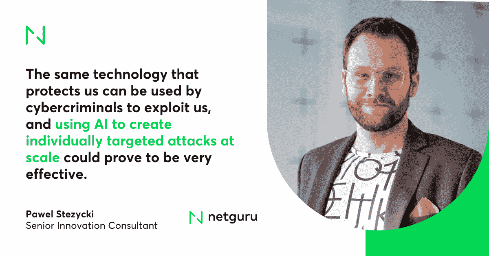

# 在金融中使用 AI？考虑这四个道德挑战

> 原文：<http://web.archive.org/web/20230307163032/https://www.netguru.com/blog/ai-in-finance-ethical-challenges>

 几周前，关于限制人工智能(AI )的法规的新闻从欧盟议员那里泄露出来，成为头条新闻。现在，他们的提案是一份官方的百页文件，涵盖了人工智能的系统、过程和发展。

欧盟和欧委会为什么把矛头对准 AI？我们应该担心吗？超级机器人会成为威胁吗？《终结者》只是一部来自未来的纪录片吗？

到目前为止，我们知道人工智能和相关技术——如机器学习算法——有能力成为改变世界的力量，但幸运的是，它还远远没有成为一个有自我意识的超级人工智能系统。这种技术变革意味着它可以提供更多的力量和金钱——人工智能系统有潜力提供额外的全球经济活动，到 2030 年 约为13 万亿美元。

据麦肯锡&公司称，在全球银行业，人工智能技术预计每年将为金融专业人士和组织带来高达1 万亿美元的额外价值。这一价值的一半以上将来自销售和营销活动的收益，如更好的客户服务管理和渠道管理，其次是欺诈和债务分析等风险管理功能的进步，最终为证券交易、资产管理、投资组合管理和整体业务决策提供更好的决策。

AI 给商业带来的 [好处是不可否认的](http://web.archive.org/web/20221206220104/https://www.netguru.com/blog/ai-banking-sector) 。从改进的欺诈检测和非结构化数据分类，到增强的反洗钱(AML)流程、更快的承保和更高效的客户服务，以人工智能为基础的智能自动化正在改变金融服务行业。

然而，另一方面，它的使用也带来了不良后果的严重风险——有些甚至还没有想到——这可能会对社会和我们的生活方式产生影响。这就是为什么每当我们在 Netguru 承担与 AI 相关的项目时，我们都会从各种角度看待它们，考虑它们的挑战，并检查这些项目可能产生的影响以及它们是否可以被视为不道德的。

在这篇文章中，我们关注人工智能的进步提出的四个关键的伦理问题，并邀请你考虑你自己的涉及人工智能系统和机器学习的技术项目中的伦理问题和挑战。

## 1.提出建议和影响选择之间的界限在哪里？

在我们的日常在线活动中，我们允许访问大量数据。人工智能可以很容易地跟踪它，处理它，并有效地影响特定的决策。几十年来，广告驱动的营销一直在为产品和政治服务，但现在，人工智能系统已经变得惊人地擅长于此，围绕道德、风险和责任提出了一些问题。

由于我们无法控制谁在使用人工智能算法，我们似乎受到任何出于任何目的使用它的组织的支配。剑桥分析公司(Cambridge Analytica)丑闻——美国总统选举中用于针对选民的数据泄露——是对肆无忌惮地使用人工智能和大数据的危险的第一个警钟。

幸运的是，人工智能只有在获得大量相关数据时才会变得强大，但这让最大的社交媒体和电子商务公司受到了关注。欧盟最近的提案显然旨在对这些公司处以高达其全球年营业额 6%的罚款。

监管将影响[银行业和金融科技](/web/20221206220104/https://www.netguru.com/blog/financial-inclusion)，禁止使用人工智能来评估社会信用评分——通过社会行为或预测的性格特征来评估一个人的可信度——或求职者的简历。

欧盟政府遵循的逻辑是，基于人类判断的预测性人工智能算法不应被自由用于做出考虑个人的关键“黑白”决定。这将对社会运作产生太大的影响，甚至可能是不公平的。

## 2.我们如何阻止人工智能应用程序被用于恶意目的？

人工智能已经成为创新银行和金融服务公司的福音，它们利用人工智能保护客户的资金，并执行反洗钱法律法规。每天，机器人都会审查数以百万计的金融操作，以监控可疑模式，并向网络安全和反洗钱官员报告。

但 AI 是一把双刃剑。保护我们的技术也可以被网络犯罪分子用来利用我们，使用人工智能技术来大规模地创建单独的目标攻击可能会被证明是非常有效的。想象一下，一个人工智能驱动的骗子同时与数百万人聊天，并训练每次对话都更加有效。

我们需要担心的不仅仅是蓄意的恶意行为——意外的副作用也同样令人担忧。想想看，为了最大化观看时间，YouTube 的算法学会了通过推广反媒体内容来诋毁其他形式的媒体。它本来可以实现让观众留在平台上的目标，但以什么社会成本为代价呢？

当我们开发新的人工智能系统时，我们如何确保它们只用于好的方面？例如，波士顿动力公司在其销售条款中严格强调其机器不能用作武器。也许是时候考虑一种类似的方法和算法跟踪，将伦理考虑融入到它们的设计中。

## 3.我们如何防止技术造成伤害？

人工智能模型越来越多地被用来帮助开发自动驾驶汽车。2018 年，一辆优步自动驾驶测试车撞死了一名正在过马路的行人。美国国家运输安全委员会的调查结果显示，直到撞击前，汽车未能识别行人是否有碰撞风险。最近，两名男子在他们的无人驾驶特斯拉汽车撞上一棵树并起火时丧生。

这些人工智能系统中有缺陷的自动化软件造成伤害的例子令人震惊，随着自动驾驶汽车变得更加广泛，我们可能会看到更多由技术引发的致命事故。但即使在金融服务领域，人工智能也带来了非常现实的危害风险。在世界经济论坛的一项调查中，58%的受访者表示担心人工智能的大规模采用会增加金融系统中偏见和歧视的风险。

例如，金融机构或金融科技公司使用机器学习算法来做出信贷限额决策，可能会无意中加入历史金融数据中包含的人类偏见。

因此，有色人种、年轻人或单身女性申请人可能会因使用错误数据的机器学习的应用而处于不公平的不利地位。这就引出了一个问题，谁最终要为人工智能驱动的软件的有害错误负责？我们应该让生产者、开发者或测试者对新技术负责吗？有时候，人工智能模型中使用的计算系统可以做出无法解释的决定。这就是所谓的黑箱效应。

同样，在一个已经高度监管的行业，新的法律正在制定中。金融机构应该预料到，这可能也适用于高频算法交易的机器人顾问。从监管的角度来看，这些解决方案在市场稳定性方面可能被视为高风险，因此将接受风险评估和缓解流程。

## 4.我们如何保障就业和平衡财富分配？

随着高级人工智能自动化的前景以及随之而来的效率提高，数百万办公室和后端工作人员面临失业的威胁。银行业可能会受到特别严重的打击。根据富国银行(Wells Fargo)在一份报告中发布的数据，由于引入人工智能驱动的金融技术，仅在美国，未来十年就将有 20 万个银行工作岗位流失到机器人手中。

我们将拥有在这个星球上最大的公司的 IT 实验室中开发的算法，而不是成千上万的员工被征税并在当地分配他们的收入。也许我们应该像对待人类工作一样对自动劳动征税？ 我们不再需要的工人会怎么样？ 它们会成为人工智能应用的‘人类副驾驶’吗？

尤其是替换人类决策者的问题，促使许多人呼吁建立普遍基本收入以保护失业工人，并建立道德框架以指导人工智能的发展。

除了道德方面，还有关于民主和经济的问题。如果没有消费者，谁来创造消费需求？我们会在社会上产生什么样的紧张关系？

## 保护未来(在为时已晚之前)

随着人工智能解决方案的广泛应用，关于其使用的伦理问题变得越来越重要。尽管人工智能是一个前所未有的转型机会，但进步正在以令人难以置信的速度发生，不幸的是，人类往往太晚看到技术突破的不利后果。

因此，尽管政府和监管机构最终将对人工智能系统和算法的道德使用拥有最终发言权，但就目前而言，我们都有责任维护道德和价值观，让人工智能实现更美好未来的承诺。