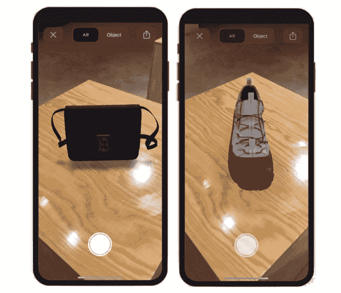
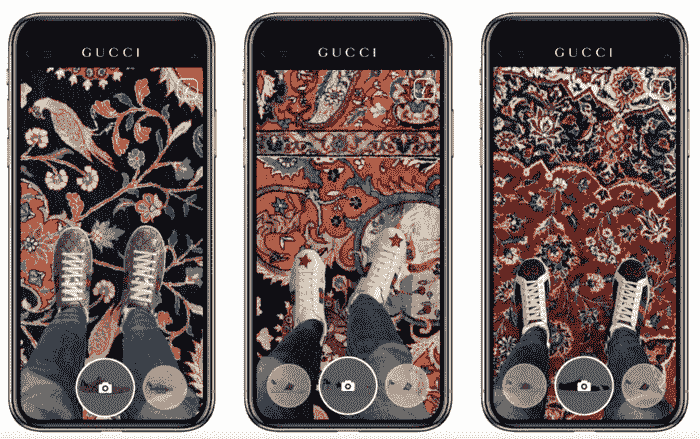
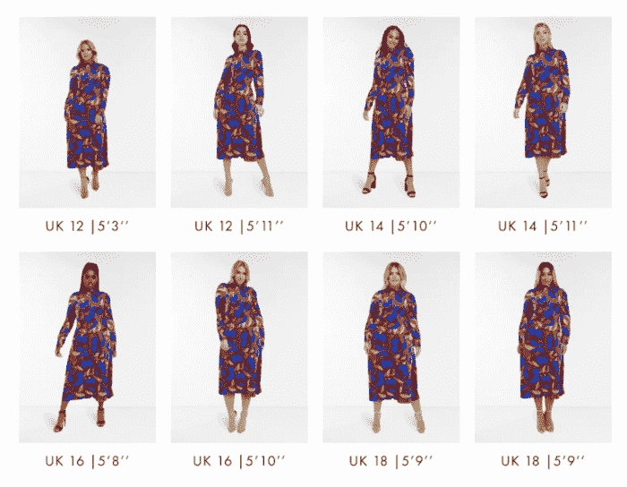
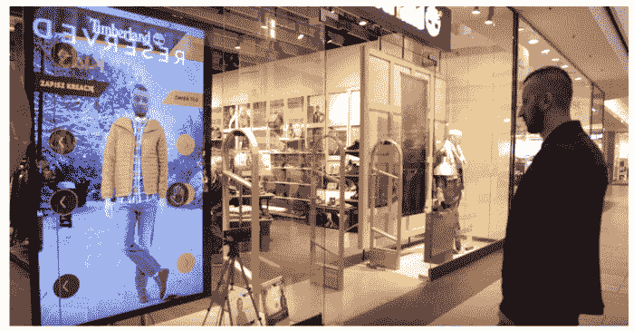
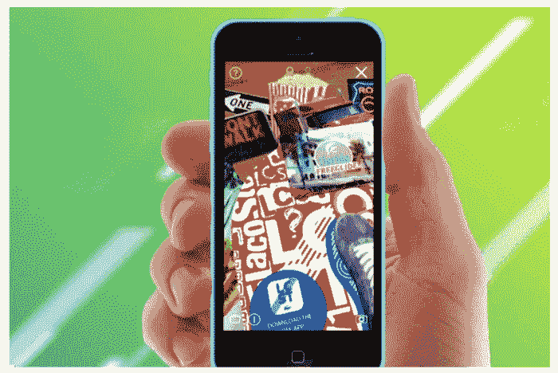

# 时装零售中增强现实的 5 个例子

> 原文：<http://web.archive.org/web/20230307163032/https://www.netguru.com/blog/augmented-reality-fashion-retail-examples>

 时尚界的增强现实(AR)是一种已经实验了十年左右的现象，但还没有达到我们目前看到的能力。

如今，该部门正迅速学会利用现实世界的增强版来为自己谋利。时尚界的 AR 技术可以改善顾客体验并促进销售。它们提供了一种全新的体验产品的方式，让顾客在整个购物过程中更加关注品牌。

什么是增强现实？一种通过智能手机、平板电脑或其他支持的电子设备将虚拟图像叠加到现实世界的技术。增强现实是如何工作的？当你启动智能手机上的相机拍照或录制视频时，AR 工具会向帧中添加一个实际上并不存在的对象。

[增强现实在时尚](/web/20221122185308/https://www.netguru.com/services/virtual-try-on-software)中是如何运用的？该技术允许时尚品牌扩展他们的客户群和产品线，使购物体验更具互动性，为消费者创造一个有趣的元素。

现在，让我们来看看时装零售中最佳增强现实的例子。

## 1.博柏利:通过 AR 提高客户参与度

在讨论时尚产业的创新时，不可能不提到博柏利。这家以风衣闻名的英国时装屋很有创意，它使用 AR 来留住客户和推广品牌。请继续阅读一些标志性公司最成功的 AR 努力。

### 丹尼·桑格拉开发的增强现实时尚应用

博柏利与艺术家丹尼·桑格拉(Danny Sangra)合作，为他们的 iOS 应用程序中的专用 AR 功能创作了“受博柏利启发”的绘画。该应用程序将电子商务商店与交互式品牌功能相结合。通过 AR 组件，用户通过将 Danny Sangra 的图像添加到他们的图片上来装饰他们的周围环境，然后在社交媒体上分享这些图像，帮助该品牌接触到新的消费者。

高端零售商越来越注重在网上接触顾客。为什么？波士顿咨询集团(Boston Consulting Group)表示，如今三分之二的奢侈品购买受到了数字化的影响。AR 是向客户提供引人入胜的交互式数字体验的绝佳方式，让购物者以新鲜和令人兴奋的方式体验品牌。

### AR 驱动的谷歌购物体验

博柏利与谷歌的合作是时尚零售领域增强现实的另一个例子。它巧妙地将店内购物体验直接带到了购物者的数字设备上。由于这一举措，博柏利向在线搜索的顾客提供了他们的黑色 TB 包和 Arthur Check 格子运动鞋的 3D 图像。通过在谷歌上输入相关的产品名称，消费者发现了这些商品的 3D 图像。

图片来源:博柏利 PLC。

与谷歌的合作让博柏利接触到更多的潜在客户。怎么会？他们以前提供产品的 3D 图像，但只能通过他们的专用应用程序或网站。与谷歌合作拓宽了零售商的覆盖范围。

此外，该解决方案不仅创造了更加互联的体验和[增强的个性化奢侈品商务](http://web.archive.org/web/20221122185308/https://www.burberryplc.com/en/news/corporate/2020/burberry-brings-products-to-google-search-through-augmented-real.html)，还管理了顾客对商品的期望。这使得购物者能够在购买前更真实地查看产品，不再需要亲自去商店直接与商品互动，并可能降低退货的可能性。

### 利用弹出式 AR 构建品牌效应

时尚零售中的 AR 不一定要专注于销售:博柏利在各个地方使用增强现实来创造品牌能量。

2019 年，他们在伦敦东部一个受欢迎的购物点 Ely's Yard 提供了一个很酷的 AR 体验，在玻璃盒子里安装了三只大型陶瓷小鹿。当路人用谷歌镜头应用扫描小鹿时，他们在手机上看到了自己和动物的鸟瞰图。

图片来源:博柏利 PLC。

同年，博柏利在日本银座店创造了另一种 ar 体验。通过扫描店内展示的二维码，游客激活 AR 镜头，在东京高档社区的街道上寻找隐藏的博柏利小鹿。在这两个案例中，用户都在他们的社交媒体渠道上分享了照片。

### 沉浸在虚拟世界中的客户

将增强现实引入其营销活动给了博柏利一个竞争优势。过去，高端品牌依靠电子商务销售中低档奢侈品——他们认为在线渠道不适合高端品牌销售，认为客户只能在实体店获得个性化体验。

然而，这一信念被证明是错误的。博柏利邀请顾客进入一个全新的数字世界，他们愉快地跟随。如今，购物者沉浸在数字世界中，越来越多地在网上购买奢侈品。该品牌在中国已经有了坚实的客户基础，在中国[几乎 80%的购买是通过移动设备](http://web.archive.org/web/20221122185308/https://techwireasia.com/2020/03/burberry-ups-its-marketing-game-with-augmented-reality/)。因此，豪华品牌不应该低估在线渠道促进销售的力量。

据麦肯锡称，到 2025 年，五分之一的奢侈品购买将在网上进行，消费者将热情拥抱数字生活方式。此外，如今，几乎 80%的奢侈品销售都受到数字渠道的影响。

## 2.古驰:几乎可以在家试穿鞋子

古驰创建了一个由 AR 技术支持的 iOS 应用程序，使客户能够远程和虚拟地试穿其 Ace 运动鞋系列。意大利品牌在全球封锁时代之前的 2019 年推出了该解决方案。从那以后，在实体店长期关闭的时候，这被证明是推动销售的最有效的方法之一。顾客越来越多地选择网上购物；这种趋势很可能会持续下去。

古驰还更进一步，与 Snapchat 合作，通过多媒体即时通讯应用程序提供虚拟试穿体验。这一明智之举极大地提高了客户参与度，为推动销售开辟了新的渠道。古驰是第一个与社交媒体平台合作的奢侈时尚品牌,利用 AR 工具推动销售。

*图片来源:VentureBeat*

古驰品牌和客户参与执行副总裁 Robert Triefus 说，这家时装公司的理念是为顾客带来身临其境的购物和娱乐体验。古驰寻求通过先进的技术融合物理和数字现实。

这个 AR 工具背后的想法？通过提供数字工具的物理体验，远程建立客户群。据 Triefus 称，古驰一直在寻找新技术，努力为客户提供他们在其他地方无法获得的独特体验。

### 古驰是如何追踪其 AR 解决方案的成功的？

Robert Tiefus 解释说[古驰从定性和定量两方面衡量了 AR 解决方案的成功程度](http://web.archive.org/web/20221122185308/https://www.youtube.com/watch?v=BozvxmyDTGc)。在质量方面，他们考察了:

*   体验参与和娱乐因素
*   用户在应用程序上花费的时间
*   无缝的客户体验:用户可以轻松尝试多种运动鞋吗？

为了进行定量分析，他们研究了用户和转化指标，以及向较低销售漏斗移动的客户数量和购买量。在这里，AR 支持的购物体验为品牌带来了积极的 roa(广告支出回报)。

古驰的 AR 虚拟试穿体验获得了成功。最初，该品牌发起了这项活动，以提高知名度和参与度，但直接从应用程序购买的能力促使许多顾客购买运动鞋。

## 3.ASOS:“看我适合”技术

2019 年，ASOS-最大的时尚在线零售商之一-推出了一项名为虚拟走秀的实验性 AR 功能，作为其购物应用的一部分。该功能旨在通过帮助应用程序用户在购买前可视化人体模型上的衣服来进一步增强在线客户体验。

该功能获得了成功，因此当全球封锁接踵而至，摄影师和模特无法再在传统活动中合作时，ASOS 决定扩大他们在时装零售中的 AR 应用。怎么会？该公司在 2020 年 5 月创建了一个名为“看看我适合”的功能。这一迭代为顾客提供了在逼真的环境中查看服装如何适合从 4 号到 18 号的 16 种不同型号的选择。

*图片来源:business*

AR 模型显示穿着选定的衣服行走和转身，让购物者看到尺寸如何适合不同的体型，提供了更真实的预览。ASOS 的目标是什么？AR 工具将帮助顾客找到合适的衣服，同时解决普遍存在的退货问题。

据 ASOS 工作室的高级内容经理蒂姆·凯里说:“在这次试衣中，我们使用了最新的增强现实技术，让我们的顾客能够看到他们最认同的模特身上的衣服，这是传统模特拍摄技术无法做到的。"

查看我的适合度:反应

借助该工具，ASOS 无疑朝着正确的方向迈出了一步，帮助客户了解产品背景，做出更明智的决策。然而，该工具被批评为不能代表“真正的”女性。

### 负面评论来自公关专家 Sunny Bird，Perfect Dress Company 的创始人，这是第一个允许顾客在网站上看到所有身材的模特穿着同一件衣服的英国时尚品牌。在她看来，尽管 ASOS 的确展示了不同尺码的模特服装，但它们不够包容，造成了错误的期望。例如，18 码以上的尺码被排除在试验之外。许多顾客对这方面不满意。

4.添柏岚的魔镜

这家户外时尚零售商选择了所谓的“魔镜”，这是一种 AR 驱动的镜子，可以虚拟地“穿着”给定系列中选定的服装。结果，消费者看到了他们穿上特定服装的样子。

## Timberland 是首批将虚拟试衣间引入波兰购物中心 moko tow Gallery 的品牌之一。他们与 Lemon & Orange 合作实施了该项目，让顾客可以轻松试穿他们最新系列中的精选商品。

The outdoor fashion retailer opted for the so-called ‘magic mirror’, an AR-powered mirror that virtually ‘dresses’ individuals in selected garments from a given collection. As a result, consumers saw how they would look in specific outfits.

Timberland was one of the first brands to bring virtual fitting rooms to Mokotów Gallery, a shopping center in Poland. They implemented the project in collaboration with Lemon & Orange, allowing customers to easily try on selected items from their latest collection.

*图片来源:柠檬&橙子*

虚拟现实镜的倒影显示在公共屏幕上，这意味着购物者可以快速方便地比较不同的服装，而无需脱掉自己的衣服。他们也可以很容易地向陪同他们去实体店的朋友或家人征求意见。

通过这种方式，购物者无需去试衣间就可以“试穿”不同的服装，为那些不想排队等候空试衣间或只是不想换衣服的人提供了便捷的顾客体验。

智能工具也是吸引新客户的一个好方法:魔镜吸引了不知道这个品牌的消费者。

Timberland 的虚拟试衣间是怎么运作的？

该解决方案使用 Kinect 技术来跟踪动作和扫描面部。它拍摄了用户在一面 80 英寸的镜子前虚拟试衣的照片。或者，客户也可以使用为 iPads 开发的应用程序。有了这个解决方案，一个用户自拍了一张自己的脸，并把它放在一个模型上。这样，他们就能看到自己穿上特定服装的样子。

### 当购物者感到满意时，他们可以通过电子邮件收到图片，或者将图片发布在 Timberland 的粉丝页面上。购物者也可以通过邮件中的链接分享他们在脸书的见闻，这样他们的朋友就可以发表评论了。通过将《镜报》与社交媒体平台联系起来，添柏岚还推广了社交购物。

5.鳄鱼:比你在商店里看到的更多

我们想与您分享的最后一个例子是由 Lacoste 开发的移动应用程序[。这家法国运动时尚品牌使用增强现实技术，允许实体店的客户以数字方式“试穿”他们 LCST 街头服饰系列的所有产品，并与该公司准备的其他内容进行互动。](http://web.archive.org/web/20221122185308/https://www.enginecreative.co.uk/portfolio/lacoste-lcst-augmented-reality-retail-campaign/)

## 当购物者进入商店时，他们可以使用专用应用程序扫描地板上的触发图像，并显示给定运动鞋型号内的不同颜色范围和风格选项。接下来，他们可以在不脱鞋的情况下试穿。

The last example we’d like to share with you is [the mobile app created by Lacoste](http://web.archive.org/web/20221122185308/https://www.enginecreative.co.uk/portfolio/lacoste-lcst-augmented-reality-retail-campaign/). The French sports fashion brand used augmented reality technology allowing customers in physical stores to digitally ‘try on’ the entire available range of products from their LCST streetwear collection, and interact with additional content prepared by the company.

When shoppers entered the store, they could use the dedicated app to scan trigger images on the floor and display different color ranges and style options within a given sneaker model. Next, they were able to try them on without having to take their shoes off.

*图片来源:引擎创意*

[应用程序允许消费者直接从应用程序方便地进行购买](/web/20221122185308/https://www.netguru.com/blog/key-challenges-of-implementing-virtual-try-on-apps)，为精通技术的购物者提供更好的客户体验。于是，公司展示了全部产品，同时保留了较小的商店和较少的库存。该应用还通过用户生成的内容帮助推动营销工作。怎么会？允许顾客拍照并在社交媒体上分享，以征求朋友和家人的意见。

AR 工具推广“带来色彩”活动

Lacoste 使用 AR 驱动的应用程序来传达他们的“带来色彩”座右铭。他们想大张旗鼓地推出这款产品，需要一个创新且充满活力的活动来吸引新客户并吸引现有客户。

### 借助该应用程序，购物者可以通过扫描商店橱窗展示、店内标牌和促销明信片来访问 3D 视频动画内容，从而为周围环境着色。Lacoste 是第一个将高分辨率 3D 产品扫描和 AR 结合起来，为购物者提供互动产品观看体验的品牌。

该活动成功地将这家街头服饰零售商宣传为大胆前卫。超过 30，000 名用户使用 LCST 鳄鱼 AR 应用程序与高分辨率 3D 产品进行了互动。

增强现实:重新定义时尚

我们选择了时装业中许多增强现实的例子中的几个。高街和奢侈品牌都以各种方式使用虚拟现实，从允许顾客试穿商品和鼓励[独特的用户生成内容用于品牌推广](/web/20221122185308/https://www.netguru.com/blog/virtual-try-ons-interview)，到激发创意来玩不同的产品和通过允许顾客跳过排队来简化购物体验。

## 通过使用 AR 工具，[时尚品牌和在线商店提升了客户体验](/web/20221122185308/https://www.netguru.com/industries/retail)和参与度，从而推动了销售。最重要的是，时尚零售中的 AR 为人们提供了一种体验产品的新方式——这是越来越多要求高的消费者所欢迎的。使用 AR 技术是时尚产业的真正进步，也是提高客户忠诚度和推动增长的创新方式。

We’ve selected several of the many examples of augmented reality in the fashion industry. Both high-street and luxury brands use virtual reality in a variety of ways, from allowing customers to try on items and encouraging [unique user-generated content for brand promotion](/web/20221122185308/https://www.netguru.com/blog/virtual-try-ons-interview), to spurring creativity to play with different products and simplifying the shopping experience by allowing customers to skip queues.

By using AR tools, [fashion brands and online stores boost customer experience](/web/20221122185308/https://www.netguru.com/industries/retail) and engagement, driving sales. Above all, AR in fashion retail offers people a new way to experience products – something increasingly demanding consumers welcome. Using AR technology is a true advancement in the fashion industry, and an innovative way of boosting customer loyalty and driving growth.