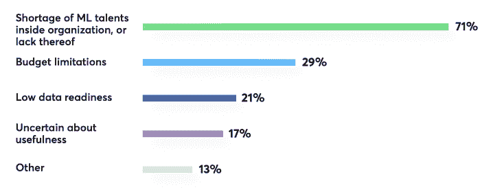

# 公司在采用机器学习时面临的 5 个关键挑战

> 原文：<http://web.archive.org/web/20230307163032/https://www.netguru.com/blog/challenges-in-adopting-machine-learning>

 机器学习和人工智能是商业发展中不断增长的工具。作为一家中型公司，在采用这些新兴的机器学习技术时，可能会出现挑战。尽管在试图赶上大公司时，机器学习是一个很有价值的工具，但实现这一目标可能是一段艰难的旅程。这些问题往往表现在五个关键方面:

*   机器学习人才的短缺
*   预算限制
*   低数据就绪性
*   其有用性的不确定性
*   低依从性

## 1.机器学习人才短缺

中型企业最普遍的问题似乎是缺乏机器学习人才。 [**在我们调查的公司中，有 71%的公司声称正在为此**](http://web.archive.org/web/20221007095302/https://www.netguru.com/hubfs/The_State_Of_Machine_Learning_In_Fintech_2020_Netguru.pdf) 而苦苦挣扎。缺少能够胜任这些角色的专业人员。

这可能是由于缺乏经验，因为这是一个新兴的部门，或者只是一个更精简的工作人员机构，没有专门的部门。全球范围内都缺乏机器学习，因此市场竞争异常激烈。

拥有公认的 ML 系统和基础设施知识的专家们倾向于频繁调动雇主和项目，因此如果一家中型企业设法找到人才，必须有适当的计划以防他们“跳槽”为了解决这个问题，[组织与拥有所需技能和经验的公司](http://web.archive.org/web/20221007095302/https://www.netguru.com/services/machine-learning)合作，利用机器学习的力量，同时从他们的成功中受益。

## 2.预算限制

对于实施机器学习的中型团队来说，经常出现的问题是预算。当这些组织与庞大的全球性公司竞争时，它们并不总能支付得起专家的工资。

与小公司不同，他们迫切需要技术，但仍有望跟上大公司的工资水平，29%的中型公司声称预算是阻碍他们的原因。

#### 中型公司在采用 ML 时面临的五大挑战

这种可用资金的巨大缺口孤立了中型企业，随之而来的是资金不足以投资运行这种先进系统所需的技术，尽管有可用的员工。这方面的一个典型例子可能是过时的遗留系统，它们需要在任何工作开始之前进行更新。

## 3.低数据就绪性

数据稀缺和数据准备不足是中型企业的基本问题，21%的中型企业遭受着“数据干旱”。数据集规模的缩小是由于收集方法的资金不足或消费者数量不足造成的，这通常是许多 ML 项目表现不佳的原因。

这导致许多项目无法在中型企业中起步，因为他们经常得出结论没有相关数据可用，或者收集过程过于复杂和耗时，不值得这么做。这有时可以通过开源数据采集来解决，但并不总是有帮助。

## 4.围绕有用性的不确定性

大多数时候，机器学习算法和方法最适合对海量数据进行探索性预测建模和分类。因此，许多较小的公司无法证明他们在机器学习上的投资是合理的。他们可能看不到[如何应用于他们的商业模式和消费者](http://web.archive.org/web/20221007095302/https://www.netguru.com/ai-consultation)——或者他们可能因为缺乏理解而拒绝这个想法。

毫无疑问，机器学习可以帮助所有企业，但这有一个警告；它需要紧张的调查，梳理数据，以及大量的条款和条件文书工作才能开始。

只有 17%的受访者声称这种不确定性是他们的一个问题，相比之下 35%的小公司。这说明了公司之间明显的知识差距，可以归因于缺乏专业人员，正如之前在讨论缺乏机器学习人才时所述。

## 5.服从

实现对机器学习系统的遵从需要奉献精神。模型越来越庞大和复杂，需要适当的风险管理和控制流程。在中型或小型公司中，这可能是不可能的，会给公司带来风险。

系统不能总是被验证、控制和治理。因此，性能可能会受到需要人工判断的场景的影响，这是一家中型公司可能没有的资源或培训。

诸如此类的问题，加上数据质量和算法可能的错误，可能会产生意想不到的结果、不准确的预测和糟糕的决策，从而损害任何使用它的企业。

## 克服中型公司采用 ML 的障碍

机器学习总是会给试图实施它的公司带来挑战，尤其是中型公司，以上只是列举了几个例子。中型公司往往会被夹在两个阵营之间；由于具有竞争力的就业率和缺乏训练有素的员工，他们无法获得维护系统所需的人才。

由于预算限制，他们无法获得这种人才，他们在试图扩张和发展时只会遭受这种限制，不可避免地会增加他们的预算。不可避免地，与其他公司合作和合并似乎是解决方案。它允许数据、人才、资源和结果被有效和安全地共享，解决了许多这样的问题。

在 Netguru，我们向我们的专家提供人工智能咨询，在咨询中，我们通过我们的框架评估来验证您的产品是否为人工智能做好了准备。然后，我们就如何成功地将您的产品转向人工智能技术提供建议和推荐。

通过确保采用正确的流程，上述许多问题都可以避免。在我们的职业生涯中，我们的团队已经为人工智能项目完善了一个强大而高效的工作流计划。[我们的流程确保我们的客户在短时间内获得可复制的结果](http://web.archive.org/web/20221007095302/https://www.netguru.com/services/artificial-intelligence-solutions)。

如果你希望进一步了解本文中使用的数据，请阅读【2020 年金融科技报告中的机器学习状态。