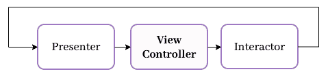
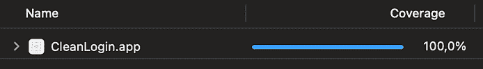

# 干净的 Swift (VIP) iOS 架构模式

> 原文：<http://web.archive.org/web/20230307163032/https://www.netguru.com/blog/clean-swift-ios-architecture-pattern>

 Raymond Law 在其网站[clean-swift.com](http://web.archive.org/web/20221002004032/https://clean-swift.com/ "https://clean-swift.com/")上首次推出了 Clean Swift (VIP)。其背后的想法是在遵循鲍勃叔叔的[清洁架构](http://web.archive.org/web/20221002004032/http://blog.cleancoder.com/uncle-bob/2012/08/13/the-clean-architecture.html "http://blog.cleancoder.com/uncle-bob/2012/08/13/the-clean-architecture.html")中的主要思想的同时，解决大量的视图控制器问题。

## 快速概览

实施 Clean Swift 项目时，您的代码将围绕您的每个应用程序屏幕或屏幕片段(也称为“场景”)进行构建。

理论上，每个场景是一个由大约 6 个组件组成的结构:

*   视图控制器，

*   互动者，

*   演示者，

*   工人，

*   模特，

*   路由器。

视图控制器、交互器和演示器是 Clean Swift 的三个主要组件。它们作为彼此的输入和输出，如下图所示。

例子



想象一个带有登录按钮的屏幕。这是一个用视图控制器、交互器和演示者的 VIP 循环定义结构的场景。当用户点击按钮时，视图控制器调用交互器。交互器使用内部的业务逻辑来准备输出(使用 workers)。然后，它将结果传播给演示者。演示者调用 VC 的方法来调用路由器显示新的场景。

The output of the view controller is connected to the input of the interactor. The output of the interactor is connected to the input of the presenter. The output of the presenter is connected to the input of the view controller. This means the flow of control is always **unidirectional**.

## 视图控制器

定义一个场景并包含一个或多个视图。

## 保存交互器和路由器的实例。

*   将动作从视图传递到交互器(输出),并将演示者动作作为输入。

*   互动者

*   包含场景的业务逻辑。

```
protocol LoginSceneViewControllerInput: AnyObject {
  func showLogingSuccess(fullUserName: String)
  func showLogingFailure(message: String)
}

protocol LoginSceneViewControllerOutput: AnyObject {
  func tryToLogIn()
}

final class LoginSceneViewController: UIViewController {
  var interactor: LoginSceneInteractorInput?
  var router: LoginSceneRoutingLogic?

  private var loginButton: UIButton = {...}()
}

private extension LoginSceneViewController {
  @objc func loginButtonAction() {
    interactor?.tryToLogIn()
  }
}

extension LoginSceneViewController: LoginSceneViewControllerInput {
  func showLogingSuccess(fullUserName: String) {
    router?.showLoginSuccess()
  }

  func showLogingFailure(message: String) {
    router?.showLogingFailure(message: message)
  }
}
```

## 保留对演示者的引用。

*   基于输入(来自视图控制器)对工作人员运行操作，触发并将输出传递给演示者。

*   交互器不应该导入 UIKit。

*   工人

*   一个处理不同底层操作的抽象，比如从核心数据中获取用户，下载个人资料照片，允许用户喜欢和关注，等等。

```
typealias LoginSceneInteractorInput = LoginSceneViewControllerOutput

protocol LoginInteractorOutput: AnyObject {
  func showLogingSuccess(user: CleanLoginUser)
  func showLogingFailure(message: String)
}

final class LoginSceneInteractor {
  var presenter: LoginScenePresenterInput?
  var authWorker: LoginSceneAuthLogic?
}

extension LoginSceneInteractor: LoginSceneInteractorInput {
  func tryToLogIn() {
    authWorker?.makeAuth(completion: { result in
      DispatchQueue.main.async { [weak self] in
        switch result {
        case .success(let data):
          self?.presenter?.showLogingSuccess(user: data)
        case .failure(let error):
          self?.presenter?.showLogingFailure(message: error.localizedDescription)
        }
      }
    })
  }
}
```

## 应遵循单一责任原则(一个互动者可能包含多个承担不同责任的工人)。

*   提出者

*   保留对视图控制器的弱引用，该视图控制器是演示者的输出。

```
protocol LoginSceneAuthLogic {
  func makeAuth(
    completion: @escaping (Result<CleanLoginUser, LoginSceneAuthWorker.LoginSceneAuthWorkerError>
  ) -> Void)
}

final class LoginSceneAuthWorker {
  private let service: AuthService
  private var bag = Set<AnyCancellable>()

  init(service: AuthService) {
    self.service = service
  }

  enum LoginSceneAuthWorkerError: Error {
    case authFailed(String)
    case unauthorized
  }
}

extension LoginSceneAuthWorker: LoginSceneAuthLogic {
  func makeAuth(
    completion: @escaping (Result<CleanLoginUser, LoginSceneAuthWorkerError>
  ) -> Void) {
    service.auth()
      .sink { _ in } receiveValue: { value in
        switch value.authorized {
        case true:
          completion(.success(CleanLoginUser()))
        case false:
          completion(.failure(.unauthorized))
        }
      }
      .store(in: &bag)
  }
}
```

## 在交互器产生一些结果后，它将响应传递给演示者。接下来，展示者将响应整理成适合于显示的视图模型，然后将视图模型传递回视图控制器以显示给用户。

*   路由器

*   配置程序

```
typealias LoginScenePresenterInput = LoginInteractorOutput
typealias LoginScenePresenterOutput = LoginSceneViewControllerInput

final class LoginScenePresenter {
  weak var viewController: LoginScenePresenterOutput?
}

extension LoginScenePresenter: LoginScenePresenterInput {
  func showLogingFailure(message: String) {
    viewController?.showLogingFailure(message: "")
  }

  func showLogingSuccess(user: CleanLoginUser) {
    viewController?.showLogingSuccess(fullUserName: user.firstName + " " + user.lastName)
  }
}
```

## 通过封装所有实例的创建并在需要的地方分配它们，负责配置 VIP 周期。

```
protocol LoginSceneRoutingLogic {
  func showLoginSuccess()
  func showLogingFailure(message: String)
}

final class LoginSceneRouter {
  weak var source: UIViewController?

  private let sceneFactory: SceneFactory

  init(sceneFactory: SceneFactory) {
    self.sceneFactory = sceneFactory
  }
}

extension LoginSceneRouter: LoginSceneRoutingLogic {
  func showLogingFailure(message: String) {
    source?.present(UIAlertController.failure(message), animated: true)
  }

  func showLoginSuccess() {
    let scene = sceneFactory.makeLoginScene()
    source?.navigationController?.pushViewController(scene, animated: true)
  }
}
```

## 模型

*   完整模式

```
protocol LoginSceneConfigurator {
  func configured(_ vc: LoginSceneViewController) -> LoginSceneViewController
}

final class DefaultLoginSceneConfigurator: LoginSceneConfigurator {
  private var sceneFactory: SceneFactory

  init(sceneFactory: SceneFactory) {
    self.sceneFactory = sceneFactory
  }

  @discardableResult
  func configured(_ vc: LoginSceneViewController) -> LoginSceneViewController {
    sceneFactory.configurator = self
    let service = DefaultAuthService(
      networkManager: DefaultNetworkManager(session: MockNetworkSession())
    )
    let authWorker = LoginSceneAuthWorker(service: service)
    let interactor = LoginSceneInteractor()
    let presenter = LoginScenePresenter()
    let router = LoginSceneRouter(sceneFactory: sceneFactory)
    router.source = vc
    presenter.viewController = vc
    interactor.presenter = presenter
    interactor.authWorker = authWorker
    vc.interactor = interactor
    vc.router = router
    return vc
  }
}
```

## 其他的

## 为了**避免内存泄漏**总是将视图控制器作为弱引用传递给路由器和演示器。

## 我不是[官方实施指南](http://web.archive.org/web/20221002004032/https://clean-swift.com/clean-swift-ios-architecture/ "https://clean-swift.com/clean-swift-ios-architecture/")的最大粉丝。我鼓励你去[看看 CleanStore](http://web.archive.org/web/20221002004032/https://netguru.atlassian.net/wiki/spaces/IOS/pages/1883177093/%28WIP%29+Clean+Swift "https://netguru.atlassian.net/wiki/spaces/IOS/pages/1883177093/%28WIP%29+Clean+Swift") 的样品项目。或者按照上面的例子(例子来自[我在 GitHub](http://web.archive.org/web/20221002004032/https://github.com/strzempa/CleanLogin-CleanSwiftExample "https://github.com/strzempa/CleanLogin-CleanSwiftExample") 上的示例项目)。

关键规则

推荐

## 需要进行单元测试的项目。

## 长期的大项目。

*   有大量逻辑的项目。

*   您希望将来重用的项目。

*   当 [MVVM](http://web.archive.org/web/20221002004032/https://netguru.atlassian.net/wiki/spaces/IOS/pages/1785529035/MVVM+-+Rx "https://netguru.atlassian.net/wiki/spaces/IOS/pages/1785529035/MVVM+-+Rx") ，MVP，MVC 不够用或者你只是讨厌[毒蛇](http://web.archive.org/web/20221002004032/https://netguru.atlassian.net/wiki/spaces/IOS/pages/1879933491/WIP+VIPER "https://netguru.atlassian.net/wiki/spaces/IOS/pages/1879933491/WIP+VIPER")但是有必要引入一个复杂的架构。

*   本地和必要的项目。

*   强项

*   易于维护和修复错误。

## 加强模块化，用单一职责编写更短的方法。

*   很好地将类依赖与已建立的边界分离。

*   将业务逻辑从视图控制器提取到交互器中。

*   用工人[和服务对象](/web/20221002004032/https://www.netguru.com/blog/service-objects-in-rails)来构建可重用组件是件好事。

*   鼓励从一开始就用[快速和可维护的单元测试来编写分解代码。](http://web.archive.org/web/20221002004032/https://clean-swift.com/effective-unit-testing/ "https://clean-swift.com/effective-unit-testing/")

*   适用于任何规模的现有项目。

*   模块化:由于使用符合协议的业务逻辑，接口可能很容易更改，而无需更改系统的其余部分

*   独立于数据库。

*   缺点和陷阱

*   许多协议具有复杂的命名和职责，起初可能会混淆协议的定义。

## 由于许多协议，应用程序很大。

*   尽管 Clean Swift architecture 有一个官方网站，但它经常变化，不同项目之间的实施可能有所不同。

*   很难维持 VC 和演示者之间的分离。有时，演示者只是调用视图方法，而不是准备 UI，所以这似乎没有用，只是创建了样板文件。

*   学习材料

*   摘要

## Clean Swift 不是最容易维护的，但可能是避免耦合和能够保持高代码覆盖率的最好方法。VIP 循环通过大量的样板代码强制执行严格的命名约定和类责任。

## 您想看看简洁的 Swift 架构的简单示例吗？
在 GitHub 上查看[我的示例项目‘clean log in’。](http://web.archive.org/web/20221002004032/https://github.com/strzempa/CleanLogin-CleanSwiftExample "https://github.com/strzempa/CleanLogin-CleanSwiftExample")

 Would you like to see a simple example of Clean Swift architecture?
Check [my sample project ‘CleanLogin’ on GitHub](http://web.archive.org/web/20221002004032/https://github.com/strzempa/CleanLogin-CleanSwiftExample "https://github.com/strzempa/CleanLogin-CleanSwiftExample").

