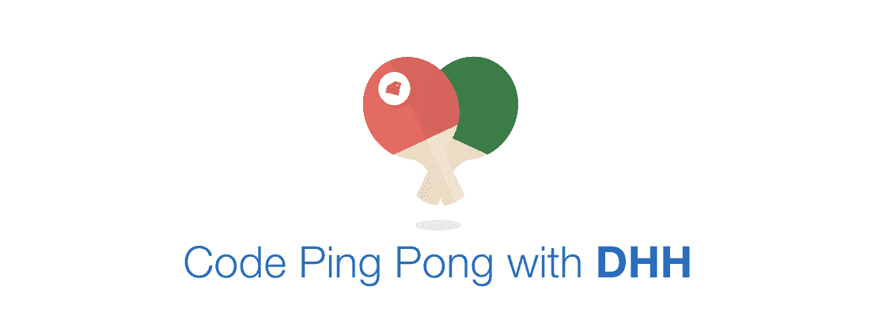

# 和 DHH 一起打乒乓球

> 原文：<http://web.archive.org/web/20230307163032/https://www.netguru.com/blog/code-ping-pong-with-dhh>

 告别模糊的建筑辩论。这个游戏是关于代码案例的。netguru 为您带来了 Ruby on Rails 的创建者的代码乒乓。

时不时地，你会发现 David Heinemeier Hansson 与一些穷人争论，为什么不需要抽象，为什么给定的例子可以用 Rails 中已经存在的东西很好地完成。

最近，[在这次讨论中](http://web.archive.org/web/20221024094711/https://news.ycombinator.com/item?id=7335211) DHH 提到，比起含糊不清的架构辩论，他更乐意做一些关于代码的**乒乓。好吧，当 Ruby on Rails 的创造者在讲话时，你最好是在听！**

受到线程的启发， [Marcin](http://web.archive.org/web/20221024094711/https://twitter.com/madsheepPL) 卷起袖子，开发了一个简单的应用程序，让代码乒乓成为现实。他还决定给 DHH 写封短信，解释他很快将在[弗罗茨瓦夫](http://web.archive.org/web/20221024094711/http://wrocloverb.com/)发表演讲——一个超级棒的 Ruby 会议——如果 DHH 同意参加乒乓球比赛，那将是一件真正令人惊讶的事情。

DHH 回答道...**“听起来不错！”**

我们的心高兴得跳了起来！

伙计们，你们喜欢乒乓球吗？让游戏开始吧！

### 游戏规则

**第一步。**挑选一段真正的代码准备讨论。[在 3 月 23 日周日之前提交一个包含你的片段的要点 URL](http://web.archive.org/web/20221024094711/http://www.dhh-ping-pong.com/)。确保示例不超过 80 行。

**第二步。**在[弗罗茨瓦夫](http://web.archive.org/web/20221024094711/http://wrocloverb.com/)组成的特别评审团挑选出 5 个最佳作品，亲自送给 DHH！快乐的获胜者将被通知结果。

**第三步。** DHH 收到 5 个片段...他回答！乒乓球！这个游戏都是关于代码案例的！准备，设置，匹配

感谢 DHH 接受挑战！

关注 [@codepingpong](http://web.archive.org/web/20221024094711/https://twitter.com/codepingpong/) ，在 [Code Ping Pong 网站](http://web.archive.org/web/20221024094711/http://www.dhh-ping-pong.com/)获取更多详情。

Thank you DHH for taking up the gauntlet!

Follow [@codepingpong](http://web.archive.org/web/20221024094711/https://twitter.com/codepingpong/) and get more details on the [Code Ping Pong website](http://web.archive.org/web/20221024094711/http://www.dhh-ping-pong.com/).