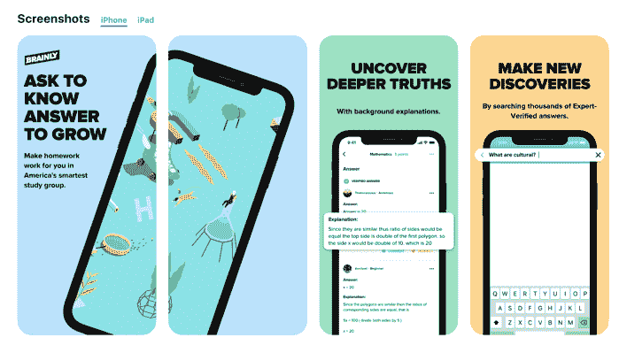
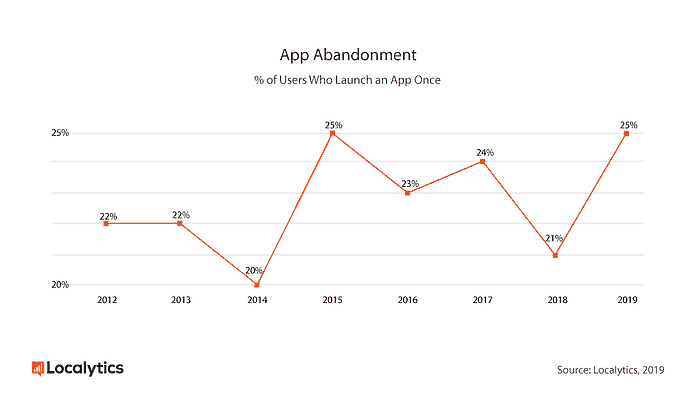

# 如何创建一个成功的移动应用？15 个有用的提示(更新)

> 原文：<http://web.archive.org/web/20230307163032/https://www.netguru.com/blog/creating-successful-mobile-app>

 移动应用是我们日常生活中非常重要的一部分。

我们用它们来获取信息、与朋友和家人联系以及娱乐。据统计数据显示，全球有超过 27 亿智能手机用户。我们一天中的大部分时间都在使用手机，其中 90%的移动时间都在使用各种应用程序。

争夺移动用户注意力的竞争非常激烈，因为 Google Play 商店中有超过 270 万个应用程序，而 T2 的应用程序商店中有 220 万个应用程序。但是我们大多数人每天只使用 [9 个应用程序，每月 30 个](http://web.archive.org/web/20220925070705/https://www.digitalinformationworld.com/2019/03/amazing-mobile-apps-usage-facts-infographic.html)。

这意味着有**无数的应用程序没有被任何人使用** -因为没有商业需求或者产品很差。

来源: [techjury](http://web.archive.org/web/20220925070705/https://techjury.net/stats-about/app-usage/)

这是易获取技术的问题之一。我们有一个**软件供应过剩，**而用户的注意力是有限的。通常，传达你的信息比开发产品需要更多的时间。

要想脱颖而出，你需要**深入的市场研究和移动应用开发方面的专业知识**。你必须确保你的产品质量好，适合市场需求。

## 如何做一个成功的 app？

### 成功应用的关键特征

一个成功的 app，巧妙的结合了三个方面:**市场**、**用户**和**产品**本身。所有这些因素需要共同作用，才能给用户带来**独特的价值**、**卓越的可用性**，以及**良好的性能**。**可访问性**是一个成功的移动应用程序的最后但同样重要的关键特征。

那么，是什么让一个 app 成为成功的呢？

我们可以将这样一个应用的功能分为两大类:以消费者为中心和以商业为中心。

**以消费者为中心的功能:**

*   不错的设计
*   深思熟虑的用户界面和 UX
*   涵盖基于人们如何使用特定服务的主要期望和需求
*   稳定、可靠的工作流程
*   提供足够的数据保护级别
*   提供对服务台/帮助的快速访问

**以业务为中心的功能:**

*   鼓励用户保留
*   提供快速、便捷的支付
*   数据泄露保护
*   未来开发和维护的低成本
*   简易更新程序

### 两个成功的移动应用示例

为了说明我所说的“[成功的定制手机 app](/web/20220925070705/https://www.netguru.com/services/custom-mobile-app-development) ”是什么意思，我举两个例子。

**[灵儿](/web/20220925070705/https://www.netguru.com/featured/shine-awarded-well-being-app)**

Shine 是 App Store 中 2018 年最佳应用，在全球 189 个国家使用。

它是你可以分享你的想法和感受的个人自我关心的朋友。该应用的用户可以利用日常动机、个人成长目标和文章。

该应用程序还提供引人入胜的播客。它设计精美，UX 也很棒。Shine 有内置的机制来帮助用户实现日常目标。例如，该应用程序每天早上都会向你发送一条通知，其中包含与你的目标相关的冥想播客。

*来源:[网络大师](/web/20220925070705/https://www.netguru.com/featured/shine-awarded-well-being-app)*

[**聪明地**](http://web.archive.org/web/20220925070705/https://brainly.com/)

Brainly 是全球最大的电子学习应用。每月有超过 1 亿来自 35 个国家的学生使用 Brainly。

该应用程序使用基于机器学习的高级机制，将发布任务的学生与可以帮助他们的专家联系起来。该应用程序设计精美，非常注重应用程序内部的用户流量。非常稳定可靠。

这反映在谷歌 Play 商店(平均 4.7 和 479.4k 总评论)和 App Store(平均 4.8 和 3.9k 评论)的好评和评级中。

来源: [苹果应用商店](http://web.archive.org/web/20220925070705/https://apps.apple.com/app/brainly-the-homework-app/id745089947?_branch_match_id=637195888298699803&utm_source=brainly.com&utm_campaign=web_to_app&utm_medium=footer)

## 制作成功移动应用的 15 个技巧  

如果你想构建一个像 Shine 和 Brainly 一样成功的移动应用程序，你需要遵循这 15 个有用的提示。

### 1.确定你的听众  

重要的事情先来。你需要知道**谁会使用你的应用**来让它成功。

它将帮助你检查你的应用创意的商业潜力(市场需求)，以及检查如何与你的目标用户沟通(营销信息)，以及在哪里沟通(渠道)。

怎么做？

搜索统计数据和见解，检查趋势，在论坛上提问，进行投票，或构建移动应用程序的 MVP 版本并收集所有用户反馈。

查看所有可用的知识来源。

您可以收集所有人口统计数据，如性别、年龄、性别、位置，并收集一些有关用户行为和动机的信息(得失)。然后和你认为高的人讨论你的想法。

**缩小目标受众**——群体越大，你的产品的优势就越大，但同时你的应用创意出问题的几率也就越高。将创新瞄准利基市场更容易。

### 2.报价价值

**一个应用程序的好主意**解决了潜在用户目标群体认可的特定问题。即使是最简单的娱乐形式，如糖果粉碎游戏，也为压力提供了一个出口，缓解了通勤或排队的无聊。

应用程序应该给用户带来重要的利益，这样他就有足够的动力去下载和使用它。

独特价值可能与给定服务的价格、信息传输的速度、应用程序的工作方式或提供从其他渠道无法获得的功能或服务有关。

一个完美的应用程序以巧妙的方式结合了消费者需求、商业目标和技术解决方案。

一个好的产品必须有趣或者有用。冗余本质上是好的。如果你的应用能解决多个问题，那总是更好。最成功的人会。

有些人需要世界各地舒适、美丽和令人振奋的住所，而有些人想把他们的公寓租给有闲钱的外国人。

### 3.定义你的商业模式

世界各地的应用开发者主要选择通过使用各种基于广告的商业模式来赚钱。[视频广告是最受欢迎的收入来源之一](http://web.archive.org/web/20220925070705/https://www.statista.com/statistics/273120/share-of-worldwide-mobile-app-revenues-by-channel/)。应用内购买在企业主中也很受欢迎。但是还有很多其他的商业模式可以选择。

每种移动应用商业模式都有其优点和缺点。要选择一个符合你需求的，最好从分析你的竞争对手在做什么开始。如果它曾经奏效，它可能再次奏效。

请注意，并不是每个成功的移动应用都必须产生利润。对于[企业应用](/web/20220925070705/https://www.netguru.com/services/enterprise-mobile-app-development)来说，应用的类别具有不同的优势。有时候，你开发一个应用程序是为了省钱或优化业务流程，而不是为了带来直接的收入流。

### 4.定义功能的范围

很可能你已经花了一些时间来思考你的应用程序的想法。你已经想象了它能做的所有奇妙的事情，所有可能增强其功能的特性。社交分享、通知、支付、整合——它们似乎都是不可或缺的。

很可能它们都是有用的特性，但是如果你现在忘记它们可能会更好。每一个都会阻碍你核心功能的开发。如果你专注于移动应用开发过程的错误一端，你要么会损失时间，要么会损失质量。

你甚至可能最终**忽略了应用理念的核心**。再次思考你的应用程序的终极*存在理由*。归结为一句话。然后专注于它。其余的将随着时间的推移。

丰富的特性似乎是个好主意，但通常不是。它只对那些想提升项目价值的承包商有效。用户需要的是最简单的解决问题的方式。

一旦你决定了你的应用程序的核心功能是什么，[试着以最清晰的方式把它放在前面](http://web.archive.org/web/20220925070705/https://digital.com/blog/make-mobile-app/)。每一个额外的选择，每一次个性化，每一次整合都会让你的用户更难理解你提供的价值。这也带来了实际成本。

不仅开发更复杂的产品更昂贵，而且你还必须在早期阶段投入更多的时间和金钱给客户支持。

少即是多。这是初始阶段的关键规则之一。

### 5.选择正确的技术

一个移动应用的构建方式和它的工作方式一样影响着它的成功。如果你想构建一个成功的应用程序，你需要选择正确的技术。有三个主要选项供你选择。

**选项 1:特定平台的原生应用**

[原生应用是为特定的移动平台——iOS 或 Android—](/web/20220925070705/https://www.netguru.com/services/native-mobile-app-development)编写的。用于编写这些应用程序的编程语言仅受这些平台的操作系统支持。一个本地应用可以在很大程度上利用你的设备的硬件和功能，这[提升了用户体验](/web/20220925070705/https://www.netguru.com/services/native-mobile-app-development)。

**方案二:跨平台原生 App**

使用这种方法开发的应用程序使用共享 SDK(软件开发工具包)，但它们仍然在本机运行。React Native 和 [Flutter](/web/20220925070705/https://www.netguru.com/services/flutter-app-development) 是用于编写[跨平台原生应用的常用技术。](http://web.archive.org/web/20220925070705/https://www.netguru.com/services/react-native-development)

虽然你确实失去了一些固有的优势，但如果你预算有限，但仍然希望应用程序针对多种类型的设备进行设计、优化和设计，这仍然是最具成本效益的方法。

**选项 3:混合应用**

混合应用程序**兼容所有设备和操作系统。**成本效益、可移植性和快速部署性是混合移动应用开发方法流行的三大驱动因素。

但是，请记住，您没有获得原生组件和原生交互模式的优势，因此您牺牲了一些应用程序的用户体验。

也就是说，如果你遵循这种成功的应用程序开发方法，你不需要为每个平台编写不同的代码库。相反，**你可以写一个，在多个平台上使用。**

这是通过使用您可能已经熟悉的基本 web 技术来完成的，比如用于布局的 HTML、用于样式的 CSS 和用于交互的 JavaScript。

### 6.设计简单直观的 UX/用户界面

设计是一个应用成功的关键之一。

B2C 和 B2B 的 app 都是如此。人们希望使用简单而直观的 UX 和用户界面的移动应用。例如，简单的用户界面不会妨碍用户在应用程序中使用数据。一个漂亮的用户界面增加了使用应用程序的良好感觉，但是记住直观的 UX 对于易用性是至关重要的。

精心设计的 UX 和用户界面还有许多其他好处。一个经过深思熟虑的注册流程会带来更好的用户获取和更高的下载量。同样的情况也出现在**精心设计的入职培训上。**当它简单易懂时，用户会坚持使用你的应用程序，并可能推荐给新用户。

如果你依赖应用内购买，明确用户将从购买虚拟商品中获得什么。这将有助于提高转化率。

### 7.选择您的设计和开发团队  

你的产品质量是你的应用程序开发团队的能力、天赋和工作的结果。

一个应用程序开发者可以完成一些项目，但是你也可以 [**将工作**外包给一个开发团队](/web/20220925070705/https://www.netguru.com/services/software-development-outsourcing)或者雇佣一个完整的咨询合作伙伴，他们不仅会为你提供技术专业知识，还会支持你的市场成功。

确保你的发展伙伴拥有**广泛的技能，**他们能够有效地相互沟通，最重要的是，理解你给他们的任务。

### 8.确保你的团队步调一致

创造性思维和高效的项目执行是很难配对的。应该尽可能经常地相互验证。

在[一次范围界定会议](/web/20220925070705/https://www.netguru.com/blog/scoping-sessions)中，当遇到技术时，你的第一个想法将不可避免地被缩减，你应该做好妥协的准备。这就是为什么一个**清晰定义的核心功能、**问题的解决，以及目标用户群是如此重要。

确保与你一起工作的[定制软件开发](/web/20220925070705/https://www.netguru.com/services/custom-software-development)团队的每个成员都了解产品，它应该如何工作，以及它应该如何对用户有用或有趣。

应用程序开发人员对他们使用的技术充满热情，当你真正让他们参与到创意过程中时，他们是一个伟大的创意来源。他们的动机是寻找新的、创造性的和有效的方法来应用他们的工具。你需要让他们参与到你的愿景中，最大化他们的知识和技能。

### 9.保持高性能

如果你想让你的应用成功，好是不够的。

根据 connectings 发布的 [2019 移动使用趋势报告，三分之二的移动用户每月至少清理一次手机**。**这意味着他们不再使用他们不再需要的应用。](http://web.archive.org/web/20220925070705/https://www.connecthings.com/mobile-usage-trends-2019/)

2019 年抛弃一个 app 的主要原因之一就是不被人听。正如 Localytics 研究显示的那样，根据数据感觉被倾听的应用程序用户更有可能继续开发应用程序。但是性能是你的应用成功的关键。**Qualitest research 称，88%的应用程序用户会放弃一款存在漏洞和故障的移动应用程序**。

来源: [质量测试](http://web.archive.org/web/20220925070705/https://www.qualitestgroup.com/)

请记住，用户会要求您对使用应用程序时可能出现的任何问题负责。不是电话制造商或为他们提供互联网的电信公司。只有你。

### 10.确保你的应用安全

未受保护的移动应用程序对整个系统构成真正的威胁。我们在设备上存储和处理重要数据，例如支付、银行信息、访问密钥、医疗和个人数据等。

有许多方法可以解决安全问题。但是确保移动防护并不是一个容易的过程，尤其是当你必须**识别给定应用中的威胁**并自己定义其安全级别的时候。大多数常见的方法遵循标准的安全实践，其他的则适用于[移动应用开发](http://web.archive.org/web/20220925070705/https://www.netguru.com/services/mobile-development)。

**基本标准安全实践包括:**

*   敏感个人数据的适当加密，如本地数据库、缓存或 [API 通信](/web/20220925070705/https://www.netguru.com/blog/fintech-api-open-interconnectivity-financial-service)的加密
*   正确的加密密钥管理和用户会话授权(令牌)
*   令牌验证——分别为每个设备分配一个令牌，并使用不同的会话到期时间
*   正确实施安全通信标准，例如 HTTPs 情况下的证书锁定
*   以及 OWASP 推荐的一般检查，您可以在[移动安全审查](/web/20220925070705/https://www.netguru.com/blog/how-to-improve-mobile-app-security)中找到

### 11.提供第三方集成

**第三方服务**可以丰富你的 app，增加用户留存，提升整体用户体验。

以**谷歌地图为例。**

由于第三方集成，你不仅可以查看从 A 点到 B 点的最快路线，还可以查看公共交通信息，了解乘车前往你想去的目的地的优步价格，甚至可以直接从谷歌地图上叫一辆**优步。**

这是提高你的应用程序可信度的好方法。将它与人们已经在使用的东西整合在一起，很容易提供一种熟悉的体验。使用这种整合尤其是为了提高转化率和增加保留率。

但是不要过度设计第三方集成。实现它们总是很费时间，所以要考虑清楚。如果你开发一个只有少数用户会使用的集成，这是一种可耻的资源浪费。

做正确的研究，确保第三方集成将为大多数用户提供价值。

### 12.策划营销策略

我们周围的信息和内容已经超载。

现在比以往任何时候都更难吸引用户的注意力，并提出正确的销售论据来说服他们。这就是为什么你需要**选择合适的营销工具**和语言来推广你的解决方案。

有时候，传达你的信息比开发产品需要更多的时间。这就是为什么你应该尽早开始。成功的应用程序在进入应用程序商店之前就已经被推广了。你可以将你的营销计划分为三个活动阶段:发布前、发布中和发布后。

也有很多现成的技巧可以帮助你将你的[营销策略变成现实](http://web.archive.org/web/20220925070705/https://buildfire.com/free-app-promotion/)。

### 13.定期更新

以正确的方式开发应用程序并恰当地进行营销是成功的移动应用程序三部分矩阵的两部分。最后但并非最不重要的是，矩阵的一部分是在应用程序发布或维护后对其进行处理。

如果你正在开发一个应用程序，你可能希望它留在市场上，对吗？所以不要忘记引入持续改进。修复 bug。37%的移动应用程序用户表示，他们在遇到崩溃、死机或重复错误等错误时会停止使用应用程序，所以要确保每个小错误都被立即修复。

此外，开发新功能并保持应用程序最新。由于这一点，用户会看到你关心他们的体验。持续更新也有助于你从你的应用中获得更多。引入新功能，修复 bug，确保更好的用户留存。

永远不要忘记应用程序被卸载的最重要的原因。观察您的应用程序在设备内存中占用的空间。审查用户获取流程(入职、注册表格等)的复杂性，并关注整体质量、性能和安全性。

记住，苹果和谷歌每年都会更新他们的操作系统。让你的应用与最近的操作系统变化保持一致是关键。有时，这可能意味着改变一些功能或改变对你的应用程序的假设。例如，增加一个小功能(从谷歌的角度来看),比如在谷歌地图上显示速度陷阱，会让应用程序只关注这些就显得非常多余。

### 14.基于反馈进行升级

如果你想确保你对应用程序的更新与用户相关，只需根据数据做出决定。你需要知道你的产品是怎么用的。分析这些信息，并尽早做出反应。

定义清晰的 KPI 来衡量你的应用是否成功。尽可能多地衡量，但要优先考虑你设定的 KPI。实现一种机制来提供更多关于 bug 的上下文，以便于重现和修复。考虑实现一个反馈表或 NPS 提示来询问用户的想法。并报告错误。

以下是一些你可能会觉得有用的移动应用分析平台:

### 15.努力留住用户

分析你收集的所有数据并不断更新你的应用有一个主要原因- **用户留存。**记住 [25%的用户只使用一次就放弃一个应用](http://web.archive.org/web/20220925070705/http://info.localytics.com/blog/25-of-users-abandon-apps-after-one-use)。所以确保你尽一切努力让你的用户满意。

来源: [Localytics](http://web.archive.org/web/20220925070705/http://info.localytics.com/blog/25-of-users-abandon-apps-after-one-use)

如果**应用不够吸引人，你的用户保留率就会下降。**吸引用户有一定的机制。最常用的是在所有平台上都可用的推送通知。例如，您可以使用通知来提醒下载了应用程序但没有使用它的用户它的存在以及使用它有多有趣。

入职、应用内消息传递和再营销是确保高用户保留率的其他方法。但是要经常思考这个问题，并尝试寻找新的方法来吸引你的用户。

记得提供真正的价值。如果你没有向用户传递任何价值，只会造成挫败感。

## 摘要

开发一个成功的应用程序不再仅仅是一群精明工程师的机会。事实上，设计师、创新型商人和创意营销人员正在接管移动应用和网络应用市场。如果你有一个伟大的想法，但没有[软件开发](/web/20220925070705/https://www.netguru.com/services/bespoke-software-development)技能，你可以很容易地找到一个将**为你提供世界级产品的合作伙伴。**

其次，在规划你的应用业务时，你不必**专注于技术**。你可以找到很多关于“如何[开发一个 iOS 应用](/web/20220925070705/https://www.netguru.com/services/ios-mobile-app-development)”、“未来的编程语言是什么”、“哪个框架是最终的解决方案”的指南。这些都是重要的问题。

然而，它们不会决定你项目的成败，如果你没有技术背景，你也不必知道它们的答案。这些都是在与有经验的项目经理或开发人员交谈几次后可以解决的问题。

第三，执行力很重要。如果技术不是你的专长，你就不要专注于它，因为有更重要的事情要做。最出色的想法远不如出色的执行。[你简直无法用这个](http://web.archive.org/web/20220925070705/http://dilbert.com/strip/2015-09-11)来形容它。你需要一个计划，并且你需要平稳地运行它。

*本文首发于 2016 年 2 月 17 日*