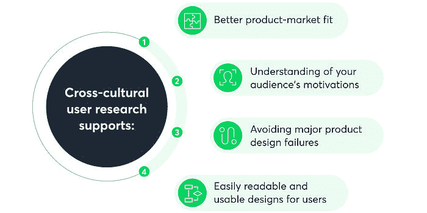

# 跨文化用户研究——你对你的用户一无所知

> 原文：<http://web.archive.org/web/20230307163032/https://www.netguru.com/blog/cross-cultural-user-research>

 随着越来越多的产品和服务面向国际市场，公司必须意识到其受众的多样性和复杂性。跨文化用户研究是确保你为用户群的所有成员设计和创造的最好方法之一。

什么是跨文化用户研究？为什么如此多的公司采用跨文化研究方法来了解他们的受众并获得竞争优势？

随着商业和文化领域更加包容的运动，跨文化用户研究近年来激增。用户研究没必要狭隘或局限。事实上，所有的证据表明，如果你想持续扩大你的用户群，创造成功的设计，这种类型的研究是不可或缺的。

## 什么是跨文化用户研究？

如果你想完全了解你的国家、文化、语言和文化规范之外的市场是谁，跨文化用户研究是实现这一目标的最佳方法。

今天，重要的是，UX 的设计师、产品或项目经理，以及参与创作过程的每个人都要试图理解人类的各种行为。

> 跨文化比较有助于你了解受众的文化差异，检验假设，设计产品和服务时更好地理解你的用户。

当你处理多元文化设计时，跨文化研究人员的帮助可能会派上用场，因为你应该预料到要面对各种文化因素。这些可能是不同于你自己的文化或许多不熟悉的文化团体以他们自己特定的方式工作所接受的文化价值观。

随着越来越多的设计师、开发人员和经理开始意识到他们的受众之间的文化差异，我们开始看到更多的产品和服务迎合了人类行为的所有方面。不可避免地，这意味着更好的，更容易接近的，更包容的创作。

跨文化用户研究应该是任何跨国经营或在多元文化社会中经营的企业的基础。了解你的受众和用户是任何[设计过程的关键一步](/web/20220926194942/https://www.netguru.com/blog/product-design-vs-ux-design)，因为你实际上是为人们而设计，而不是为了设计本身。

成功的跨文化设计是大量用户研究的结果。让我们来看看当今企业使用的几种最流行的跨文化研究方法。

## 跨文化研究方法

有几种方法可以进行用户研究。那么，你可以采用什么方法来确保你的[用户研究](http://web.archive.org/web/20220926194942/https://www.netguru.com/blog/user-research-product-market-fit)既跨文化又有效呢？

### 社会心理学研究

这种类型的研究旨在揭示大型社区的心理特征。UX 的研究人员很难独自在社区之间进行这样的比较研究。相反，在这里你可以依靠科学家们已经做的和使用以前的行为科学研究。

基本工具是案头研究，这是一个很好的实践，有助于加深对产品运营所在社区的了解。通过这种方式，你将能够创造出满足特定文化群体共同需求的产品。

### 定性研究

深度访谈，结合可用性测试，也可以作为定性用户研究的一种形式。

通过收集和分析非数字数据，你将能够理解和归类各种各样的概念、观点和经验。你将从这种研究中获得的数据将帮助你了解用户的动机。

### 眼球追踪和分析数据

更多的技术方法，如眼球追踪，可以用来理解用户的无意识行为。这为进一步跨文化比较和分析不同文化的行为提供了很好的视角。这些比较研究是理解世界文化的具体差异和共性的关键。

### 包容性的背景研究

背景研究是一种重要的跨文化用户研究方法，旨在了解用户的环境，了解他们可能会如何与你的产品互动。

## 跨文化研究的一大缺陷是什么？

虽然成功的跨文化研究有许多重要的好处，但考虑这种特殊研究方法中可能存在的缺陷也很重要。什么时候跨文化分析是一种阻碍而不是一种有见地的知识？

在某些情况下，你的研究和跨文化比较的可行程度是有限的。

> 探索每种文化背景或可能性是很困难的，因为最终你必须开始创造和设计你的产品或服务。

例如，如果我们建立一个在线商店，销售我们想在欧盟销售的夹克，那么很难在所有 27 个国家进行试验。即使国与国之间存在显著差异，更为定制的方法所带来的好处可能也无法抵消维护 27 个不同版本的商店的成本。同样，进行跨文化测试所需的时间可能会不利地延迟设计过程。

类似地，有时为每一种文化进行本地设计是不可行的，不值得的，甚至是不必要的，尤其是对于小企业。在这种情况下，产品或服务主要依赖于翻译，只是提供多种语言选项。在你开始在研究中使用跨文化方法之前，了解你的业务的确切范围是很重要的。

你要问自己，“跨文化研究对于这种特定产品的创作是否可行、实用、有用？”在大多数情况下，答案会是“是的！”。然而，在开始任何用户研究项目之前，每次都要问这些问题，并理解过程中的实际元素，这是非常重要的。

## 为什么跨文化研究很重要？

对于亚马逊、优步和苹果等许多企业来说，跨文化用户研究现在是产品生命周期中至关重要的一部分。它提供广泛的文化知识，特别是关于文化差异的知识，并允许企业对产品和活动做出明智的决定。

让我们来看看它可以发挥的作用，以及为什么在某些情况下，它是创造成功产品的关键因素之一。

### 更好地理解你的观众的动机

你脑海中可能已经有了你理想的用户或受众的画面。然而，不太可能每个人都符合这种模式，如果你只为这一类用户设计，你就忽略了其他潜在的未来客户。

跨文化用户研究有助于你更好地理解受众动机的复杂性和多样性。这反过来将有助于您做出明智的商业决策，创造出真正解决消费者实际问题的产品。这种研究方法可以让你从竞争者中脱颖而出，并有助于激发你的创作过程。

### 更好的产品市场契合度

另一个“好处”是跨文化研究将帮助你创造出适合当地市场的产品。比较研究和特定的文化数据收集将考虑当地的条件，并帮助您制定适当的商业战略。

例如，当优步在世界各地扩张时，他们不只是复制和粘贴每个国家的拼车应用程序。相反，他们想到了每个城市和国家的文化环境。

在巴黎，优步决定与 Cityscoot 合作，将踏板车加入他们现有的车队。在一个不断变化的城市，优步知道提供更灵活和易于使用的替代品是适应当地习惯的一种方式。

除了巴黎，优步还通过允许用户预订 Uberboat(由当地公司 Navette 运营)来适应伊斯坦布尔的交通文化，以帮助用户避免汽车和铁路交通对这座城市的影响。

### 避免重大产品设计失败

早在 2008 年，当亚马逊在印度推出业务时，他们面临着一些问题，因为他们缺乏文化洞察力和全面的 UX 研究。亚马逊不明白为什么他们的印度客户不使用他们的主要收入来源之一:允许在移动网站主页上购买的产品搜索。

他们在印度的大多数客户似乎没有将放大镜的形象与搜索的概念联系起来。在对用户界面进行检查和进一步研究后，亚马逊发现他们的大多数印度客户认为这个图标代表一个乒乓球拍。

亚马逊对这个问题的解决方案是继续使用放大镜，但用北印度语文本标签同化搜索栏，让人们知道这是他们可以开始搜索的地方。如果进行彻底的跨文化研究，这种产品设计失败是完全可以避免的。

### 创建用户易于阅读和使用的设计

最后，但同样重要的是，跨文化研究有助于理解信息架构的不同呈现和设计方式，这些方式会极大地影响与用户的沟通。

在西方，展示和交流信息的理想方式是以一种极简、不受干扰的方式展示。经验法则是“少即是多”。然而，该公约在一些亚洲国家并不适用。

例如，当 Mozilla Firefox 为世界各国创建本地化的登录页面时，他们确保研究并融入了特定国家的文化敏感性。因此，美国网站非常简洁，只有一个清晰的 CTA(行动号召)。然而，中文版有更多的内容——横幅、新闻和广告占据了所有可用空间。

## 通过跨文化用户研究为人们制造产品

跨文化用户研究已经帮助许多公司生产出容易理解的、有创意的和相关的产品。现在，您对它和各种方法有了更多的了解，您可以开始自己的研究或使用跨文化研究人员的外部团队的帮助。

我们发现，企业跨文化用户研究的质量与企业为各种文化群体创造解决问题的设计能力之间存在正相关关系。与大多数商业领域一样，知识是成功的关键。

如果你有兴趣提升你的产品设计以适应不同的市场，看看[用户研究方法](http://web.archive.org/web/20220926194942/https://www.netguru.com/services/user-research)可以帮助你的产品适应选定的受众。