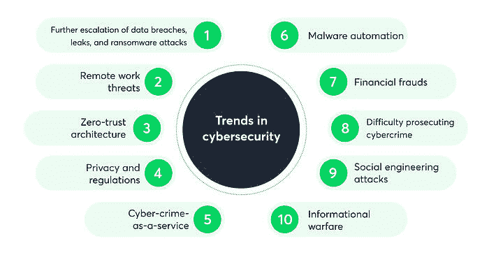

# 2022 年十大网络安全趋势值得关注

> 原文：<http://web.archive.org/web/20230307163032/https://www.netguru.com/blog/cybersecurity-trends>

 自新冠肺炎大流行开始以来，世界已经发生了变化。我们在生活的方方面面都能感受到这一点，尤其是在我们的工作方式和企业运营方式上。

分散的劳动力和对[数字架构和云系统的日益依赖在许多组织的运营方式中留下了脆弱的网络安全漏洞](/web/20220926195702/https://www.netguru.com/blog/red-team-vs-blue-team)。我们的个人和职业生活比以往任何时候都更加在线，网络罪犯已经利用这一点进行越来越复杂的攻击。

微软、其他财富 500 强公司和许多美国政府机构所经历的网络安全管理软件产品供应链混乱就是一个很好的例子。技术发展迅速，安全团队也被迫如此。

[因此，保护您自己和您的公司免受网络安全威胁](http://web.archive.org/web/20220926195702/https://www.netguru.com/services/cybersecurity)比以往任何时候都更加复杂，但也从未如此重要。用正确的信息武装自己是保护你的企业的第一步。

## 网络安全行业的现状

IDC 的一项调查发现，全球超过三分之一的组织在去年经历了某种形式的重大网络安全事件。

在许多情况下，这些事件并不是孤立的——成为勒索软件受害者的组织往往不止一次成为目标。勒索软件被认为是最大的威胁，特别是在制造业和金融机构，平均赎金约为 25 万美元。

由于这些不断增长的统计数据，网络安全有了新的重要性。正在对安全程序和数据保护措施进行压力测试和更新，并在出现潜在威胁时加强知识共享。

《IDC 透视》分享了八条关键知识，有助于制定更可靠的[网络安全计划](/web/20220926195702/https://www.netguru.com/blog/cybersecurity-strategy),经受住时间的考验。在 Netguru，我们有自己的一套[网络安全标准](http://web.archive.org/web/20220926195702/https://www.netguru.com/blog/security-standards-at-netguru)，这是我们工作的基础。

紧跟网络安全趋势对于保护您的组织至关重要。您需要了解新的威胁，熟悉的威胁是如何演变的，以及有助于保护数据安全的新措施和建议。我们总结了 2022 年十大网络安全趋势，为您提供帮助。

## 新兴网络安全趋势

了解您最容易受到的网络攻击，并学习如何保护您的组织及其数据。

### 数据泄露、泄密和勒索软件攻击的进一步升级

新冠肺炎疫情一直是商业运作方式快速变化的催化剂。技术发展的速度太快，以至于必要的安全措施都跟不上。它的复杂性激增，保持复杂系统足够安全是一个挑战。此外，在线可用数据的巨大增长增加了其流通性及其对企业和黑客的价值，导致更成功、更有利可图的数据窃取攻击。

地缘政治和经济利益的机会(当全球关系在当前的医疗、军事和气候紧急情况下特别脆弱时)是高级黑客的良好动机。通常，缺乏所需安全资源或防御的地区将遭受更多的威胁。

一个特别相关的例子是俄罗斯和乌克兰之间正在进行的战争，网络攻击在其中扮演了重要角色。虽然对乌克兰的网络攻击可以追溯到许多年前，但一个突出的例子发生在俄罗斯入侵之前:所谓的“雨刷”恶意软件被部署在乌克兰政府机构和部门。

很明显，面对全球脆弱性，对数据的攻击数量正在上升，而且这一趋势不太可能放缓。2022 年，网络安全专家将成为全球[数字加速](/web/20220926195702/https://www.netguru.com/services/digital-acceleration)不可或缺的一部分。

### 远程工作威胁

在疫情过程中，远程工作的过渡是仓促完成的，几乎没有任何警告，这意味着安全基础架构在投入使用之前没有得到正确的设置、测试和保护。许多企业的云安全措施配置不当，家用电脑缺乏全面的安全保护，个别员工容易受到电子邮件、短信或电话的网络钓鱼欺诈。

多因素身份验证(MFA，要求员工能够访问多台设备)和不同级别员工的受限访问等功能有助于最大限度地减少勒索软件威胁的机会。每一个员工都必须在每一个步骤进行验证，没有默认许可。利用人工智能(AI)和生物识别技术创建的高级无密码用户验证已经改变了我们使用个人设备的方式，但这对企业来说将变得更加强大。

然而，远程工作带来的对物联网(IoT)设备的依赖在本质上是有问题的。为了保持连接，员工使用他们的移动设备，如手机、平板电脑和笔记本电脑来访问敏感信息(当获得访问权限时)，但物联网设备本质上具有较弱的安全控制。因此，构建所需的安全网络可能比实施 MFA 和 AI 验证等措施更复杂，尤其是在非常动态的“疫情”环境中。

### 零信任架构

需要为动态和分散的工作环境设计适当的安全架构，以纠正远程工作中出现的问题和安全漏洞。零信任架构提供了这种安全性，它减少了个人的责任，并将所有设备和系统的控制权集中在一个中心。零信任的主要特性包括环境感知访问、系统上所有设备的详尽日志、用户的强大用户身份、多个不同级别的身份验证、设备的最新健康和状态报告、反映数据和服务价值的策略，以及对所有本地网络安全的全面不信任。

### 隐私和法规

随着认识的提高，政府的兴趣也随之增加。对此的回应将是对互联网增加更多监管，包括对网络安全制定更严格的措施。未能遵守这些新法规会导致罚款和相关公司的坏名声。

这方面的一个例子是对 cookies 的日益关注。每个网站都会让用户选择不收集他们的数据，从法律上来说(在欧洲),这种选择必须明确。通常，选择退出 cookie 的选项并不明确，需要网站访问者导航到不同的页面并单独关闭每种类型的 cookie，这可能会令人沮丧。这正是政府可能会严厉打击的那种做法。

加强数据安全的另一个例子是，当数据涉及欧盟公民时，欧洲裁决限制和监管通过谷歌分析从欧盟传输到美国的数据。分析等服务接收大量个人数据，因此减少这些敏感数据的收集、存储和全球传输方式越来越受到关注。

### 网络犯罪即服务

随着网络攻击机会和潜在利润的增加，它的受欢迎程度也在增加。有了网络犯罪即服务(CaaS)，攻击者现在可以租用或购买他们需要的工具，在黑暗网络上发起攻击。可以花更多的时间来策划一次成功的攻击和研究最有可能支付赎金的公司，因为投入在开发工具上的时间更少。TOR 等软件帮助犯罪分子在完成交易时搭建庇护所。

不到 100 美元就可以买到克隆的信用卡、PayPal 账户、伪造的文档、被黑的社交媒体账户、恶意软件和 DDoS 攻击，这使得它们比以往任何时候都更容易被获取。两个最流行的 CaaS 示例是 DDoS(拒绝服务)和勒索软件即服务。后者采用基于订阅的模式，开发者通过这种模式分发经过验证的勒索软件，分支机构注册使用勒索软件，并从每次成功的勒索中赚取一定比例的佣金。

这也为勒索软件开发者本身提供了一定的身份保护。DDoS-as-a-Service 旨在通过使服务器超载，每秒处理数万个请求来关闭网站，使网站在支付赎金之前完全无法运行。

### 恶意软件自动化

恶意软件自动化的工作原理是，如果投入足够的时间并使用正确的工具，任何防御都可以被克服。网络罪犯可以使用复杂的机器学习技术反复测试他们的攻击，直到他们突破防御。

因此，他们运行攻击的能力成倍增加，许多勒索软件攻击未能成为新闻。此外，多态恶意软件包含帮助恶意软件随时间变化的代码，以便在绕过这些防御后保持隐藏。

### 金融欺诈

我们生活在一个几乎无现金的社会，这意味着数字金融科技工具的压力越来越大，因此，数字加速并没有放缓。支付接近完全数字化，并由一系列不同的服务提供便利。

随着更多支付选择的出现，金融网络变得不那么集中，政府安全法规需要一段时间才能跟上。与此同时，网络罪犯面临着许多金融诈骗的机会。

数字货币、区块链和实时支付对此有所贡献，也是安全改革的重点。

### 起诉网络犯罪的困难

围绕起诉网络罪犯的困难有几个因素。首先是这个问题的规模。

由于勒索软件攻击的数量和复杂性增长如此之快，只有较大的数据泄露才会受到应有的关注。监管仍在追赶，因此攻击通常会超越规则，并避开规则概述的类别。

相比之下，许多数据泄露或攻击的发生是因为组织没有遵守政府法规。在这种情况下，勒索软件攻击的受害者将被迫支付监管罚款以及任何潜在的赎金。通常，网络犯罪分子可以通过利用互联网的跨境特性来逃避起诉。

网络攻击经常部署在一个国家的组织上，同时使用在第二个国家开发的工具，由第四个国家的公民实施，等等。法律通常在当地执行，因此追踪和处理如此复杂和深远的犯罪几乎是不可能的。

### 社会工程攻击

网络钓鱼攻击是所有互联网和物联网设备用户面临的主要网络安全威胁之一。诈骗现在出现在 Whatsapp、Slack、Signal、微信和其他消息应用程序上，试图说服员工将恶意软件下载到他们的手机上。

一种更基本的诈骗类型是语音网络钓鱼(vishing)，黑客伪装成 IT 员工，简单地询问员工的重要细节。然而，捕鲸攻击的增加证明了不仅仅是低层员工处于危险中:行政领导也可能成为目标。

### 信息战

信息以前所未有的速度传播。新闻网站通过社交媒体分享内容，每年都有更多的受众。对个人来说，这是掌握相关新闻的好方法；但这也是恶意的个人为了自己的利益传播错误信息的一个很好的方式。

巨魔农场和社交媒体机器人只是有害错误信息传播的两种方式(有时由政府机构传播)，它们修改图像、视频和书面内容以达到特定目的。

在整个俄罗斯和乌克兰战争迄今为止，所散布的有害虚假信息在塑造国内对局势的总体看法方面发挥了关键作用。在乌克兰和该地区的其他国家，公民受到无数虚假信息运动的影响，这些运动通过禁止媒体使用“战争”和“冲突”等词，传播虚假标题，并阻止国内分享国际新闻，来控制围绕战争的叙事。

虽然不像勒索软件或恶意软件部署那样明显是“网络攻击”，但这是信息攻击的一个例子。许多国家广泛故意误导公众，旨在破坏该地区的稳定，制造信息噪音和混乱。

## 网络安全的未来是什么？

2022 年网络安全将继续变得更加突出。只有当安全措施跟上时，持续的数字加速才能继续，但在此期间，威胁将变得越来越复杂。

我们可以预期，重点将从检测和应对威胁和攻击转移到预防和防患于未然。首席信息安全官(CISO)将全面加大对网络安全专业人员的投资，以发现其自动化安全系统中的弱点，并采取措施使其更加安全。

因此，在遭到攻击的情况下，企业将实施更全面的行动计划。内部规章和最佳做法也可能成为强制性的，并经过严格的培训，以确保每一名工作人员在日常工作中遵守规定。

虽然我们无法预测未来，但利用可以识别的网络安全趋势将有助于我们为接下来发生的事情做好准备。

这就是为什么建立一个有效的基础是至关重要的。这个基础必须包括经过严格测试的有效安全软件，以及员工和行政领导不断增强的个人责任感。

最终，不受地缘政治力量或经济不公平影响的民主化安全工具将有助于确保恶意软件保护受到监管，并进一步防止近年来出现的危险虚假信息和恶意攻击。