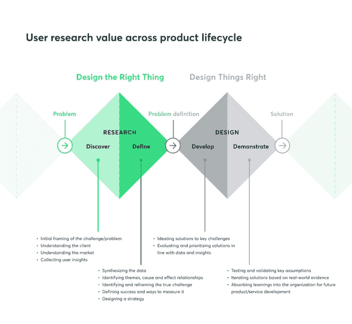
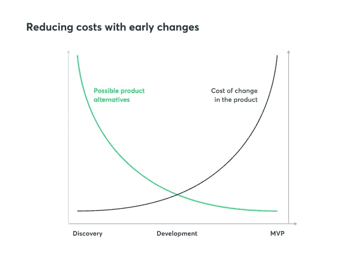

# 别听亨利·福特的！问用户，问他们很多问题

> 原文：<http://web.archive.org/web/20230307163032/https://www.netguru.com/blog/derisking-products-user-research>

 用户研究不是不必要的花费，甚至不要试图用亨利·福特的老话来说服我。

由尤韦林娜·什切帕尼亚克-文婷合著的故事。

“如果我问人们想要什么，他们会说是更快的马。”–这是很多人用来证明不做用户研究的理由。

首先，没有证据表明亨利·福特真的说过这句话。即使他知道，那又怎么样？他造的车本质上仍然是一匹更快的马。不是因为它有蹄和雄伟的尾巴，而是因为它解决了用户的需求——更快地从 A 点到达 B 点。

是时候忘记这句话了，因为现在比以往任何时候，在这个动荡和不确定的市场中，用户研究需要成为任何想要蓬勃发展的企业的基本职能。

不幸的是，用户研究是一个被误解的过程。让我们澄清误解，看看如何进行适当的用户研究，并探讨一些阻碍人们投资 it 的常见错误。

## 将产品与市场的匹配视为一个持续的过程

产品与市场的契合非常重要，但一旦你获得了最初的吸引力，它就不完整了。这是一个根据市场需求调整解决方案的持续过程，而不是一次性的。

消费者的行为、需求和欲望在不断发展。你不仅要密切关注你的用户，还要密切关注你的竞争对手，并根据他们的行为调整你的计划。

在产品的整个生命周期中，你必须不断寻找新的差异化点。做得最好的公司是那些拥有由研究专家组织和维护的反馈回路的公司。

然而，一般来说，公司会有一个由首席执行官、销售、市场或产品经理建立的特别反馈流程。这样的过程是不充分的，它使公司面临很大的风险。

如果你想让用户研究有助于产品与市场的契合，你需要首先更新你的思维模式，然后确保应用正确的原则。

## 用户研究和心态

#### 没有用户研究，你可以构建得更快，但是这会增加构建错误的东西的风险

一般来说，用户研究和产品验证的关键功能是告诉你不要做什么。这是一个极其重要但又难以捉摸的事实。

如果你足够幸运，从来没有运送过失败的产品，你就不会知道把全部预算花在市场最终拒绝的东西上是什么感觉。

经历这种心碎(的确是心碎，让我们不要假装这只是“生意”)可能是完全理解为什么用户研究不是障碍，也不是不必要的新奇事物的唯一途径。

如果你想取得进步，而不是继续做错误的事情并期待不同的结果，用户研究和产品验证是至关重要的。

你应该努力保持定量数据的平衡，解决“发生了什么？”，以及定性数据，这些数据回答了“为什么会出现这种情况？”。否则，你就是在孤立地行动，仅仅基于你的假设。

#### 假设只有在你验证它们的时候才有用

你可能犯的最大的错误是假设你知道人们需要什么。你需要意识到这样一个事实，那就是你的假设是正确的需要极大的运气。

> 即使它以前对你有用，基于你的直觉做决定也不是一个可重复或可预测的过程。

最有可能的是，你会烧完你的钱，浪费时间，却没有任何回报，然后你会匆忙回到正确的轨道上。为什么要让自己经历这些？让有经验的研究人员帮你处理就行了。

我们经常看到的是，没有相关经验或教育背景的人跳入研究，最终只寻求证实他们的假设或把诽谤者变成积极的人——这是研究的最大罪行，一个有经验的研究人员永远不会犯！

#### 产品应该是为用户设计的，而不是为高管设计的…

…除非您的用户是真正的高管。作为企业所有者或项目负责人，你的角色不是代表客户的声音。

拥有自己的愿景很重要，因为它会给你必要的动力和信心来推进你的计划——但必须有个限度。最终，如果你的愿景与用户需求相冲突，你必须把用户放在第一位，你的愿景放在第二位。

你的经历也是如此，尽管这显然是一笔巨大的财富，但实际上也可能是一种诅咒。

> 你不能太相信你的经验，因为现在一切都变化得太快了。

新一代用户不断提高用户界面和 UX 的预期标准，给产品设计师带来了前所未有的挑战。

只有当你准备好根据你的研究结果重新调整你所有的假设时，验证和用户研究才能为你创造价值。不要猜测用户的需求和偏好，而是要根据用户的洞察力和可验证的证据做出决定。

#### 愿景不应该一成不变

不要太执着于自己的愿景。一个愿景应该是可延展的，它需要基于研究洞察而发展。

除非你有证据支持你的观点，并且数据(定性和定量)清晰明了，否则你不可能有一个真正的观点。没有证据，没有清晰，你最多只能有狭隘的眼光。

## 用户研究的适当原则

#### 用户研究只是产品与市场匹配的一部分，但它几乎影响到你业务的方方面面

用户研究着眼于用户行为，它只揭示了你需要做决策的全局视图的一部分。

还有市场趋势、竞争基准、[技术趋势](/web/20221207142048/https://www.netguru.com/blog/digital-acceleration-trends-2023)——为了清楚地了解你的业务和生态系统，你需要看很多东西。

用户研究给你这个难题的合意性元素:

*   **可取性**(有人想要这个吗？)
*   **生存能力**(我们应该建造这个吗？)
*   **可行性**(我们能建造这个吗？)

然而，这一因素将影响您在不同业务领域的许多决策:

*   **战略**和商业模式
*   **营销**渠道和信息
*   **品牌化**

因此，虽然这只是产品市场匹配的一部分，但用户研究对你的业务有很大的影响。

#### 研究的民主化并不意味着任何人都可以做

有一种趋势叫做研究的民主化。对你的组织来说，研究的民主化意味着:

*   了解用户研究
*   用户研究的价值是众所周知的
*   整个组织都可以看到研究结果
*   产品团队成员可以参与研究，甚至接受培训来管理他们自己的项目

这样做的问题是，民主化经常被误解为“我们不需要专家，任何人都可以做用户研究！”。这是不对的。你不能把用户研究委托给没有准备好的设计师或营销人员，这不是他们的工作，他们也不会像熟练的研究员那样深入。

任何人都可以与用户交谈，或者查看某个软件套件提供的使用数据。然而，要提取实际有用的信息，不仅要找出明显的信号，还要找出隐藏在表面之下的信号，这需要技能、知识和经验。

这是一项细致入微的工作，以至于拥有最强用户研究能力的组织实际上将这一领域划分为如下专业化领域:

*   设计研究人员
*   产品研究人员
*   行为研究者
*   数据科学家
*   等等。

这不是你公司的任何人能在几个小时内完成的事情。这就是为什么让研究在整个组织中可见和可访问是可以的，但将用户研究委托给非研究人员不是一个好主意。

#### 包装成洞察的走廊测试不是合适的用户研究

走廊可用性测试本质上是随机调查人们对你的产品的看法。走廊测试可能意味着:

*   向你的队友寻求反馈
*   收集你在街上遇到的人的意见
*   接触你的社交媒体网络

在有些情况下，走廊可用性测试是一个很好的补充策略，可以帮助你更好地计划你的实际研究，并发现你以前没有意识到的事情。

然而，我们有时看到走廊测试被当作完全的用户研究，这是完全错误的。这是最常用的一种抄近路、快速获得无用数据的方法，所以在走廊测试时要小心！

#### 不要马上下结论

研究人员不会马上得出结论，因为用户研究有点像玩大卫·爱登堡。

你在人们的自然栖息地观察他们，分析他们的行为，测试和迭代解决方案，然后观察用户的反应。最后，您综合收集的数据，并将您的发现应用到产品开发过程中。

“自然”在这里是一个重要的关键词。你可以问用户任何你想问的问题，但除非你了解他们在独处时做了什么，否则你不会了解全貌。

这最好用黄色随身听的故事来解释。如果你已经做了一段时间的产品，你可能知道它。

简而言之:索尼想看看人们是否喜欢他们新的黄色随身听卡带播放器，而不是标准的黑色。他们成立了一个测试小组，当被问到时，所有的测试参与者都说他们喜欢黄色的随身听。

测试结束时，参与者可以在黄色和黑色的随身听中选择一个带回家。很明显，他们选择了黄色的，对吗？没有。每个人都选择了标准的黑色。

这就是为什么你不应该马上下结论。用户可能会告诉你一件事，然后转身做完全相反的事。在得出结论之前，你需要理解和探索这两种观点。

#### 用户研究打破了组织中的孤岛，让您以客户为中心

每个公司都应该为客户着想。超个性化和激光聚焦瞄准是目前最重要的商业实践。

如果你不进行用户研究，你真的不能做这些事情。看到不做研究却声称以客户为中心的公司总是令人困惑。

这归结于组织文化和领导力。当首席管理层中有用户研究的冠军，他们会利用每一个机会推动更多的研究和更好的用户理解时，这总是一个游戏规则的改变者。

> 只有当用户研究在你的公司有适当的优先权时，你才能称之为以客户为中心。

由此带来的最大好处之一是，任何内部纠纷都可以通过查看告诉您客户需要什么的数据来解决。

换句话说，用户研究可以帮助你打破组织内部的孤岛，为每个人引入一个关注点——用户。

#### 你应该分配多少预算给用户研究？

各不相同。我们看到用户研究的成本在 1000 美元到 250 万美元之间。

为了估算你的预算，考虑你已经收集了多少知识——多少数据。如果没有，你已经在考虑更大的预算了。

接下来，考虑你需要测试什么。您是在测试现有产品中的一个功能，还是需要跨多个系统和设备测试一个全新的应用程序？单一功能的测试成本会更低。

你的组织以前建立过反馈回路和做过用户研究吗？如果答案是“否”，初始投资将会更大，因为需要从头开始构建这个流程。

正确设置研究和验证操作可以是非常可扩展和可持续的。随着时间的推移，成本随着投资回报率的增长而下降，这种投资将在产品的整个生命周期中不断得到回报。

## TL；不要听亨利·福特的

在动荡的市场中，在超越竞争对手的竞赛中，抄近路是很诱人的。但在当前的市场现实中，与亨利·福特的时代相比，情况要复杂得多，仅凭你的远见不足以打造一匹更快的马。

对于大多数经理来说，为了快速上市而忽视验证是错误的，只会造成不必要的压力。

为了降低失败的风险，让自己免受压力，你需要和你的用户建立某种共生关系。这种关系可以通过持续的用户研究来实现。

如果你想知道你应该采取什么步骤来接近你的用户，[我的 LinkedIn 收件箱永远是打开的](http://web.archive.org/web/20221207142048/https://www.linkedin.com/in/jinderk/)！