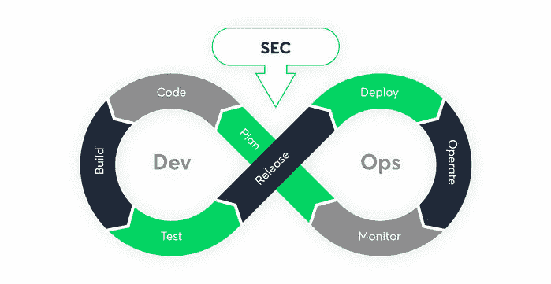
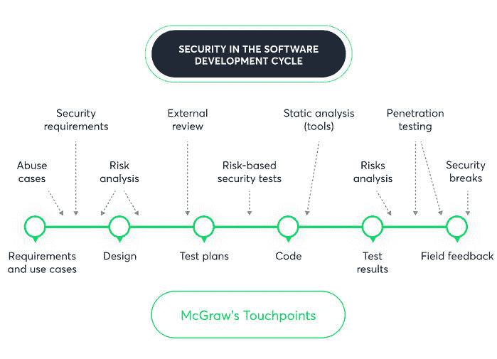

# DevOps 安全最佳实践:保护您的应用免受漏洞攻击

> 原文：<http://web.archive.org/web/20230307163032/https://www.netguru.com/blog/devops-security-best-practices>

 在 DevOps 出现之前，安全性测试通常只在开发的最后阶段进行。在开发周期从几个月缩短到几周或几天之前，这并不是什么大问题。

在[快速协作的开发运维环境](/web/20220925015955/https://www.netguru.com/blog/devops-faq)中，成熟的组织认识到安全团队也必须脱离孤立状态，融入到已经集成的开发和运营流程中。这导致了对“DevSecOps”的认可，以强调另一个转型转变——将安全性作为 DevOps 的一部分。

DevSecOps 属于一种组织文化，体现在开发实践和自动化工具的使用中，其中安全性是一项共同的责任，并集成到 DevOps 生命周期中。

在云优先的环境中，依靠云供应商提供的安全特性可能很容易。然而，根据 Forrester 的研究显示， [58%的企业遭遇过数据泄露](http://web.archive.org/web/20220925015955/https://www.forrester.com/report/The-State-Of-Data-Security-And-Privacy-2020/RES159695)，其中 41%是由软件漏洞造成的。

不管 DevSecOps 是否仍然只是另一个时髦的术语，DevOps 过程的成功已经不可避免地指出安全性应该是其中不可或缺的一部分。

## DevSecOps 的最佳实践

DevSecOps 要求从一开始就考虑应用程序和基础设施的安全性，并贯穿任何给定系统的整个生命周期。以下是您的组织应该考虑的 DevOps 安全最佳实践。

### 采用并实施 DevSecOps 模型

正如 DevOps 模型要求组织进行文化变革一样，DevSecOps 要求从经理到工程师进行类似的思维和战略转变。

企业和机构需要在任何将信息安全嵌入项目计划并为安全自动化奠定基础的新计划开始时，就让安全专业人员参与进来，无论他们是组织内部的还是外部的。

采用和实现 DevSecOps 模型将帮助工程师在考虑安全性的情况下工作的责任放在了执行官和经理身上。这需要在安全专家和开发人员之间建立一种开放的文化，以便能够就安全问题相互分享见解和反馈。

### 用安全实践更新治理策略

转向 DevSecOps 模式需要的不仅仅是思维模式的转变。为了建立期望和明确性，这种转变必须在您组织的治理结构和政策中找到自己。

编写您的安全协议，无论是新的还是已建立的，都可以向您的团队传达您打算如何将 DevSecOps 付诸实践。这也是进一步讨论如何随着时间的推移改进组织的安全实践的起点。

### 自动化安全流程

DevOps 支持流程自动化，使开发和运营团队能够更加协作和无缝地工作。同样地，DevSecOps】支持[安全流程](/web/20220925015955/https://www.netguru.com/blog/security-standards-at-netguru)的自动化，以快速交付满足客户期望的应用程序。

通过在开发周期的早期应用自动化的安全控制和测试，您的 DevSecOps 团队可以最小化人为错误、停机时间和漏洞。

自动化安全工具有助于工程师识别开发过程和基础设施中易受攻击的代码、潜在威胁和其他安全风险，无论他们是否接受过足够的安全培训。

安全自动化的一些示例包括:

*   在集装箱内引入安全扫描仪。
*   自动更新和修补 DevOps 管道中的已知安全风险，旨在消除团队人员登录生产环境的需要。
*   完全自动化大部分安全回归测试，而那些必须手动执行的测试应该是自动辅助的。
*   在代码分析、配置管理、秘密管理、漏洞管理、审计、补救以及自动化工具已经广泛可用的其他领域使用自动化工具。

### 进行漏洞评估和管理

在 DevOps 环境中，扫描漏洞已经是一种常见的做法。然而，在大多数情况下，进行漏洞评估通常仍然局限于少数情况，并没有真正嵌入到 DevOps 的生命周期中。

DevSecOps 团队必须扫描并修复开发、集成和生产环境中的漏洞。渗透测试和其他攻击机制的结果必须告知团队的每个成员如何应对各自工作领域的安全风险。

此外，安全自动化工具应该帮助团队运行测试和监控漏洞，这可以使安全性更无缝地集成到开发运维流程中。

### CI/CD 中的持续安全性

与 DevOps 的兴起密切相关的是 CI/CD 方法，它指的是持续集成、持续交付和持续部署。

DevSecOps 从业者确保安全协议和工具集成在 CI/CD 环境中。虽然有很多需要考虑，但这里有一些 CI/CD 管道中的安全指南的示例:

*   会话管理或认证中的模式变化必须触发对安全工程师的通知。
*   团队必须使用软件版本管理系统，不仅要跟踪源代码的所有变更，还要管理可执行映像和用于创建和测试软件的工具。
*   发布到生产的决策必须基于预先确定的标准，包括安全标准。
*   连续部署流程必须触发运行时安全性和合规性检查，例如确保禁用不必要的服务。

### 实施最低特权模式

最小特权模型是安全方面的一个重要经验法则，它是一种不给予超过所需特权的实践。实施最低特权访问权限可最大限度地减少内部或外部攻击者利用漏洞的机会。

例如，如果工程师不需要 root 访问权限，那么只分配普通用户凭证。此外，限制开发人员对某些系统容器的访问(如果对他们的工作不必要的话),同时仍然启用编码、构建、测试和管理应用程序组件所必需的权限。

作为安全治理的一部分，定期监控和审核所有特权会话和活动，以确保它们是合法的。

### 对 DevOps 团队进行安全培训

无论您的组织是否有可以整合到开发运维团队中的专业安全人员，向开发和运营人员提供安全实践方面的培训和能力建设都是至关重要的。

公司可以组织全团队的培训课程，或者赞助在线课程，个人成员可以利用自己的时间参加。因为安全规范和最佳实践在不断发展，所以组织必须让他们的员工不断学习，并将这些知识整合到组织实践中。

DevSecOps:网络大师之路

我们的 DevSecOps 方法基于安全软件开发生命周期(SSDLC)框架。这面向处理敏感和高价值数据的客户，[要求他们的产品符合顶级安全标准和实践](/web/20220925015955/https://www.netguru.com/blog/handling-devops-processes-the-netguru-way)(例如 OWASP、ISO、NIST、PCI-DSS、HIPAA 等。).

## 无论您从事什么行业，我们 Netguru 都有经验丰富的安全专业人员，他们可以轻松融入您的开发团队。根据项目的复杂程度，我们的安全工程师可以兼职或全职工作。

下面介绍的我们的专业知识基于左移安全方法，这实际上意味着从设计 IT 系统的最早阶段开始实施安全措施。

风险评估

风险评估的实践尽可能接近项目概念，以确保项目的设计质量。

### 风险评估活动包括技术性较低的对话，以便客户组织的经理和高管能够参与该过程。

Netguru 风险评估服务的预期结果是产生项目风险的整体图景，这不仅涉及技术风险，还涉及影响整体业务的风险。

威胁建模

威胁建模是最适合从头开始构建或开发产品的组织的服务。尽管如此，在整个产品生命周期中采用威胁建模仍然是非常值得推荐的。

### 与风险评估相比，威胁建模的主要焦点是识别与项目相关的技术漏洞、问题、威胁和潜在攻击媒介。

在威胁建模练习中，安全工程师站在攻击者的角度来寻找最可能的威胁场景。这通过考虑用例、测试用例以及用户故事的威胁而反映在项目范围中。

咨询和架构分析

该服务的目的是为设计和开发团队提供支持，特别是在考虑安全性的情况下确定体系结构和技术解决方案。

### 此流程使安全顾问或工程师能够与项目开发人员携手构建架构，并选择符合项目安全参数的解决方案。

CI/CD 管道强化

该服务的目的是通过选择旨在早期识别安全问题的工具来设置 CI/CD 管道的适当配置。

### 全球安全标准(如 OWASP 和 NIST)以及某些法律法规(如 HIPAA 和 PCI-DSS)建议在开发过程中进行错误检测。

扩展安全性测试

质量保证是一个复杂的动态过程，测试是其中的关键步骤之一。虽然测试有多种形式，但 QA 工程师通常专注于功能测试，从用户的角度验证应用程序的实用性。

### 非功能性测试，包括安全性和性能测试，关注应用程序的一般健壮性和可靠性。这些通常由主题专家来执行。例如，[组织需要定期测试基础设施对中断的抵抗力](http://web.archive.org/web/20220925015955/https://www.netguru.com/blog/how-to-bulletproof-your-company-for-web-outage-in-three-steps)，而不仅仅是攻击。

在扩展的安全测试中，渗透测试在每个 sprint 中执行，并深入集成到 DevOps 生命周期中。这种程度的连续性在不忽视网络安全的情况下加快了上市时间。

云硬化

云强化是一系列工具、技术和最佳实践，用于减少和管理应用程序、基础架构和其他基于云的系统的漏洞。

### 这是通过删除多余的应用程序、权限、功能、端口和其他对系统的最佳运行不必要的元素来实现的。

例如，通过引入 API 网关，企业减少了暴露的 API。通过[最大限度地减少攻击媒介和压缩系统的攻击面](/web/20220925015955/https://www.netguru.com/blog/attack-surface-discovery)，恶意软件和漏洞利用在您的云生态系统中获得立足之地的机会更少。

通过设计保护您的企业

在一项关于[防止网络安全漏洞的经济价值](http://web.archive.org/web/20220925015955/https://www.businesswire.com/news/home/20200407005031/en/Study-Preventing-Cyberattack-Penetration-Save-Enterprises-1.4)的研究中，该研究表明，大多数网络安全预算侧重于遏制攻击，而不是防止攻击。该研究认为，公司在遏制方面比预防更有效，因为在违规后的遏制被认为更负责任，而预防被认为更困难。

## DevSecOps 最佳实践是通过设计确保安全的概念，这实际上意味着安全实现从设计 IT 系统的最早阶段开始。这种方法不仅与项目交付有关，还与实现对您的组织至关重要的业务目标有关。

尽管开始更加关注和考虑安全性永远不会太晚，但是在已经投入生产的系统中实施安全性最佳实践更加困难、复杂和昂贵。DevSecOps 降低了实施安全控制的成本，更不用说阻止可能对您的整个企业造成巨大损失的攻击了。

DevSecOps best practices are secure-by-design concepts, which in practice means security implementations begin at the earliest stages of designing IT systems. Not only is this approach about project delivery but also about achieving business objectives that matter to your organization.

While it’s never too late to start becoming more conscious and deliberate about security, [implementing security best practices in systems](/web/20220925015955/https://www.netguru.com/services/cybersecurity) already in production is more difficult, complex, and expensive. DevSecOps reduces the cost of implementing security controls, not to mention deterring attacks that may be costly to your entire business.