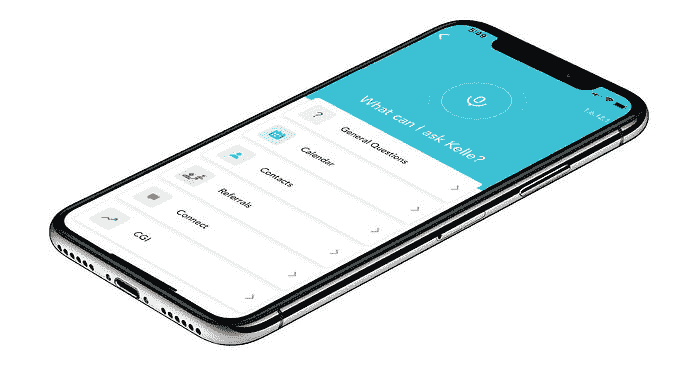
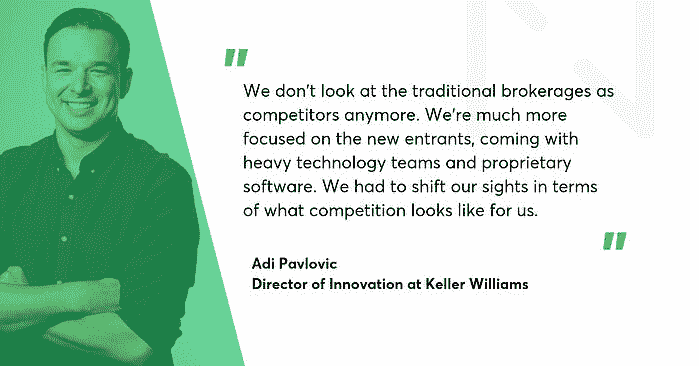
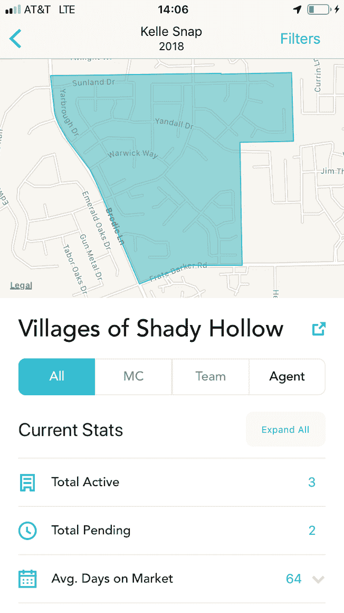
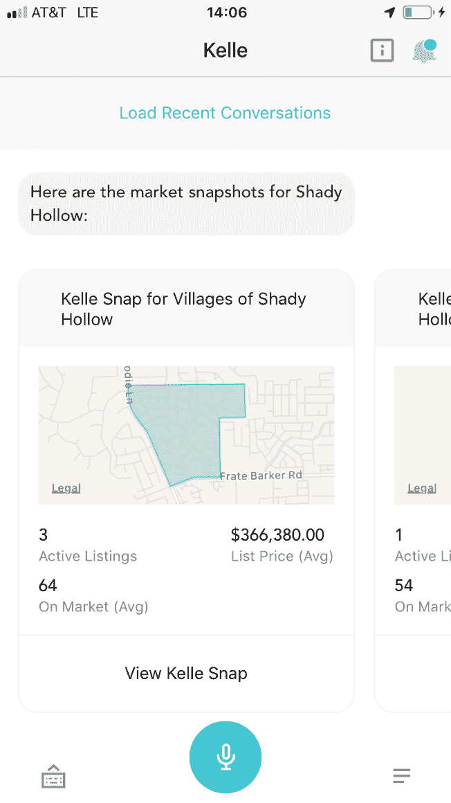

# 数字化转型。一个房地产领袖如何押注人工智能和敏捷，创造出“类固醇 Siri”，并成为一家科技公司

> 原文：<http://web.archive.org/web/20230307163032/https://www.netguru.com/blog/digital-transformation-real-estate>

 Keller Williams 是世界上最大的房地产特许经营公司(超过 190，000 名代理人)，也是全球最大的私有住宅房地产经纪公司之一。你不会对一家来自传统行业的 35 岁公司有太多期望吧？但魅力非凡的凯勒·威廉姆斯公司创始人兼董事长加里·凯勒远非孤注一掷。

因此，2015 年，KW 开始将自己重新定位为一家科技公司(至于如何和为什么，你马上就会知道)。该公司在自己的软件、云计算和人工智能上投入了大量资金。它创建了自己的实验室部门 KW Labs，其工作方式与谷歌或亚马逊类似。

他们的标志性产品之一是 Kelle，被称为“房地产行业的 Siri”。Kelle 是一个由人工智能驱动的个人助理，可以帮助代理管理他们的交易-回答问题，管理推荐，根据职业目标检查他们的进展，等等。

> KW 创新总监 Adi Pavlovic 说:“没有一家房地产公司像我们这样大规模地这样做。”。

作为 Keller Williams 的设计和软件合作伙伴，我们知道一个事实，那就是他们在数字化转型之旅中的速度令人难以置信。作为市场领导者，他们没有理由沾沾自喜。我们很自豪 Netguru 是 Keller Williams 旅程的一部分。

****

*Kelle 是 Keller Williams 的标志性产品之一，被称为“房地产行业的 Siri”。*

 *网络大师 Tomasz Grynkiewicz:在加入 Keller Williams 之前，你没有房地产行业的背景。从这样的障碍开始很难克服吗？

Keller Williams 的创新总监 Adi Pavlovic:相反，我认为它实际上非常有帮助。给你一点背景资料——当我开始在凯勒·威廉姆斯工作的时候，房地产技术领域的风险投资基金大约是每年 2-2 . 5 亿美元。从那以后的五年里，这个数字是 40 亿。

**看来房地产行业有点...**

## 陈旧的。

终于有人决定尝试解决许多效率低下的问题。

## 许多公司试图利用技术来实现这一垂直市场的现代化。他们中的一些人成功了，这吸引了大量资金进入这个领域。事实证明，这些外来者解决了许多效率低下的问题，从而提高了生产率，也节省了大量资金。

但是凯勒·威廉姆斯没有等着别人来切馅饼，而是决定从内部创新。

## 大约三年前，我们决定成为一家技术独立的公司。很多和我们类似的经纪人和经销商，几乎整个行业，都依赖于第三方技术公司。他们在我们的墙外为我们构建解决方案。

问题是这些解决方案基于长期合同，它们的目标并不总是与实际经纪业务一致。随着消费者需求开始以前所未有的速度变化，越来越多的进入者开始进入这个领域，这就产生了一些竞争压力。

我们很快意识到，我们需要开发专有软件，以便给我们的代理商最好的获胜机会。

**从那以后，你在云、机器学习、设计方面投入了很多。您还启动了 KW Labs 计划，邀请您的代理与您的团队一起开发软件。**

## 我们研究了很多实现[数字化转型](/web/20221006005633/https://www.netguru.com/services/digital-transformation)的不同方法。有了 KW 实验室，我们希望有一个地方，在那里我们可以以令人难以置信的速度与最终用户一起快速构思、培育和验证产品。我们需要一个地方，在那里我们可以研究不一定与业务目标一致的概念，因为它们更关注消费者。

我们可以说，我们已经采用了谷歌和亚马逊运行创新实验室的方式，并对其进行了调整，以适应房地产环境。

这听起来有点像车库黑客。它如何适应凯勒·威廉姆斯的结构和文化？

## 对整个公司来说，这是一个变革的过程。最初，当我们投资 KW 实验室时，它是一个小得多的部门。但这种模式在内部被广泛采用，我们的领导层有了“啊哈”的时刻，决定冒一次险:“为什么我们不能让我们的整个产品管理团队或整个工程团队在这种模式下运作？”。

我们采用敏捷思维，并给它注入类固醇。我们现在的上市速度非常快，涵盖了我们做的每一件事情。所以 KW Labs 最终作为一种产品方法在整个组织中实施。

你是如何设法得到代理人的支持，与他们合作进行实验室的头脑风暴和验证的？

*

*我们没必要这么做。凯勒·威廉姆斯拥有房地产界最大的代理网络和良好的合作文化。我们从公司文化中继承的是与代理商的良好关系。反过来，他们中的很多人非常愿意测试产品，参与焦点小组，回答调查。他们愿意参与实验室并成为大规模的测试者，这对我们来说是一个巨大的优势。*

 *## 你能提供一个这种合作的例子吗？

在我们的年度活动“家庭团聚”上，我们的技术团队在现场主持了几个实验室。三天之内，根据 400 名员工的反馈，该团队设计出了三款对代理商有用的产品。

## 在另一场活动中，我们与同事合作举办了一场黑客马拉松，为我们的人工智能私人助理 Kelle 设计了一项新技能。开发“映射我的数据库”花了不到四天的时间，帮助代理在外出时可视化他们的数据库。

除了这些黑客活动之外，市场上已经有一些来自实验室的商业解决方案。

没有一家房地产公司像我们这样的规模在做这件事。

令人印象深刻。你认为运行实验室的最大挑战是什么？

拥有一个积极参与的用户群是件好事，但这也给我们带来了挑战。我们很快了解到，我们从 190，000 名代理人的网络中获得的几乎每一个观点都与众不同。

## 我们问自己:我们是为阶级而建，还是为大众而建？我们挖掘了数据，发现大约前 20%的代理商完成了大约 80%的业务。

他们面临非常复杂的挑战，在技术上投入大量资金，通常使用大约 10 到 15 个不同的应用程序。 因此，我们的挑战是如何为顶级代理商解决问题，同时也为一年可能只做几笔交易的新代理商解决问题？这是一项巨大的努力，也是我们仍然面临的挑战。

Kelle 是解决方案之一，也是您的标志性产品之一。这个人工智能助手是如何产生的？

当我们问代理:“如果你现在有什么可以帮助你解决最大的业务问题，那会是什么？”时，我们会对他们做这种开放式的练习在其中一个实验室里，出现了“房地产 Siri”的想法。

## 这个概念是指一个代理人在办公室之外花大约三四个小时在路上，通常是开车。因此，除了成熟的[企业移动应用](/web/20221006005633/https://www.netguru.com/services/enterprise-mobile-app-development)，代理商还需要一个声音来与他们的业务数据进行交互，因为他们经常在约会和展示之间。我们进一步推进了这个想法，询问了前五个最需要的技能是什么。凯乐的概念就是这样诞生的。

Kelle 开始执行简单的任务，但由于人工智能的能力，我们可以教 Kelle，它每天都变得越来越聪明。学习过程发生得如此之快，以至于我们确实感觉我们正在构建“房地产 Siri”。

**哪些最重要的特征让你相信凯尔在市场上鹤立鸡群？**

我认为我们是第一个通过语音完成复杂任务的市场。我们必须让 Kelle 复制苹果的“Siri”或亚马逊的“Alexa”的体验，因为消费者已经习惯于学习如何操作这些语音助手。但是我们在商业概念和不同的环境中使用声音。

有了 Siri 和 Alexa，用户只想获得问题的答案或执行简单的命令，而我们让 Kelle 执行复杂的命令，与充满商业数据的平台同步。

## 我们才刚刚开始。今天，我们通过文本显示确认，但我们的下一个飞跃将是通过双向语音，从助理到代理，以及主动通知来实现。

你认为构建 Kelle 的主要挑战是什么？

我们解决了自然语言处理方面的许多挑战。我们了解到代理使用的术语因州而异，甚至因团队而异，因为他们喜欢构建自己的词汇表。

可用性是我们面临的下一个巨大挑战。我们必须超越简单与凯乐。设计理念非常简约，第一次迭代不过是一个简单的麦克风按钮。

## 几个月后，我们收到了超过 400 万份对 Kelle 的询问。我不能分享我们已经成功识别了多少人的指标。但我们看到仍有改进的空间，通过使用机器学习，我们可以快速了解 Kelle 需要优先考虑的下一件事。

从 Netguru 的角度来看，成为这样一个旅程的一部分是令人兴奋的。我们给凯乐增加了什么价值？

这对我帮助很大。Netguru 是迄今为止我们合作过的最好的代理商。您的团队了解 Kelle，并能够在我们的模型中设计新的技能、功能和交互，非常注重上市速度。

Netguru 还非常擅长理解如何平衡自己的设计经验和最佳设计实践与 KW 实验室会议的成果。

## 我认为最有帮助的一件事是理解哪些用户支持的功能应该被整合到最终的设计中。

谢谢你的美言。回到一个更广阔的视角-是什么让凯勒威廉姆斯从其房地产竞争对手中脱颖而出？

我们是第一个也是第一个站出来说:“嘿，我们不再是一家房地产公司，我们现在是一家科技公司”的主要品牌之一。令人惊讶的是，我们因此受到了一些批评。

所谓“创新者困境”的概念是，当你是业内最大的公司时...

你也是最难改变的人。这是真的，这也是为什么我们正在远离过去所做的许多事情。很不舒服，但同时也很刺激。

## **比如？**

我们已经改变了招聘方式，现在我们为凯勒·威廉姆斯带来了不同的人才。我们正在改变我们的合同、我们的供应商关系等等。很自然，这会产生很多摩擦，从好的方面来说，我们正在做很多新的事情。

## 但是我们开始看到许多模仿者试图复制我们已经做过的事情。我们认为这对我们来说是一种证明，证明我们对整个行业的现代化有影响力。

**作为一家科技公司，你现在如何定义竞争？**

## 就代理商数量和交易额而言，我们已经是该领域的第一名。因此，我们不再将传统券商视为竞争对手。我们更关注新进入者，他们拥有强大的技术团队和专有软件。我们必须转移我们的视线，看看竞争对我们来说是什么样的。

在科技世界里，每天都有新的竞争对手。

他们中有多少人会留下来？不多。但我们有一个研究团队，致力于寻找任何在房地产领域筹集资金或风险投资的人。我们试图确定他们是朋友还是敌人。 与此同时，我们正在构建平台，因此很快我们将拥有一个 SDK，允许第三方公司集成到我们的平台中，并在 Kelle 中构建技能。

## 我说这与亚马逊的做法非常相似，这难道是错的吗？

在我们将如何影响行业以及我们的平台将如何成为行业的一部分方面，我们正在从亚马逊的剧本中窃取一些东西。我们不仅对进行交易感兴趣，还对定义代理与客户互动的方式感兴趣。

## 我们从一个个人问题开始，我也想以一个问题结束。你如何用通俗的语言解释你的角色——创新总监？

我说过作为一个行业局外人有助于获得新的视角。但是也有很多东西要学。房地产是一个非常独特的行业，所以我和我的团队仍然试图花很多时间在这个领域跟踪代理人，了解代理人的一天是什么样子，交易是如何进行的。

## 我的工作是了解我们下一步要做什么。我的角色不一定是提出想法，而是帮助合适的团队成员与合适的焦点小组一起做合适的练习，以了解问题和解决方案。

然后，我需要把它转化成设计，再把这些设计转化成产品。在某种程度上，我是设计团队和产品团队之间的桥梁。

## **We started with a personal question, and I would like to end with one as well. How would you explain your role - director of innovation - in layman’s terms?**

I have said that being an industry outsider was helpful for getting the fresh perspective. But there is also a lot to learn. Real estate is a very unique industry, so me and my team are still trying to spend a lot of time in the field shadowing the agent, understanding what the day of an agent looks like, how a transaction looks.

My job is understanding what we're going to build next. My role is to not necessarily come up with the ideas, but rather help facilitate the right team members to do the right exercises with the right focus groups to understand what the problem and what the solution is.

Then, I need to translate that into designs, and these designs into a product. In a way, I’m a bridge between the design and product teams.*