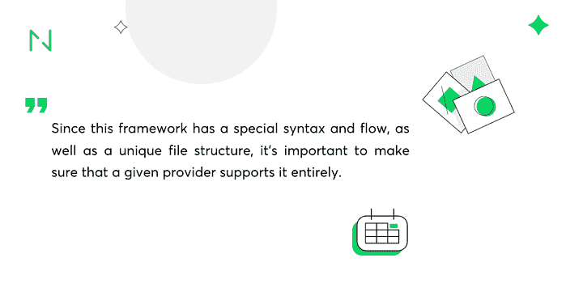
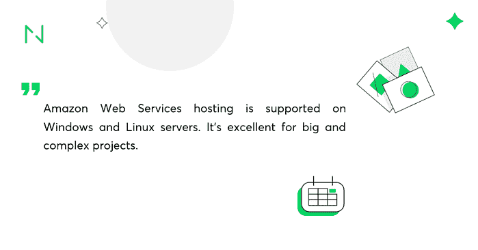

# 在哪里托管你的下一个应用:10 大 Django 托管提供商

> 原文：<http://web.archive.org/web/20230307163032/https://www.netguru.com/blog/django-hosting>

 假设您正处于开发应用程序的最开始阶段。有了可靠的商业计划，你决定使用 Python，你把赌注押在了 [Django 框架](/web/20221209130803/https://www.netguru.com/blog/django-pros-and-cons)上，准备做出第一个决定，将这个项目从概念变为现实。在这个阶段要做的最基本的事情之一是找到一个 Django 友好的托管服务。

由于这个框架有特殊的语法和流程，以及独特的文件结构，所以确保给定的提供者完全支持它是很重要的。你应该检查你的主机是否:

*   支持 [Python](/web/20221209130803/https://www.netguru.com/glossary/python) 和 [Django](/web/20221209130803/https://www.netguru.com/services/django-development) 、的 **多个版本**
*   优惠 **快速简单的 Django 安装和配置** ，
*   使 **轻松部署和扩展** 任何 Django 项目成为可能，
*   有专门的 **支持团队** 。

当然，还有其他你需要注意的事情，但是这些取决于你的项目的更具体的要求，以及你的未来计划。然而，为了让你的生活更轻松，这里有一个 **对 10 个 Django 兼容的主机提供商** 的简要概述，绝对值得考虑。 

 

PythonAnywhere 运行在强大的 Amazon EC2 服务器上，**它非常适合纯 Python 项目** 。它预配置了大量的库，可以在 iOS 设备上运行(Android 测试版)，所以你可以随时随地进行编码。

### **优点**

*   设置和使用都很简单。
*   所有帐户都获得免费的 SSL 支持，您可以与其他人共享您的控制台。
*   它有很好的客户服务。
*   它包括简单的缩放选项。
*   它提供灵活的支付方式(你按月付费，可以随时取消)。

### **缺点**

*   在服务器端只有 Python。
*   由于 PA 不支持 websocket，您无法托管实时应用。

### **计划&定价**

免费初级账户+ 3 个付费计划(5-99 美元/月)+定制计划(5-500 美元/月)。

Heroku 采用 PaaS 架构，支持多种语言(Python、Ruby、Java 和 PHP)、数据库和插件。它具有应用程序指标、代码和数据回滚、实时洞察、GitHub 集成等功能。**最适合中小型应用。**

### **优点**

*   它具有高度的可扩展性和可定制性。
*   仪表板是用户友好的。
*   上传、更新和部署过程非常简单。
*   它既可靠又灵活。

### **缺点**

*   当你长到真正大的时候，它可能会变得太贵。

### **计划&定价**

免费账户+付费计划(“现收现付”模式，每月甚至高达数万美元)。 

A2 主机是一家独立的公司，拥有无限的磁盘空间和带宽，99.9%的正常运行时间保证，共享 Linux 主机。 **它有低流量和高流量网站的选项，但主要用于快速增长的项目。原因如下。**

## **优点**

*   它专注于速度和高性能。
*   服务器的物理位置并不重要，因为他们在全球各地都有数据中心。
*   这些产品是完全可定制的，可以根据客户的需求进行定制。

## **缺点**

*   没有免费账户来测试功能。
*   与较贵的计划相比，最便宜的计划有相对严格的限制。

### **计划&定价**

3 个付费 Linux 计划(3.92 美元至 9.31 美元)+ 3 个付费 Windows 计划(4.90 美元至 10.78 美元)+ 1 个定制计划(119.99 美元)

它很大，提供了大量的虚拟主机选项和许多高端附加服务。它在功能和定价方案方面都是非常可定制的。Windows 和 Linux 服务器支持 Amazon Web Services 托管。 **非常适合大型复杂的项目。** 

****

**优点**

### 它高度可靠，选项包括服务器克隆、完全冗余和备份。

*   它为其机器学习和数据分析工具提供了广泛的框架支持。
*   它不仅关注速度和性能，还关注安全性、合规性和隐私。
*   它拥有一流的客户支持。
*   您可以轻松运行和扩展您的应用。
*   **缺点**

### 有限的磁盘空间和带宽。

*   选择太多——对新人来说非常困惑。
*   复杂的定价方案。
*   **计划&定价**

### 有很多种变化。价格取决于你使用的服务和你选择的时间间隔——它们从每小时 0.08 美元开始。

HostUpon 提供无限的磁盘空间、带宽和托管在所有计划上的网站。它在全球拥有 5 个数据中心，并承诺 99.9%的主机服务正常运行时间。 **它为小型、中型和大型企业提供量身定制的解决方案。**

**优点**

### 它不仅支持 Python，还支持 PHP 和 Perl。

*   它提供 24/7 全天候实时客户支持，速度非常快，知识丰富。
*   价格实惠，并保证 30 天退款。
*   **缺点**

### 没有免费计划。

*   它可能在基本计划中有太多不必要的选项。
*   **计划&定价**

### $ 3.95-15.95/月的共享托管计划，$ 49.95-149.95/月的 VPS 托管计划，$ 24.95-99.95/月的云托管计划，以及$ 175.00-595.00/月的专用服务器计划。

TMD 主机使用尖端的云技术和固态硬盘服务器，以提供更快的加载时间。他们在全球 7 个地方拥有数据中心。他们还在安全性上下了赌注:定期更新、每日备份和流量监控。**这有利于启动项目，也有利于中型企业。**

**优点**

它高度可靠和安全。

### 使用起来既简单又直观。

*   它的表现很好，因为他们对停机时间采取“零容忍”政策。
*   训练有素的支持团队可以在 15 分钟内全天候处理基本和技术问题。
*   **缺点**
*   没有可供测试的免费计划。

### 对于更复杂的项目，没有太多的选择。

*   **计划&定价**
*   初级计划的起价为每月 2.95 美元，商业计划的起价为每月 5.95 美元，专业计划的起价为每月 12.95 美元。

### 这是目前最流行的云托管选项之一。DigitalOcean 的价值在于其简单性、快速加载时间(得益于 SSD 存储和 8 个数据中心)以及可靠性。控制面板很容易操作，支持团队也很有帮助。 **对初创项目来说非常棒，对更先进的企业来说也不差。**

**优点**

这是一个易于部署、管理和扩展任何规模应用的平台。

它具有高度的灵活性和定制性。

*   它拥有强大的 24/7/365 支持，并提供大量的教程和常见问题。
*   它提供有竞争力的价格。
*   **缺点**
*   数字海洋不提供 Windows 服务器。

### **计划&定价**

*   $ 5.00-960.00/月标准液滴，$ 20.00-920.00/月 CPU 优化液滴。 

### **Plans & pricing**

微软的 Azure 是最大的云提供商之一，它托管 [Django](/web/20221209130803/https://www.netguru.com/blog/django-apps-examples) ，允许内容交付网络、媒体服务、web 应用程序、API 应用程序，并提供不同的工具包。Azure 将适合托管每个月都会收到大量流量和请求的 Django 网站。使用 Azure 托管 Django 的知名公司包括 HP、Asos 和 AirBus

赞成的意见

它是可扩展的。

### 它具有多因素认证。

*   它在世界各地有 40 多个数据中心。
*   骗局
*   它很复杂，新用户可能需要一些时间来理解它。

### 它只对管理数据有效。

*   它缺少恢复模式。
*   计划和定价
*   你可以选择从多达 10 个网络，移动 API 应用程序和 1 GB 磁盘空间的免费包不同的包，但缺乏自定义域。然而，基本套餐每月从 54.75 美元到 219 美元不等，包括无限数量的网络、移动 API 应用程序和自定义域。

### 谷歌云平台也是 Django 主机提供商，专注于适合 Spotify、可口可乐和索尼音乐等企业的服务。它提供了许多不同的工具，包括计算、存储、运行大数据分析和机器学习。该平台也适合寻求出色支持帮助的公司。

赞成的意见

这对需要分析和数据存储的公司非常有利。

### Django 可以在支持所有谷歌产品的相同基础设施上运行，这对应用程序适应可靠工作负载的能力产生了积极影响。

*   骗局
*   例如，它的功能比 AWS 少。

### 成本很高。

*   计划和定价
*   谷歌云平台提供 300 美元的免费积分，用于为新客户运行、测试和部署工作负载。所有客户都可以免费使用 20 多种产品，但是每月有使用限制。价格从每月每 GB 0.01 美元起。

### Hetzner 是一家总部位于德国的公司，提供各种可能对 Django 托管、SSL 证书、域名注册、专用服务等有用的服务。该平台由 Showma、Autodoc 等公司使用。

赞成的意见

它适用于小型和大型项目。

### 它比其他主机提供商更实惠。

*   它拥有高质量的软件(与戴尔和英特尔合作)。
*   骗局
*   美国没有数据中心；仅在德国和芬兰。

### 技术文档仅提供德语版本。

*   它的界面不是很友好。
*   计划和定价
*   海兹纳提供非常实惠的定价方案。CX11 级每月€2.49 起，包含 20 GB 磁盘空间和 20 TB 流量。最贵的计划是 CX51，€每月 29.90 英镑，包括 240 GB 磁盘空间和 20 TB 流量。

### 最后的想法

所有的 10 个主机提供商都支持 Django，并使使用它变得容易和愉快。因此，如果你确信 [Django 对你的项目来说是完美的](/web/20221209130803/https://www.netguru.com/blog/why-use-django)，你就可以开始了！当然，如果您认为不同的主机更符合您的需求，您也可以选择不同的主机。有很多可供选择，每一个都提供不同的解决方案和选项，或多或少都有灵活的定价方案。

## 只要记住一件事。如果提供商的网站上没有明确提到 Django 支持，请在注册之前询问一下。

All of the 10 hosting providers support Django, and make working with it easy and enjoyable. So if you are sure that [Django will be perfect](/web/20221209130803/https://www.netguru.com/blog/why-use-django) for your project, you are ready to start! Of course, you can choose a different host if you feel that it would fit your needs and requirements more accurately. There are plenty to choose from, each offering different solutions and options, with more, or less, flexible pricing schemes.

Just remember one thing. If Django support is not explicitly mentioned on the provider’s website, ask about it before you sign up.