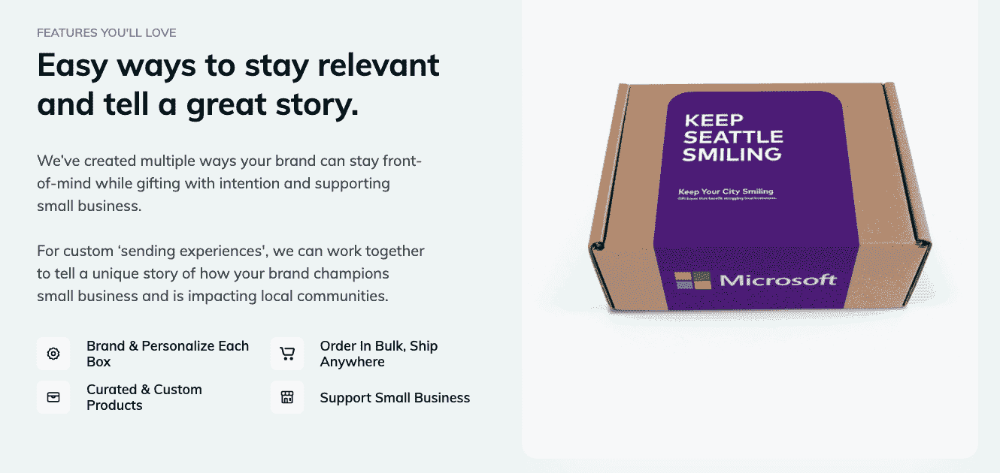
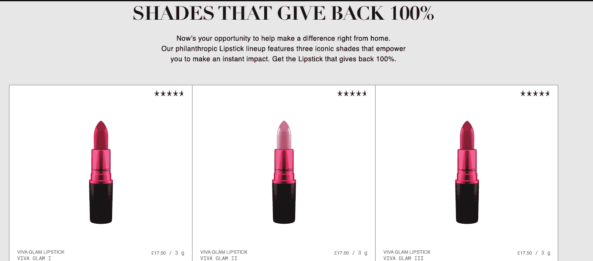
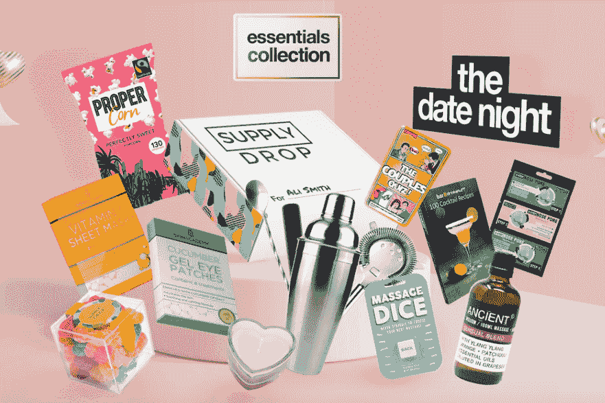

# 8 家电子商务公司调整业务以应对新冠肺炎

> 原文：<http://web.archive.org/web/20230307163032/https://www.netguru.com/blog/e-commerce-pivoting-business-covid-19>

 新冠肺炎·疫情推动公司重新思考他们的商业模式。虽然电子商务在面对这一挑战时比任何其他行业都处于更有利的地位，但它们也必须采取某些步骤，以便在新的现实中有效地运作。

他们不仅要满足**日益增长的网上购物需求，而且还要推出全新的产品，如锁定美容套装和新冠肺炎测试亭，以满足当前的购买模式。**

 **在下面的文章中，我们将与您分享包括 Room、Zay 和 Buymie 在内的 9 家电子商务公司如何在新冠肺炎疫情期间调整业务，以更好地满足客户的需求。

## 什么是商业支点？

尽管“pivot”一词经常被理解为剧烈的业务变化，但它并不总是意味着从根本上动摇业务的变化。相反，它是解决公司面临的一个重要问题或挑战的过程——一个阻碍公司实现目标的问题。因此，一个支点可以意味着从引入一个新的产品或服务到整个业务的重新定义和进入一个新的行业。

## 1.让你的城市保持微笑

总部位于西雅图的初创公司 Snap Bar 出售西雅图特有的礼盒，支持受到新冠肺炎冲击的小企业。

在疫情之前，他们为现场和虚拟活动提供虚拟照片亭、活动箱和品牌自拍链。这家快餐酒吧 [在一周内失去了所有的顾客](http://web.archive.org/web/20221007151618/https://www.inc.com/emily-canal/the-snapbar-pivot-keep-your-city-smiling-coronavirus-pandemic.html) ，这促使创始人推出了一项全新的业务——一项礼盒服务让这座城市保持微笑。

礼品盒包括从当地商家收集的**商品**，如小吃、艺术品、咖啡杯等。并且直接销售给 B2B 和 B2C 消费者。根据当地的特色，每个城市的产品种类都不一样。

他们的大部分客户位于西雅图、洛杉矶、旧金山和波特兰。“保持城市微笑”还为医护人员准备了一个特殊的礼盒，以表彰他们在疫情期间的工作。

团队**使用谷歌和 Etsy** 为他们的盒子在当地采购产品。他们还要求已经合作的企业在其他类似的企业中进行宣传，这样他们的产品也可以包含在优惠中。

在推出这项服务的一个月内，**该品牌获得了 10 万美元的销售额**，并将礼盒的价格从 75 美元降至 65 美元。总的来说，这一转变非常成功。

**

**来源: [让城市保持微笑](http://web.archive.org/web/20221007151618/https://www.keepyourcitysmiling.com/)**

 **2.房间

## 房间提供**办公室电话亭**用于单独打电话、虚拟会议或获得一些安静的工作时间。它们由可回收材料制成，隔音，通风，模块化。

作为对新冠肺炎战斗和保护医护人员的一种贡献，Room 重新设计了他们的产品，并开始生产 T2 测试亭。他们将普通电话亭改造成了**快速检测单位**。

由于它们由三面从办公室电话亭回收的未使用的有机玻璃制成，因此易于清洁和消毒。你可以在 30 分钟内移动和组装它们。

该展台还包括内置医用手套和放置基本设备的架子。

它不仅有助于新冠肺炎病毒的快速检测，还能有效地保护医务人员免受病毒感染。

由于越来越多的公司采用远程办公，在疫情期间销售办公室电话亭变得极其困难。通过将目标受众扩大到医疗保健行业，Room 成功抵消了新冠肺炎给他们的业务带来的负面影响。

来源: [房间](http://web.archive.org/web/20221007151618/https://room.com/pages/test-booth)

3. ZAY

Zay 是科威特**奢侈品电商时尚平台，**由 Sara N. AlAteeqi 于 2019 年创立，专注于可持续发展和租赁。创办该公司的主要理念是让女性有发言权，通过简单的日常活动增加她们的衣柜，最大限度地减少环境浪费。

## 在新冠肺炎之前，这家商店的运营方式和其他任何在线商店一样。然而，疫情已经迫使 ZAY 将其业务转向委托市场平台。

[ZAY 的创始人说:](http://web.archive.org/web/20221007151618/https://www.entrepreneur.com/article/351644)

“我决定将我当前的问题转化为‘我们’的解决方案，向小企业提供我们的平台(包括我们的应用和网站),以 0%的佣金销售两个月...通过这种方式，我们为所有加入的小企业创造了一种网络效应，并帮助我们自己以及我们的扩展社区在这场危机中成长，而不是关门。”

4. M.A.C 化妆品

> 米（meter 的缩写））A.C .是一家加拿大化妆品制造商，年营业额为 10 亿美元，在全球拥有 500 多家独立商店。像许多其他公司一样，该公司不得不关闭大部分门店，将业务转移到网上。

## 米（meter 的缩写））空调公司意识到，随着消费者从店内购物转向网上购物，他们不得不 [想办法让他们试试化妆品](http://web.archive.org/web/20221007151618/https://www.warc.com/newsandopinion/opinion/covid-19-conversations-ukonwa-ojo-cmo-mac-cosmetics/3752) 。他们将一项他们已经拥有的技术——T4——转变成了一场虚拟试演。该公司升级了工具，增加了新的子类别，并且在 COVID 后参与度增加了三倍。

除了将销售转移到网上，M . A.C Cosmetics 还恢复了其在艾滋病危机期间**发起的“Viva Glam】活动。**

他们计划在 4 月份重新推出，但由于新冠肺炎疫情，他们决定将其转变为针对冠状病毒的活动，并提前推出。该品牌推出了特殊的口红颜色，VIVA GLAM 口红购买的利润(不含增值税)将捐给帮助弱势群体的组织，包括那些受疫情影响的人。他们向全球 250 个这样的组织捐赠了 1000 万美元。

来源: [M.A.C 化妆品](http://web.archive.org/web/20221007151618/https://www.maccosmetics.co.uk/viva-glam-changing-lives)

5.罗西着火了

Rosie on Fire 是一家总部位于英国的网上服装店，提供高端女装。该品牌于 2013 年推出，在英国、加拿大和马来西亚设有分公司。当疫情冠状病毒爆发时，该品牌正准备在吉隆坡推出第一家线下商店和美容吧。

当封锁开始时，Rosie on Fire 决定不仅仅是优化交付体验。

## 他们推出了一个新的**与封锁相关的系列**、 SuperCleen ，其中包括洗手液和手套等物品。他们还与伦敦一家名为的初创公司 Jed.ai 合作，并创建了一个名为 SupplyDrop 的品牌，帮助孤立的人模仿现实生活中的社交活动，如生日或订婚派对。他们的一些**大流行相关套件**包括《拥抱》、《毕业典礼》和《约会之夜》。

6. 那不勒斯香皂

那不勒斯肥皂是一家美国天然化妆品公司，于 2009 年作为在线商店推出。截至 2020 年，该品牌在佛罗里达州拥有超过 10 个零售点和一个全球批发商网络。在新冠肺炎之前，这两个分销渠道都是公司的主要收入来源。

当疫情来袭时，Naples Soap 和许多其他公司一样，毫不费力地将他们的线下顾客转移到他们的网上商店。他们还决定迎合市场对洗手液不断飙升的需求，同时瞄准高端客户。因此，他们推出了抗病毒洗手液、喷雾和食品的高端系列。冲洗。

Source: [SupplyDrop](http://web.archive.org/web/20221007151618/https://supplydrop.me/)

## 引入新产品和优先考虑在线商店已经取得了回报——根据 eMarketer 的数据，仅在 2020 年 3 月至 4 月期间，那不勒斯肥皂的销售额就增长了两倍。

7.兜风

Joyride 是一家总部位于纽约的专业咖啡提供商，由三位咖啡爱好者于 2011 年创立。这项业务最初是在一辆食品卡车后面运营的，经过多年的发展，已经成长为一家受欢迎的面向 B2B 客户的优质咖啡供应商。

当疫情开始时，Joyride 发现他们陷入困境，由于大量办公室关闭而无法盈利。然而，该公司没有等太久就采取行动，他们决定重新设计他们的在线信息，以便为个人客户量身定制。

 Source: [Naples Soap](http://web.archive.org/web/20221007151618/https://www.naplessoap.com/sanitizer/)

截至 2020 年 7 月，该公司将重点放在送货上门的 B2C 客户上。他们还推出了一种保质期长的新产品——Joyride 盒装冷饮。

在接受 Vending Marketwatch 采访时，Joyride 联合创始人 Adam Belanich 表示:

## “新冠肺炎可能把团队带出办公室，但它没有把 Joyride 的核心价值观带出团队。“我看到我们的核心价值观‘大小创新’和‘享受过程’每天都在体现。”

8.DUER

DUER 是一家总部位于温哥华的服装公司，2013 年以在线时装商店起家。随着时间的推移，该品牌的线下业务不断增长，已经覆盖了全球 1000 多家批发商和零售店。

当新冠肺炎来袭时，DUER 正在开展他们的春季活动——他们的商品已经被运送到 T2 的商店和全球的合作伙伴。然而，**他们的销售额在三月份暴跌了 70%** ，当时大多数商店被迫关门。DUER 决定再次把重点放在网上，作为唯一稳定的销售渠道。
封锁还促使该公司敲定了在疫情之前就已经在考虑的业务重心。

> 也就是说，他们决定减少服装产量和未售出商品的数量，同时增加商店的品种。他们在自己的网站上推出了更多的款式和颜色，然而，只有当足够多的人表现出兴趣时，这些才会可供购买。一旦一个设计被大众接受并投入生产，它就可以在 4 到 6 周内交付给客户。

Source: [Joyride](http://web.archive.org/web/20221007151618/https://www.joyridecoffeedistributors.com/)

除了节省服装生产成本，在网站上引入产品原型还让 DUER 减少了品牌的碳足迹和水资源浪费。

## 由于这些行动，DUER 能够在封锁期间保持其客户的参与——其电子商务销售额超过冠状病毒爆发前的估计[25%](http://web.archive.org/web/20221007151618/https://www.retail-insider.com/retail-insider/2020/4/canadian-apparel-brand-duer-pivots-business-model-amid-covid-19-store-shutdowns)。

冠状病毒爆发后的电子商务

当新冠肺炎疫情于 2020 年初在 Q2 全球启动时，许多电子商务公司注意到他们需要迅速**利用不断增长的在线流量**。

以前可以选择线下和在线购物体验的客户现在只能选择后者。然而，这种事件的转变并不能保证所有企业的在线销售飙升，电子商务仍然需要努力说服客户通过他们的在线渠道购买。

许多公司**通过提供快速店内或无接触路边送货服务，优先选择取货和送货选项**。其他人也决定推出新产品——与新冠肺炎相关的商品，如洗手液和手套，以及网上独家提供的时尚风格、颜色和洗涤方式。

Source: [DUER](http://web.archive.org/web/20221007151618/https://duer.ca/pages/sustainability)

如果疫情持续到 2020 年以后，我们可以期待电子商务公司进一步优化他们的交付链、生产成本，并优先考虑他们的网上购物体验。

Apart from saving on garment production, the introduction of product prototypes to the website also allowed DUER **to reduce the brand’s carbon footprint** and decrease water waste.

As a result of these actions, DUER was able to keep its clientele engaged during the lockdown – its e-commerce sales have exceeded pre-coronavirus estimates by [25 percent](http://web.archive.org/web/20221007151618/https://www.retail-insider.com/retail-insider/2020/4/canadian-apparel-brand-duer-pivots-business-model-amid-covid-19-store-shutdowns).

## E-commerce after the coronavirus outbreak

When the COVID-19 pandemic started worldwide in early Q2 2020, many e-commerce companies noticed they needed to quickly **capitalize on the growing online traffic**.

Customers who could previously choose between offline and online shopping experiences were now confined to the latter solution. However, such a turn of events didn’t guarantee soaring online sales to all businesses and e-commerces still needed to put in the work to convince customers to buy through their online channels.

Many companies have **prioritized pickup and delivery options** by offering quick in-store or contactless curbside delivery. Others have also decided to introduce new products – COVID-19-related items like hand sanitizer and gloves, as well as fashion styles, colors, and washes available exclusively online.

If the pandemic lasts beyond 2020, we can expect e-commerce companies to further optimize their delivery chains, production costs, and to [prioritize their online shopping experiences](/web/20221007151618/https://www.netguru.com/blog/unified-commerce-transforming-way-we-shop).**