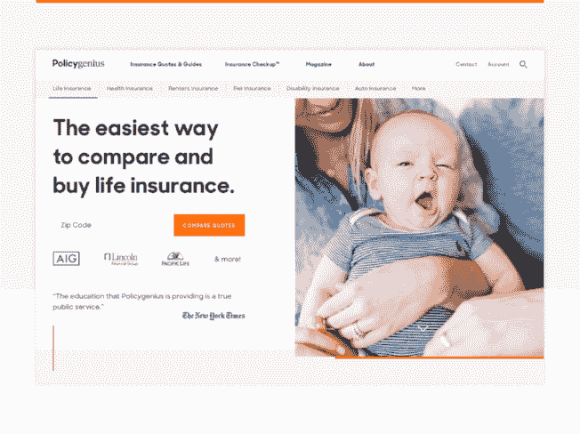

# 从零到 450 万用户，覆盖 200 亿美元。在不到 15 分钟的时间内了解纽约金融科技的秘密

> 原文：<http://web.archive.org/web/20230307163032/https://www.netguru.com/blog/fintech-design-new-york-insurance-policygenius>

 Policygenius 的故事是这样的:过去，两位麦肯锡顾问为保险公司提供增长和营销策略方面的建议。他们发现了一个重复的模式:保险公司不知道如何在网上与客户互动。因此，他们决定成立自己的公司来应对这一挑战。

2014 年，Jennifer Fitzgerald 和 Francois de Lame 创立了 PolicyGenius(最近更名为 Policygenius)，这是一家专注于简单保单比较的在线保险经纪公司。

这家总部位于布鲁克林的初创公司席卷了保险业。他们很快提高了客户体验的门槛，并从投资者那里筹集了逾 5000 万美元。但他们赢得用户芳心的秘密武器是他们卓越的数字体验。目前，Policygenius 拥有超过 450 万购物者，并为美国家庭提供了超过 200 亿美元的保险。

为了弄清这一成功之旅的真相，我采访了 T2 policy genius 公司的首席设计官贾斯汀·特努洛。在你跳进去之前(强烈推荐)，你可以尝尝他们的数字体验是什么感觉。

年轻的初创公司 Netguru: Policygenius 的高级编辑 Tomasz Grynkiewicz 正在教保险业的老男孩们如何在短时间内发展到 450 万购物者。我打赌传统的保险公司不高兴。

## Policygenius 首席设计官 Justin Ternullo:你会感到惊讶的。如果我不在这家公司，我会认为这个故事有点像大卫和歌利亚，拿出弹弓，试图打倒那些大家伙。

这是一个吸引人的标题，但这不是真实的故事。传统保险公司不一定能像我们一样快速行动。但是，归根结底，我们是在销售他们的产品。这不是敌对关系。

如果他们做得好，你也做得好？

## 完全正确。保险公司知道变革即将来临。寿险销售队伍正在老化，代理人的平均年龄是 59 岁左右。所以他们知道他们需要找到一条新的直接通向消费者的道路。

分销是我们关注的重点，我们正在与这些运营商建立关系。我们是合作伙伴，不是竞争对手。他们对我们在这个领域所做的事情感到兴奋。

在这样一个规范、严格、正规的环境中进行设计有多难？银行业和保险业似乎是难啃的硬骨头。

是的，总的来说，金融科技世界和金融服务业增加了监管。不可避免地，它限制了我们或者增加了本来不需要的摩擦。例如，我们不能以典型的电子商务体验中非常标准的方式来激励购物者。

## 但是老实说，这个领域的机会多于限制。我们正在构建用户决策旅程的数字版本，即保护他们的物品、他们自己或他们的家庭的情感路径。仅仅在保险领域，很容易看出在这方面有多大的改进空间。

无论我们是在和客户打电话，还是在设计一种新的体验，我们都关注他们需要的对话、反馈、鼓励和教育。这有助于我们作为一个设计团队保持稳定，并让我们的眼睛专注于旅程可以有多好。

Policygenius 的创始人很早就让你担任设计总监。这可能有点令人惊讶——许多人声称所有的问题都可以通过技术或者仅仅通过技术来解决。

很好的观点。当你试图改变消费者对一个名声不太好的恐龙产业的看法时，设计扮演了一个关键的角色。创始人从一开始就知道这一点。

## 是的，大多数人认为科技是万灵药，但我们试图用一种更平衡的方法来解决问题。我认为它是进攻和防守(虽然我一生中从未参加过一项运动)。当大多数人想到科技创业公司时，他们会想到“进攻”——创新、颠覆，利用技术推动变革。这是我们 Policygenius 工作的一大部分。这就是为什么我们有了全国第一个在线人寿保险市场的原因。这是作为一家科技创业公司的一部分，这是我们的天性。

但是“防御”部分同样重要。真正的影响不仅仅来自突破界限，站在科技的前沿。这也是关于承认在一个使用古老技术的缓慢发展的行业中工作的现实。如果我们忽视了这一点，我们将会束手束脚地试图解决问题。 对我们来说，技术并不是全部。这是一个工具，我们用它来使我们的专业知识更容易获得。

And yeah, most people think of tech as a cure-all, but we try to have a more balanced approach to problem solving. I think of it as offense and defense (though I’ve never played a sport in my life). When most people think of tech startups, they think of the “offense” - innovation, disruption, using technology to push for change. And this is a huge part of what we do at Policygenius. There's a reason why we had the first-in-the-nation online life-insurance marketplace. That’s a part of the nature of being a tech startup, that's in our blood.

But the “defense” piece is equally important. Real impact doesn’t just come from pushing boundaries, being on the bleeding edge with tech. It’s also about acknowledging the reality of working in a slow-moving industry with ancient technology. If we ignored that we’d be trying to solve problems with one hand tied behind our backs. For us, technology isn’t the entire story. It’s a tool we use to make our expertise more accessible.

那么，对于一家炙手可热的纽约保险科技公司来说，主要的困难和障碍是什么呢？

哈。面临的挑战与其他科技创业公司相似。第一，找到那些认为自己主要是问题解决者的设计师。然而，这并不是一项容易的任务。

## 我认为这是现在每个人的焦虑——缺少合适的人来适应这个团队。还有其他挑战吗？

让人们高度关注他们的假设和速度。确保每个人都在同一页上。相当标准的“团队精神”。

## 在我们努力让旅程变得更轻松的同时，我们面临的主要挑战是确保体验反映我们的价值观和我们内部沟通的方式。

你这话是什么意思？

我们的一个用户曾经说过:“我一直认为，如果我找到一个懂保险的朋友，我们坐下来喝一杯啤酒，我们就能知道我需要什么。他可以向我解释一切，给我看我的选择。这就是 Policygenius 的感觉”。

## 当然，我们还没有达到 100%的目标，但对于我们正在努力做的事情来说，这是一颗伟大的北极星。

Well, one of our users once said: “I always thought that if I found a friend who understood insurance and we sat down over a beer, we could figure out what I need. And he could just explain everything to me and show me my options. That's what Policygenius felt like”.

We’re not 100 percent there yet, for sure, but that’s a great North Star for what we’re really trying to do here.

要去北极星，你需要一些常规。

真的。我们有一些坚实的设计实践，每一个 Policygenius 设计的表赌注。我们的设计总是:

## 解决方案——我们从为用户解决的问题开始，并以此结束。

背景——我们挖掘完整的背景(用户、市场、团队),揭示关键的限制因素(行业、技术)。

*   结构化——我们创建组织有序、可浏览的体验，强调内容层次。
*   高效——我们通过少花钱多办事来传达简单。
*   硬化——我们解释了用户体验我们设计的许多方式。没有什么是珍贵或脆弱的。
*   很多格言...
*   很公平，但我们更多的是用这些来让每个人在基础上保持一致，这样我们就可以把时间花在困难的事情上。 这就是我们的原则所在。他们提醒我们什么是好的设计。他们有观点。它们不只是用来诱导点头的空洞短语。

## 你能举个例子吗？

当然-其中一个关键原则是“IRL，而不是 URL”当我们设计时，我们想象现实生活中的互动。这有助于我们将自己与用户的情感体验联系起来。否则，在冰冷的屏幕中很容易失去人与人之间的联系。

## 另一个原则是“均衡教育”

学历？我以为你只是在网上卖保险产品。

嗯，我们正在与顾客建立真正的关系。这意味着承认大多数时候人们不理解这些东西，不知道他们真正需要的是什么。

因此从教育的角度来看？

## 完全正确。我们让您轻松构建、管理和理解您的金融安全网。这通常需要教育来真正赋予人们做出明智决定的能力。

平衡是关键，所以我们关注渐进式披露:用户需要知道什么，什么时候知道？关键是提供支持，而不是压倒性的。

回首四年，你最自豪的是什么？

我记得开始的时候，我们正在测试一个简单的 PDF 版本的保险检查。我们开玩笑说，如果创始人不需要手写每一份推荐信，那该有多好。回顾过去的四年，我们取得了多大的发展，建设了多少，这令人印象深刻。我不经常表扬自己，但我绝对为我们建立的团队感到骄傲。这些人很敬业，足智多谋，我不介意早上起床的主要原因是。

更具体地说，我在这里最开心的时刻之一是去年 12 月推出我们的品牌重塑。当我加入公司时，我的角色主要是让团队运转起来，交付 MVP 并帮助创始人实现他们的愿景。开发品牌(当时我们叫 KnowItOwl)不是我的重点，也绝对不是我的专长。

品牌重塑触及了我们代码库的每一个部分，必须在我们第一次大型营销活动之前推出。我们即将在全国变得更加引人注目，所以时间紧迫。

## 我的设计师必须在整个体验中诠释我们的新品牌形象。整个团队按时交付了一个全新的、美好的体验。我们得到了很好的反馈，最重要的是，我们最终从我平庸的品牌中获得了逃逸速度。

发布后，我们在一次内部演示中展示了关于 impact 的数据(我们每周五都有这些数据，并且对整个公司开放)。我们说:“我们已经看到了这么多的转化，我们已经看到了这么多的参与，等等。”。团队中的每个人都知道这不仅仅是一张新面孔，这一点很重要。

那段时间你遇到过什么失望的事吗？

肯定的。作为一家成长中的公司，我们通常的不足之处是我们的产品流程。也许 MVP 不够低。也许我们关注了一点错误的东西，关注了不会给用户带来最大影响的功能。也许有比需要更多的流失。所有的小事情加起来。

语音、人工智能、生物识别——科技领域有很多创新。它们会如何影响和改变设计环境？

我们不时会看到这些发展，无论是拍下你的车牌照片以获得汽车保险，还是使用你的 Google home 设备申请人寿保险。我喜欢看这些东西推动空间。但是我们倾向于对客户产生最大影响的地方是在不太性感的东西上创新。这些技术肯定会改变景观，但我们试图从真正的实用性中分离出新奇的东西。通过简单地利用现有的技术，有很大的潜力来简化保险之旅。

## Policygenius 本身就是一个很好的实践设计思维的例子。然而，如果让你分享你觉得鼓舞人心的其他项目，你会选择哪一个？

这个行业中有很多人做得非常好。但我会举两个例子。首先，TurboTax 是一款税务准备软件，看起来不太可能成为冠军。

过去，它被视为一个简单的输入/输出软件体验，一个稍微强大一些的计算器。但多年来，他们的产品和设计思维已经扩展。

## 他们在学习行为心理学方面非常出色。他们会引导你从完全不清楚如何报税，到自信地认为一切都准备好了，一切都搞定了。他们通过强力提醒用户他们在旅程中的位置，TurboTax 在后台进行的计算，以及不断提醒用户一切都经过了“双重检查”来做到这一点。听起来有点傻，但是你不可能在不知道他们如何帮助你的情况下离开他们的产品。对于一年只使用一次的产品来说，这很重要。他们很善于让你明白为什么你想明年回来。所以我向他们脱帽致敬。

第二个例子？

Digit，一款自动化储蓄应用。他们的团队在参与方面做得很好。Digit，早在一天，想出了如何编织他们的方式进入我的大脑，并留在那里。

首先，他们在我的手机上发了一条私密短信，用他们的入职信息(一系列有针对性的比利·穆雷 gif 和完美的广告文案)吸引了我。然后，他们给我发来每日银行账户余额和他们存了多少钱的最新信息，这让他们变得很有用。他们用程序性的 GIF 响应和令人印象深刻的简单的基于文本的命令来刺激交互。我认为 Digit 是一个很好的例子，它了解你的受众，并优先考虑情感、人与人之间的联系。

They’re outstanding at leaning on behavioural psychology. They guide you from complete ambiguity, not knowing much about how to do your taxes, to feeling confident you’re good to go, and everything is buttoned up. They do this by heavy handedly reminding the user where they are in the journey, what calculations TurboTax is doing in the background, and continuously driving home that everything has been ‘double-checked’. Sounds a bit silly, but here is no way you can leave their product without knowing how they helped you.That’s important for a product you only use once a year. They are great at making it clear why you want to return next year. So I tip my hat to them.

## The second example?

Digit, an automated savings app. Their team has done a great job on the engagement side. Digit, back in the day, figured out how to weave their way into my brain and stay there.

First, they took an intimate channel - texts on my phone, and hooked me with their onboarding (a series of well targeted Bill Murray GIFs and pitch perfect copy). Then they made themselves useful by sending daily bank account balances and updates on how much they were saving for me. They pepper interactions with programmatic GIF responses for delight, and impressively simplistic text-based commands. I think Digit is an excellent example of knowing your audience and prioritizing emotional, human to human connections.