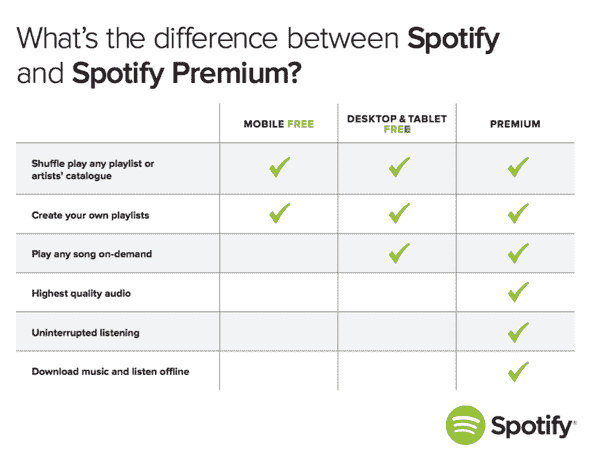

# 从免费增值到高级——是什么让 SaaS 值得花钱购买？

> 原文：<http://web.archive.org/web/20230307163032/https://www.netguru.com/blog/from-freemium-to-premium-what-makes-a-saas-worth-paying-for>

 你可能会觉得这篇文章是一个关于音乐的故事，但请相信我，事实并非如此。它讲述了一个吸引在线客户并将他们转化为忠实付费用户的故事。听好了。我不知道该不该告诉你，但我最喜欢的乐队是电台司令。我已经得到了他们所有的东西，并急切地等待着他们的新专辑，据说是今年下降。当然，既然我是粉丝，我也是他们的追随者。当主唱汤姆·约克在 2013 年决定从 Spotify 上撤下他的个人音乐材料而成为(音乐)头条新闻时，我不得不去看看到底是怎么回事。

在那之前，我是一个忠实的 iTunes 迷——但是，在尝试了 Spotify 的 30 天免费试用后，我完全被迷住了。在这个平台上，我可以发现、播放或保存我想要的所有音乐到我的 iPhone 上。太棒了——太棒了。我冒了以前从未敢冒的险，并发现我真的喜欢爵士音乐。我绝不会赌上我的钱在 iTunes 上买下所有查尔斯·明格斯、米勒·戴维斯、艾灵顿公爵、克里斯汀·斯科特、GoGo Penguin 和 Portico Quartet 的专辑，以防我喜欢它们。但是，碰巧的是，我喜欢它们，在我的免费试用结束后，**我很高兴地支付了每月 9.99 美元的全额付费账户**，每天都能发现新老音乐。

现在，有人可能会说，具有讽刺意味的是，我第一次离开然后爱上 Spotify 都是托姆的错。但是，真的，不是。发生这种情况的原因是因为 Spotify 是一个非常棒的应用程序， **30 天的免费试用对我来说是一个完美的时间，让我真正发现没有**我再也无法生活，我相信 Spotify 也正是这样获得了许多其他应用程序。

## Spotify 做对了什么，别人就做错了什么

是的，他们有。当然有很多不同的免费增值模式。有些提供免费试用，在一定时间后过期。其他网站允许用户免费使用基本功能，然后付费升级(正如 Spotify 的模式一样)。

然而，**很多创业公司犯的错误是提供过于慷慨的免费计划**。很容易看出为什么会发生这种情况——这家初创公司对自己的产品如此兴奋，以至于它盲目地认为，一旦人们尝试了它，他们也会同样兴奋，不会很快交出他们的钱。但现实是，事情往往不会像那样发展——不幸的是，我们不可能都像 Spotify 一样大，现在我们已经有了，我们真的不需要另一个。

## 为什么用户不升级

有许多原因:

*   免费计划并不能让用户相信他们在生活中确实需要这个产品。
*   免费计划对大多数用户来说已经足够了——因此，升级似乎是浪费金钱
*   [入职流程不是用户友好的](http://web.archive.org/web/20221004121821/https://www.netguru.com/blog/5-biggest-mistakes-in-user-onboarding)，因此无法转换
*   定价计划得不够彻底——也就是说，关注点往往过于集中在创造新用户上，而不是将免费增值用户转化为付费用户

## 如何将新用户转化为付费客户

好吧，让我们不要陷入太多的困境，看看一些创业公司是如何做错的，而是专注于如何做对。

### 小心选择免费试用限制

免费试用应该是两者兼而有之——免费和试用。这种免费试用的想法是让用户快速体会到产品的核心价值。这是一个[入职过程](http://web.archive.org/web/20221004121821/https://www.netguru.com/blog/great-user-onboarding)，但不应该永远持续下去。例如，我已经使用生产力应用程序 [Trello](http://web.archive.org/web/20221004121821/https://trello.com/) 两三年了。我发现它在组织我的写作计划和同事的写作计划方面非常有用，我可以轻松地与我联系的其他用户合作，留下笔记，它可以在我的所有设备之间完美地同步，等等。等。等。事实上，**免费版太好了，以至于我从来没有认真考虑过把**升级到付费版。免费赠品这么好，我为什么要去？

实际上，Trello 背后的人应该做的是从一开始就给所有新用户提供这种出色的体验，指导他们了解这个奇妙的应用程序将如何让他们的生活变得更轻松、更有条理——然后把这一切都带走，除非他们支付升级费用。也许 Trello 这样会有更少的用户，但我敢用我的车打赌，他们会有更多的付费用户。

### 奖励让朋友注册的用户

这实际上是一个鼓励更多人开始付费使用你的应用或其他 SaaS 风格产品的伟大策略。说明这一点的最佳方式是看一个典型的例子——Dropbox。除了为额外的存储空间付费，Dropbox 还允许用户通过推荐朋友和家人注册，或者连接社交媒体账户和其他一些东西来获得额外的免费空间(见下图)。它很聪明，因为它确实奖励了忠实用户，同时将 Dropbox 的口碑传播给了潜在的新用户。这是继续使用 Dropbox 的双重激励。

看到所有这些你可以开始赚取免费空间的方法了吗？太棒了。Dropbox 让你在他们开始要钱之前就爱上了他们的产品。最终，免费空间会耗尽，但此时我们已经足够重视 Dropbox，开始为它付费了(是的，顺便说一下，我是 Dropbox 的高级用户——我想知道我是否会因为在这个博客上宣传它们而获得任何免费赠品！)

### 简化初始注册过程

保持简单对于最初的转换、入职以及最后的升级过程至关重要。然而，正如您所看到的，这里需要采取三个明确的步骤，您最不想做的事情就是在第一步制造障碍。事实上，首先，当你试图让用户爱上你的产品时，你需要让每一步都尽可能简单，包括注册。记住，当该说的都说了，该做的都做了，你就已经创造了你的产品来解决一个问题，或者换句话说，让某件事情变得比现在不那么困难或者简单。用户重视简单，所以展示你从一开始就站在用户的一边，就像这个来自 [Shopify](http://web.archive.org/web/20221004121821/https://www.shopify.co.uk/) 的例子:

### 考虑让用户为额外的便利付费

将免费增值用户转化为优质用户的一个策略是让便利成为你需要付费的东西。让我们再次以我的 Spotify 为例。虽然仍然是一个伟大的音乐播放器，但我不得不说，获得 Spotify 全部辉煌的唯一方法是使用高级版本。在免费模式下，你只能随机播放，不得不忍受广告，只能在线听音乐——老实说，这就像一个完全不同的平台。但是，升级后的转变是惊人的。现在，无论你在哪里，无论有没有互联网连接，你都可以下载音乐来听。没有广告。你可以播放任何你喜欢的歌曲，非常方便。这是纯粹的音乐极乐。

想想“廉价”

免费增值计划有一个问题——它们并不总是有回报。Hubstaff 团队有一个[精彩的博客](http://web.archive.org/web/20221004121821/http://blog.hubstaff.com/saas-pricing-free-plan-mistake/),他们详细讲述了他们是如何艰难地了解到这一点的，但关键点可以归结为:

### 付费产品承载更多价值

免费用户带来更多免费用户

*   免费用户吃光了支持
*   人们利用免费账户
*   Hubstaff 学到的经验是**如果有人看重一个产品，他们就会为它买单**。因此，他们抛弃了免费增值模式，代之以“T2”廉价模式。**当人们为某样东西买单时，他们往往会更加尊重它。也许这是人类的天性，或者是我们生活在一个被宠坏的时代的标志，但这是真的。通过选择廉价模式，用户只需为基本功能支付少量费用，你几乎可以肯定他们会更加关注产品——这可能是他们发现你的应用程序有多棒的关键。这可能看起来违反直觉，但我们更重视那些我们必须为之付出的东西，而不是那些我们不需要付出的东西。利用人类的特性。**
*   (通常)缩短免费试用时间

Spotify 的 30 天免费试用之所以奏效，是因为 Spotify 是一个巨大的产品。然而，这个长达一个月的时间是规则的例外，因为通常，最好的选择是保持免费试用期短而甜蜜-最多 14 天。

### 人们不会充分利用 30 天的免费试用期。太长了。Close.io 博客称，绝大多数用户会试用一个产品一两天，然后要么注册，要么就不再回来。这也是为什么你**需要趁热打铁，保持免费试用期短**。事实上，当人们觉得没有时间试用你的产品时，他们就越有可能花时间快速了解它。当我们知道我们有整整一个月的时间去做某件事时，很容易就把它推掉，然后把它忘得一干二净。

The 30-day free trial of Spotify worked because of the gigantic product that Spotify is. However, this is month-long period is the exception to the rule, for usually, the best option is to keep the free trial period short and sweet – 14 days at most.

People don’t tend to take full advantage of a 30-day free trial. It’s too long. The [Close.io blog](http://web.archive.org/web/20221004121821/http://blog.close.io/saas-startups-why-your-free-trials-are-way-too-long) says that the vast majority of users trial a product for a day or two, and then either sign up or don’t come back. And this is why you **need to strike while the iron’s hot and keep that free trial period short**. Indeed, when people feel like they have less time to trial your product, the more likely they are to actually take the time to get to know it quickly. When we know we’ve got a whole month to do something, it’s pretty easy to put it off, and then forget about it all together.

(图片来源: [Close.io 博客](http://web.archive.org/web/20221004121821/http://blog.close.io/saas-startups-why-your-free-trials-are-way-too-long))

你认为什么是一个伟大的免费试用？请在下面的评论中与我们的读者分享你的经验和例子。

(Image source: [Close.io blog](http://web.archive.org/web/20221004121821/http://blog.close.io/saas-startups-why-your-free-trials-are-way-too-long))

What do you think makes a great free trial? Please share your experiences and examples with our readers in the comments below.