# 好了谷歌，是时候改变了！–Google Drive 的网络应用重新设计

> 原文：<http://web.archive.org/web/20230307163032/https://www.netguru.com/blog/google-drive-redesign>

 2019 年 4 月，谷歌的旗舰商务协作和生产力应用套件 G Suite[在全球范围内拥有 500 万付费用户](http://web.archive.org/web/20230307094414/https://www.statista.com/statistics/961008/g-suite-paid-accounts-worldwide/)。据 [iDatalabs](http://web.archive.org/web/20230307094414/https://www.statista.com/statistics/983299/worldwide-market-share-of-office-productivity-software/) 称，它是办公套件技术的市场领导者，占有 63%的份额。然而，说到它的云共享服务， [Google Drive 并不是最受欢迎的选择](http://web.archive.org/web/20230307094414/https://www.statista.com/statistics/868121/north-america-eu-cloud-storage-use/)。

只有五分之一的企业客户每月至少使用一次 Google Drive 云存储选项。除了安全性和可靠性，易用性是评估云存储服务时最重要的因素之一。我们的团队决定想办法为商业用户改善 Google Drive 的整体体验。

## 我们使用 Google Drive 的体验

在 Netguru，Google Drive 是我们的首选工具。由于我们是一家远程优先的公司，我们的团队成员分散在不同的地点。我们需要一个基于云的解决方案来顺利合作。Google Drive 是一个简单的选择，因为它提供了许多优势:

*   存储许多文件，
*   与其他团队成员一起实时处理文档，
*   组织文件并共享它们。

虽然 Google Drive 是最受欢迎的基于云的文件存储解决方案之一，但用户表示，很难在所有文档中找到自己的路，尤其是那些不是他们自己创建的文档。在 Netguru，600 人远程工作或在 7 个办公室中的一个工作。我们在不同的部门工作，参与数百个不同的项目——每个团队都制作和存储许多文件，分散在数千个文件夹中。这使得 Netguru 的员工成为我们研究 Google Drive 潜在改进的完美听众。

## 研究目标

这项研究的目标是确定主要的痛点，并了解 Google Drive 在日常工作中的使用情况。我们没有考虑不同的上下文，但是我们知道这个工具在不同的设置和环境中使用，并且由具有不同需求的不同的人使用。我们希望从一个在中型或大型公司工作的典型用户的角度来重新设计和考虑 Google Drive 的功能，这涉及到很多协作。

### 第一步:选择特征

我们问自己的第一个问题是“我们到底想重新设计什么？”很明显，我们不想与 Google Drive 团队竞争，该团队致力于开发新功能、测试和与终端用户交流。这种工作是无法复制的。

Google Drive 提供了许多功能:

*   不同类型文件的安全存储，
*   与整个团队和个人共享文件，
*   搜索文件并将它们组织到文件夹中，
*   与文档、幻灯片、表格或表单等 Google 应用程序的兼容性，
*   扫描不同的文档并转换成 pdf(仅适用于 Android)，
*   脱机工作并检查文档的历史记录，
*   新的智能文件建议和组织与优先级和工作空间。

根据不同的使用情况，这些特性会以不同的频率使用。例如，学生可能不会经常使用共享选项，因为他们自己写论文和作业。在一个严重依赖协作的公司里，人们每天都与整个团队、特定的人甚至公司以外的人共享文件。

我们想了解人们如何在 Netguru 中使用 Google Drive。为了做到这一点，我们提出了两个研究问题:

*   人们在日常工作中使用哪些 Google Drive 功能？
*   哪些活动或特征让体验变得令人畏惧和痛苦？

这些问题的答案将清楚地表明我们需要遵循的方向，以创建一个有意义的重新设计概念。

## 研究成果

为了确定人们是否在上述活动中挣扎，我们向我们的同事发出了一份简短的调查。来自不同团队的人员分布相当均匀，来自[产品设计团队](/web/20230307094414/https://www.netguru.com/services/product-design)的人员略占优势。

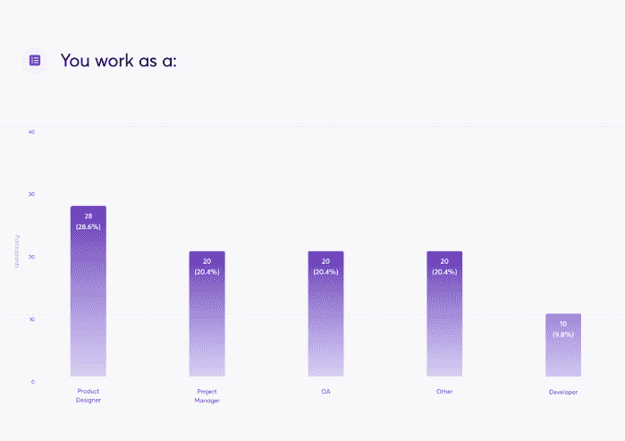

大多数受访者(90%)每天或每周几次使用 Google Drive。我们希望关注经常使用 Google Drive 的用户遇到的问题，因此我们决定不考虑选择“一个月很少几次”选项的受访者。

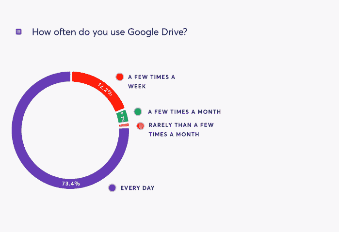

在下一个问题中，我们想知道我们的同事在努力解决哪个 Google Drive 版本的问题。正如我们所怀疑的，几乎 90%的受访者主要使用 GDrive 的 web 版本。这让我们相信，在商业环境中，网络版是最流行的处理和共享文件的方式。

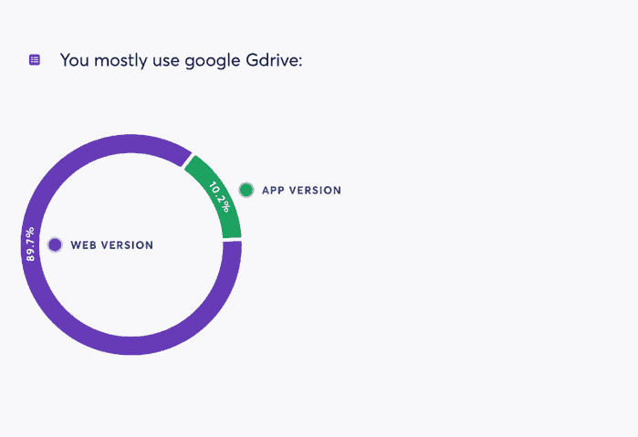

当谈到最受欢迎的功能时，结果也并不令人惊讶。在 Netguru 中，人们大多:

*   检查团队驱动器并找到文件(100%)，
*   与他人共享文件(97.9%)，
*   使用搜索(67.3%%)，
*   创建新文件(67.3%)，
*   整理档案(58.1%)。

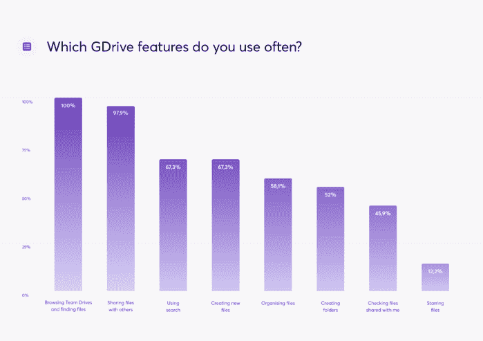

与具体功能相关的第二个问题是关于我们的同事在使用 Google Drive 时遇到的麻烦。目的是理解日常工作，并对界面中最重要的部分有所了解，这将从重新设计中受益。当被问及不满意的功能时，最受欢迎的回答是:

1.  使用**搜索** (61.2%)，
2.  通过团队驱动和**查找**文件(61.2%)，
3.  **与他人分享**文件(45.9%)，
4.  **整理**文件(36.7%)，
5.  **查看**与我共享**的**文件(21.4%)。

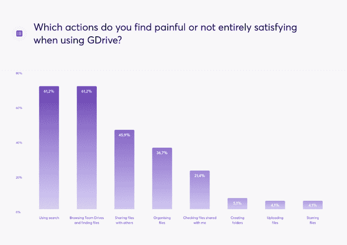

它让我们清楚地看到了我们应该首先解决的问题——**高效的搜索对于快速访问文件**和提高工作效率至关重要。由于误导性的搜索结果和其他人在创建新文件和文件夹时使用的各种命名模式，人们很难找到文件。

当谈到为什么这些功能令人痛苦的论证和解释时，我们从一个开放式问题中收集了见解——我们的同事可以自由抱怨并描述使用 GDrive 接口时最令人痛苦的情况。这个问题让我们理解了在使用 Google Drive 时反复出现的挫败感，这个问题是:“*你能解释一下为什么你觉得这些功能很痛苦吗？*”。对原始数据进行了分析和分组，以确定普遍存在的困难。

*原始数据*

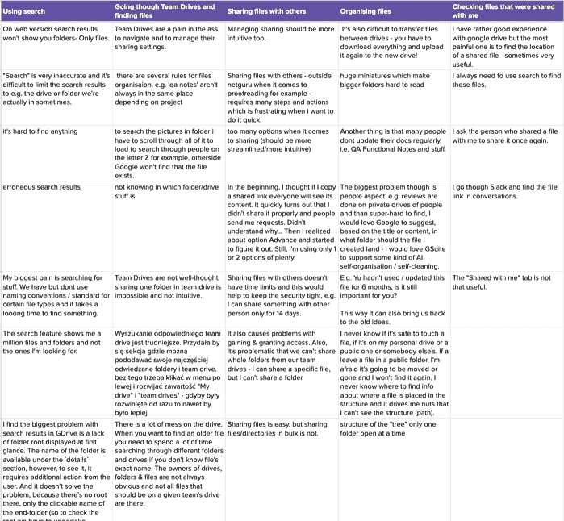

我们的同事经常遇到的问题是:

**1。使用搜索**

仅显示文件，不显示文件夹或目录

将搜索结果限制为文件夹或团队驱动器的问题

*   显示大量不相关的文件
*   根文件夹显示不清楚；很难找到文件的位置
*   **2。浏览团队驱动器并找到文件**
*   管理团队驱动共享设置的困难

团队驱动没有经过深思熟虑；在 team drive 中共享一个文件夹是不可能的，也不直观

*   无法快速访问常用文件夹或驱动器
*   从不使用的文件夹中给出结果
*   **3。与他人共享文件**
*   在公司外共享——需要许多步骤和行动，当用户想要快速完成时，这是令人沮丧的

分享的选择太多了

*   复杂的“高级”共享选项
*   无法共享团队文件夹(仅文件)
*   批量共享文件/目录并不容易
*   **4。组织文件**
*   很难在硬盘之间传输文件，你必须下载所有文件，然后再上传到另一个硬盘

在文件夹之间转移文件的困难——如果你不知道确切的目录，这是非常困难的

*   使大文件夹难以阅读的巨大缩图
*   没有自我组织/自我清理或哪些文件可能过时的建议
*   不知道确切的目录(它是哪个驱动器–私有还是公共
*   一次只能看到一个文件夹
*   **5。检查与我共享的文件**
*   我们也知道谷歌最近引入了新的组织文件的方式，包括优先级标签和工作区。调查的最后一个问题与这些特征有关。不幸的是，没有一个参与者使用它，因为他们从未听说过它们，也没有在使用 Google Drive 时见过它们。非常有趣的是，为什么谷歌没有对这些功能做更多的宣传，例如，展示一个快速概览或教程。尽管如此，我们还是想把重点放在参与者直接陈述的问题上，所以我们决定暂时不深究。

重新设计

经过一些坚实的基准测试，获得灵感，并分析当前的解决方案，我们有了一个基本的理解，什么是我们想要探索的，哪些想法要推进，当谈到搜索和组织文件。创建一个 moodboard 并勾画出想法有助于我们可视化并讨论总的方向和具体的用例。

## *灵感 moodboard*

草图对于快速可视化最初的想法和流程非常有用。

焕然一新的样子

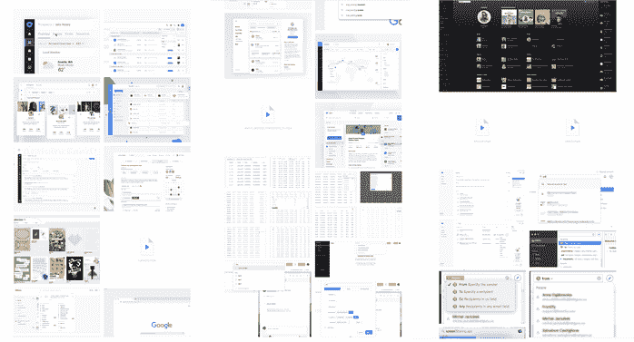

首先，我们想解决界面的视觉部分，因为这是引入 UI 调整和改进的绝佳机会。当我们在背景中添加了更多的对比度后，区分主要内容和导航内容变得更加容易。CTA 主按钮内“+”号的细微变化和一致的图标创造了**更具凝聚力的体验**。由于 Google Drive 的当前版本中没有悬停状态，我们决定添加这一状态，以便用户能够**轻松定位**他们当前正在分析的元素。

使用搜索

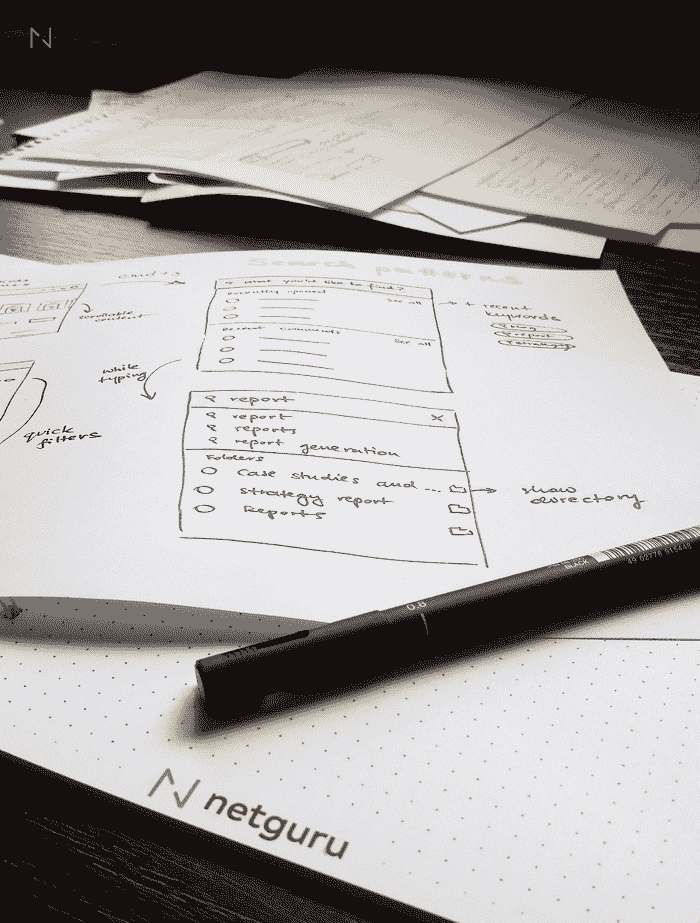

在研究阶段出现的第一个关键问题是搜索功能。似乎人们经常与这一特性作斗争。很难**快速**找到文件，没有选项**找到具体的文件夹，**没有**通过团队驱动或其他目录过滤**，并且**根文件夹不可见，**这使得识别文件本身更加困难。

## 我们的受访者没有意识到过滤器功能可以通过点击搜索栏中的 v 形图标直接使用。在我们的重新设计中，过滤器直接显示在搜索结果的上方。用户现在可以通过根据不同的团队驱动器、文件类型、所有者等浏览文档来快速定位文件和文件夹。没有更复杂的搜索模式-元素被立即过滤！

此外，由于搜索在我们的调查参与者中非常受欢迎，我们创建了一个快捷方式(苹果设备上的 CMD+S)来启动该功能。打开搜索栏后，用户可以看到最近的关键字、最近打开的文档以及最近的评论、回复和建议。这对那些主要使用文档与其他队友协作和交谈的用户尤其有用。

当用户开始键入时，不仅文件和文件夹变得可见，而且文件路径和所有者也变得可见。用户现在可以将文件与特定位置或同事进行匹配，这使得查找文件变得更加容易。

可调仪表板

## 当前的 Google Drive 默认视图由快速访问组成，它显示最近的元素和我的驱动器文件列表。由于快速访问是一个非常有用的元素，特别是对于快速找到经常打开的文件，我们增加了一个功能，使用户能够拖放文件和文件夹，并以他们想要的方式个性化仪表板。由于不清楚为什么有些文件会出现快速访问，我们给用户提供了调整视图的选项。只需简单的拖放操作，他们就可以将文件移动到快速访问部分，只需一次点击即可访问。

The first key issue that transpired in the research phase was the search feature. It seems that people struggle with this feature very often. It’s difficult to **find files quickly**, there is no option to **find a specific folder,** no **filtering** by Team Drive or other directories, and the **root folder is not visible,** which makes it harder to identify the file itself.

Our respondents did not realize that the filters feature was available directly by clicking the chevron in the search bar. In our redesign, filters are shown directly above the search results. Users can now locate files and folders quickly by browsing documents according to different Team Drives, types of files, owners, etc. No more complicated search patterns – the elements are filtered instantly!

我们引入的另一个改进是关于过滤我的驱动器文件。当我们增加了按类型过滤文件的选项时，浏览个人文件变得容易多了。

个性化功能

## 似乎每个用户搜索文件的方式都不一样——例如，通过触发搜索栏、使用过滤器或手动搜索不同的文件夹。同样的逻辑也适用于分析文档的详细信息——有些人可能会发现“所有者”列比“上次修改”指示器更有帮助。这就是为什么我们引入了个性化搜索结果的选项。通过打开和关闭列，用户可以决定哪些信息将出现在列表中。

The current Google Drive default view consists of Quick Access, which shows recent elements and a list with My Drive files. Since Quick Access can be a very useful element – especially for quickly finding frequently opened files – we added a feature that enables users to drag and drop files and folders and personalize the dashboard in the way they want. Since it wasn’t clear why some files appeared Quick Access, we gave users the option to adjust the view however they want. With a simple drag & drop, they can move a file to Quick Access section to make them accessible with one click.

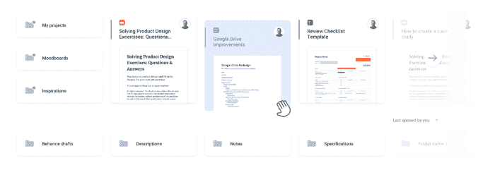

我们重新设计的另一个有助于扫描大量文件的功能是“表密度”。通过调整行高，用户可以在搜索结果中挤进更多的内容。

Another improvement we introduced concerns filtering My Drive files. When we added an option to filter out files by type, browsing through personal files became a lot easier.

## Personalization features

微小的调整带来巨大的变化

我们的受访者表示，查找文件是一项艰巨的任务。其中一个原因是 Google Drive 不会显示文件所在的文件夹。我们添加了突出显示当前检查的文档的悬停状态；我们还引入了一个显示文件位置的小弹出窗口。当用户将鼠标悬停在文件夹上时，他们可以看到文件路径，并且可以点击他们想要的任何文件夹。这使得导航更加容易。

Another functionality from our redesign that helps scan lots of files is “Table density”. By adjusting row height, the user can squeeze in more content in search results.

我们的同事经常通过 Slack 或电子邮件收到关于 Google Drive 上新回复、评论和建议的通知。我们认为在 Google Drive 中直接看到这些信息会很棒。用户只需将鼠标悬停在屏幕上就可以查看新的通知，根本不需要打开文档！

通知和截止日期

## 既然我们在谈论通知，我们认为在 Google Drive 中直接访问每个新的更新会很棒。您可以看到关于新评论、回复、建议、带星号的文件夹中的新文件的信息，或者关于新共享文件的信息，等等。

最后但同样重要的是，我们很乐意测试一个我们称之为“最后期限”的想法。在更大的组织中，人们经常依靠协作文档来共享想法。人们有一定的时间来思考一个主题，并被要求在文档中提供他们的意见。

由于人们做很多的多任务处理，他们经常忘记他们应该在截止日期前提交一些意见。如果用户可以为文档添加截止日期，并将其与智能通知相链接，这将改善一般的工作流程并节省大量时间。有多少次你被 pinged 去查看一个文件并添加一些评论？

总而言之，通过我们的重新设计，我们改进了 Google Drive 界面的一些元素。我们增强了视觉部分，增加了更多的背景对比，并调整了用户界面，增加了悬停状态等功能。搜索体验现在更容易了，因为用户可以使用键盘快捷键启动搜索。当用户输入时，搜索还会显示相关的建议。我们添加了智能过滤器，可以根据搜索结果进行调整。搜索现在也更加个性化——用户可以在搜索结果中添加或删除列，并调整表格密度。

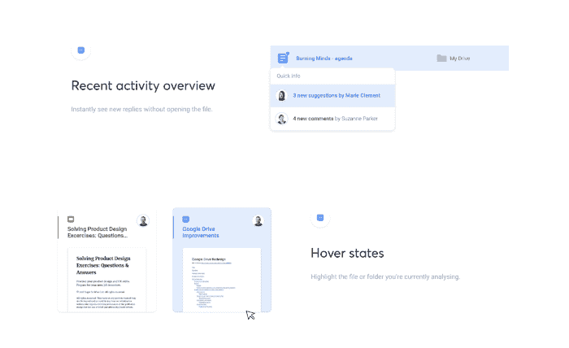

当谈到仪表板时，它现在提供了一个选项来拖放元素以进行快速访问。将鼠标悬停在文档上时，用户现在可以看到文档的位置以及最近添加到文档中的评论和建议。通知现在嵌入在 Google Drive 中，它们会通知用户新共享的文档以及对他们评论的回复。最后，我们创建了一个*截止日期*选项卡，它根据截止日期对文档进行排序，并显示哪些文档应该首先处理。

## 包裹

我们在探索 Google Drive 的界面、与我们的同事交谈、分析他们的回应以及集思广益解决方案的过程中获得了很多乐趣。我们相信，即使引入很小的改进，也会对总体体验产生很大的影响。如果那些[改进让用户更开心，](/web/20230307094414/https://www.netguru.com/glossary/ux-design)它们绝对值得实施。下一步，我们想看看人们对我们的改进有什么反应，并检查他们是否真的能更快地找到文件。我们肯定会使用 Google Drive 来创建一个用户测试计划！:)

Last but not least, we would love to test out an idea that we called “Deadlines”. Very often in bigger organizations, people rely on collaborative documents to share ideas. People are given some amount of time to think about a topic and are asked to provide their opinion inside the document.

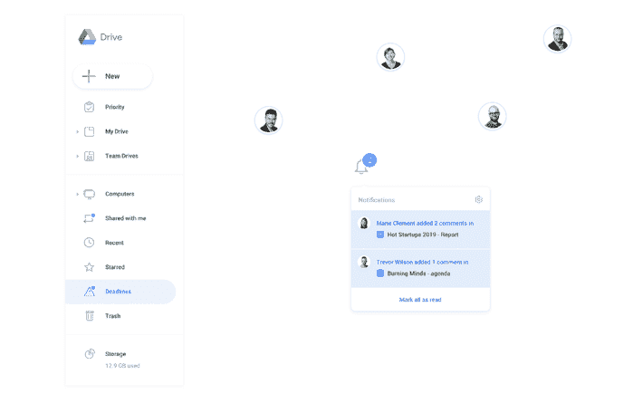

Since people do a lot of multitasking, they often forget that they were supposed to submit some opinion before a deadline. If a user could add a deadline to a document and link it with a smart notification, it would improve the general workflow and save a lot of time. How many times have you been pinged to take a look at a file and add some comments?

To sum up, with our redesign, we improved a few elements of Google Drive’s interface. We enhanced the visual part by adding more contrast to the background and tweaking the UI with features like hover states. The search experience is now easier because users can launch a search with a keyboard shortcut. The search also shows relevant suggestions while a user is typing. We added smart filters that adjust according to search results. The search is also more personalized now – users can add or delete columns in search results and adjust the table density.

When it comes to the dashboard, it now offers an option to drag & drop elements to Quick Access. Upon hovering over a document, users can now see the document’s location and recent comments and suggestions added in the document. Notifications are now embedded in Google Drive, and they will notify users about newly shared documents and replies to their comments. Finally, we created a *Deadlines* tab that sorts documents by a deadline and shows which ones should be worked on first.

## Wrap up

We had a lot of fun exploring Google Drive’s interface, talking to our colleagues, analyzing their responses, and brainstorming solutions. We believe that introducing even small improvements can have a large impact on the general experience. If those [improvements make users happier,](/web/20230307094414/https://www.netguru.com/glossary/ux-design) they are definitely worth implementing. As a next step, we would love to see how people react to our improvements and check whether they really make finding files faster. We’ll definitely use Google Drive to create a user testing plan! :)