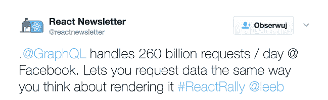
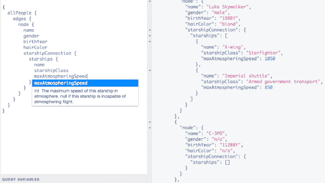

# GraphQL 与 REST 的比较——脸书的解决方案值得冒险吗？

> 原文：<http://web.archive.org/web/20230307163032/https://www.netguru.com/blog/grapghql-vs-rest>

 有些时候，某些想法变得如此相关，以至于很难忽视它们。如果你以任何方式与编程行业联系在一起，你可能听说过 GraphQL，这是脸书为了应对他们面临的实际问题而发明的一种技术。有些人可能仍然对此持怀疑态度，但其他人认为这是对 REST APIs 的改进。

在本文中，我将向您展示为什么 GraphQL 对于新的和现有的应用程序都是一个可行的解决方案，以及它与 REST 相比有哪些优势。

### 什么是 graph QL——你今天可能用过它

GraphQL 保密了三年多。它的诞生是为了解决脸书在 2012 年经历的移动市场问题，也是许多公司今天面临的问题。

脸书需要一种有效的方法来定义复杂的数据需求。当时，脸书正在寻找一种解决方案，以防止获取太少或太多的数据，或者制造数量多得离谱的端点。

在 GraphQL 正式向公众发布的时候，它已经每天处理大量的请求。

GraphQL 是脸书用户一直在不知不觉中使用的技术，它已经在 Pinterest、 [Coursera、](http://web.archive.org/web/20221207033930/https://building.coursera.org/blog/2016/11/23/why-ui-developers-love-graphql/) [Shopify](http://web.archive.org/web/20221207033930/http://www.graphql.com/articles/graphql-at-shopify) 或 [Github](http://web.archive.org/web/20221207033930/https://githubengineering.com/the-github-graphql-api/) 等[巨头中实现。](http://web.archive.org/web/20221207033930/http://graphql.org/users/)

### 休息不灵活

在典型的 REST API 中，当数据需求发生变化时，会创建一个新的端点，此外，端点一必须保持不变。移除旧端点可能会导致未更新的应用程序中断。因此，几乎完全相同且几乎无法辨认的代码数量可能会快速增长。这对于包含少量不同服务数据的小型应用程序来说没什么问题，但是对于任何其他应用程序来说，这完全是一场噩梦。端点越多，维护起来就越困难。

### 休息最终会造成过度蚀刻

在一个完美的世界里，端点是经过优化的，它们提供理想的数据量。然而，事实往往并非如此。发送适量的数据可以缩短加载时间，并直接降低[客户因沮丧而关闭应用的可能性。对于大多数产品所有者来说，这应该是一件大事，并且通常会给现有的 REST 应用程序留下很大的改进空间。](http://web.archive.org/web/20221207033930/https://www.google.pl/webhp?sourceid=chrome-instant&ion=1&espv=2&ie=UTF-8#q=apps+loading+more+then+2+seconds&*)

### REST 存在缺乏文档的问题

开发人员使用他们从其他开发人员那里继承的代码并不罕见。许多应用程序在推出后还能持续数年。在它们的生命周期中，会发生变化，新的程序员会被引入到已经存在的代码中。REST 架构变得非常难以维护和理解，因为它会随着时间的推移而增长。

### 何时应该考虑 GraphQL

如今，许多公司都面临着 GraphQL 能够解决的问题，例如:只获取所需的数据、编写 API 文档、使应用程序可伸缩且易于维护等等。这里有一些为什么应该考虑实现它的理由。

### 您可以使用 GraphQL 来解决您的问题，而无需更改您的堆栈

您可以在查询中使用现有的端点和数据库，这允许您在现有代码基础上利用 GraphQL 的特性。事实上，脸书最初使用 GraphQL 只是为了给 iOS 和 Android 用户提供新闻。

### GraphQL 只有一个端点，提供给它所有的数据

[你的应用程序的前端可以请求它需要的任何数据，并且不会获取额外的信息](/web/20221207033930/https://www.netguru.com/services/software-development)。这不仅可以防止提取不足或提取过多，还可以避免创建难以记录和维护的无数端点。

### GraphQL 可能拥有最好的 API 文档系统

它是强类型的，因此您可以完全了解您的数据是什么样子，并且它附带了一个名为 GraphiQL 的 IDE，可以让您轻松地查看和查询您的数据。这使得查找 bug 和处理数据变得非常容易。[看看这个由脸书开发者制作的星球大战 API:](http://web.archive.org/web/20221207033930/http://graphql.org/swapi-graphql/)

这是 GraphiQL 的实际应用。在左边，我们可以看到一个查询是什么样子，以及它是如何被记录的。是不是很美？

### GraphQL 是向后兼容的

最新版本仍然支持 GraphQL 早期的代码。这里是核心创作者之一，李·拜伦，[写道:](http://web.archive.org/web/20221207033930/https://github.com/facebook/graphql/issues/175#issuecomment-218292957)

“脸书的 GraphQL 模式(已有 4 年历史，目前有 1000 多种类型，正在由 100 多名工程师积极开发中)从来不需要版本化的突破性变化，仍然支持 4 年前发布的 iOS 和 Android 应用程序版本。”

### 包扎

每次制造一个新的、未优化的端点，都会产生浪费，损失一些利润。每当一个新的、新奇的、优化的终端服务于一个非常具体的用例时，应用程序就变得更加难以维护。技术债务可能很容易让公司停滞多年。每个面向数据的软件都需要可扩展性、良好的文档和端点优化。

这在不久的将来不太可能改变，REST APIs 并不总是最好的选择。GraphQL 就是为解决这类问题而创建的，可能是您公司的完美解决方案。

### 还会有更多！

在 Netguru，我们很高兴尝试这一新的复杂技术，目前正在开发一些将它与 Node.js 结合使用的现实解决方案。如果您想知道 Node.js 何时是一个合适的解决方案，您可以在这里阅读我们的见解。这不是我们关于 GraphQL 的最后一篇文章，敬请关注！