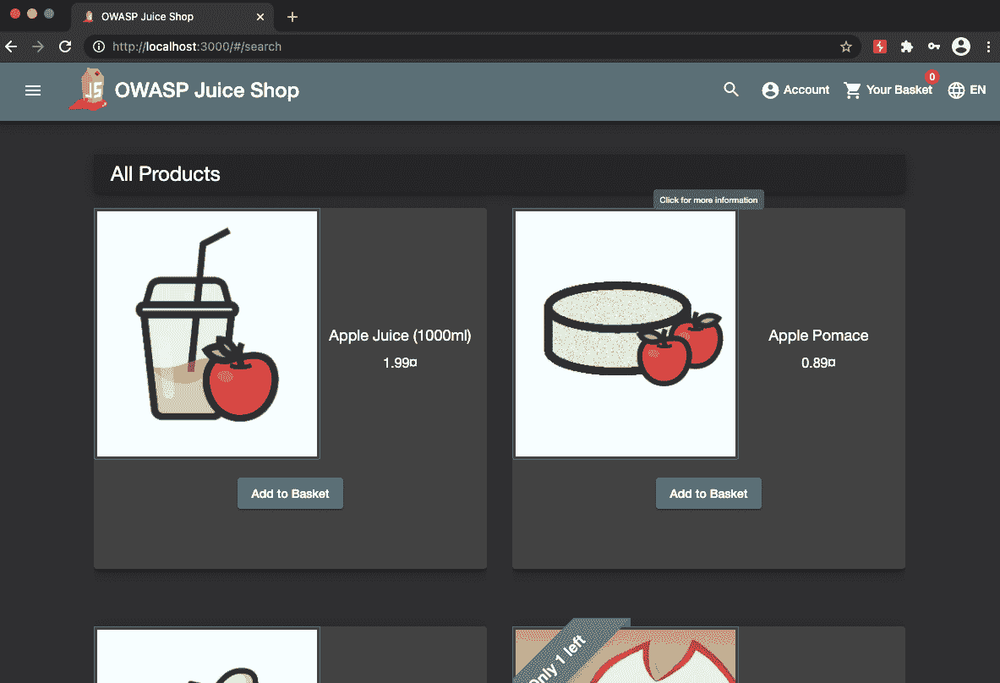
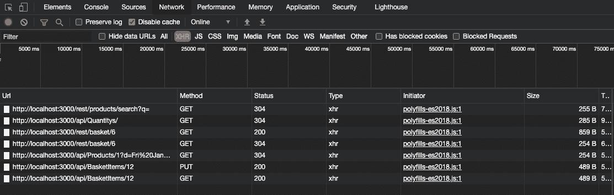
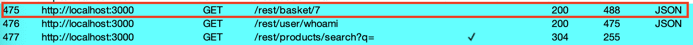
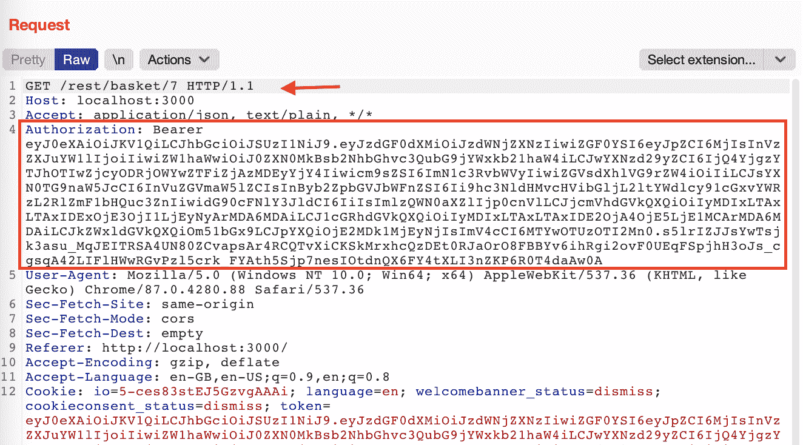
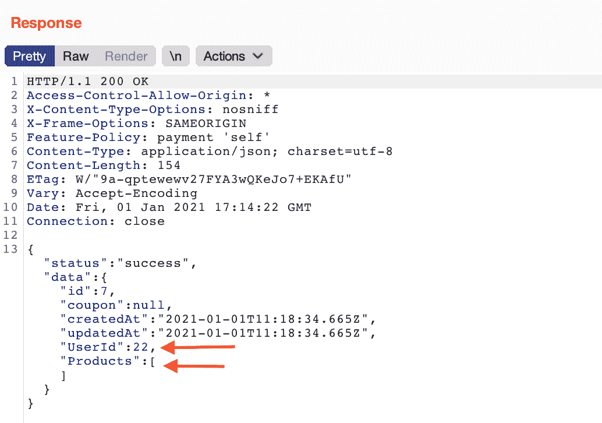
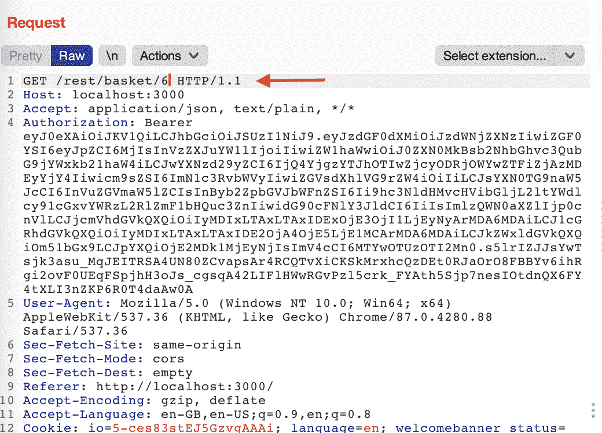
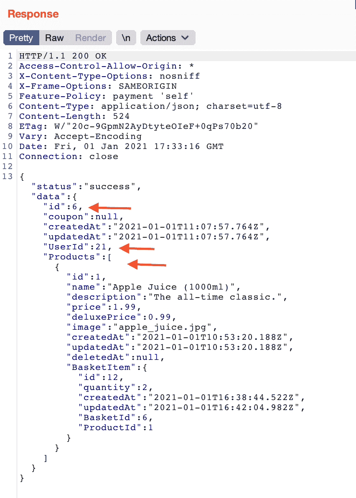

# 如何检测和避免现代 Web 应用中的 IDORs？

> 原文：<http://web.archive.org/web/20230307163032/https://www.netguru.com/blog/how-to-detect-and-avoid-idors-in-modern-web-applications>

 不安全的直接对象引用(IDOR)是应用程序的业务逻辑中的一个错误。

这类错误在静态代码分析或代码审查中很难发现。它们无法通过任何种类的附加“神奇”安全设备(如下一代防火墙或 web 应用程序防火墙)来缓解。这是一个**业务逻辑错误**，在设计或实现阶段出现。带有 IDOR 的 webapp 使得任何用户都可以访问其他用户的数据。

## 我为什么要在乎？

不安全的直接对象引用总是会导致未经授权的数据访问，这在 GDPR 时代可能代价非常高。也许最著名的与 IDOR 相关的数据泄露是第一美国金融公司。他们被纽约州金融服务局指控泄露了 35 万份包含高度机密的抵押贷款相关数据的文件。

在欧盟，监管机构没有披露数据泄露的细节，但他们将这种安全问题描述为“确保信息安全的技术和组织措施不足”。这就是为什么很难估计有多少数据泄露是由入侵者造成的。
根据我的经验，**在现代 web 应用程序中，十个已发现的关键漏洞**中有八个是不安全的直接对象引用。

## 为什么会这样？

通常，培训材料(即[ports wigger Web Security Academy](http://web.archive.org/web/20221202094314/https://portswigger.net/web-security/access-control/idor))显示 IDOR 是一个经典 Web 应用程序的示例，其中可以在浏览器的 URL 栏中轻松修改请求参数。

这样的网址引人注目。大多数测试人员会检查如果参数改变会发生什么，并在应用程序实际部署之前尽早发现漏洞。

然而，现代 web 应用程序通常使用 RESTful 或 GraphQL APIs。在这类 app 中，测试 IDOR 漏洞更加困难。

我将使用[OWASP Juice Shop](http://web.archive.org/web/20221202094314/https://owasp.org/www-project-juice-shop/)测试应用程序来更好地演示这个问题。在这个 webapp 中，浏览器中可见的 URL 地址不包含参数，如果操作这些参数，可以很容易地允许测试 IDOR。

相反，客户端的浏览器端应用程序向 API 服务器发送请求，乍一看用户是看不到的。

下面你可以在 Chromium 中找到 DevTools 控制台网络视图的截图，显示了向购物车添加商品时发出的请求。

同样的情况也发生在移动应用程序中。看起来，由于这些请求是不可见的，所以不可能恶意修改它们并暴露漏洞。
**然而这个假设是不正确的。**对 HTTP 协议有深入了解的攻击者可以利用这些漏洞并危害应用程序。

## 检测现代 Web 应用程序中的 IDOR

为了测试利用 JavaScript AJAX 方法与 API 联系的现代 web 应用程序，请使用一个 web 代理，在这个代理上可以拦截和修改这些请求。为了展示这一点，我将使用 [BURP 套件。](http://web.archive.org/web/20221202094314/https://portswigger.net/burp/communitydownload)

## 参数枚举

在大多数情况下，参数枚举允许用户在应用程序中使用相同权限集访问其他用户的资源(水平移动)。

测试场景如下:

1.  使用现有帐户在应用程序中进行身份验证。
2.  执行一系列将由代理人记录的动作(打嗝)。
3.  使用可能指向其他人资源的更改参数重新发送记录的请求(使用 Burp 套件中的 Repeater 模块)。

在这个特殊的例子中，我将尝试显示其他人购物车中的内容。在 Burp 历史中，您可以看到一个 ID 为 7 的购物车的 GET 请求已经被发送。这是应用程序的业务逻辑提供的 ID，存储在用户的浏览器端。

在这个请求的授权头中，您可以看到当前登录用户的 JWT 令牌。

API 响应是一个 JSON 文档，表示登录用户的购物车。它显示了用户 ID 22 和一个空的“Products”对象，对应于站点上的一个空的购物车视图。

当我替换请求中的购物车 ID 时会发生什么？

我再次发送这个请求，将购物车 ID 参数更改为一个较小的数字。

在响应中，我得到了一个 JSON 文件，其中包含了其他人购物车中的内容。“产品”对象现在包含苹果汁。还要注意不同的购物车用户 ID - 21。

所以我们检测到了一个 IDOR 漏洞。您可以使用相同的方法来测试其他端点和其他 HTTP 方法，包括那些修改数据的方法，例如将产品添加到购物车。

## 访问功能

在有些应用中，由于用户的角色，对某些功能的访问受到限制。

在测试这样的应用程序时，您应该测试一个场景，在这个场景中，具有较低权限的用户试图执行只为具有较高权限的用户设计的操作。

1.  在应用程序中使用具有最高权限的帐户进行身份验证。
2.  在应用程序中执行操作-代理将记录对 API 的请求。
3.  在应用程序中使用较低权限的帐户进行身份验证，以生成授权头的令牌。
4.  使用更改的授权头重放记录的 API 请求——使用特权较低的用户的令牌。

## 预防

不安全的直接对象引用是一个业务逻辑漏洞。只有在设计和实施阶段才能避免这种情况。

## 将安全需求添加到用户故事中

第一个也是最基本的操作是正确定义每个设计功能中的安全要求。我知道，这听起来很可怕，所以我将用一个例子来说明它是什么。

想象一个定义为“*的函数，作为用户，我希望能够显示我的购物车*。对于这样一个用户故事，程序员自然会实现一个 API 方法来显示带有给定标识符的购物车。测试人员将测试这个故事，以确认用户收到了预期的购物车内容。

一个添加了的**安全需求的故事可能是这样的:“*作为一个用户，我希望能够查看我的购物车，但前提是我有权访问它。*“在这种情况下，开发人员在返回结果之前添加用户权限检查是很自然的。测试人员看到故事中的情况后，将检查用户是否可以访问其他人的资源。**

一个更好的措辞可以是这样的:“作为一个用户，我希望能够只显示我自己的购物车，而不显示任何其他用户的购物车”。对于这样一个函数，程序员不是为具有给定 ID 的 cart 对象创建 GET 方法，而是为没有 ID 参数的专用 cart 对象创建 GET 方法(或者“ *mycart* ”)。确定该方法将返回哪个购物车将需要获得关于当前登录用户的数据(例如，从 JWT 令牌)，这将显著降低 IDOR 漏洞的风险。

## 创建适当的单元测试

下一步是创建适当的单元测试来覆盖边缘情况。如上所示，在故事中定义这些具有**定义的安全需求的案例要容易得多。标准的边缘案例集应包括以下场景:**

*   用户未通过身份验证，例如授权头缺失或无效。
*   用户已通过身份验证，但无权访问资源。

## 执行全面的集成测试

下一步是考虑边缘情况的全面集成测试。对于 API，必须对每个端点的每个方法进行测试，包括它们在上述情况下的行为。API 测试需要专用工具，例如 [Postman](http://web.archive.org/web/20221202094314/https://www.postman.com/) 、 [OWASP ZAP](http://web.archive.org/web/20221202094314/https://www.zaproxy.org/) 、 [Burp Suite](http://web.archive.org/web/20221202094314/https://portswigger.net/burp) 。

## 执行渗透测试

web 应用程序的渗透测试至关重要，因为它们提供了针对真实风险的保护的最终状态检查。[最近根据 GDPR](http://web.archive.org/web/20221202094314/https://www.enforcementtracker.com/ETid-483) 开出的罚单表明，监管机构正在调查过程中考虑**关于测试和测量安全控制**的要求。

## 摘要

我听过下面这句话:“不安全的直接宾语是现代的 SQL 注入”。根据我的经验，当比较我在渗透测试中发现的漏洞数量时，这是绝对正确的。

不过，有一点小小的不同，这使得防范 IDOR 变得如此困难:没有任何框架、库或 web 应用程序防火墙能够防范业务逻辑错误。唯一的解决方案是[“设计的安全性”](http://web.archive.org/web/20221202094314/https://en.wikipedia.org/wiki/Secure_by_design)，在软件开发的早期阶段引入。开发人员不仅要编码，还要设计应用程序，牢记互联网上可能出现的所有威胁。