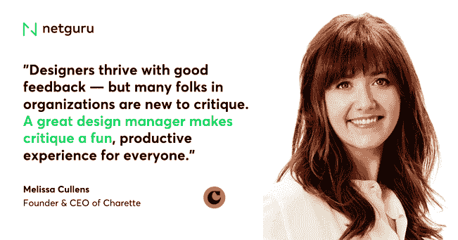
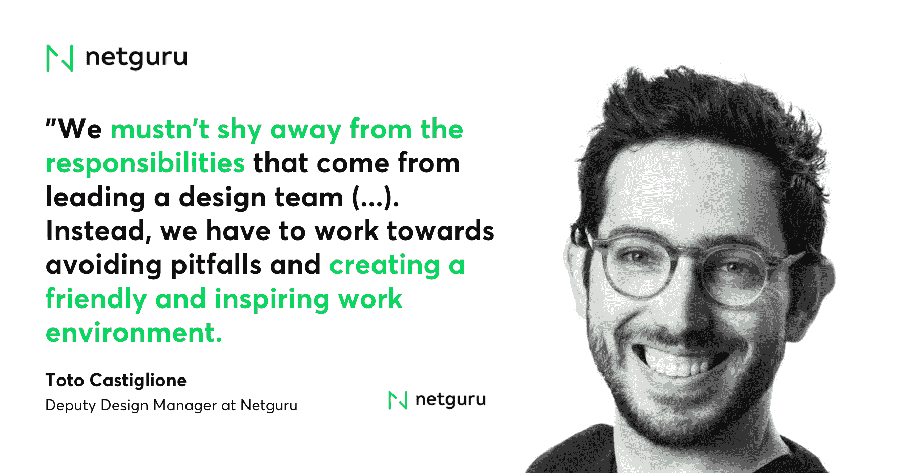
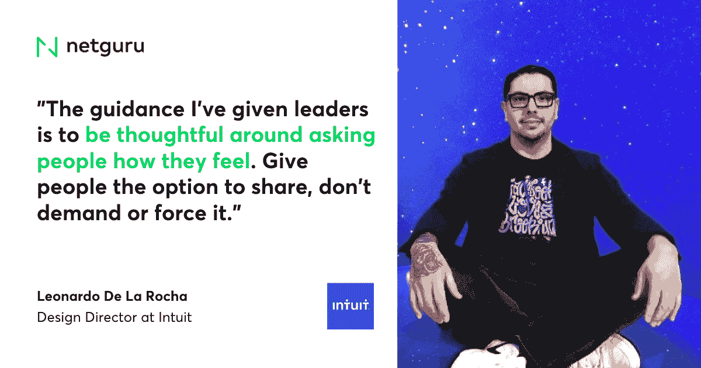
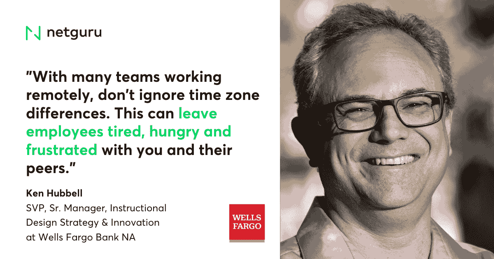
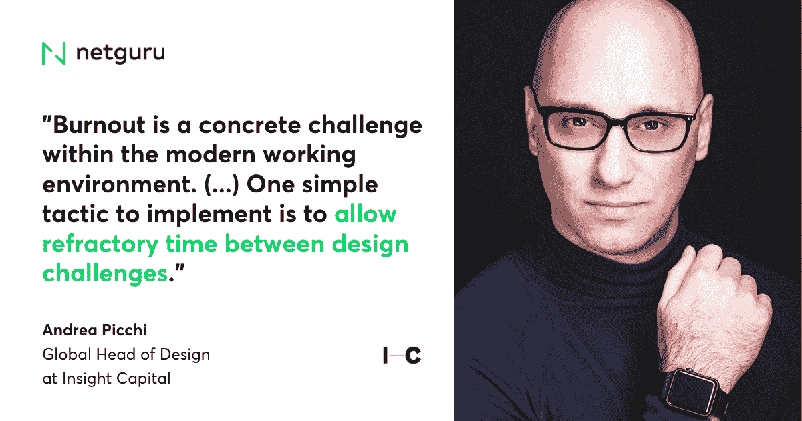
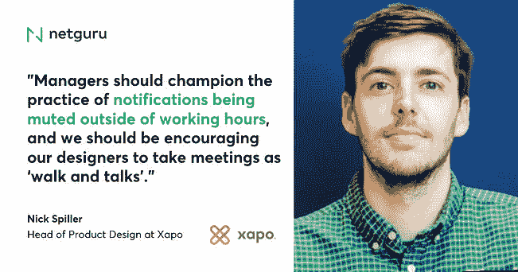

# 设计经理如何防止团队精疲力竭的 8 点建议

> 原文：<http://web.archive.org/web/20230307163032/https://www.netguru.com/blog/how-to-prevent-design-team-burnout>

 管理设计团队可能会给设计负责人带来很多挑战，即使是最好的管理者也会犯错。这些常见的陷阱可能包括:没有解决孤立感，忽视每个团队成员的自我发展，没有激励设计师，缺乏远见，没有反馈或认可，或者更糟糕的是，反馈沟通不畅...这个清单可以一直列下去。

团队倦怠的问题是真实存在的，所以我们决定联系设计领导者，询问他们对团队倦怠原因的看法。我们还收集了如何防止职场倦怠的建议。

## **如何让设计师开心又不让他们筋疲力尽的 8 条建议**

### **Andi Beka**

**UX 负责人&设计简单保险**

设计团队的时间和精力分散在重要的活动中，例如教育、完成请求、分析以前的活动、记录当前的活动以及维护设计系统和设计资产。

一旦设计师的时间主要花在实现上，就会产生一系列危险的影响:缺乏自我发展的感觉，因为花在教育、机器人行为和缺乏意义上的时间少得多，因为过去的事件没有被充分分析和处理以产生学习和成长；混乱感，因为缺少文档和维护。

随着时间的推移，这将增加精神负荷，并可能导致倦怠症状。设计经理应该在满足个人需求、按需请求、路线图项目和内部计划之间保持良好的平衡，以持续分析、识别模式和归纳问题，从而提出更智能和更高效的产品，最大限度地学习，并减少在满足需求上花费的精力和时间。

### 梅丽莎·卡伦斯

**创始人&Charette 首席执行官**

主持非结构化的评论是我见过的团队精疲力竭的方式之一。设计师在良好的反馈中茁壮成长——但组织中的许多人是新批评者。

一个优秀的设计经理会让评论成为每个人有趣而富有成效的体验——一个优秀的经理不会让利益相关者对细节提出规定性的建议，而是提升对话，将关注点作为商业目标进行提炼和分解，这样设计师就可以清楚地了解要做什么，但又有足够的空间找到创造性的解决方案。

### 托托·卡斯蒂略

**Netguru 的副设计经理**

********

****盲目分配任务**，没有上下文和解释。在这种情况下，你的队友可能会认为这些任务是他们需要做的琐事，因为他们不知道他们如何为团队目标做出贡献。总是准备一个容易理解的介绍，列出一系列“为什么”来显示任务之间的相关性，并强调你的队友的工作如何对团队的整体战略做出贡献。**

**Us managers can make many mistakes. But we mustn’t shy away from the responsibilities that come from leading a design team, or any other team actually. Instead, we have to work towards avoiding pitfalls and creating a friendly and inspiring work environment. The common bad practices that could lead to team burnout include:

*   过多的微观管理。控制多少人合适？根据我的经验，非常低。时不时地进行对话以协调和分享想法显然是好的，但永远不要一天要求超过一次的进展，并在真正罕见的情况下详细检查工作流程。关注结果，给人们犯错的空间，然后解释为什么有些事情是不正确的，以及如何改进。

*   **很少或没有通信**。缺乏对话，尤其是在偏远的环境中，会引起与同事的疏远。确保你鼓励队友经常见面/见面，可能一周一次。不仅讨论与工作相关的问题，还可以适当询问他们的私人生活，表现出你对队友生活的兴趣。

*   忽视这样一个事实:对你来说似乎是小问题的事情对其他人来说可能是非常重要的事情。试着同情你的队友，讨论每一个小挫折。从长远来看，不这样做可能会导致精疲力尽。

*   莱昂纳多·德拉罗查

### Intuit 的设计总监

**Design Director at Intuit**

当我们在困难时期继续工作时，优秀的经理会尽最大努力为他们的团队创造安全的空间，分享他们如何应对并寻求帮助。尽管这看起来是出于好意，但我们在工作中关心的许多人都因为分享他们的感受而不知所措。事实上，我听说过的许多队友都分享说，他们把工作时间看作是对现实世界戏剧的逃避，现实世界戏剧可能会令人筋疲力尽。

我给领导者的指导是，在询问人们的感受时要考虑周到。给人们分享的选择，不要强求或强迫。我收集人们工作表现信号的方法之一是将我每周的团队检查转变为一种更轻松的氛围。

每周一，我都会通过 Slack 向我的直接团队和扩展团队发送周末更新线程，但要求以表情符号的形式提供回复。这允许人们挖掘他们的创造性灵魂，思考他们在工作之外经历的通常有趣或富有成效的事情，并以这种能量开始他们的一周。

**当哈勃**时

### **SVP，高级经理，教学设计战略&富国银行北美创新**

 **许多设计经理非常专注于带领他们的团队创造伟大的产品。然而，如果不小心，持续完成工作的愿望经常会导致团队精疲力竭。我发现了几种避免这个问题的方法。由于许多团队远程工作，不要忽略时区差异。

****

这会让员工对你和他们的同事感到疲惫、饥饿和沮丧。尽量减少缩放会议，让您的团队专注于设计。最后，在项目之间点击暂停按钮，腾出时间来反思和重新振作。这些简单的想法将有助于保持他们的热情不被耗尽。

【T0 插入】T1

**妮娜·埃克伦德设计公司的创意总监/设计顾问**

 **在我从事设计行业的这些年里，我很幸运没有目睹过一个团队筋疲力尽。然而，我经常听到人们谈论因精疲力尽而导致的倦怠。我有幸与之共事的设计经理都有能力给出清晰的方向。

他们总是确保团队中的每个人都清楚自己的角色和职责。他们清楚地定义了项目每个阶段的范围和目标，并作为一个团队与团队进行了沟通。根据我的经验，我认为这些品质有助于确保我们行业中设计团队的健康和长寿。

****

**Andrea Picchi**

**Insight Capital 全球设计总监**

 **### 职业倦怠是现代工作环境中的一个具体挑战。正如我在上一本书《像领导者一样管理》中探讨的，你可以从不同的角度缓解这种精神状态。

一个简单的实施策略是在设计挑战之间留出耐火时间。如果你的团队在项目结束时取得了成果，无论是积极的还是消极的，分配少量时间减压，同时专注于低优先级的任务。这种方法可以避免精神压力升级到不可修复的程度。

**尼克玩家**

****

Xapo 产品设计主管

总结

许多经理，不仅仅是设计界的经理，都在努力保持团队的积极性和对工作的满意度。但是，正如你所看到的，行业领导者已经证明了有效管理团队和防止倦怠的方法。我希望这篇文章能帮助你应对领导力的挑战！

### **Nick Spiller**

**Head of Product Design at Xapo**

As remote design roles become more common, I’ve seen an uplift in team burnout, mostly due to the lack of divide between work and home life. Managers should champion the practice of notifications being muted outside of working hours, and we should be encouraging our designers to take meetings as ‘walk and talks.’ This reduces the time they spend staring at a screen and provides a change of scenery that can help reinvigorate their creativity.

## Wrapping-up

Many managers, not only in the design world, struggle to keep their teams motivated and satisfied with their work. But, as you can see, industry leaders have proven ways to manage their teams effectively and prevent burnout. I hope this article will help you with tackling that leadership challenge!********