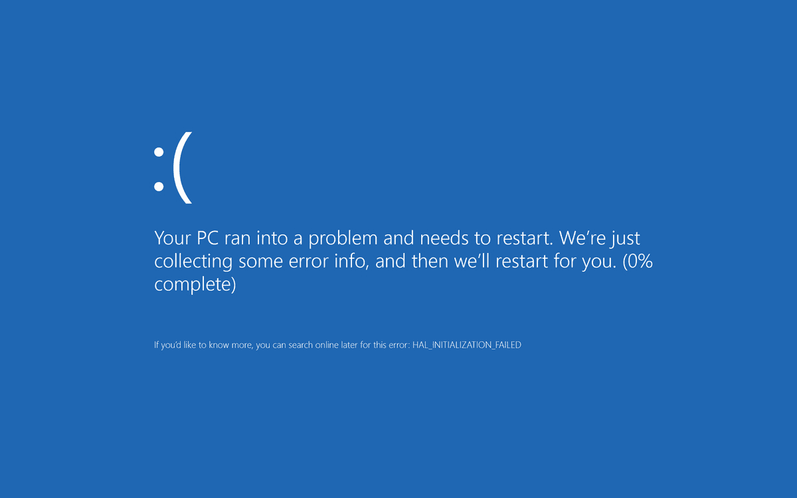

# 命令式编程与声明式编程——利弊

> 原文：<http://web.archive.org/web/20230307163032/https://www.netguru.com/blog/imperative-vs-declarative>

 与命令式编程相反，声明式编程是关于描述你试图实现什么，而不是指导如何去做。请继续阅读并查看我关于编程范例的演示。

快速(历史)回顾

## 命令式编程的想法可以追溯到 20 世纪 50 年代，那时第一批高级编程语言已经诞生。由于有 72 个真空管晶体管和 18K 内存可供使用，程序必须尽可能地高效。实现这一点的唯一方法是根据计算机执行的一步一步的食谱编写程序。

这基本上就是**命令式编程**的全部内容——用改变程序状态的指令来描述程序。这种有 60 年历史的风格仍然是许多现代编程语言中最流行的范例。JavaScript、Ruby、Objective-C 甚至全新的 Swift——默认情况下它们都是必不可少的。

但是，让我们在这里停下来，看看下面这个典型的命令式示例:

考虑到它只是下载、解析和处理一些远程数据，这段代码似乎过于复杂。随着项目的发展和开发人员增加更多的步骤，厄运金字塔很快出现。

你可能会问，另一种选择是什么？

进入声明式编程

## 与命令式编程不同，**声明式编程**是关于描述你试图实现什么，而不是指导如何去做。

让我们将上面的命令式示例转换成声明式示例(使用类似于 [promise](http://web.archive.org/web/20221204003703/http://en.wikipedia.org/wiki/Futures_and_promises) 的结构):

哇，这看起来清楚多了。更好的是，想增加一个步骤吗？没问题！只需在流中添加一行代码:

1.它最小化可变性

不可变对象通常更容易处理。这种对象只能处于一种状态，不能跨线程修改。你可以共享它们，克隆它们，甚至缓存它们的数据——所有这些都不用担心它们会过时。

### 您可能会惊讶地发现，通过使用不可变的数据结构，可以完全消除多少易于制造和难以检测的错误。

2.它减少了副作用

假设您正在调试一个未知的视图控制器，它可能是由团队成员编写的。你会发现对于相同的输入参数，函数 F 有时会有不同的表现。经过一番检查，你发现它使用了一个公共属性 x。

### 然后你寻找修改 x 的地方(视图控制器内外)，发现有五个。祝你好运，找出哪一个是错误的真正来源。:)

这就是为什么[态](http://web.archive.org/web/20221204003703/http://en.wikipedia.org/wiki/State_(computer_science))是邪恶的。因为实际上任何人都可以改变它，它是不可靠的。

Then you look for places that modify x (inside and outside the view controller) and find that there are five of them. Good luck finding out which one is the true source of the bug. :)

This is why [state](http://web.archive.org/web/20221204003703/http://en.wikipedia.org/wiki/State_(computer_science)) is evil. Because literally anyone can change it, it cannot be relied upon.

每次你不得不重启应用程序或电脑来解决问题时，你都是状态失控的受害者。

声明式编程不鼓励使用变量，而是支持更复杂的结构，例如[管道](http://web.archive.org/web/20221204003703/http://en.wikipedia.org/wiki/Pipeline_(computing))或[高阶函数](http://web.archive.org/web/20221204003703/http://en.wikipedia.org/wiki/Higher-order_function)。

3.它导致更容易理解的代码

让我们面对现实吧——如果不逐行检查，就不清楚上面的代码在做什么。这个典型的缺陷源自命令式编程的定义——不是声明你试图实现什么，而是告诉计算机**它**应该做什么。

### 如果你想知道如何进一步简化上面的例子，这里有一个更具声明性的版本:

简单多了，不是吗？

4.它只是更具可扩展性

因为声明式程序通常更简单、更安全，所以这样的项目更易于维护，开发人员工作起来也更愉快。

然而，对于一个新的团队成员来说，跳入一个有很多可变状态、不清楚的过程和隐含依赖的项目并不容易。

### 一起

我们都习惯了命令式范式。这是我们所有人在学习编码时学到的，也是为什么这种古老的风格仍然在现代编程语言中占主导地位的主要原因。然而，随着[软件项目变得越来越复杂](/web/20221204003703/https://www.netguru.com/services/software-development)，编写安全、可理解和可扩展的代码比以往任何时候都更重要——这是使用传统方法无法完成的事情。

我强烈鼓励我们，开发人员社区，重新审视一下我们面向命令的习惯，看看它的缺点，并挑战自己去尝试一些完全相反的东西。

## 因此，下次我们要实现一些功能时，我们会问自己是否可以用声明的方式编写，没有任何变量、循环、条件或回调。

你会惊讶有多少次答案是**是**。

这是我在二月份的 infoMEET 会议上演讲的摘录:“编程范例——哪一个是最好的？”下面来看看:

Netguru 的开发者经常以听众和演讲者的身份参与各种活动。下面是我们的 iOS 开发者 Patryk 关于移动中欧会议的几句话。

You'd be surprised at how many times the answer is **yes**.

*This is an excerpt from my talk at February's infoMEET conference: "Programming Paradigms — which one is the best?" Check it out below:*

*Netguru's developers often participate in various events both as listeners and speakers. Here's a few words about Mobile Central Europe conference by our iOS developer Patryk.*