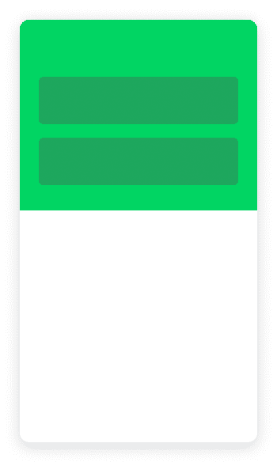
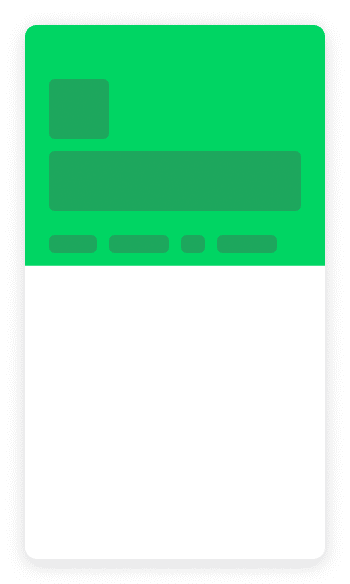
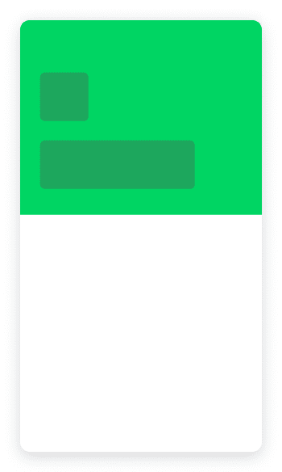

# 在 React Native 和 Sticky Parallax Library 中实现 App Store 头

> 原文：<http://web.archive.org/web/20230307163032/https://www.netguru.com/blog/implement-an-app-store-header-in-react-native-with-sticky-parallax-library>

 在这篇博文中，我们从模拟人生移动产品页面构建了一个苹果应用商店粘性头。

滚动时，此页眉隐藏后退按钮，使背景模糊的页眉出现。滚动浏览产品详细信息后，标题右侧会显示一个行动号召按钮，中间是产品的徽标。  

为了用动画快速实现类似的标题布局，我们可以使用[react-native-sticky-parallax-header](http://web.archive.org/web/20221007101023/https://github.com/netguru/sticky-parallax-header)库。它将允许我们专注于实现一个类似于原始应用商店标题的设计，而不用编写不必要的逻辑。

您可以从预定义的标题组件的三个变体中进行选择:带有可滚动标签的标签栏标题和两个动画标题-头像标题和细节标题。除此之外，您还可以使用 StickyParallaxHeader 组件创建一个完全自定义的标题。



在我们的例子中，我们可以使用逻辑稍加修改的头像头。

让我们导入“StickyParallaxHeader”，使用“AvatarHeader”作为“headerType”。除此之外，我们可以将“hasBorderRadius”设置为 false 来关闭圆形边框。我们可以设置“背景颜色”为黑色，“视差高度”为 430，因为这将是整个视差的高度。属性“transparentHeader”应该是真的，因为我们希望我们的标题是完全自定义的，它应该是不可见的，在滚动后出现。

我们还需要设置一个“scrollEvent ”,如下例所示。

```
<StickyParallaxHeader
 headerType="AvatarHeader"
 hasBorderRadius={false}
 backgroundColor="black"
 scrollEvent={event(
   [{ nativeEvent: { contentOffset: { y: scrollY.y } } }],
   { useNativeDriver: false }
 )}
 parallaxHeight={430}
 transparentHeader={true}
/> 
```

然后我们应该从“react-native”导入“Animated”并创建一个“scrollY”变量。有必要准备自定义动画。

```
const { event, ValueXY } = Animated
const scrollY = new ValueXY()
```

## 创建前景组件

为了更容易地跟踪我们所做的代码更改，请检查头文件的完整源代码。我将在这篇博文中解释代码的不同部分。

现在，我们需要创建一个前景组件，它在顶部有一个背景图像和一个细节视图，由左侧的产品徽标、标题、副标题、行动号召按钮“Get”和共享图标组成。

下面是完整的组件代码——确保像这样传递给 StickyParallaxHeader 的前台道具:“foreground={renderForeground}”。

```
const styles = StyleSheet.create({
 foregroundImage: {
   width: '110%',
   height: 250,
   marginLeft: -25
 },
 foregroundContainer: {
   flexDirection: 'row',
   marginBottom: 100,
   marginTop: 27,
   marginLeft: 27
 },
 foregroundLogo: {
   width: 128,
   height: 128,
   borderRadius: 32
 },
 foregroundDetails: {
   marginLeft: 15
 },
 foregroundDetailsHeader: {
   color: 'white',
   fontSize: 22,
   fontWeight: 'bold'
 },
 foregroundDetailsDesc: {
   color: 'gray',
   fontSize: 20
 },
 foregroundActionsContainer: {
   flexDirection: 'row',
   marginTop: 40,
   alignItems: 'center'
 },
 foregroundActionsButton: {
   backgroundColor: '#3479F6',
   width: 80,
   height: 33,
   borderRadius: 18,
   alignItems: 'center',
   justifyContent: 'center'
 },
 foregroundActionsButtonTitle: {
   marginLeft: 10,
   color:'gray',
   fontSize: 10
 },
 foregroundActionsShare: {
   width: 20,
   height: 20,
   marginLeft: 30
 }
})

const renderForeground = () => (
 <View>
   <Image source= style={styles.foregroundImage} />
   <View style={styles.foregroundContainer}>
     <Image source= style={styles.foregroundLogo} />
     <View style={styles.foregroundDetails}>
       <Text style={styles.foregroundDetailsHeader}>The Sims™ Mobile</Text>
       <Text style={styles.foregroundDetailsDesc}>Play with life.</Text>
       <View style={styles.foregroundActionsContainer}>
         <TouchableOpacity style={styles.foregroundActionsButton}>
           <Text style={styles.headerDetailsButtonTitle}>GET</Text>
         </TouchableOpacity>
         <Text style={styles.foregroundActionsButtonTitle}>{`In-App\nPurchases`}</Text>
         <Image source= style={styles.foregroundActionsShare} resizeMode="contain"/>
       </View>
     </View>
   </View>
 </View>
) 
```

## 创建标题组件

在博客文章的开始，我们将“transparentHeader”设置为 true，所以现在没有显示标题，但是当我们将 renderHeader prop 与我们的自定义标题组件一起使用时，它将完全可见。我们可以操纵它的背景不透明度，使它在开始时不可见，并在滚动一点点后出现。

注意，标题背景是一个模糊的视图——我们可以使用@react-native-community/blur 库来做到这一点。

### 标题背景

在我们的 header 组件中，我们可以创建一个动画视图来应用动画不透明度，在内部，我们可以使用来自“@react-native-community/blur”的 BlurView 和“ChromeMaterialDark”模糊类型。

```
const styles = StyleSheet.create({
 headerContainer: {
   width: '100%',
   height: 97
 },
 headerBlurView: {
   position: "absolute",
   top: 0,
   left: 0,
   bottom: 0,
   right: 0
 }
})

<Animated.View
 style={[styles.headerContainer, { opacity }]}>
 <BlurView
   style={styles.headerBlurView}
   blurType="chromeMaterialDark"
   blurAmount={15}
   reducedTransparencyFallbackColor="black"
 />
</Animated.View>
```

你可以注意到动画。视图将不透明度传递给了样式。这是一个动画属性，对我们创建的“scrollY”值进行简单的插值。意思是滚动到我们 scrollY 为 110 的地方后，不透明度会增加到 150，使背景完全可见。

```
const opacity = scrollY.y.interpolate({
 inputRange: [0, 110, 150],
 outputRange: [0, 0, 1],
 extrapolate: 'clamp',
}) 
```

### 页眉白色后退按钮

虽然标题是不可见的，但在左侧我们可以看到一个白色的后退按钮。它有两个动画属性。滚动后它被移动到左边，当显示标题背景时它完全不可见。

在这种情况下，我们将按钮完全放置在标题背景上，然后将“left”属性传递给按钮容器，这是一个 [React Native](/web/20221007101023/https://www.netguru.com/glossary/react-native) clickable 元素“TouchableOpacity”。这个值是插值的，所以在“scrollY”滚动到值 110 之后，按钮向左移动，直到值“left: -40”，此时按钮完全在视图之外。

除此之外，我们还使用值“arrowOpacity”传递不透明度。它将不透明度从 1 更改为 0，因此在滚动到“scrollY”值 140 后，按钮不可见。 

```
const styles = StyleSheet.create({
 headerImage: {
   width: 18,
   height: 18,
 },
 headerButtonContainer: {
   position: 'absolute',
   top: 50,
   zIndex: 4
 },
 headerButton: {
   backgroundColor: 'white',
   height: 36,
   width: 36,
   borderRadius: 18,
   alignItems: 'center',
   justifyContent: 'center'
 }
})

const left = scrollY.y.interpolate({
 inputRange: [0, 110, 160],
 outputRange: [24, 24, -40],
 extrapolate: 'clamp',
})

const arrowOpacity = scrollY.y.interpolate({
 inputRange: [0, 110, 140],
 outputRange: [1, 1, 0],
 extrapolate: 'clamp',
})

<TouchableOpacity style={[ styles.headerButtonContainer, { left }]}>
 <Animated.View style={[styles.headerButton, { opacity: arrowOpacity }]}>
   <Image
     style={styles.headerImage}
     resizeMode="contain"
     source=
   />
 </Animated.View>
</TouchableOpacity>
```

### 标题搜索按钮

白色按钮消失后我们首先能看到的是模糊的标题背景和带有左箭头图标的搜索按钮。在第一步中应该已经准备好了标题背景；现在，我们需要实现一个搜索按钮，并使它出现在滚动。

在此示例中，带有“headerWrapper”的“View”绝对定位为“top”值 55，这是为带有凹槽的 iPhone 实现的，因此 iPhone X 和更新的版本也是如此。对于 Android 和旧的 iPhone 设备，您应该通过创建一个助手函数来计算这个值，从而更改这个值。您可以查看一下[react-native-sticky-parallax-header](http://web.archive.org/web/20221007101023/https://github.com/netguru/sticky-parallax-header)存储库中的“example”目录，并检查它是如何在那里实现的。

在实现了带有返回箭头图标的图像组件和带有“搜索”值的文本组件之后，我们可以用动画来包装它。查看并传递与标题背景相同的不透明度。搜索按钮应该与背景同时出现。

```
const styles = StyleSheet.create({
 headerWrapper: {
   position: 'absolute',
   left: 0,
   top: 55,
   width: '100%',
   flexDirection: 'row',
   justifyContent: 'space-between',
   alignItems: 'center'
 },
 headerSearchContainer: {
   flexDirection: 'row',
   alignItems: 'center',
   paddingLeft: 5,
   paddingRight: 60
 },
 headerSearchArrow: {
   width: 25,
   height: 25,
 },
 headerSearchText: {
   color: '#2488FF',
   fontSize: 20
 }
})

<View style={styles.headerWrapper}>
 <Animated.View style={[styles.headerSearchContainer, { opacity }]}>
   <Image
     style={styles.headerSearchArrow}
     resizeMode="contain"
     source=
   />
   <Text
     style={styles.headerSearchText}>
     Search
   </Text>
 </Animated.View>
</View>
```

### 标题图标和行动号召按钮

最后出现在滚动条上的是产品细节，比如一个 [React 原生应用](http://web.archive.org/web/20221007101023/https://www.netguru.com/services/react-native-development)图标和一个“获取”按钮，上面有关于“应用内购买”的信息。标题的这一部分应该在用户滚动出视差标题(我们的“renderForeground”组件)之前可见。

在标题的左侧显示“搜索”按钮后，它应该用一个具有 headerWrapper 样式的视图包装，在动画。我们刚刚实现的视图。这一次我们需要一个插值来显示头部细节作为最后一个动画。这将是不透明度，但不同的价值。“scrollY”值最高为 250，细节将不可见，但从 250 到 350，不透明度将增加到完全可见。

```
const styles = StyleSheet.create({
 headerDetailsImage: {
   width: 30,
   height: 30,
   borderRadius: 7.5
 },
 headerDetailsContainer: {
   flexDirection: 'row',
   alignItems: 'flex-end'
 },
 headerDetailsText: {
   marginLeft: 10,
   color:'gray',
   fontSize: 10,
   textAlign: 'right',
   paddingBottom: 3
 },
 headerDetailsButton: {
   backgroundColor: '#3479F6',
   width: 80,
   height: 33,
   borderRadius: 18,
   alignItems: 'center',
   justifyContent: 'center',
   marginHorizontal: 8
 },
 headerDetailsButtonTitle: {
   color: 'white',
   fontWeight: 'bold',
   fontSize: 20
 }
})

const detailsOpacity = scrollY.y.interpolate({
 inputRange: [0, 250, 350],
 outputRange: [0, 0, 1],
 extrapolate: 'clamp',
})

<Animated.View style=>
 <Image source= style={styles.headerDetailsImage} />
</Animated.View>
<Animated.View style={[ styles.headerDetailsContainer, { opacity: detailsOpacity }]}>
 <Text style={styles.headerDetailsText}>{`In-App\nPurchases`}</Text>
 <TouchableOpacity style={styles.headerDetailsButton}>
   <Text style={styles.headerDetailsButtonTitle}>GET</Text>
 </TouchableOpacity>
</Animated.View>
```

### 捕捉阈值和捕捉值

现在当我们有了一个“renderForeground”函数和一个“renderHeader”函数，我们可以把它传递给 StickyParallaxHeader 的“Foreground”和“Header”函数。

之前我们设置了 headerType、hasBorderRadius、backgroundColor、scrollEvent、parallaxHeight 和 transparentHeader。现在我们需要定制标题所依附的“scrollY”的值。整个头+视差前景高度是 430，所以前景图像和带细节的头的第二部分之间放置的粘滞点是 167。可以传递给“snapValue”道具。然后可以将值 50 传递给“snapStartTreshold”。在滚动过 50 的“滚动”之后，标题自动滚动到 167。然后，用户必须滚动标题的细节部分来打开它。“snapStopThreshold”的值应该为 250 才能实现这一点。
请记住，为了使代码更简单，我们的头的“top”值为 55，这是为带凹槽的 iPhones 设置的。为了使这个标题具有响应性，我们需要为 snap props 和 parallaxHeight 计算这个值。您可以在[react-native-sticky-parallax-header](http://web.archive.org/web/20221007101023/https://github.com/netguru/sticky-parallax-header)库中的示例组件中找到一些解决方案。

```
const AppStoreHeader = () => (
 <StickyParallaxHeader
   headerType="AvatarHeader"
   hasBorderRadius={false}
   backgroundColor="black"
   scrollEvent={event(
     [{ nativeEvent: { contentOffset: { y: scrollY.y } } }],
     { useNativeDriver: false }
   )}
   parallaxHeight={430}
   transparentHeader={true}
   foreground={renderForeground}
   header={renderHeader}
   snapStartThreshold={50}
   snapStopThreshold={250}
   snapValue={167}
 />
)

export default AppStoreHeader
```

## 摘要

您可以在库存储库的附加示例目录中找到完整的 App Store 头源代码。使用[react-native-sticky-parallax-header](http://web.archive.org/web/20221007101023/https://github.com/netguru/sticky-parallax-header)我们设法快速实现了一个应用商店标题，并在 scroll 上添加了自定义动画。当滚动时，很容易添加一些不同类型的动画。blogpost 的简化示例可以通过实现对标题及其动画的响应来改进。您还可以实现包含评级的屏幕主体、带有视频的滚动视图和产品描述的其余部分，然后通过“renderBody”属性传递它。