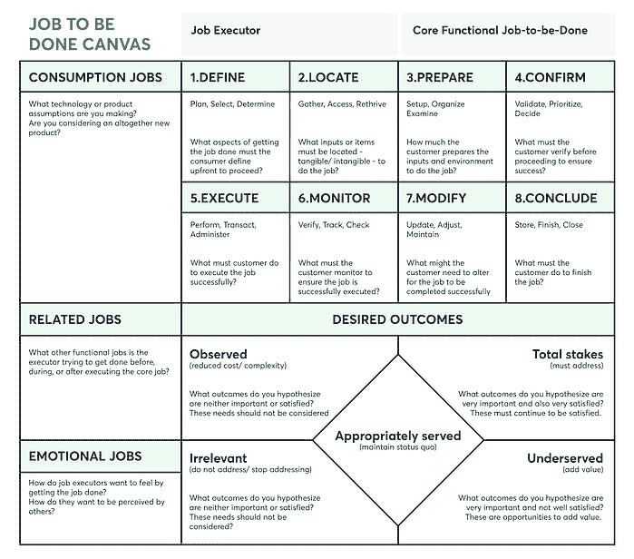

# 如何使用待完成工作画布来定义客户的问题

> 原文：<http://web.archive.org/web/20230307163032/https://www.netguru.com/blog/job-to-be-done-canvas>

 企业总是在寻找预测客户需求的新方法，以便降低将无人问津的产品推向市场的风险。

“要做的工作画布”是一个新的框架，旨在帮助企业做到这一点。在这篇文章中，我们将探索你需要知道的关于要做的工作框架的一切，从何时以及如何在你自己的产品发现中使用它的优点和缺点。

## 什么是要做的工作框架？

要做的工作(JTBD)理论试图通过概述人们如何以及为什么决定购买或采用新产品或服务来量化客户需求。[产品经理](http://web.archive.org/web/20221203101704/https://www.netguru.com/blog/what-makes-a-good-product-manager)、营销团队和业务领导利用工作来降低将人们不想要也不会购买的解决方案推向市场的风险。“要做的工作”框架模板使得将 JTBD 理论付诸实践变得非常容易。

JTBD 理论声称，人们购物和购买新产品和服务是为了以某种方式改变他们的现状，或者在他们的目标上取得进展。这就是这个概念的名字的由来:每一次购买都是顾客“要做的工作”。

一个实际的例子是，当一个团队领导想要帮助他们的团队改善协作和更有创造性地工作。他们的工作还没有完成，因为仍然存在一些限制，例如团队在孤岛中工作或陷入熟悉的工作模式。

为了实现他们的目标(他们要做的工作)，团队领导需要克服反对这个目标的约束。这促使他们寻找新的解决方案。

> 因此，约束和目标之间的相互作用产生了对新解决方案的需求。

在 JTBD 框架中，这些事件被称为催化剂，它们创造了引发新产品需求的紧迫性。

当人们，比如上面例子中的团队领导，寻找新的解决方案来帮助他们实现目标时，他们会寻找任何能够[帮助他们实现目标](/web/20221203101704/https://www.netguru.com/blog/product-vision-board)的东西。在这个例子中，它可以是一个工具、一些团队培训、一个顾问等等。这个选项范围称为选择集。它通常非常多样化，并超越特定的产品类别。

当客户经历这一过程时，他们寻找为他们提供这一解决方案的候选人。“要做的工作”框架将流程的这一部分称为招聘。就像雇主雇佣员工来扮演一个角色一样，人们雇佣产品来完成他们的工作。

在整个招聘过程中，人们会将当前的解决方案与他们的潜在选择进行比较，最终“解雇”当前的解决方案，聘用新的解决方案来取代它。当一个新的解决方案看起来值得信赖和新颖，并成功地让客户看到它是如何工作的，这最终会影响客户的支付意愿。

这些概念(约束、对新解决方案的需求、催化剂、选择集、雇佣和支付意愿)构成了 JTBD 画布的关键阶段。

## 何时以及为何使用待完成工作画布

*   当您需要分析上一节所述流程的需求创造和招聘部分时，待完成工作画布模板将为您提供帮助。
*   您还可以使用该模板直接获取所有重要的数据点，例如在您进行客户访谈或其他[产品发现活动](/web/20221203101704/https://www.netguru.com/blog/product-management-tools)之后。
*   或者，你也可以用它来总结一系列的客户访谈，以及你对客户希望完成的工作得出的结论。

从本质上来说，要做的工作在产品开发的不同阶段都是一个重要的工具，它将帮助你[专注于客户真正需要的东西](/web/20221203101704/https://www.netguru.com/blog/product-management-insights-4)。

## 如何使用待完成工作模板

要使用该模板，首先要采访最近购买了你的产品或服务的人，特别是那些最近转用你的产品的人，以及那些已经使用了很长时间的人。一旦你进行了这些访谈，将你的发现分成三个阶段:

### 需求创造

*   **你需要合作记下你的理想客户**未满足的需求，列出他们的目标和阻止他们实现这些目标的潜在限制。
*   **列出所有在购物(或招聘)过程中产生需求或紧迫感的事件、挫折、经历和其他催化剂**。

### 期望的进展

*   **分组，用简短的叙述概述你对理想顾客的看法**，包括他们为什么决定做出改变。比较各组之间的故事，并讨论不同之处。您可以在以后使用这些故事来激发新的想法，并在您的团队之间达成一致。
*   从你的故事中，**构思一个简单的待完成工作“陈述”**表达你的客户正在寻找的关键优势。
*   **识别“进展信号”**，这些信号记录了这些客户如何知道他们正在朝着最终目标前进。

### 雇用

*   **列出他们雇佣、解雇和考虑**完成工作的解决方案、产品或服务。
*   在内部讨论招聘过程的各个方面。你可以使用便利贴来突出增加或减少信任的因素(使用绿/红颜色编码)或使产品看起来为他们的钱提供了好或坏的价值。也要抓住似乎有助于顾客想象产品如何使用的方面，并列出使产品看起来熟悉或新奇的因素。

一旦你以这种方式总结了你的采访，使用这些数据来改变你的营销、产品或销售。这些待办事项数据将帮助你找到理想的客户，并设计出吸引他们的产品。

## 使用待完成工作模板的好处

“要做的工作”理论可以给你带来许多不同的好处。除了帮助您的内部团队更好地协调和合作，更有洞察力，它还将帮助您正确识别创造价值的领域。

通过花时间了解 JTBD 模板的不同方面，这些方面会告知客户关于像您这样的产品的雇用决定，您可以[设计一个真正满足他们需求的产品之旅](/web/20221203101704/https://www.netguru.com/blog/value-proposition-canvas)，并在您进入市场时增加您在财务和声誉方面成功的机会。最终，这将为您提供增加收入的机会，并在您选择的市场中变得更具竞争力。

## 使用待完成工作框架的缺点

JTBD 模板的一个可能的缺点是，它会导致您的团队基于抽象或哲学假设开发产品。这方面的一个例子是，一位顾客最终“想要帮助动物”——例如，这与一位只想让他们的猫使用猫砂托盘的人相去甚远。

这种对客户需求的抽象解释可能会导致诸如功能优先级之类的问题，或者使确定战略目标变得困难，这可能会分散对更直接的设计关注，如产品的可用性或美观性。为了确保您的产品团队不会受到这些问题的困扰，请将这些考虑因素和您客户的特定需求放在首位。

## 待完成工作示例画布

下面你可以看到一个待完成工作画布的模板，上面有你需要填写的每个部分:

来源: [待完成工作画布](http://web.archive.org/web/20221203101704/https://jobs-to-be-done.com/the-jobs-to-be-done-canvas-f3f784ad6270)

## 评估客户的当前需求

预测和响应客户需求也许是一个企业能够掌握的最重要的活动；如果你能有效地设计解决方案来满足这些需求，你最终会卖出更多的产品和服务。

但这是一个困难且持续的过程，待完成工作框架可以极大地帮助我们提炼出影响客户购买或雇佣决策的因素，并指导您的团队设计最佳解决方案。

正如我们已经看到的，存在一些潜在的缺点，但是如果你能够将这些因素考虑到你的想法的发展和执行中，你仍然可以获得工作模板的潜在好处——更多的客户，更满意的客户，更好的收入和销售。

就这样，你已经准备好开始在你自己的产品设计中使用待办事项模板了，但是如果你想了解更多关于如何使用它的信息，或者谈论它是否是你企业的最佳选择，现在就联系一位 Netguru 专家吧！