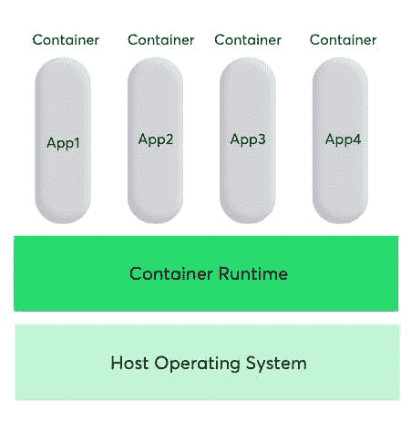
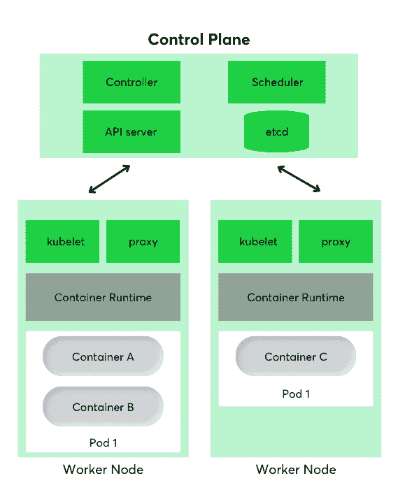
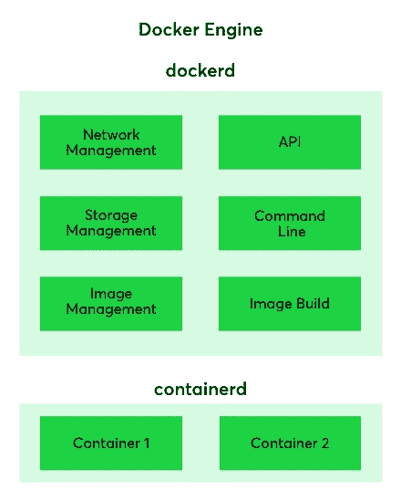

# 立方结构与对接器:了解容器

> 原文：<http://web.archive.org/web/20230307163032/https://www.netguru.com/blog/kubernetes-vs-docker>

 如果你想用容器技术构建、交付和扩展应用程序，你可能想知道是用 Kubernetes 还是 Docker。这两种技术本质上是不同的，在关于容器的讨论中，这两种技术经常相互对立。

那么，您应该为您的下一个项目选择哪种工具呢？做出选择并不容易，要做出最终决定，你应该了解 Kubernetes 和 Docker 的优势和局限性。

下面，我们重点介绍了 Kubernetes 和 Docker 的基本要素，探索了每种技术如何服务于您的业务，讨论了两者的优缺点，并选择了一些关键要点，您可以使用它们做出明智的决策。

## What is Kubernetes?

Kubernetes 是一个可移植、可扩展的开源平台，用于管理容器化的工作负载和服务。它是一个开源平台，使公司能够扩大规模，满足不断扩大的产品目录的需求。

Kubernetes 是为 pod、服务和部署的组合而设计的。它是一个帮助管理基础设施的平台，并且是继 Linux 之后，开源软件历史上发展最快的项目。Kubernetes 的使用继续扩大，根据最近的研究，它被全球超过 24，400 家[公司使用。](http://web.archive.org/web/20220924162203/https://enlyft.com/tech/products/kubernetes#:~:text=We%20have%20data%20on%2024%2C441,in%20the%20Computer%20Software%20industry.)

Kubernetes 的优点

Kubernetes 的多云功能以及其可移植性和适应性使该平台脱颖而出。

## 多云能力

Kubernetes 是一个非常强大和灵活的平台，可以在单个云上托管工作负载，也可以跨多个云托管工作流。

### Kubernetes 的多云能力是该平台的突出特点之一，也是其近年来取得如此成功的部分原因。Kubernetes 可以简单地将其整个环境从一个云扩展到另一个云，这为您提供了广泛的功能。

在当今市场上，许多企业都在通过各种云应用来推行[多云战略](/web/20220924162203/https://www.netguru.com/blog/types-of-cloud-computing)，这使得 Kubernetes 成为帮助实施广泛战略的理想工具。

成熟的平台

五年前，没有多少人熟悉 Kuberenetes，因此采用它可能有风险。然而，今天成千上万的 IT 团队定期使用 Kubernetes，它已经成为行业内的市场领导者。

### 这是一个成熟可靠的解决方案，可确保您在将它用于生产部署时不必承担不必要的风险。

当谈到容器编排器时，Kubernetes 是一个受欢迎的解决方案，这也意味着有更多熟悉该平台的开发人员和工程师。

你不必花很多钱去找一个精通 Kubernetes 的合格开发人员，你也可以从一个大型的互补软件项目生态系统中受益。因此，Kubernetes 是最方便、最经济的平台之一。

便携性和适应性

Kubernetes 能够与任何类型的容器运行时一起工作。此外，Kuberenetes 还兼容几乎任何类型的底层基础设施——无论是公共云、私有云还是本地服务器。

### 总的来说，这意味着您在选择基础架构或环境配置时不会受到限制。Kubernetes 容器具有高度的可移植性，这是许多其他容器编排器所不具备的。

许多容器都与特定的基础设施相关联，而使用 Kubernetes，您可以自由地进行试验并做出适合自己业务的选择。

Kubernetes 的缺点

然而，Kubernetes 有一些缺点，包括复杂的设置和配置过程，以及高成本。

难以设置和配置

Kubernetes 是出了名的复杂，这可能会导致困难的设置和棘手的配置过程。对于不熟悉基础设施技术的开发人员来说，Kubernetes 可能是一条陡峭的学习曲线。

## Kubernetes 开发工作流程可能需要一些时间来适应，并且您希望您的工程团队中至少有一名 Kubernetes 专家。

谈到 Kubernetes 的复杂性，一个可取之处是你可以利用 Azure 和其他云环境中的服务[来进行设置和配置。](http://web.archive.org/web/20220924162203/https://azure.microsoft.com/en-gb/services/kubernetes-service/)

### 过渡到 Kubernetes 可能是一场斗争

您现有的软件需要进行调整，以便在 Kubernetes 上轻松运行。这种适应和转换所需要的时间很难估计，并且很大程度上取决于您已经运行的软件的类型。

Kubernetes 可能很贵

建立和运行 Kubernetes 所需的专业知识和人员有时会导致一些沉重的管理费用。并不是所有的组织都可以在内部培训 Kubernetes 专家，聘请外部人才可能会很昂贵。

### 例如，在美国，Kubernetes 熟练软件开发人员的平均工资约为 11.5 万美元。因此，Kubernetes 可能不是中小型企业的可行选择。

Docker 是什么？

### Docker 是一个开源平台，旨在帮助应用程序的开发、运输和运行。Docker 旨在消除重复的配置任务，并可在整个开发生命周期中用于桌面或云的简单和可移植的应用程序开发。

有了 Docker containers，企业可以灵活安全地构建、共享和运行应用程序。

码头工人的优点

## Docker 的主要优点是可移植性、高性能、减少部署时间和隔离资源。

轻便

使用 Docker 容器的一个关键优势是可移植性。Docker 容器在多云平台上运行的能力非常有用，非常适合使用大量云解决方案的企业。

## 近年来，所有主要的云计算提供商，包括亚马逊网络服务(AWS)和谷歌计算平台(GCP)，都采用了 Docker 的可用性，并增加了个人支持。

一旦你完全测试了你的容器化应用程序，它就可以被部署到 Docker 正在运行的任何其他系统上，并且它将继续有效地运行。Docker 还可以与其他提供商一起工作，如 Microsoft Azure 和 OpenStack，并可以与各种配置管理器一起使用，如 Chef、Puppet 和 Ansible。

### 表演

与虚拟机不同，容器不包含操作系统，这意味着它们能够快速创建，并且启动速度更快。

如果你正在寻找具有高性能的容器技术，那么 Docker 容器是市场上最好的解决方案之一。Docker 引擎快速而强大，将帮助您高效地完成任务。

快速持续部署

### Docker 可以将部署时间减少到几秒钟，并确保您永远不会浪费时间。使用 Docker Swarm，您可以获得从开发到生产的一致环境。

通过从开发到生产使用同一个容器，确保没有差异或人工干预，可以确保在容器生命周期中保持连续部署。

隔离

### 每个 Docker 容器都有独立的资源。该功能有助于以更干净的方式删除应用程序，因为每个应用程序都在自己的容器中运行。如果你不再需要使用一个应用程序，Docker Swarm 可以很容易地删除它的容器，而不会造成更大的不便。

Docker 引擎在每个容器的级别上提供隔离。因此，当使用 Docker 容器时，可以部署多个应用程序，而应用程序之间不会有任何冲突。容器隔离是便利性和安全性的重要考虑因素，Docker 能够很好地维护隔离的应用程序。

码头工人联合会

### Docker 的主要缺点是高度复杂或低效的存储选项。

高度复杂

虽然 Docker 可能比 Kubernetes 相对简单，但是切换到 Docker 容器的复杂性相当高。对于一些开发人员来说，使用 Docker 容器可能是一个陡峭的学习曲线，当他们试图处理平台的复杂性时，这可能导致效率低下。

监视

Docker 提供有限的监控解决方案。对于许多企业和开发者来说，这不是一个大问题，尤其是如果你只需要关于你的容器的基本信息。然而，如果您想要更高级的实时收集数据的监控，Docker 并不是最兼容的平台。

## 低效的存储选项

Docker 的持久数据存储很复杂，而且效率很低。您可以使用 Docker 数据卷在 Docker 中保存数据，但是这个过程并不是无缝的，有更简单的方法来存储数据。

### 目前，还没有一种简单可靠、方便的方法来连接 Docker 容器。在未来，我们可能会看到 Docker 容器更好、更高效的存储选择，但目前数据存储很困难。

Kubernetes 什么时候比 Docker 强？

### 当你在寻找一个更广泛的解决方案时，Kubernetes 比 Docker 更好。根据 Azure 的说法，Kubernetes 旨在以高效的方式协调生产中的大规模节点集群，而 Docker 运行在单个节点上。

Kubernetes 是一个复杂的平台，非常适合配置复杂的高要求应用程序。这是一个久经考验的系统，被市场上最大的玩家如谷歌所使用。

### Kubernetes 得到了每个主要云提供商的支持，它的广泛流行证明了这样一个事实，即它是最强大、适应性最强和可定制的平台之一。

Docker 什么时候比 Kubernetes 好？

Kubernetes 是一个复杂的平台，安装、配置和维护起来既费时又费钱。另一方面，Docker 更容易，从长远来看，它通常是一个更便宜的解决方案。

## 这可以从近年来 Docker 采用率的上升中看出。2021 年，Docker Hub 账户总数达到 730 万，同比增长约 45%。开发人员已经习惯了 Docker 生态系统，并且因为它使用起来相对简单，所以它的受欢迎程度超过了其他一些容器平台。

Docker Swarm 比 Kubernetes 更容易开始，如果你知道你只有很小的工作量，它可能是更合适的平台。

Kubernetes vs. Docker:有什么区别？

我们的简要概述表明，Kubernetes 和 Docker 都不是完美的。那么，如何正确决定使用哪一种呢？答案很简单:这两个平台都适合特定的任务，也适合特定的业务。

## 虽然 Kubernetes 和 Docker 经常相互竞争，但这两个平台可以相互配合使用，以便更好地控制和实现容器化的应用程序。

在某些方面，比较这两个平台就像比较苹果和橙子一样。Kubernetes vs Docker 的争论将会继续，但实际上它们都在不同的方面表现出色，你的选择通常取决于哪个平台更适合你的业务。

在研究这两种容器技术时，一个关键的要点是 Kubernetes 是一个更广泛、更灵活的解决方案。Kubernetes 和 Docker 都具有广泛的可移植性；然而，如果你正在寻找一个广泛的，多方面的解决方案，Kubernetes 只是略微超过 Docker。

类似地，研究 Docker 对现代企业的效用的一个关键收获是，如果您需要在容器中自动部署应用程序，它会非常有用。Docker 引擎功能强大，性能卓越，允许应用程序在不同的环境中高效工作。

## 最终，这两个平台都有潜力扩展和增强您业务的能力。无论您选择使用 Docker Swarm 还是 Kubernetes，它们都将是 2022 年以及未来许多年的两个领先容器平台。

Our brief overview demonstrates that neither Kubernetes or Docker are perfect. So how do you make the right decision about which one to use? The answer is straightforward: both platforms are good for specific tasks and will be suited to particular businesses.

While Kubernetes and Docker are often pitted against each other, the two platforms can be used alongside each other for better control and implementation of containerized applications.

In some ways comparing the two platforms is like comparing apples to oranges. The Kubernetes vs Docker debate will rage on but really both of them excel in different ways and your choice will often depend on which platform is more suited to your business.

One of the key takeaways when examining both container technologies is that Kubernetes is a more broad and flexible solution. Kubernetes and Docker are both capable of a wide degree of portability; however Kubernetes just slightly edges Docker if you are looking for an extensive, multi-faceted solution.

Similarly, a key takeaway from studying the utility of Docker for modern businesses is that it is incredibly useful if you need to automate the deployment of applications in containers. The Docker engine is powerful, capable of great performance and allows applications to work efficiently in different environments.

Ultimately both platforms have the potential to extend and [enhance the capabilities of your business](/web/20220924162203/https://www.netguru.com/services/cloud-application-development). Whether you choose to go with Docker Swarm or Kubernetes, they will be two of the leading container platforms in 2022 and for many years to come.