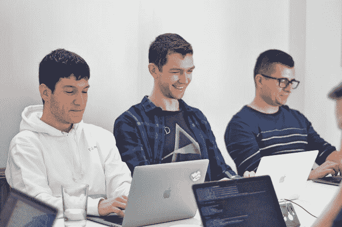
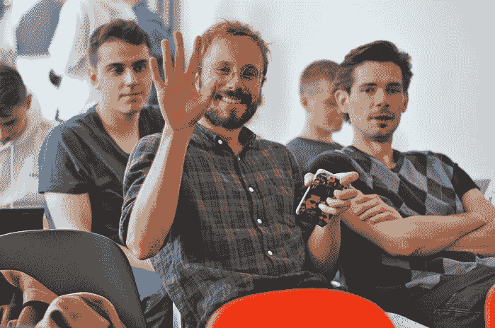

# 网络大师技术讲座——我们的首次内部会议

> 原文：<http://web.archive.org/web/20230307163032/https://www.netguru.com/blog/netguru-tech-talks-our-first-internal-conference>

 在 Netguru，我们最大的资产是人才。日复一日，Netguru 的专业人员忙于向全球各地的公司提供一流的产品。在业余时间，他们周游世界分享他们的经验。资深 UX 设计师 piotr liwa 在四次 UXDX 欧洲会议上发言。Marek Talarczyk，Netguru 的首席运营官，[出席在三藩市举行的 Dreamforce 17 会议](http://web.archive.org/web/20221206184117/https://www.youtube.com/watch?v=AnL-EQw9VpQ)，以及质量保证经理 Bruno Mańczak，刚刚从[伦敦知识产权博览会](http://web.archive.org/web/20221206184117/https://www.ipexpoeurope.com/)回来，他在那里发表了关于“针对可测试性的犯罪”的演讲。我们的目标是为外部社区提供更多。但我们也决定为团队创造一个空间，让他们可以与其他同事分享知识。这就是我们第一次内部会议“网络专家技术讲座”的由来。

## 从想法到执行

The person behind the whole undertaking is Zuzanna Stolińska, Senior Ruby on Rails Developer at Netguru. Not only does she stand out as a great backend developer, but she’s also a proactive team member who engages in after-work initiatives.

我总是喜欢参加像聚会、研讨会和会议这样的知识分享活动，因为它们能激发你学习新东西，结识有趣的人。 *。Zuzanna 承认，他们也倾向于让你脱离常规，拓宽你与工作相关的视野。*

她参加了许多科技活动，随着时间的推移，她开始注意到她参加的每个会议都有一些听起来有些熟悉的内容。

Netguru 总是紧跟最新的趋势，所以我参加的每一个其他活动都是关于在我们的网络研讨会上已经出现过的某些主题。 她补充道。

Zuzanna 第一次认为应该由 Netguru 的员工来做这些演讲。她参与内部会议，领导组织 Rails 开发者会议和初级会议，这只是 Netguru 十几个不同类型的内部会议中的两个。

参加这些会议的人的投入程度令人鼓舞。他说: 我们都想鼓励更多的人以有趣和简单的方式分享他们的知识。

这是一个转折点，我们决定在更大的范围内而不是在小范围内分享我们的知识。Zuzanna 开始为内部会议的想法工作，并让团队准备活动。怎么样了？

This was the turning point when we decided to share our knowledge on a bigger scale rather than in small groups. Zuzanna started working on the idea for an internal conference and engaged the team to prepare the event. How did it go?

为活动做准备

## 大会筹备工作于 2018 年初开始。在技术和雇主品牌团队的支持下，Zuzanna 同时成为项目所有者和经理。网络大师技术讲座对组织者来说是一个巨大的挑战。首先，鼓励我们的团队成员报名成为演讲者并不容易。

Netguru 的员工全神贯注于日常事务和任务，以至于他们没有意识到他们的知识对其他同事是多么有价值。Netguru 的雇主品牌专家乔安娜·安特科维克总结说，这不仅仅是他们的技术专长，还包括软技能和领导经验。

另一个挑战是同步参与组织活动的人员的日历。网络大师技术讲座是一个附带项目。帮助准备的开发人员同时在从事商业项目，雇主品牌团队也参与了其他活动。在日历中找到一个适合每个人的时间段并不容易。

Another challenge was to synchronize the calendars of people engaged in organizing the event. Netguru Tech Talks is a side project. Developers who helped in preparation were working on commercial projects at the same time, and the Employer Branding team was involved in other activities as well. Finding one slot in the calendar that would be suitable for everyone wasn’t easy.

最后，组织者有点担心活动期间的出席情况。由于《NTT》的第一版是在一个深夜结束的工作活动的第二天，我们以为很多人不会出现。

我们知道我们选择的日期是有风险的。幸运的是，出席人数很多。人们没有让我们失望，大多数与会者按时到达了 Netguru 总部， 乔安娜补充道。

一天，4 场研讨会，10 场演讲

## 所有的努力都得到了回报，我们的会议得到了非常积极的反应。我们的演讲者和研讨会负责人在此次活动中设定了非常高的标准。我们从参与者那里获得了很大的反馈。

**

一个周六的早上，80 多名与会者聚集在 Netguru 总部，聆听 Netguru 技术&产品设计负责人 Mateusz Czajka 的开幕主题演讲，他强调了我们作为一家蓬勃发展的公司所面临的挑战。接下来是服务交付经理 Krzysztof Przybylski，他从我们的日常工作中举出例子来解释软件工艺的意义。

 接下来的演讲让我们对机器学习、端到端测试、 [Node.js](/web/20221206184117/https://www.netguru.com/services/node-js-development) 、创建开源库以及一些不太技术性的话题有了深入的了解，比如领导力、冒名顶替综合症以及成为一名负责任的开发者。所有的演讲者都自发地引用其他的演讲，将所有的演讲整合成一个连贯的作品。

这次活动也是我们的专家分享个人项目见解的好主意。拥有 10 多年产品设计经验的 Netguru 高级产品设计经理 bartek biaek 展示了他构建数字游戏的旅程，[【Cotrio](http://web.archive.org/web/20221206184117/http://cotriogame.com/)，这款游戏由苹果公司在全球推出，并成为 AppStore 上的热门游戏。

我想我最喜欢的是 Bartek biaek 的演讲。这真的很有趣，我对 Bartek 在开发和推广他的游戏期间的工作方法印象深刻-【Wojtek buěko，Netguru 的 Ruby on Rails 开发者。

除了演讲，我们还组织了四次高强度的研讨会，让参与者获得硬技能并在实践中进行测试。这是一个很好的机会，让你在一个不同的领域获得一些经验，而不是人们所能胜任的领域。例如，我们的开发人员可以学习机器学习的基础知识，或者发现关于 [DevOps](/web/20221206184117/https://www.netguru.com/services/cloud-application-development) 的细节。

*我爱这个发布会！内部交流知识和进行更多跨部门分享的绝佳机会。Netguru 的项目经理 Aleksandra Pyta 说，这也是演讲者练习公开演讲技巧并为他们的下一次会议* 做准备的好机会，他为开发人员举办了一个关于 Scrum 的研讨会。

下一次网络大师技术讲座

第一届 Netguru 技术讲座取得了巨大成功，我们不会就此止步。我们不仅希望促进公司不同部门之间的知识共享，还希望激励我们的员工走出去，向更多的观众展示他们的演讲。他们中的许多人已经在这么做了！

## 随着我们公司的成长，Netguru Tech Talks 自然会与我们一起成长——为其组织者和演讲者设立更高的标准和更多的挑战。我们将努力使它有一天成为一个开放的会议，这样我们就可以推广我们的价值观，激励他人，并与更多的观众分享我们的知识。我迫不及待地想开始工作了！， 祖赞娜总结道。

我们才刚刚开始！

*As we grow as a company, Netguru Tech Talks will naturally grow with us - setting up higher standards and more challenges for its organisers and speakers. We’ll work towards making it an open conference one day, so we can promote our values, inspire others, and share our knowledge with bigger audiences. I can’t wait to start working on that!,* Zuzanna summarizes.

We’re just getting started!