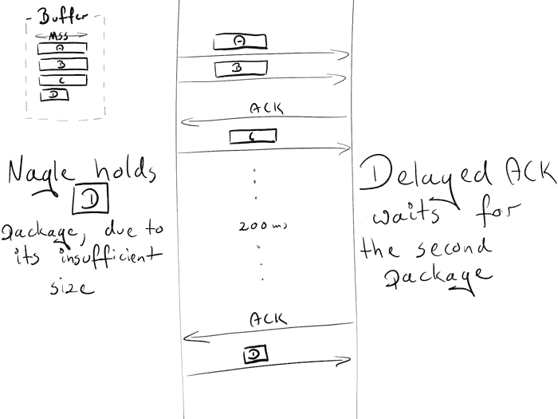

# Nginx 教程#2:性能

> 原文：<http://web.archive.org/web/20230307163032/https://www.netguru.com/blog/nginx-tutorial-performance>

 你好！分享是关怀，所以我们很乐意与你分享另一个知识。我们准备了一个三部分的 Nginx 教程。如果你已经对 Nginx 有所了解，或者你只是想扩展你的经验和理解——这是你的最佳选择！

我们将告诉你 Nginx 是如何工作的，谈论它背后的概念，你如何优化它来提高你的应用程序的性能，以及如何设置它来启动和运行它。

本教程将包含三个部分:

*   **[基础概念](/web/20221209135007/https://www.netguru.com/blog/nginx-tutorial-basics-concepts) :** 了解指令和上下文的区别，继承模型，以及 Nginx 挑选服务器块和位置的顺序。
*   **[性能](/web/20221209135007/https://www.netguru.com/blog/nginx-tutorial-performance) :** 提高速度的小窍门。我们将讨论 gzip、缓存、缓冲区和超时。
*   **[SSL 设置](/web/20221209135007/https://www.netguru.com/blog/nginx-tutorial-ssl-setup) :** 设置通过 HTTPS 提供内容的配置。

我们的目标是创建一个系列，在其中你可以很容易地找到特定主题的适当配置(比如 gzip、SSL 等)。)，或者干脆通读一遍。为了获得最佳的学习体验，我们建议你在自己的机器上安装 Nginx 并自己摆弄它。

## `tcp_nodelay`、`tcp_nopush`和`sendfile`

### `tcp_nodelay`

在 TCP 早期，工程师们面临着拥塞崩溃的危险。出现了相当多的解决方案来防止这种情况，其中之一是由 John Nagle 提出的算法。

Nagle 的算法旨在防止被大量小数据包淹没。它不会干扰完整大小的 TCP 数据包(最大分段大小，简称 MSS)，只会干扰小于 MSS 的数据包。只有当接收方成功发送回所有先前数据包的确认(ack)时，才会发送这些数据包。并且在等待期间，发送方可以缓冲更多的数据。

```
if package.size >= MSS.size
  send(package)
elsif acks.all_received?
  send(package)
else
  # accumulate data
end 
```

在此期间，出现了另一个提议:延迟确认。

在 TCP 通信中，我们发送数据并接收确认(ACK ),确认告诉我们这些数据已成功传送。
延迟确认试图解决网络被大量确认包淹没的问题。为了减少这个数量，接收方将等待一些数据被发送回发送方，并在这些数据中包含 ack 包。如果没有要发回的数据，我们必须至少每 2 * MSS 或每 200 到 500 ms 发送一次 ack(以防我们不再收到数据包)。

```
if packages.any?
  send
elsif last_ack_send_more_than_2MSS_ago? || 200_ms_timer.finished?
  send
else
  # wait
end 
```

您可能已经注意到，这可能会导致持久连接上的一些临时死锁。我们来重现一下吧！

假设:

*   初始拥塞窗口等于 2。拥塞窗口是另一种称为慢启动的 TCP 机制的一部分。细节现在并不重要，只要记住它限制了可以同时发送的包裹数量。在第一次往返中，我们被允许发送 2 个 MSS 包；第二，4 个 MSS 包；第三，8 毫秒，等等。
*   4 个等待发送的缓冲包:A、B、C、D
*   a、B、C 是 MSS 包
*   d 是小包装

场景:

*   由于初始拥塞窗口大小，发送方被允许传输两个包:A 和 b。
*   接收器在获得两个包后发送 ACK 。
*   发送方发送 C 包。然而，Nagle 阻止他发送 D(包太小，所以我们需要等待来自 C 的 ACK)
*   在接收方，延迟的 ACK 阻止他发送 ACK(每 2 个包或每 200 ms 发送一次)
*   200ms 后，接收器发送 C 包的 ACK。
*   发送方收到 ACK，发送 D 包。



在交换过程中，由于 Nagle 和延迟确认之间的死锁，引入了 200 毫秒的延迟。

Nagle 算法在当时是一个真正的救星，并且仍然提供[巨大的价值](http://web.archive.org/web/20221209135007/https://news.ycombinator.com/item?id=9048947)。然而，在大多数情况下，我们的网站不需要它，可以通过添加标志`TCP_NODELAY`安全地拒绝它。

```
tcp_nodelay on;     # sets TCP_NODELAY flag, used on keepalive connections 
```

享受你的 200 毫秒增益！

对于一些吹毛求疵的细节，我建议你阅读这篇伟大的论文。

### `sendfile`

通常，当需要发送文件时，需要以下步骤:

*   `malloc(3)`:分配一个本地缓冲区用于存储对象数据
*   `read(2)`:获取对象并复制到本地缓冲区
*   `write(2)`:将对象从本地缓冲区复制到套接字缓冲区

This involves two context switches (read, write) which make a second copy of the same object unnecessary. As you may see, it is not the optimal way. Thankfully, there is another system call that improves sending files, and it's called (surprise, surprise!): `sendfile(2)`. This call retrieves an object to the file cache, and passes the pointers (without copying the whole object) straight to the socket descriptor. Netflix states that using `sendfile(2)` increased the network throughput [from 6Gbps to 30Gbps](http://web.archive.org/web/20221209135007/https://people.freebsd.org/~rrs/asiabsd_2015_tls.pdf).

However, `sendfile(2)` has some drawbacks:

*   不适用于 UNIX 套接字(例如，当通过上游服务器提供静态文件时)
*   根据操作系统的不同，性能会有所不同(此处有更多)

要在 nginx 中实现这一点，请键入:

```
sendfile on;
```

### `tcp_nopush`

`tcp_nopush`与`tcp_nodelay`相对。它的目标不是尽可能快地推送包裹，而是优化同时发送的数据量。
在将包发送到客户端之前，它会强制包等待，直到达到其最大大小(MSS)。该指令仅在`sendfile`开启时有效。

```
sendfile on;
tcp_nopush on;
```

It may appear that `tcp_nopush` and `tcp_nodelay` are mutually exclusive. But if all 3 directives are turned on, nginx will:
* ensure packages are full before sending them to the client
* for the last packet, `tcp_nopush` will be removed, allowing TCP to send it immediately, without the 200ms delay

## 我应该有几道工序？

### 工作进程

`worker_process`指令定义了应该运行多少工人。默认情况下，该值设置为 1。最安全的设置是通过 `auto` 使用核心数。

But still, due to Nginx's architecture, which handles requests blazingly fast, we probably won’t use more than 2-4 processes at a time (unless you are hosting Facebook, or doing some CPU-intensive stuff inside nginx).

```
worker_process auto; 
```

### 工人连接

这个指令与`worker_process`直接相关的是`worker_connections`。它指定了一个工作进程可以同时打开多少个连接。这个数字包括所有连接(例如，与代理服务器的连接)，而不仅仅是与客户端的连接。此外，值得记住的是，一个客户端可以打开多个连接来同时获取其他资源。

```
worker_connections 1024; 
```

### 打开文件限制

在基于 Unix 的系统中，“一切都是文件”。这意味着文档、目录、管道甚至套接字都是文件。系统对一个进程可以同时打开多少个文件有限制。要检查限值:

```
ulimit -Sn      # soft limit
ulimit -Sn      # hard limit 
```

该系统限制必须根据`worker_connections`进行调整。任何传入的连接都会打开至少一个文件(通常是双连接套接字和后端连接套接字或磁盘上的静态文件)。所以这个值等于`worker_connections` * 2 是安全的。幸运的是，Nginx 提供了在 nginx 配置中增加这个系统值的选项。为此，添加带有适当数字的`worker_rlimit_nofile`指令，并重新加载 nginx。

```
worker_rlimit_nofile 2048; 
```

### 配置

```
worker_process auto;
worker_rlimit_nofile 2048; # Changes the limit on the maximum number of open files (RLIMIT_NOFILE) for worker processes.
worker_connections 1024;   # Sets the maximum number of simultaneous connections that can be opened by a worker process. 
```

### 最大连接数

给定上述参数，我们可以计算我们可以同时处理多少个并发连接:

```
max no of connections =

    worker_processes * worker_connections
----------------------------------------------
 (keep_alive_timeout + avg_response_time) * 2 
```

`keep_alive_timeout`(稍后将详细介绍)+ `avg_response_time`告诉我们一个连接打开了多长时间。我们还将它除以 2，因为通常一个客户端会打开 2 个连接:一个在 nginx 和客户端之间，另一个在 nginx 和上游服务器之间。

## Gzip

启用`gzip`将显著降低您的响应权重，因此它将更快地出现在客户端。

### 压缩级别

Gzip 有不同的压缩级别:从 1 到 9。增加此级别将减小文件的大小，但也会增加资源消耗。作为标准，我们将这个数字保持在 3 到 5 之间，因为增加这个数字只会带来很小的收益，但会显著增加 CPU 的使用。

下面是一个用不同级别的 gzip 压缩文件的例子。0 代表未压缩的文件。

```
curl -I -H 'Accept-Encoding: gzip,deflate' https://www.netguru.com/ 
```

```
❯ du -sh ./*
 64K    ./0_gzip
 16K    ./1_gzip
 12K    ./2_gzip
 12K    ./3_gzip
 12K    ./4_gzip
 12K    ./5_gzip
 12K    ./6_gzip
 12K    ./7_gzip
 12K    ./8_gzip
 12K    ./9_gzip

❯ ls -al
-rw-r--r--   1 matDobek  staff  61711  3 Nov 08:46 0_gzip
-rw-r--r--   1 matDobek  staff  12331  3 Nov 08:48 1_gzip
-rw-r--r--   1 matDobek  staff  12123  3 Nov 08:48 2_gzip
-rw-r--r--   1 matDobek  staff  12003  3 Nov 08:48 3_gzip
-rw-r--r--   1 matDobek  staff  11264  3 Nov 08:49 4_gzip
-rw-r--r--   1 matDobek  staff  11111  3 Nov 08:50 5_gzip
-rw-r--r--   1 matDobek  staff  11097  3 Nov 08:50 6_gzip
-rw-r--r--   1 matDobek  staff  11080  3 Nov 08:50 7_gzip
-rw-r--r--   1 matDobek  staff  11071  3 Nov 08:51 8_gzip
-rw-r--r--   1 matDobek  staff  11005  3 Nov 08:51 9_gzip 
```

### `gzip_http_version 1.1;`

这个指令告诉 nginx 仅对 HTTP 1.1 及以上版本使用 gzip。我们这里不包括 HTTP 1.0，因为对于 1.0 版本，不可能同时使用 keepalive 和 gzip。你需要决定你更喜欢哪一个:HTTP 1.0 客户端错过了 gzip 或者 HTTP 1.0 客户端错过了 keepalive。

### 配置

```
gzip on;               # enable gzip
gzip_http_version 1.1; # turn on gzip for http 1.1 and higher
gzip_disable "msie6";  # IE 6 had issues with gzip
gzip_comp_level 5;     # inc compresion level, and CPU usage
gzip_min_length 100;   # minimal weight to gzip file
gzip_proxied any;      # enable gzip for proxied requests (e.g. CDN)
gzip_buffers 16 8k;    # compression buffers (if we exceed this value, disk will be used instead of RAM)
gzip_vary on;          # add header Vary Accept-Encoding (more on that in Caching section)

# define files which should be compressed
gzip_types text/plain;
gzip_types text/css;
gzip_types application/javascript;
gzip_types application/json;
gzip_types application/vnd.ms-fontobject;
gzip_types application/x-font-ttf;
gzip_types font/opentype;
gzip_types image/svg+xml;
gzip_types image/x-icon; 
```

## 贮藏

缓存是另一个可以很好地为返回用户加速请求的东西。

管理缓存可以通过两个标题来控制:

*   `Cache-Control`用于管理 HTTP/1.1 中的缓存
*   `Pragma`为了向后兼容 HTTP/1.0 客户端

缓存可以分为两类:公共缓存和私有缓存。公共缓存存储响应以供多个用户重用。一个专用缓存供一个用户使用。我们可以很容易地定义应该使用哪个缓存:

```
add_header Cache-Control public;
add_header Pragma public; 
```

对于标准资产，我们也希望保留一个月:

```
location ~* \.(jpg|jpeg|png|gif|ico|css|js)$ {
  expires 1M;
  add_header Cache-Control public;
  add_header Pragma public;
} 
```

上面的配置似乎已经足够了。但是，使用公共缓存时有一个注意事项。

让我们看看，如果我们将资产存储在公共缓存(例如 CDN)中，并将 URI 作为唯一的标识符，会发生什么。在这个场景中，我们还假设 gzip 是打开的。

我们有两种浏览器:

*   旧的，不支持 gzip
*   一个新的，支持 gzip

旧浏览器向我们的 CDN 发送一个`netguru.com/style.css`请求。由于 CDN 还没有这个资源，它将向我们的服务器查询并返回未压缩的响应。CDN 将文件存储在哈希中(供以后使用):

```
{
  ...
  netguru.com/styles.css => FILE("/sites/netguru/style.css")
  ...
} 
```

最后，文件将被返回给客户端。

现在，新的浏览器向 CDN 发送相同的请求，请求`netguru.com/style.css`，期望一个 gzipped 资源。由于 CDN 仅通过 URI 识别资源，它将为新浏览器返回相同的未压缩资源。新的浏览器将试图提取一个非 gzip 文件，并将得到垃圾。

如果我们可以告诉公共缓存根据 URI 和编码来识别资源，我们就可以避免这个问题。

```
{
  ...
  (netguru.com/styles.css, gzip) => FILE("/sites/netguru/style.css.gzip")
  (netguru.com/styles.css, text/css) => FILE("/sites/netguru/style.css")
  ...
}
`` 
```

而这正是`Vary Accept-Encoding;`所做的。它告诉一个公共缓存，一个资源可以通过一个 URI 和一个`Accept-Encoding`头来区分。

因此，我们的最终配置如下所示:

```
location ~* \.(jpg|jpeg|png|gif|ico|css|js)$ {
  expires 1M;
  add_header Cache-Control public;
  add_header Pragma public;
  add_header Vary Accept-Encoding;
} 
```

## 超时设定

`client_body_timeout`和`client_header_timeout`定义了 nginx 在抛出 408(请求超时)错误之前等待客户端发送主体或报头的时间。

`send_timeout`设置向客户端发送响应的超时时间。仅在两个连续的写操作之间设置超时，而不是针对整个响应的传输。如果客户端在这段时间内没有收到任何东西，连接就会关闭。

设置这些值时要小心，因为太长的等待时间会使您容易受到攻击者的攻击，而太短的时间会切断慢速客户端。

```
# Configure timeouts
client_body_timeout   12;
client_header_timeout 12;
send_timeout          10; 
```

## 缓冲

### `client_body_buffer_size`

设置读取客户端请求正文的缓冲区大小。如果请求体大于缓冲区，则整个请求体或仅其一部分被写入临时文件。对于`client_body_buffer_size`，在 大多数情况下设置 16k 就足够了。

这是另一个可以产生巨大影响的场景，但是必须小心使用。放得太少，nginx 会不断使用 I/O 将剩余部分写入文件。如果放得太多，当攻击者可以打开所有连接，但您无法在系统上分配一个缓冲区来处理这些连接时，您将很容易受到 DOS 攻击。

### `client_header_buffer_size`和`large_client_header_buffers`

如果标题不适合`client_header_buffer_size`，那么将使用`large_client_header_buffers`。如果请求也不适合该缓冲区，则向客户端返回一个错误。对于大多数请求，1K 字节的缓冲区就足够了。但是，如果一个请求包含长 cookies，它可能不适合 1K。

如果超出了请求行的大小，则向客户端返回 414(请求-URI 太大)错误。如果超出了请求头的大小，就会抛出 400(错误请求)错误。

### `client_max_body_size`

设置客户端请求正文的最大允许大小，在“内容长度”请求头字段中指定。根据您是否希望允许用户上传文件，根据您的需要调整此配置。

### 配置

```
client_body_buffer_size       16K;
client_header_buffer_size     1k;
large_client_header_buffers   2 1k;
client_max_body_size          8m; 
```

## 保持活力

HTTP 所基于的 TCP 协议需要执行三次握手来启动连接。这意味着在服务器向您发送数据(例如图像)之前，需要在客户端和服务器之间进行三次完整的往返。
假设您从华沙请求`/image.jpg`，并连接到柏林最近的服务器:

```
Open connection

TCP Handshake:
Warsaw  ->------------------ synchronise packet (SYN) ----------------->- Berlin
Warsaw  -<--------- synchronise-acknowledgement packet (SYN-ACK) ------<- Berlin
Warsaw  ->------------------- acknowledgement (ACK) ------------------->- Berlin

Data transfer:
Warsaw  ->---------------------- /image.jpg --------------------------->- Berlin
Warsaw  -<--------------------- (image data) --------------------------<- Berlin

Close connection 
```

对于另一个请求，您将不得不再次执行整个初始化。如果您在短时间内发送多个请求，这可能会增加很快。这就是 keepalive 派上用场的地方。在成功的响应之后，它保持连接空闲一段给定的时间(例如 10 秒)。如果在此期间发出另一个请求，将重用现有的连接并刷新空闲时间。

Nginx 提供了一些指令，可以用来调整 keepalive 设置。这些可以分为两类:

*   客户端和 nginx 之间保持活动状态

```
keepalive_disable msie6;        # disable selected browsers.

# The number of requests a client can make over a single keepalive connection. The default is 100, but a much higher value can be especially useful for testing with a load‑generation tool, which generally sends a large number of requests from a single client.
keepalive_requests 100000;

# How long an idle keepalive connection remains open.
keepalive_timeout 60; 
```

*   nginx 和上游之间保持活动

```
upstream backend {
    # The number of idle keepalive connections to an upstream server that remain open for each worker process
    keepalive 16;
}

server {
  location /http/ {
    proxy_pass http://http_backend;
    proxy_http_version 1.1;
    proxy_set_header Connection "";
  }
} 
```

仅此而已。

## 结束语

感谢您的阅读。如果没有在互联网深处找到的大量资源，这个系列是不可能的。在撰写本系列文章时，我们发现以下几个网站非常有用:

* * *

我们非常乐意看到一些反馈或讨论，所以请随时留下评论或以任何其他方式联系我们！你喜欢这个教程吗？关于我们下一步应该讨论什么主题，你有什么建议吗？或者你发现了一个漏洞？让我们知道，下次再见！