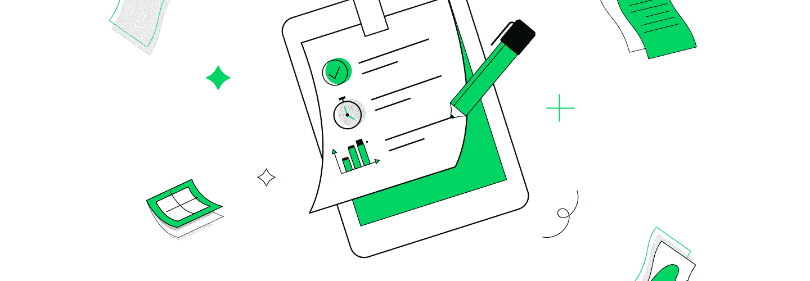
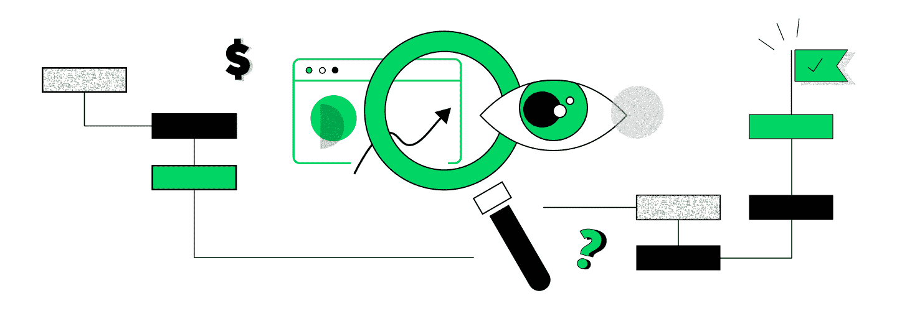
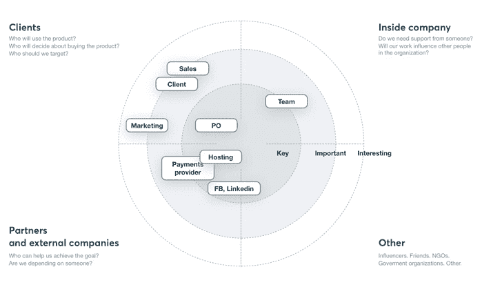
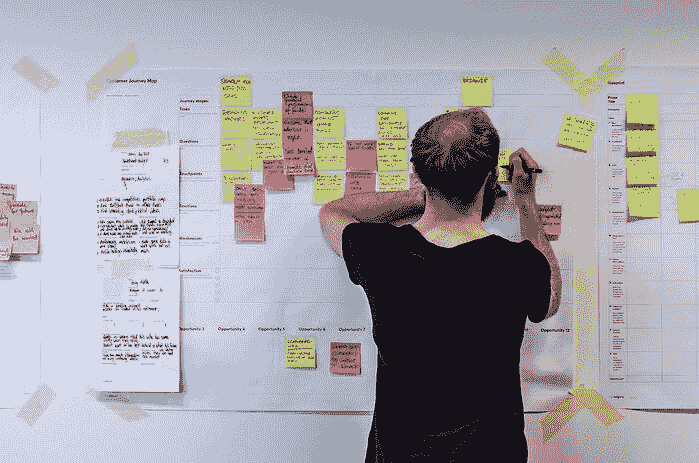
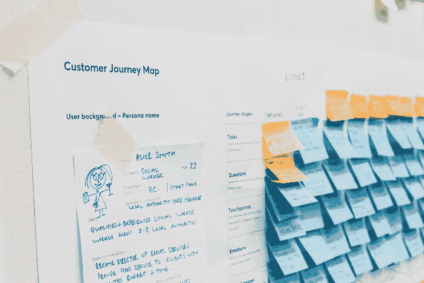
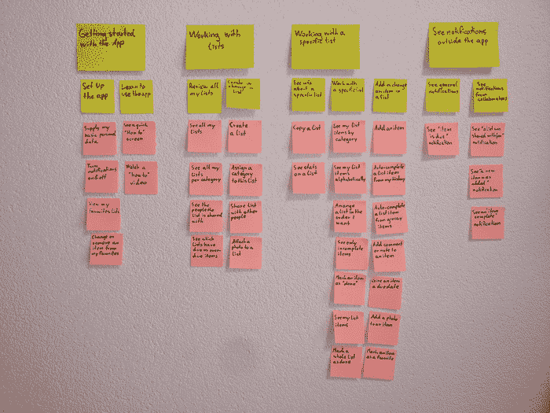
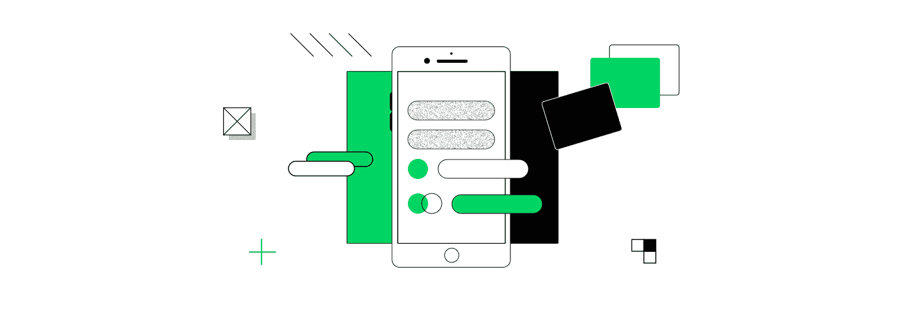
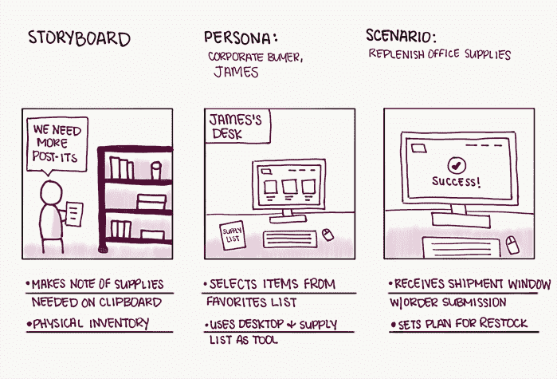
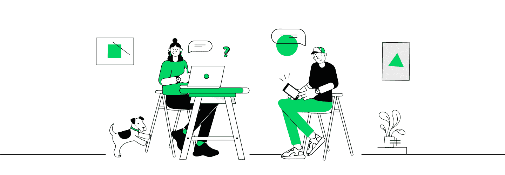
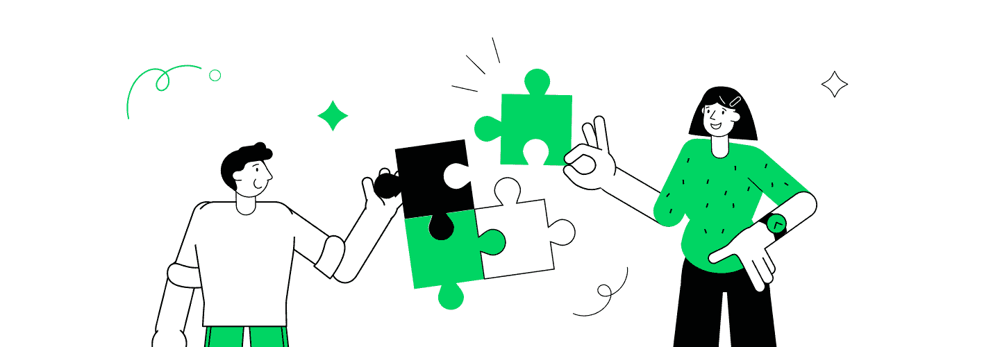

# 产品设计冲刺过程、方法、工具和模板:运行设计冲刺的完整指南

> 原文：<http://web.archive.org/web/20230307163032/https://www.netguru.com/blog/product-design-sprint-methods-tools-templates>

 技术正以极快的速度发展，竞争一如既往地激烈，客户需要更好的体验来确保他们的忠诚度。

公司知道他们需要变得更加敏捷，并与他们的市场保持一致才能领先，但是成功的组织是如何做到这一点的呢？对许多人来说，答案是产品设计冲刺。

## 什么是产品设计冲刺？

简而言之，产品设计冲刺是一个研讨会，允许企业减少与将新产品或新功能推向市场相关的风险，并在很短的时间内回答复杂的业务问题。

基于 [谷歌设计 sprint 方法论](http://web.archive.org/web/20221007144553/https://designsprintkit.withgoogle.com/) ，Sprint 的目标是通过一个通常持续五天的研讨会来完成的，**涵盖构思、设计、原型和测试——所有这些都以用户为中心**。谷歌的 sprint 方法是解决这一问题的众多方法之一，但任何可靠的 sprint 商业计划都将包括制定时间和方法。

### 一个产品冲刺多长时间？

这种方法允许设计冲刺将几个月的工作浓缩到一周内，并最大限度地降低失败的风险，只占用原本会使用的资源的一小部分。

## **进行产品设计冲刺的好处**

进行产品设计冲刺可以给你的企业带来很多好处:

**简单的解决方法。**产品设计冲刺的协作性和高度集中性意味着会产生和评估一系列想法。其中一些可能会创造令人兴奋的机会，这是以前没有想到的。PDS 是简化复杂问题的有效方法。

*   **速度。**设计冲刺旨在缩短时间，提高灵活性，突破大型组织中常见的官僚作风和缓慢流程。[敏捷的冲刺计划可以带来更快的回报。](/web/20221007144553/https://www.netguru.com/blog/how-to-create-agile-data-science-projects)
*   **降低风险**。设计冲刺让你快速发展想法，但也让你快速失败。在投资开发之前与用户一起测试想法可以显著降低向市场发布不成功的产品或服务的风险。
*   以用户为中心的设计。 产品设计冲刺的关键支柱之一就是要求团队成员在做任何事情的时候都要把用户放在第一位。这包括倾听、培养信任，以及从用户的角度出发 [打造产品。](http://web.archive.org/web/20221007144553/https://www.netguru.com/services/product-design-consulting)
*   **产品设计冲刺的过程**

## 产品设计冲刺通常持续五天，每一天对应于解决给定问题的不同阶段。

话虽如此，经过多年对我们产品设计冲刺方法论的提炼，我们发现 [保持灵活](http://web.archive.org/web/20221007144553/https://www.netguru.com/services/product-design-sprint) 至关重要。当你计划一次冲刺时，你通常会设定一个日程。**做好准备，一旦研讨会开始就放弃它——只有设计冲刺阶段应该保持不变**。sprint 计划会议不应该优先考虑，因为工作展开的方式可能完全不同。

Sprint 产品开发是一个[敏捷开发](/web/20221007144553/https://www.netguru.com/services/minimum-viable-product)的过程，在这个过程中会有很多停顿和改变。但是这种经历通常是值得的。

在整个研讨会中，**您将更深入地了解您的业务需求和想法，并确定和预先验证可行的解决方案**。在接下来的冲刺会议上，团队的设计和开发技能在[打造一个伟大产品的过程中起到了至关重要的作用。](/web/20221007144553/https://www.netguru.com/glossary/digital-product-design)

本文的以下部分涵盖了研讨会每个阶段使用的方法、目标、方法和工具。

**第一阶段:了解**

第一阶段的重点是了解业务问题，并为未来一周制定路线图。从收集对用户需求和业务目标的见解开始，评估你的技术能力。然后，您可以设定您的长期目标，这将有助于在项目向前推进时保持每个人的一致，并建立在冲刺阶段要解决的主要目标。

目标:

这一阶段的目标是找出可用的技能，与产品理念保持一致，并对客户、用户、产品的业务背景和市场有更深入的了解。

### 选定的方法和工具:

**产品愿景。**产品愿景应由团队精心制作和理解，以便在项目进展过程中为项目的各个方面提供方向和焦点。

### **用户角色。**创造代表目标用户的虚构角色。这有助于更好地理解他们的需求、难点和目标。

*   **利益相关者映射。**每个项目的目的都是为了满足关键利益相关者，如客户或合作伙伴。重要的是确定谁对项目的成功有最大的影响，以及他们的期望是什么。展望未来，从这些利益相关者的最佳利益出发行事应该成为你所做的一切的指导。

*   **远程冲刺或亲自工作。**团队的性质对合作计划也很重要。虽然远程设计和协作策略可能会取得成功，但协作方式和每个人的时间可用性将是讨论的重点。
*   **利益相关者地图示例:**

**第二阶段:分流**

第二阶段的目标是产生和探索尽可能多的想法。您可以从回顾现有解决方案的优势和劣势开始，然后继续开发新的见解和解决方案。通过个人分析和集思广益，将会产生许多想法，这些想法随后将被评估和测试。

## 目标:

这个阶段的重点是集思广益，构思功能，并讨论用户流和旅程。

选择的方法和项目工具:

**服务蓝图。**制定服务蓝图通过绘制客户旅程中的用户需求和痛点，以及用户接触点，为您提供有价值的背景。
此外，前台和后台的人员和系统可以重叠，让你可以根据每个想法在企业中的位置和用户的需求来检查每个想法。通过这种方式映射现有的产品或服务，可以做出非常有意识和有目的的设计选择。

### **用户/客户旅程映射**。构建用户旅程图是了解用户目前如何与产品或服务互动，以及他们未来如何与之互动的一个很好的方式。理解用户必须完成的关键任务，就有可能确定哪些功能元素将使完成这些任务成为可能，从而帮助发现产品中的任何弱点。

用户旅程图非常适合全面分析客户体验——

### 通过多种渠道。它们也是发现用户痛点和制定战略决策的很好的研讨会技术。

*   **用户旅程映射示例:**

****第三阶段:收敛****

**[mapping user experience](http://web.archive.org/web/20221007144553/https://www.netguru.com/services/ux-review)

**到目前为止，您应该有很多想法可以利用。第三阶段的目标是作为一个团队确定最佳选项，根据总体目标对它们进行评论，并决定哪一个将被原型化。**

 **目标:

****

在这一阶段，您将专注于构建和概述系统架构。

选择的方法和工具:

**用户故事映射。**使用便利贴，一个屏幕一个屏幕地横向绘制用户旅程，目的是沿着最长的可能路径来识别所有可能的屏幕。垂直地，尝试定义应该包含的特定视图的部分。

## ****

********

**第四阶段:原型**

 **### 第四天，你要开发一个可以和用户一起测试的原型。关键是要在一天之内完成一些事情，所以它需要尽可能的低成本，同时让你得到你需要的答案。

基于你的用户故事，创建一个纸质原型或者使用 Keynote、、Sketch、Figma 或者任何你熟悉的工具。如果你选择纸上原型，试着用 [POP](http://web.archive.org/web/20221007144553/https://marvelapp.com/pop/) 让它变得栩栩如生。

### 开始之前，团队中的每个人都应该清楚他们的角色是什么。通常，**设计师会构建原型，除非它是如此的低 fi，以至于每个人都可以贡献出**——例如，在一篇论文或 Keynote 原型中。

*   产品负责人在冲刺阶段做什么？

产品负责人通常负责向原型加载真实的信息、数据和副本。他们在 scrum sprint 计划中扮演领导角色，支持团队协作并确保最终产品的一致性。

********

有很多 scrum 工具可以综合这个过程。例如，周一应用程序可以帮助跟踪时间，并根据 scrum 模型的原则组织团队。也可以考虑使用 Hive、吉拉或其他工具来保持 sprint 跟踪的顺畅。

## 目标:

在这个阶段结束时，你应该有一个工作原型，这将使你能够形象化产品的想法。

选择的方法和工具:

**故事板**。规划整个产品的用户之旅不仅在将你的概念从草图变成可测试的原型的过程中起着关键的作用，而且对于让每个人都同意原型应该包括什么也很重要。

**纸上原型。低保真度原型可以让你快速、廉价地将你的想法形象化。**

**数字原型。**使用 Sketch 或 Invision 等工具构建交互原型，您可以快速轻松地测试更真实的交互。

### **故事板示例:**

 ****第五阶段:测试**

在最后阶段，你将与真实用户、技术专家和商业利益相关者一起测试你的原型。

### 在这个“关键时刻”，正如 GV(前谷歌风投)所描述的，你将收到来自用户的直接反馈，这将允许你在投资设计和开发产品之前验证你的想法。发展良好的设计思维将有助于一个不断完善想法和愿景的过程。

*   目标:

*   在这个阶段，目标是通过与用户一起测试原型来验证你的想法。
*   选择的方法和工具:

真实用户的精益测试。 [根据你第一天确定的目标用户角色，招募五个左右的真实用户](http://web.archive.org/web/20221007144553/https://www.nngroup.com/articles/why-you-only-need-to-test-with-5-users/) 。记录会议，以便 sprint 团队可以获得即时反馈。基于一组你要求用户执行的问题或任务来测试你的原型，并观察他们如何与产品交互，以识别任何人机工程问题或痛点。

在这个阶段，产品并不完美，但是以这种方式进行测试将有助于您确定大部分需要进一步改进的地方，并收集关于产品可用性、有用性和可取性的有价值的信息。

****

结果

## 一旦冲刺结束，客户将会对他们的用户的问题有更好的理解，并有很多解决问题的想法。

在 Netguru，我们给每个客户留下一份关于研讨会的详细报告**，包括所有材料和画布的数字化版本**，以及一些用户故事的功能性低保真原型。

我们还会就客户应该将产品推向哪个方向提出建议。

如果客户随后继续与我们一起构建他们的产品，我们会提供一个全面的项目路线图，该路线图将项目分成几个阶段，以及每个阶段的预定义任务，以便开发人员可以开始工作。

**将所有东西放在一起**

产品设计 Sprint 是一个非常强大的工具，可以提高组织的敏捷性，同时为复杂的业务问题找到简单的解决方案。一个敏捷的 sprint 可以迅速给客户带来创造性的解决方案。

### 设计冲刺成功的关键在于**在早期阶段将利益相关者的期望与冲刺的目标一致**，并且在整个过程中不要忽略这些。采用以用户为中心的协作方法至关重要，选择正确的管理工具和方法来充分利用每一天也是如此。

*   设计冲刺可以面对面完成，也可以远程完成。最佳实践将取决于您的团队的性质以及什么样的实践最适合。如果在偏远的地方，保持联系并留出时间进行合作对话可以让每个人顺利地一起工作。

经过多年使用我们的产品设计冲刺方法的经验，我们已经看到，当成功执行时，设计冲刺可以让公司降低新产品或现有产品开发的失败风险，并将几个月的工作浓缩到几天内。

## Outcomes

Once the sprint is over, the client will have a much better understanding of their users’ problems, plus a host of ideas on how to solve them.

At Netguru, we leave every client with a **detailed report on the workshop, including digitized versions of all materials and canvases**, and a functional lo-fi prototype of some of the user stories.

We also make suggestions as to which direction the client should take the product in.

If a client then proceeds to build their product with us, we provide a comprehensive project roadmap, which breaks down the project into phases, along with predefined tasks for each phase, so that developers can get to work.

## **Bringing everything together**

Product Design Sprint is a hugely powerful tool for increasing your organization’s agility while finding simple solutions to complex business questions. An agile sprint can bring creative solutions to customers quickly.

The key to success in design sprints lies in **aligning stakeholder expectations with the goals of the sprint at an early stage**, and not losing sight of these throughout the process. Adopting a collaborative, user-centered approach is crucial, as is selecting the right management tools and methods to get the most out of each day.

Design sprints can be done face-to-face or [remotely](http://web.archive.org/web/20221007144553/https://www.netguru.com/blog/remote-product-design-sprint-for-good). The best practice will depend on the nature of your team and what practices will be a best fit. If it’s remote, staying connected and setting aside time for collaborative conversations can keep everyone working together smoothly.

After many years of experience working with our Product Design Sprint methodology, we have seen that when carried out successfully, design sprints allow companies to reduce the risk of failure in a new or existing product development, and to condense months’ worth of work into just a few days.********