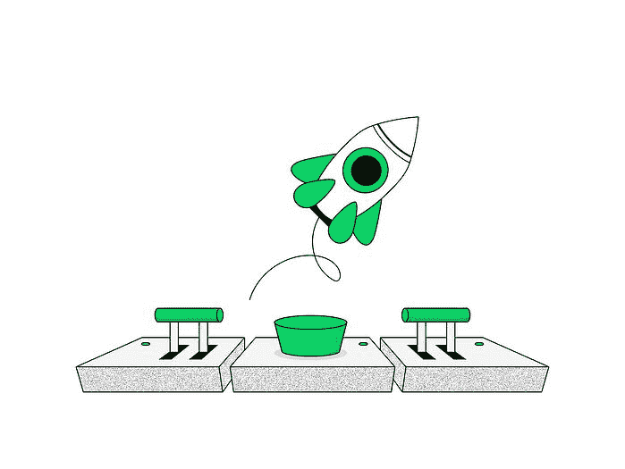

# 2022 年将遵循的 7 大产品设计趋势

> 原文：<http://web.archive.org/web/20230307163032/https://www.netguru.com/blog/product-design-trends>

 恭喜你，你刚刚度过了又一个大起大落的一年！为 2022 年做好准备，这一年的产品设计趋势将回应仍在形成的“新常态”熟悉 MXDPs，NFT，RPA，对甜品有点留恋。

在又一个动荡的一年后，物理世界与其数字世界达成了更深层次的融合。我们已经成为智能设备的最好朋友，调整我们的家庭办公室以进行高效的远程工作，并目睹企业将他们的活动从纸张转移到数据字节。

软件业从不休息，但近年来加速了这一领域的发展，扩大了数字技术的使用，这种技术以前只为专注于技术的企业和个人保留。

我们比以往任何时候都更信任我们的机器，这影响了我们在日常生活中体验它们的方式。让我们看看多体验平台、对话式界面、甚至更智能的算法和其他新兴现象如何成为 2022 年产品设计的顶级趋势。

## 自动化加速

“如果一个过程可以自动化，它就应该自动化，”—在 2022 年的产品设计趋势中，这个概念将变得如此真实。在过去的几年里，自动化已经获得了很大的发展，随着新冠肺炎疫情的出现，发展速度甚至更快。随着企业和组织遇到“新常态”的挑战，他们一直在增加自动化方面的支出，并将在 2022 年继续这样做。

RPAs(机器人过程自动化)和“智能自动化”在 2021 年引领自动化系统设计。RPA 的主要目标是将一个人从耗费宝贵时间和精力的单调重复的工作中解脱出来。

与此同时，智能自动化代表着创建能够执行越来越复杂任务的算法，例如批准贷款申请或扫描发票。

另一个涉及自动化系统设计的激动人心的产品设计趋势是基于任务的方法取代了基于工具的方法。实际上，这意味着多个业务应用程序的用户将会收到一个由自动化算法交付的任务精选提要。结果？更好的关注、更高的生产力和简化的工作流程。

## 对话式体验设计

社会隔离和封闭显示了我们真正花了多少时间与机器交流。科技巨头们通过在他们的产品中普及对话体验方法，提高了人机交流的门槛，使交互尽可能像人一样。

对话式 UX 设计是基于通过聊天或语音控制的语言交互，最后一个抢尽风头，因为它最容易为最大的用户群操作。

随着科技巨头推出他们的语音助手，语音界面接管了我们的日常生活，你可以听到“Alexa”、“嘿，Siri”和“好的，谷歌”，到处都是——导航、购物、预订、研究。

这种产品设计趋势的下一步是从个人设备转向其他产品，如家用电器、汽车和医疗设备。如果没有人工智能( [AI](/web/20221209130528/https://www.netguru.com/blog/artificial-intelligence-ux-design) )不断发展的能力，这样的扩展是不可能的，人工智能是每个对话体验设计的不可或缺的元素。

## 运动设计和动画

2021 年 8 月，脸书宣布他们将公司名称改为 Meta，并引入了元宇宙的概念，这是一个被扎克伯格描述为“具体化互联网”的虚拟现实网络

你可以说，元宇宙将再次让企业重点关注虚拟现实和增强现实，但这还不是全部。随着数十亿美元被投入到创造一个全新的 3D 世界中，动画和动作设计的发展势不可挡。

元宇宙可能是一个巨大的虚拟现实努力，但越来越多的产品设计趋势将运动设计和动画结合起来，这将创造一个在不同平台和复杂程度上使用它的机会。

巧妙使用，动作设计和动画创造了一个视觉节奏，吸引并保持观众或用户的注意力。由于动画比静态图像产生更强的冲击力，它可以增强故事讲述，塑造品牌个性和体验。

对于科技行业来说，这是设计师学习动作设计原理和工具的最佳时机。在数字软件设计和开发中，导航、菜单或交互中的少量动画会带来愉悦的瞬间，让产品流行起来。

## 包容性设计及其他

在一个理想的世界里，包容性不会是一种设计趋势，而是设计过程中的必备要素。由于我们并不生活在理想的世界中，你甚至可能会问——什么是包容性设计？与无障碍设计有何不同？让我们给予它应有的关注。

易访问性侧重于使产品或服务对尽可能多的用户可用，克服他们的缺陷或残疾。但是这并不是好的产品设计应该包含的全部内容。

包容性设计承认人类在种族、民族血统、年龄、性别、语言和社会文化背景等方面的多样性。这样的例子不胜枚举。产品设计中的包容性避免了特权社会群体做出的陈规定型的假设，并向那些以前被忽视的人，特别是少数民族开放叙事。

举一些包容性设计的例子，看看越来越多的表情符号已经接管了我们的聊天、休闲信息和电子邮件。多年来，我们已经获得了肤色、性别身份、年龄组和关系模型的选择。

由于我们正在探索新的虚拟世界，并严重依赖数字通信，企业将在 2022 年对包容性设计进行更多投资。我们如何创建不仅可访问，而且包容的虚拟环境？没有一本现成的原则手册，这使得包容性设计成为一个更加困难的挑战，但随着新的例子和最佳实践的出现，设计包容性应该赢得其作为行业标准的地位。

## NFT:作为数字所有权的不可替代令牌

在产品设计趋势中，另一个值得一提的是 NFTs(不可替代的代币)，它在去年成为新闻，这要归功于 [Nyan Cat](http://web.archive.org/web/20221209130528/https://www.theverge.com/2021/2/18/22287956/nyan-cat-crypto-art-foundation-nft-sale-chris-torres) 作为独一无二的数字商品出售，以及 Grimes 在 Nifty Gateway 上赚了数百万。

不可替代令牌是一种基于区块链的数字对象(数据片段),用于传递虚拟或物理商品的所有权。NFT 是不可替代的，是独一无二的，这使得它不同于普通的加密货币，并为重塑所有权的商业模式创造了机会。

艺术家可以在 NFT 上附加条款和条件，确保他们在每次转售中获得一部分收益，这意味着如果他们的作品升值，他们将从中受益。当客户在 NFT 平台上借用或购买艺术品时，他们可以在屏幕上显示，因为他们知道不存在版权或原创性问题。

由 NFT 和区块链保证，这两种技术都保证了所有权的真实性。目前，Adobe 正在开发一项新功能，允许用户直接从 Photoshop 中将他们的作品保存为 [NFTs](http://web.archive.org/web/20221209130528/https://wersm.com/tag/nfts/) 。

在这些领域之外，NFTs 的潜力更大，因为它完全改变了所有权的规则。它减少了信任中介的必要性，并用一个可靠的交易平台取代了它们。这对许多企业来说可能是一个开端，但对今天的消费者来说也是一个巨大的福利。

NFT 产品设计的挑战集中在建立买卖双方的信任和可信度，确保交易过程的安全性和清晰性。你能想到比数字艺术和金融科技世界的交叉更好的 UX 设计挑战吗？

## MXDP:多体验开发平台

尽管多体验开发平台(MXDPs)专用于前端和后端开发人员，但它们绝对是 2022 年产品设计趋势清单上的必备产品，是数字化转型的关键驱动因素之一。

过去两年迫使世界大量转向软件解决方案，这导致新的数字接触点无处不在。使用 MXDP 有助于企业跟上这一趋势，并响应客户的需求和期望。

MXDPs 使开发人员能够创建适用的软件，这些软件使用不同的模态(触摸、语音、手势)和触摸点(网络、移动、可穿戴设备、AR/VR、聊天机器人)。对这类应用的需求不断增长，也将影响对能够提供相应 UX 的产品设计师的需求。对话式和沉浸式设计是多平台应用用户体验的标志性元素。

## 设计怀旧

人类大脑在困难时期的运作方式令人着迷——我们渴望一些我们知道的东西，一些会让我们感到安全的东西。难怪 2021 年是视觉怀旧年，这种产品设计的趋势在 2022 年似乎不可阻挡。随着世界慢慢复苏，怀旧设计提醒我们，会有(也将会有)更好的时光。

总的来说，怀旧是一种积极的情绪，一种当某些东西让你想起你的过去时产生的舒缓情绪——一个图像，一个声音，甚至一种气味。似曾相识，但感觉很好。著名排版工作室 Monotype 的菲尔·加南对此做了完美的解释:

“纯粹怀旧的想法并不是真正推动变革的趋势，但它是一种在困难时期寻求熟悉和舒适的世界中表达同情的手段。随着我们乐观地准备转向，重新开放，这种熟悉感将有助于稳定、消除疑虑，并在我们前进的过程中为信任提供基础。”

消费者对熟悉和有形的东西的渴望比以往任何时候都更强烈。在追求与客户更好的联系中，许多品牌挖掘了过去几十年的古怪美学，并将其重新诠释到当前的设计中。明亮的色块、混合着哥特式衬线的霓虹调色板、lo-fi 90 的毛刺效果，已经饱和了当代的数码产品。简而言之——复古是新的黑色。

## 关注产品设计趋势，但不要盲目跟风

2022 年的产品设计趋势描绘了一幅动态环境的图画，它为软件创作者提供了更多的灵活性，鼓励快速采用新概念，并为更多的用户组提供了更好的用户体验。我希望这个简短的排名能让你对学习新概念和尝试新方法感到兴奋！

对于每一个产品设计师来说，有一件重要的事情需要记住——好的设计的关键不是盲目地跟随潮流，而是以一种当代的时尚来封装你的用户的需求和愿望，这就是我们在 Netguru 所做的。浏览我们的[产品设计](http://web.archive.org/web/20221209130528/https://www.netguru.com/services/product-design)服务，您会发现将当前趋势与我们的顶级设计流程相结合的项目。