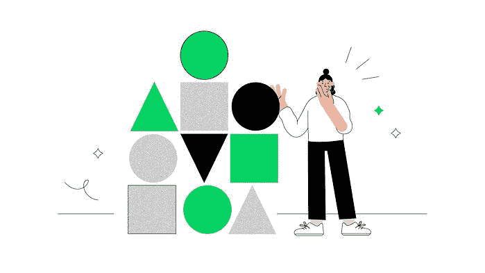
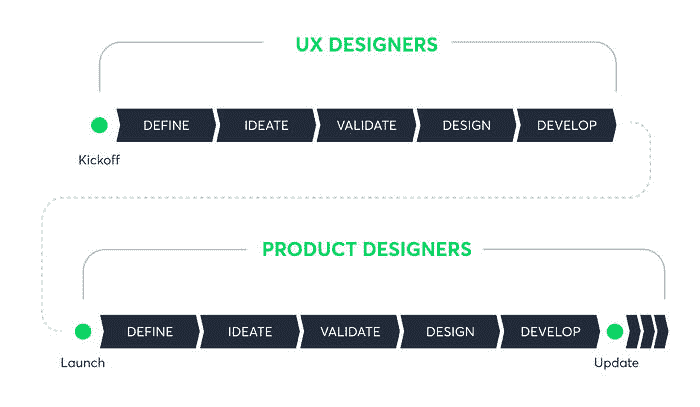

# 产品设计与 UX 设计:你的企业需要哪一个？

> 原文：<http://web.archive.org/web/20230307163032/https://www.netguru.com/blog/product-design-vs-ux-design>

 通过认识产品设计与 [UX 设计](http://web.archive.org/web/20221209135605/https://www.netguru.com/glossary/ux-design)的异同，组织可以更好地改进他们开发和管理数字产品的方法。

今天的设计师已经发展得越来越跨学科，除了设计用户界面，他们还知道如何研究他们的用户，研究市场，监控商业目标，以及其他许多技能。

[一般来说，UX 设计比产品设计更专业](/web/20221209135605/https://www.netguru.com/services/ux-consulting)。为了更好地了解你的下一个项目是需要产品设计师还是 UX 设计师，最好先了解一些误解，它们的主要区别，以及它们重叠的地方。

一开始，承认产品设计师和 UX 设计师都基于设计思维过程是有价值的。

无论他们被要求关注产品生命周期的哪个领域，产品和 UX 设计师总是寻求理解用户，挑战假设，并定义问题，以提出可能不会立即显现的策略和解决方案。

## 产品设计与 UX 设计的误区

同样重要的是要认识到，产品设计和 UX 设计之间的相似之处往往多于不同之处。然而，对于这两个设计领域有一些普遍的误解，您需要首先了解。

### 误解:是一样的

认为产品和 UX 设计是一样的，对于数字空间之外的人来说是可以理解的。这种误解源于这样一种观念，即一个是从另一个进化而来的，它们都是从 UI 设计或信息架构设计中产生的。

正如我们将在这里解释的，产品和 UX 设计师可能承担重叠的责任，但他们处理不同的任务。

### 误解:UX 设计只关注用户，而产品设计同时关注用户和商业需求。

UX 设计必须在设计中考虑商业目标。理想情况下，UX 设计师和产品设计师都应该在设计过程中融入商业需求。

产品和 UX 设计师的[工作机会要求他们的工作与商业目标](http://web.archive.org/web/20221209135605/https://uxdesign.cc/the-clear-cut-difference-between-ux-design-and-product-design-explained-74350b34cdda#:~:text=Multiple%20camps%20have%20attempted%20to,business%20needs%20and%20user%20needs.)一致，而不仅仅是用户需求，这一事实支持了这一点。

## 产品设计和 UX 设计的主要区别

规则总会有例外，但这些是产品设计师和 UX 设计师工作的主要区别。

### 他们关注的地方

产品设计师和 UX 设计师的主要区别在于他们关注的焦点。产品设计师的目标是在产品开发过程中优化产品，使其服务于商业目标，而UX 的设计师专注于将这些商业目标转化为用户旅程。

例如，虽然产品设计师可能会推动一个新功能的实现，以促进下一季度的销售，但 UX 设计师将创造实现这一业务目标的用户之旅。

此外，UX 设计是一个更加专业化的领域，而产品设计师的工作领域更类似于一个完整的堆栈服务，产品设计师不一定要深入到技术领域，但应该具有跨各种产品相关技能集的广泛能力。 [UX 设计负责整合产品的整个过程](http://web.archive.org/web/20221209135605/https://www.interaction-design.org/literature/topics/ux-design)，包括桌面和移动设备的可用性、用户界面设计、功能、品牌和视觉设计。

### 当他们工作时

这两个角色之间的另一个区别，虽然不是在所有情况下都适用，但更多的是关于他们做什么，而不是什么时候做。

通常更适用于成熟或更大的组织，用户体验设计师更多的工作在新产品上，而产品设计师致力于改进现有的产品。

虽然 UX 设计师的工作各不相同，但通常需要进行用户研究，创建人物角色，绘制线框，使用原型工具，以及用户测试早期设计。

来源:uxdesign.com，作者亚伦·特拉维斯

在一个数字产品发布后，组织通常会将 UX 的设计师转移到其他项目，有时会在稍后重新设计。另一方面，产品设计师继续在同一产品上工作，随着时间的推移不断迭代。

一旦产品进入现实世界，现实情况是改进和新功能不会立即出现。产品团队认识到，必须允许用户了解现有的功能和工作流。

这也为组织提供了收集用户行为实时数据的空间和机会。这是指产品设计师运用他们的大量技能，在下一个产品发布中推出改进的版本。

### 他们从事多少产品

组织通常要求他们的 UX 设计师致力于多种产品的用户体验，通常目的是创建跨所有公司平台的无缝体验。

这种跨产品导向不仅需要对单个产品及其各自的用户非常熟悉，还需要对更广泛的商业策略非常熟悉。

产品设计师可能会过度关注他们自己产品的关键绩效指标 ，而 UX 的设计师和战略家需要适应整体商业模式和关键绩效指标。

例如，苹果公司的 UX 设计师必须考虑他们所有的产品——包括物理设备和数字服务——为他们的用户建立无缝体验。产品设计师专注于他们的特定产品组合，如 Apple TV+或最新的 iPhone 型号。

无论哪种方式，设计师创造和改进产品不仅仅是考虑到它的消费和使用，而是考虑到购买、使用、维护和故障排除的整个过程。

虽然好的 UX 因产品而异，但设计师会根据用户可能使用产品的特定环境的需求来定制期望的用户体验。

## 产品和 UX 设计师重叠的地方

不可否认的是，UX 和产品设计师的职能有相似之处。公司有他们自己的做事方式，但基于最常见的设计实践，这两个角色往往会重叠。

### 实现业务目标对双方都很重要

人们普遍认为，UX 和产品设计师之间的一个核心区别是，他们在多大程度上考虑了高层次的商业目标、关键绩效指标和确保营销成功。UX 设计师传统上只关注与用户满意度相关的 KPI。

然而，我们 Netguru 认为 UX 的设计师必须始终将商业需求融入他们的设计中。虽然他们可能沉迷于描述用户故事和优化客户流，但他们的工作不应脱离单个产品和整个公司的业务目标。

与此同时，当产品设计师引入新功能或对现有功能进行迭代时，他们应该这样做，因为这是基于商业案例的——改善客户体验的[有望转化为商业成果。](/web/20221209135605/https://www.netguru.com/blog/user-experience-mobile-commerce-app)

### 他们都部署用户研究

UX 和产品设计师都需要精通用户研究，比如发现、可用性测试以及其他定性和定量的研究方法。

虽然 UX 设计师通常会领导并更多地参与数据分析、用户访谈、A/B 测试和其他结构化研究技术，但产品设计师也是用户研究实践的积极参与者，以了解他们的用户并将新的用户见解应用到产品迭代中。

例如，当一个产品已经发货时，产品设计师需要有能力分析关于用户行为的数据，这将允许他们进一步优化产品设计。

另一方面，虽然产品设计师可能会参与可用性测试，但通常是 UX 专家设计他们，并将学到的见解应用到产品中。

### 他们分享相似的设计技能，使用相同的工具。

在开发新产品或重新设计现有产品时，总的印象是产品设计师更关注实体模型、平面设计、排版、颜色和整体观感。

另一方面，UX 设计师被认为对用户故事、易用性和用户满意度更感兴趣。例如，UX 设计师可能倾向于在设计过程的早期更多地工作在线框或草图上，以形成所需的用户工作流程。然后，他们可能会在产品交给工程师之前，再次投入到产品的提炼中。

无论他们被要求关注哪里，他们通常都分享相同的设计技能，并使用相同的工具应用这些技能，如 Adobe creative suite XD、Figma 和 Sketch，更不用说面向业务的工具，如 Google Analytics、Miro 和 Mixpanel 等。

## 我需要哪种类型的设计师？

在选择产品设计还是 UX 设计的专家之前，[无论是内部的还是来自代理公司的](http://web.archive.org/web/20221209135605/https://www.netguru.com/blog/find-top-ux-design-agency)，问自己这些问题来帮助你弄清楚此刻你需要的设计师的技能和类型:

*   我需要帮助开发产品概念或建立良好的用户体验吗？
*   我是在设计新产品，改进现有产品，还是对现有产品进行改造和重新设计？
*   我需要有人专注于单一产品还是跨多个平台工作？
*   我需要设计师进行用户研究，还是参与市场研究，或者两者都需要？
*   我需要有人来设计一个应用程序或合作伙伴来将其推向市场吗？

## 为什么产品和 UX 设计对您的企业很重要

产品设计主要关注产品优化，以实现商业目标，而 UX 设计将这些商业目标转化为用户旅程。

了解产品设计和 UX 设计之间的误解、差异和相似之处，可以帮助您的企业更好地完善开发和管理您的数字产品的方法。

最终，产品和 UX 设计的价值不仅仅是让用户满意。交付高质量的用户体验是为了确保产品的未来，并在未来几年建立强大的市场地位。

良好的设计已被证明可以降低开发成本、提高客户忠诚度、优化转化路径并提高投资回报率(ROI)。

实现这一点需要设计过程中的[专家知道如何假设、实验和测试](http://web.archive.org/web/20221209135605/https://www.netguru.com/services/ux-design)，这不仅会帮助你为用户创造有意义的体验，还会支持你的公司做出更好的商业决策。