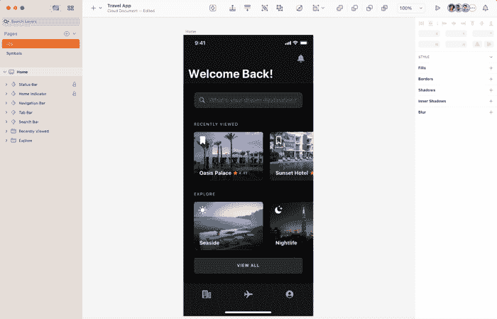
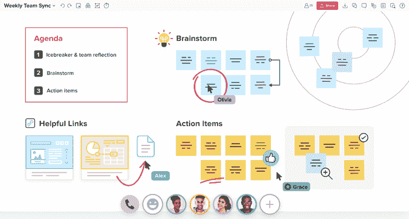
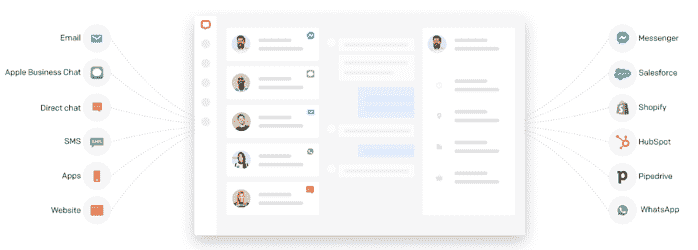
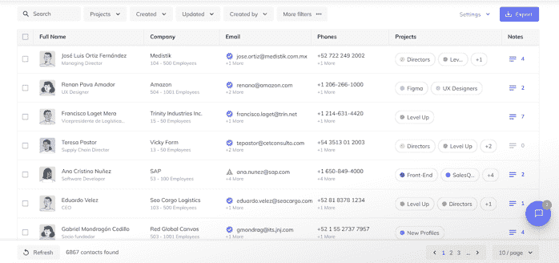

# 2022 年 100 多种最佳产品管理工具

> 原文：<http://web.archive.org/web/20230307163032/https://www.netguru.com/blog/product-management-tools>

 在不断变化的产品开发环境中，最好是在涉及到[产品管理](/web/20220925213838/https://www.netguru.com/services/product-management)工具时，看看有什么可以提供。因此，为了让事情变得简单，我们收集了 105 个产品管理工具，它们可能是你所面临的任何问题的答案。

我们的列表包含了企业确保日常运营尽可能高效运行的终极解决方案。尽管有些可能现在还不相关，但在未来的[产品管理](/web/20220925213838/https://www.netguru.com/blog/internal-product-management?hs_preview=PhqyFDSe-71434464669)阶段，它们可能是一个合适的答案。让我们来看看。

## 产品分析的最佳工具

产品分析工具是企业了解用户行为、用户流和产品指标的好方法。换句话说，这些工具有助于更好地理解用户如何与产品交互。

图片来源: [mixpanel](http://web.archive.org/web/20220925213838/https://mixpanel.com/home/)

看看下面一些最好的产品分析工具。

### 产品分析

产品分析工具提供关于产品的客观反馈。这些重要信息有助于[产品经理](/web/20220925213838/https://www.netguru.com/blog/what-makes-a-good-product-manager)对正确的事情进行优先排序，并创建一个平衡的产品管理策略。

#### 1.Adobe Analytics

Adobe 以其易于理解的分析软件而闻名，该软件被全球的产品经理所使用。它非常适合将大量网络数据转化为可操作的见解。它衡量客户路径、流量来源、内容有效性和视频参与度等。它有助于回答谁会访问一个网站以及为什么访问这个网站的问题。提供高度准确的客户洞察使该工具成为最常用的产品管理工具之一。

#### 2.振幅

这款分析管理软件通过更好地了解客户，帮助企业打造最佳产品。振幅允许产品经理了解新功能的采用、用户参与度或客户保持度。该工具在报告 KPI、测量功能影响和进行用户研究方面表现突出。Amplitude 为产品经理提供了一种了解用户行为的方式，当发现不足之处时，有助于提高转化率。它还可以帮助理解产品的生命周期。

#### 3.混合面板

通过使用这种管理软件，产品经理可以更好地理解用户行为，分离和描绘数据，并衡量产品发布的成功。该工具提供了关于用户如何与产品交互的实时数据，并有助于识别趋势，例如，入职率的下降，这表明了有待改进的领域。

### 商业智能

有许多商业智能工具可以用来从数据中提供可操作的见解，以制定战略业务决策。

#### 4.亚马逊 Quicksight

这是一个用于商业智能(BI)分析的可扩展和无服务器的机器学习工具。机器学习允许企业执行高级分析，如假设分析、异常检测或流失预测。该工具使企业能够就运营和战略规划做出明智的决策。亚马逊 Quicksight 对于大规模部署的公司来说也很划算，因为它提供了按会话付费的定价；当用户访问仪表板或报告时，您需要付费。

#### 5.谷歌数据工作室

Google Data Studio 无需训练即可快速掌握；它提供了一种全面的方法来报告和监控 KPI。产品经理可以使用这个工具进行详细的分析，以便更好地了解用户对产品体验的趋势。其交互式和完全可定制的仪表板和报告使做出明智的业务决策变得更加容易。它是任何产品管理工具包的重要组成部分。

#### 6.（舞台上由人扮的）静态画面

这款用于产品管理的多功能工具可帮助各种规模的组织做出更多数据驱动的决策。可视化分析平台允许产品经理查找和解释相关数据，从而改变了他们的工作。它提供了对产品中最终用户工作流的深入了解，从而可以更好地进行产品发布的战略规划和执行。

#### 7.Microsoft Power BI

Microsoft Power Bi 是市场上最好的 Power Bi 工具之一，用于生成有洞察力且易于解释的数据。它通过一个简单的界面提供交互式数据可视化和商业智能功能，以创建仪表板和报告。这对于避免不一致的数据操作以产生可操作的结果非常有用。它提供两个版本——桌面版和网络版，用于在线协作。

### 基于订阅的收入

这些工具帮助产品经理跟踪与基于订阅的产品销售相关的活动。软件即服务(SaaS)不再是唯一基于订阅的产品。越来越多的企业构建产品，提供数字和物理产品作为订阅模式。这些工具有助于定义和管理订阅计划，决定定价，跟踪销售和收入，发现新的销售机会，保存客户数据。

#### 8.沙特大亨

ChartMogul 通过提取和分析订阅收入来了解趋势。通过清晰的图表显示数据，它有助于产品经理直观地了解产品需求。

#### 9.公平度量

一个简单而有效的选择是 baremetrics。它有助于提供通过订阅获得的所有收入的快速概览。如果您要处理大量的订阅，这个工具应该是众多产品管理工具中的一个。

## 产品开发的最佳工具

为了准确评估您当前的产品管理流程并开发您的产品以改进您的产品，您需要最佳的工作工具。查看以下产品开发的最佳工具。

图片来源: [编辑](http://web.archive.org/web/20220925213838/https://www.editorx.com/)

### 开发和发布工具

开发和推出新产品有许多要素。以下工具帮助产品经理执行产品策略，并成功推出产品。

#### 10。编辑 X

这个产品管理工具类似于 InVision。它通过提供高质量的 API 来帮助设计您的网站，并让您自由地开发卓越的数字用户体验。凭借其灵活的画布，产品经理可以将想法转化为用户喜爱和重视的美丽设计。该平台的秘密是将响应式设计与流畅的拖放相结合。

#### 11\. GitLab

GitLab 允许您使用同一个一体化平台来规划、构建、保护和部署您的软件开发，从而有助于产品管理。该工具支持产品经理从想法到生产，并将时间周期从几周缩短到几分钟。这样，有助于提高生产率。同时，降低了产品开发成本，缩短了上市时间。

#### 12.洗牌

Shuffle 是最高质量的产品管理工具之一，用于帮助开发人员加速开发过程并提高效率。该工具结合了四个可视化编辑器，Bootstrap、布尔玛、Tailwind CSS 和 Material UI。此外，它包括 3，000 多个 UI 组件，这些组件被组织成不同的类别，具有各种配置选项，允许用户构建定制的模板。

### A/B 测试

开发团队需要 A/B 测试工具来识别产品、特性或更新的最佳表现变化，从而带来更好的产品设计。

#### 13.谷歌优化

这个免费的产品管理工具非常适合那些希望测试他们的网站，以获得或提高转化率，增加用户参与度和用户满意度的人。它提供了如何改进网站的快速洞察力。除了 A/B 测试之外，它还可用于多变量测试和重定向测试。

#### 14.AB 美味

通过人工智能实验和个性化，这种产品管理工具可以帮助建立高质量的端到端体验。例如，该工具可用于在不同的用户群上测试新功能，实时整合用户反馈，运行实验。产品团队使用 AI Tasty 进行 A/B 测试以及多变量测试。

#### 15.优化

这种 A/B 测试工具允许跨平台优化，从移动和基于 web 的平台到 OTT 等等。它能够优化所有客户的数字接触点，并跟踪这些优化的性能。通过这种方式，企业能够在不同的平台上提供一致的体验。它也可以用于多变量测试。管理软件工具的一大补充。

### 追溯工具

回顾工具的作用是为团队构建一个框架，并促进团队会议。他们帮助组织、回顾和跟进。

#### 16.弥洛松

这款在线主板产品管理工具有助于将团队聚集在一起，以便他们能够有效协作并开发出最高标准的产品。Miro 提供了多种模板，适用于团队头脑风暴、团队会议和研讨会。

#### 17.易复古

远程工作？这是最简单的产品管理工具之一，非常适合希望在项目上合作的远程团队。产品团队用它来回顾常规的团队春季会议，讨论哪些进展顺利，哪些没有按计划进行。产品团队可以将其作为学习和改进工作的机会。

### 质量管理工具

产品团队使用质量管理工具来识别重复出现的问题、产品缺陷及其来源。

#### 18.代码气候

如果您正在寻找一个测试代码质量的工具，Code Climate 是一个质量管理软件，它拥有您测试覆盖率、根据可测量的目标跟踪您的进度、可维护性等等所需的一切。您可以收到自动化的代码审查和对您的请求的评论。该工具基于 10 分技术债务评估，提供实时反馈。

#### 19.幽灵检查员

这种创新和全面的产品管理解决方案允许产品团队执行测试，这对于每个团队成员来说都是可行的，即使是那些没有深厚技术知识的成员。是什么让这个工具如此吸引人？当出现问题时，它会立即发送警报。此外，它在影响用户体验之前消除了一些问题，例如，通过捕获客户遇到的错误。

## 产品设计的最佳工具

[有效的产品管理](/web/20220925213838/https://www.netguru.com/glossary/product-management)需要能够支持产品设计不同方面和阶段的工具。

图片来源: [草图](http://web.archive.org/web/20220925213838/https://www.sketch.com/)

### 样机研究

原型工具允许尝试产品或功能，并处理细节。

#### 20.Adobe XD

Adobe XD 帮助企业创建网站、应用程序和语音等。它允许用户快速绘制线框和模型，为任何屏幕创建高保真设计，并实时一起工作。它提供了添加动画、构建交互式原型和跨不同设备进行测试的选项。此外，它允许用户共享切换设计，收集反馈，并快速迭代。

#### 21.菲格玛

如果你正在寻找一个基于质量矢量的设计管理软件，你可以在不同的项目上合作。与此同时，不要把眼光放得比 Figma 更远。该工具提供创建动画原型，草图，可点击的原型/实物模型。没有编码技能的用户可以直观地构建、定义交互，并使原型感觉像是对移动承诺设计的真实体验。

#### 22.原始 io

Proto.io 是产品经理、UX 设计师、企业家和市场营销人员将设计理念转化为现实的终极原型工具之一。易于使用的原型管理软件有助于无缝捕捉创意。由于 250 多个 UI 组件、1000 多个模板和 6000 多个数字资产，原型制作、创建草图、可点击的原型和实体模型成为可能。

#### 23.素描

超过 100 万人选择它作为创建高质量设计的首选软件开发程序，它是优化协作设计流程的完美工具。

它不是一个基于交互的原型工具，更像是一个静态模型上的低保真度到高保真度。如果你想设计一个非常简单的原型草图可以做到这一点。作为上述工具，它可以用于原型制作，创建草图，以及可点击的原型/实物模型。

#### 24.UXPin

UXPin 创造了创新的技术驱动的代码基础设计。它不是一个简单的原型工具，将静态屏幕或画板与过渡链接起来。它配备了各种工具，能够设计出像最终产品一样工作的原型。

例如，在 UXPin 中，您可以设计任何元素的不同版本，一键更新状态之间的属性，动态更新文本元素，从输入中捕捉数据，创建条件交互，在 Android 和 iOS 移动设备上预览您的原型，等等。

### 创建可视内容

产品管理包括使用可视化内容创建工具制作演示文稿、视频等。

#### 25.帆布

这款图形设计管理软件非常适合创建专业的视觉内容。更重要的是，易于使用的界面使其适合初学者和专家。在 Canva 中，您可以通过使用不同的功能、许多专用平台和格式的模板、大量照片、视频和其他元素来制作演示文稿、信息图表和短视频。

#### 26.PiXLR

PIXLR 是基于云的编辑软件，可以解决你所有的照片编辑需求。有了免费的模板，你可以马上步入正轨。它的人工智能工具允许用户进行直观的照片编辑和图形设计。此外，该工具可以打开不同的图像格式，例如，PSD，PGN，JPEG，WebP。

## 产品宣传的最佳工具

在同一个项目中与团队沟通可能会很困难。以下这些工具有助于与您的团队和客户进行前所未有的沟通。

图片来源: [霍平](http://web.archive.org/web/20220925213838/https://hopin.com/)

### 在线视频会议和网络研讨会

产品管理涉及团队内部以及与客户和其他利益相关者的许多会议。通常，客户或团队成员在不同的位置，远程通信是必要的。

#### 27.Google Meet

国际上使用最多的沟通管理工具之一是 Google Meet。它有不错的视频质量，并能在需要时容纳大量通话。它提供了许多有用的集成和实用的功能，如设置背景，录制会议，或将电话划分到不同的会议室。

#### 28.微软团队

这款简单易用的通信管理软件有助于及时连接企业。与产品相关的问题可以通过其惊人的笔记功能进行详细讨论。它还提供聊天和讨论空间，以及一个简单的任务管理板。

#### 29.一款云视频会议软件

Zoom 无需介绍。该软件在整个商业世界广泛使用，是会议、电话、网络研讨会和其他在线活动最常用的通信管理工具之一。

#### 30.希望如此

作为最具可定制性的管理工具之一，Hopin 非常适合直接进入业务领域。通常，企业用它来进行在线流媒体活动。每当需要时，产品经理都会称赞他们的高质量支持。

#### 31.河道场

当流向不同的社交平台时，该软件提供了一个简单的选择。在组织和管理视频流时，您可以轻松共享您的屏幕或摄像头。

### 合作与交流

这些工具促进了远程团队的交流和合作。

#### 32.松弛的

Slack 提供了一种组织讨论和文档的有效方式。由于这个伟大的软件，远程内部通信变得更加容易。商家为什么要用 Slack？因为它出色的集成使所有通知集中化，包括支持、销售、社交媒体和博客。在一个地方找到所有通知并能够立即讨论它们是如此容易。

#### 33.谷歌文档

凭借实时功能，Google Docs 允许产品团队成员编写各种形式的文档。它还促进了团队成员以及外部参与者之间的协作。

#### 34.谷歌工作空间

对于不同协作和通信管理工具的快速集成，此选项是一个不错的选择。所有信息都可以集中在一个易于获取的位置。Google Workspace 计划包括自定义电子邮件、Gmail、日历、会议、聊天、驱动、文档、表格、幻灯片、表单、网站等等。

#### 35.谷歌工作表

Google Sheets 是 Google 对 Excel 的回答。他们的 sheet 程序提供了许多与传统软件相同的关键功能，但有一个明显的好处:多用户实时编辑。文件共享的完美答案。

#### 36.谷歌幻灯片

快速学习，谷歌幻灯片是一个廉价的选择，用于创建可视化幻灯片演示。它保存在云中，因此整个公司都可以访问该程序。

## 产品营销的最佳工具

谈到产品营销，企业非常清楚它的成本有多高。为了确保在不超出预算的情况下获得结果，请检查以下内容。

图片来源: [漂移](http://web.archive.org/web/20220925213838/http://www.drift.com/)

### 电子邮件营销

电子邮件仍然是最常见的营销渠道之一，因为 87%的 B2B 营销人员和 77%的 B2C 营销人员使用它来培育销售线索。阅读可以简化产品营销的工具。

#### 37.邮件地址

如果你想创建先进的电子邮件活动，试试 MailerLite。随着自动化，调查，以及更多，你会有你需要的一切与此电子邮件营销管理软件。

#### 38.GetResponse

GetResponse 是发送电子邮件和创建登录页面的强大工具，可帮助您发展并吸引目标受众。它不仅可以处理电子邮件营销、自动化、销售漏斗、推送通知，还可以处理网络研讨会。此外，它提供了许多集成。、微软 Dynamics 365、Salesflare、Save My Leads、SamCart、 [Magento](/web/20220925213838/https://www.netguru.com/services/magento-development) 、Shopify、WordPress 等等。

#### 39.漂流

Drift 电子邮件管理软件可帮助您与客户进行个性化对话，帮助您获得线索和新业务。值得一提的一个特性是从自动回复中自动分离出人类回复。它还有助于通过向特定目标客户添加新联系人来提升联系人记录，并自动读取回您的 CRM 和 MAP，用更新的信息替换旧的联系人记录。

### 营销和电子商务自动化

营销和电子商务自动化工具使企业能够接触到更多的潜在客户，并优化不同的流程，与手动相比，花费的精力和时间更少。

#### 40.阿德罗尔

受众定位和跨渠道参与只是 Adroll 软件附带的一些有用的营销管理工具。借助 Adroll，您可以开展营销活动、寻找更多客户、建立有利可图的关系、跟踪、衡量和改善结果，以及保护客户数据。使用这一工具的企业通过使用展示广告、自动电子邮件、细分受众和目标定位重新联系客户并吸引他们回来，从而观察到销售的增长。

#### 41.MailChimp

这款双重营销和电子商务管理软件非常适合那些想从电子邮件营销中获得最大收益的人。Mailchimp 的电子邮件生成器很容易使用，它的定制功能允许品牌将电子邮件制作得像他们的网站一样。此外，由于各种集成，如 Accelo、Adobe Photoshop、Zendesk Activity、ConvertFlow、40Nuggets、DataBox、Monday.com，企业可以节省时间并做更多事情。

#### 42.销售管理公司

这种人工智能驱动的软件有助于尽可能容易地创建和自动化营销渠道。你甚至不需要学习代码来使用它！它是唯一一个通过使用高级分析和人工智能自动化来利用第一方和零方数据的无代码 CDP 和营销自动化平台。

### 社交媒体管理

推广一种产品需要花费大量的时间和精力。社交媒体活动是其中很大的一部分。查看市场上有助于简化社交媒体营销人员的工作流程、节省时间并将内容交付给正确受众的工具。

#### 43.缓冲器

Buffer 是最好的产品管理软件之一，可以帮助您管理所有的社交媒体账户，同时分析和吸引您的目标客户。小企业倾向于选择 Buffer 在社交媒体上建立自己的品牌和形象。

#### 44.Postify

如果你正在寻找一个一体化的工具来帮助你安排你的帖子到你所有的社交媒体渠道，那么 Postify 就是最好的选择。它允许你在脸书、Instagram、LinkedIn、Twitter 和 Vkontakte 上安排帖子。

## 产品发现的最佳工具

花在产品发现过程上的大部分时间是收集大量用户信息，以便为产品做出最佳决策。看看一些提高产品发现过程效率的好工具。

图片来源: [壁画](http://web.archive.org/web/20220925213838/https://www.mural.co/)

### 做实验

不断增长的客户期望使得产品经理转向实验来评估想法并根据数据做出决策。

#### 45.点击漏斗

该工具非常适合那些不知道如何在销售漏斗中编写页面的人。您可以在一个易于访问的位置创建多个销售渠道。创意可以迅速推出，而不会受到缓慢的外部整合的阻碍。

#### **46\. Landingi**

Landingi 是一个可靠的选择，通过许多现代管理工具来帮助您创建高转化率的登录页面。您可以使用可自定义的模板来简化这一过程。您可以使用拖放式页面生成器快速创建、启动和优化页面。

### **团队合作**

无论您的团队是在同一屋檐下工作，还是分散在不同的城市或国家，以下工具都可以帮助您不间断地工作。

#### 47.draw.io

Draw.io 是一个免费的产品管理软件，它提供了一个用户友好的体验，即使对于初学者也是如此。您可以使用它来显示和编辑图形信息。

#### 48.弥洛松

Miro 是另一个神奇的可视化工具，产品团队可以使用它来有效地协作，并按照最高标准开发产品。Miro 提供了多种模板，适用于团队头脑风暴、团队会议和研讨会。企业计划使您能够设置多个团队，这些团队可以从事具有不同目的的不同项目。

#### 49.壁画

对于产品管理团队的产品头脑风暴和视觉协作来说，壁画是一个交互式白板，无论员工身在何处，它都可以帮助他们联系。可视化协作功能包括便笺、图表甚至 gif。

### 用户洞察

开发产品的关键部分是对用户的洞察。用户对产品的体验如何？他们是如何预测的？他们是如何应对的？这些工具可以帮助你获得所有你需要的洞察力。

#### 50.品牌 24

Brand24 提供跟踪用户分析的能力，并带有“在线提及”选项，可识别社交媒体上讨论您业务的对话，以帮助收集客户反馈。

#### 51.感知音

SentiOne 是在社交媒体、博客、论坛等平台上寻找提及和用户故事的另一个好方法，可以了解用户对你的产品的看法，并帮助推动改进。该公司还提供人工智能聊天机器人和语音机器人，可以改善全渠道联络中心。

#### 52.谷歌表单

这个免费的在线工具通过使用简单的调查帮助产生客户反馈。您添加您的照片和徽标，表格会自动选择正确的颜色模板，使您的调查独一无二。问一些你想知道的问题，以获得关于你的产品的可行信息。

#### 53.马托莫(皮维克)

Matomo 可以与 WordPress 等网站同步，以提供关于用户如何与您的网站和产品互动的用户分析。该工具是谷歌分析的替代产品。他们尊重客户隐私，不会像谷歌那样出于自己的目的使用或分享数据。

#### 54.字体

一个很棒的可定制表单，有助于创建复杂的调查，而没有通常令人头痛的附加问题。数据可以毫无问题地集成到这个伟大的用户生成的反馈工具中。Typefrom 为测验、研究、反馈和线索生成提供了各种模板。

#### 55.调查猴子

SurveyMonkey 是最著名的调查管理工具之一，为在线表单提交设定了标准。它的资深会员身份为您提供了丰富的功能，有助于在获取高质量反馈时吸引用户。

### 用户测试和研究

在本节中，您可以了解哪些内容可以帮助您进行 UX 研究和测试。这些工具可以用于可用性测试、调查、面试或者更专业的测试。

#### 56.重火力点

在为应用程序收集数据时，Firebase 提供了一种可靠的一体化方法。那些使用软件类 it 作为收集数据所需的唯一后端工具的人。是后端即服务，不需要编程。因此，使其成为企业使用的产品管理工具的必备工具。

#### 57.VWO

寻找 web 测试和会话改进？那么 VWO 是一个绝佳的选择。你可以获得定性和定量的用户研究，以提高产品销售。该工具提供 A/B 测试、多元测试、调查、热图、漏斗和会话记录。

#### 58.智能外观

从这款易于使用的网站和应用分析软件中获取定性数据。发现是什么驱动了客户，是什么阻碍了更多的转化。您可以使用此工具来观看用户的记录，使用网站上生成的跟踪事件，创建访问者行为的热图，以及执行用户行为分析。

### 用户跟踪

为了优化你的产品，比如一个网站或者一个应用，你需要理解和衡量用户行为。

#### 59.谷歌分析

企业用于用户分析的最受欢迎的管理工具之一，提供有价值的量化数据。它支持跟踪广告 ROI、Flash、视频、社交平台网站和应用程序。

#### 60.VWO

已经在我们的名单上的 VWO，还包括惊人的分析管理工具来跟踪用户，了解更多关于你的观众的信息。该工具提供 A/B 测试、多元测试、调查、热图、漏斗和会话记录。

#### 61.热罐

作为一个易于使用的热图工具，hotjar 帮助企业了解用户的行为，以帮助产品团队增强用户行为分析。它结合定性和定性数据来确定需要的变化。

#### 62.uxcam

当关注热图、屏幕分析、会话长度等时，这款分析管理软件正是您需要的。它专为应用程序而设计，为实施变革提供了非常有价值的数据。

## 产品运营的最佳工具

为了增强日常产品运营，有不同的选项可供利用。见下文。

图片来源: [LiveChat](http://web.archive.org/web/20220925213838/https://www.livechat.com/tour/)

### 通信自动化

营销传播既复杂又耗时。为此，营销人员使用通信自动化软件。

#### 63.轮毂点

该产品操作软件通过自动化和确保所有系统和部门内的团队沟通，帮助您掌控所有流程。它涵盖了 CRM、销售应用程序、登录页面、通话时间表。

#### 64.实时通讯

这款产品管理工具是一款高质量的实时聊天软件，可帮助您与客户保持联系。LiveChat 提供了与各种通信渠道的许多集成，包括 HelpDesk、WhatsApp Business、ChatBot、Hubspot、Zendesk、SnapCall 或 Slack for Live Chat。

### 知识库

每个产品团队都需要一个空间，在那里他们可以分享知识和收集文档。

#### 65.汇合

在考虑产品管理软件工具时，需要考虑合流。这是一个协作工具，可以帮助团队远程合作完成项目。产品团队可以将其用于文档和知识库。

### 人力资源（部）

人力资源工具是各种解决方案，帮助产品团队处理日常活动，如报告和其他管理任务。

#### 66.bambooHR

无论你处于人力资源流程的哪个阶段，无论是招聘、入职还是改善公司文化，bambooHR 都会为你提供分析，让你的生活变得更轻松。该工具是为中小型企业创建的，用于存储和分析员工记录并跟踪应用程序。

#### 67.鱿鱼

需要帮助跟踪休假和出勤情况吗？Calamari 自动完成所有这些流程，让您专注于最重要的人力资源任务。许多企业已经将此添加到他们经常使用的主要产品管理工具中。

#### 68.也就是

它是最好的管理工具之一，可以在一个地方提供您需要的所有产品管理信息，无论是工资单、员工参与度、合规性还是福利管理。

### 聊天机器人

产品的成功取决于与顾客的沟通。这里有几个工具可用于实时和自动化的客户支持。

#### 69.蒂迪奥

TIDIO 是一个高性能，但简单易用的聊天机器人，非常适合那些希望比以前更快回复客户的人。TIDIO 可以将来自不同渠道的所有消息保存在一个仪表板中。TIDIO 的人工智能聊天机器人全天候工作，除了回答顾客的问题，它们还可以保存废弃的购物车并提供折扣。

#### 70.手机钥匙

这是最好的产品管理工具之一，可以通过短信、LinkedIn、脸书、Instagram 和网站聊天机器人营销接触到比以往更多的客户。您可以使用 MobileMonkey 的多平台聊天机器人构建器来编写将在每个聊天平台上使用的内容。统一的聊天收件箱将允许您在一个地方保存所有通过聊天进行的客户交流。

### 登机时

用户入职对于提高客户满意度至关重要。Onboarding 工具有助于正确利用产品并提高客户保持率。另一方面，产品团队还需要确保为他们的新团队成员提供引人入胜的培训和顺利的入职流程。

#### 71.walkme

自 2011 年以来，walkme 一直是帮助企业通过高质量的数字体验增加用户加入平台的最佳产品管理工具之一。该工具将帮助客户通过平稳的入职流程接受该产品。

#### 72.阿普蒂

Apty 可用于员工培训和入职培训。这种经济高效的工具能够促进学习，帮助新员工更快地吸收知识。

### 多语言

产品管理的一个更具挑战性的方面是创建多语言产品。本地化和翻译工具可以使这一过程变得更加容易。

#### 73.gengo

Gengo 通过提供高质量和价格合理的翻译解决方案，帮助解决理解不同语言的任何问题，无论这些问题有多复杂。产品管理工具的一大补充。

#### 74.洛卡利斯

Lokalise 有助于提高开发周期的效率。凭借其高质量的机器翻译工具，您可以确保翻译的准确性。该工具提供了无缝的本地化工作流程。它允许通过插件 Adobe XD、Figma 和 Sketch 使产品的本地化与开发周期保持一致。

#### 75.语法上

确保产品有完美的语法是关键。这个工具通过检查文本中的拼写、标点符号、清晰度或语法错误来解决这个潜在的问题。

#### 76。语言工具

这款免费的开源语法检查工具非常适合那些希望立即改进其产品或新产品写作内容的人。

#### 77.DeepL

DeepL 是一个机器翻译软件产品管理系统，由于其上下文特性，它非常准确，同时也从不存储任何已翻译的文本。

### 数据管理

整个产品生命周期会产生大量的数据。产品管理离不开存储、分析和处理数据的工具。

#### 78.烟囱

这个数据管理工具收集和分析所有营销数据，让您做出更明智的产品管理决策。漏斗与 500 多个营销应用和平台集成。Salesforce、Hubspot、微软、脸书等等。

#### 79.谷歌工作表

由谷歌创建，这是在一个易于使用的免费电子表格程序中输入和管理所有数据的理想选择。它包括实时编辑，通过简单易用的用户界面帮助跟踪进度。

#### 80.微软优越试算表

这是最著名的电子表格工具之一，由于它的许多特性，它提供了你输入和管理数据所需的一切。

#### 81.忠濑

这种高效的数据库工具可以定制为自动化工作流和简化操作，您甚至不需要知道一行代码就可以使用它。Tatabase 集成了管道、本机集成和第三方工具。

## 提高生产力的最佳工具

高效的员工队伍可能是实现业务目标或失败的关键。这些是可以帮助提高整体生产力的最佳软件类型。

图片来源: [扎皮尔](http://web.archive.org/web/20220925213838/https://zapier.com/)

### 工作流/工具集成

连接不同的应用程序和服务来自动执行重复性任务可以节省大量产品管理时间。

#### 82.扎皮尔

该工具可帮助企业获得一种经济实惠的方式来实现自动化，在集成应用和其他基本工作流程时无需编写任何代码。工作流管理工具的一大补充。

### 时间管理

产品经理需要对他们的工作进行优先级排序，以实现项目目标。有效的时间管理技巧是很重要的，然而，有不同的工具可以帮助你集中注意力和有条理。

#### 83.谷歌日历

这是一种快速而廉价的方式来组织会议和一周中的其他截止日期。完美的任务管理工具，适用于现有工作流中希望防止任何混乱的人。

#### 84.及时的

及时是有史以来第一个创建的时间跟踪应用程序。如今，它帮助 5000 多家企业安排工作，确保一切顺利进行。顺畅地管理日程。

#### 85.托格尔

无论工作流程如何，toggl 都是一种实时跟踪同步到所有设备的任务的简单方法。以及显示您的内部团队正在处理的任务和项目。切换跟踪在处理客户端时特别有用。很容易呈现报告并展示在特定任务上花费了多少时间。

#### 86.最近

Calendly 是一款易于使用的会议安排工具，它消除了来回的电子邮件。它为您提供了与您和其他参与者在不同日历上的可用性相配合的时间。

## 产品销售的最佳工具

看看一些改善产品销售流程的最佳工具。无论是寻找线索还是客户关系管理，您都可以在这里找到。

图片来源: [SalesQL](http://web.archive.org/web/20220925213838/https://salesql.com/)

### 领导获取和发展

推出产品后，是时候挖掘销售线索了。

#### 87.阿波罗

最终的销售线索挖掘工具，不仅能帮助您找到高价值的销售线索，还能帮助您增强拓展方法，提高回复率。

#### 88.SalesQL

将销售线索添加到一个统一的数据库中，以便在推广活动中轻松访问和使用他们的信息。使用 SalesQL，您可以在第一、第二和第三+ LinkedIn 连接上查找电子邮件，备份和导出您的联系人。

#### 89.火箭延伸

从大公司到小企业，超过 800 万的企业使用 RocketReach。您可以访问全球 1700 万家公司中 4.5 亿名专业人员的实时验证数据。

#### 90.猎手

这是最终的产品管理软件，用于从网站、企业和其他方法获得的经过验证的电子邮件中获取有价值的线索，以扩大您的销售。你用 Hunter 的 Chrome 扩展来查找任何网站背后的邮件。您可以验证来自 1 亿多个专业电子邮件地址数据库的电子邮件。

#### 91.生长机器人

Growbots 是一个一体化的对外销售计划，它通过获取新的销售线索和执行自动电子邮件营销活动来实现销售线索生成过程的自动化。

#### 92.展望

使用 LinkedIn 寻找潜在客户？ProspectIN 是一个浏览器扩展(针对 Chrome ),有助于自动拓展潜在客户。它提供一致的结果，不会超过每日限制。

#### 93.商务化人际关系网

专业人士在社交媒体平台上交流、发展和推广产品。世界各地的许多公司都有 LinkedIn，这为寻找潜在客户提供了绝佳的场所。

## 产品策略的最佳工具

产品管理最重要的部分之一是战略过程。为了制定最佳策略，你需要高质量的工具来帮助你实现目标。

图片来源: [卡帕塔](http://web.archive.org/web/20220925213838/https://kapta.com/getting-started/integration)

### OKR

每个产品团队都创建自己的目标和关键结果来衡量产品的成功。

#### 94.聪明的进步

SMART PROGRESS 是一个协作式产品战略工具，您可以在其中分享目标，并共同制定实现目标的计划。

#### 95.Gtmhub

Gtmhub 在超过 75 个国家使用，是最好的规划产品管理软件之一，企业可以在其中有效、轻松地改变和调整他们的战略。可以将目标和关键结果可视化，使数据更容易获取。

#### 96.收到了吗

这是最好的产品管理工具之一。Kapta 简化了客户管理和目标设定，有助于提高效率，同时确保您永远不会失去最大的客户。

### 路线图

路线图是每个产品经理工作的重要组成部分。跟踪项目是最重要的产品管理技术之一。市场上的不同工具可以帮助实现产品开发的愿景、方向、优先级和进度。

#### 97.产品板

Productboard 整合了从客户反馈和见解到参与度和优先级的所有内容，以创建每个人都可以参与的详细路线图。该工具构建在开放平台上，以满足产品团队的期望。

#### 98.产品计划

如果您正在寻找一种简单的方法来创建整个团队都可以遵循的产品路线图，ProductPlan 的产品管理器工具包就是为您准备的。许多企业都在使用必不可少的路线图软件。

#### 99.吉拉

吉拉是路线图的终极产品管理软件，在这里你可以跟踪并确保项目顺利进行。

### 优化

优先化，一个评估不同任务的重要性和消除不必要的活动，并以最短的方式交付产品的过程，对每个产品经理来说都是至关重要的。为了完成工作，产品经理需要确保团队首先关注最重要的事情。

#### 100.特色向上投票

该工具将您所有的客户反馈集中到一个系统中，因此您可以确保宝贵的反馈不会在其他工具中丢失。

#### 101.空中聚焦

Airfocus 允许您对最重要的项目和任务进行优先排序，以确保您总能实现最紧迫的目标。

### 项目管理

以下是你应该考虑的顶级项目管理工具。

#### 102.瑜伽体位

这款产品规划软件可以帮助整个团队了解最新的发展动态，并在线管理团队的工作、项目和任务。

#### 103.吉拉

对于那些想要有效地安排和开发产品的人来说，这是一个正确的选择。这款[项目管理软件](http://web.archive.org/web/20220925213838/https://pm-guide.netguru.com/)可以与多个设备同步，以确保您始终可以访问。吉拉是产品经理使用的众多工具之一，但通常被视为完整的产品管理套件。

#### 104.monday.com

顶级产品管理工具的另一个选择是周一。工作的每一个方面都可以通过周一的使用来覆盖和管理。团队可以轻松协作并快速产生结果。

#### 105.特雷罗

借助易于使用的产品管理平台，消除不必要的障碍，让整个企业有条不紊地发展。世界各地的企业都依赖这个产品管理系统进行日常调度。

## 选择正确的产品管理工具

有这么多的选择供您选择，您可以选择专为您的需求设计的产品。找到有效方法的最好方法是分析您的核心流程，并找到需要改进的地方。