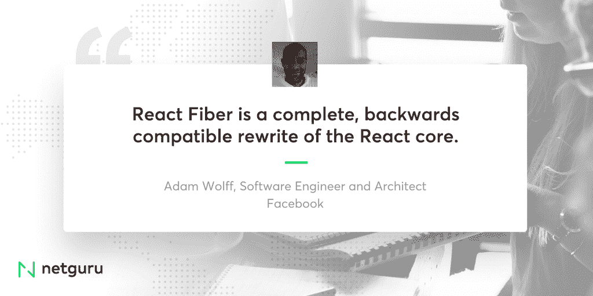

# 我应该担心反应纤维吗？

> 原文：<http://web.archive.org/web/20230307163032/https://www.netguru.com/blog/react-fiber-announcement>

 本周，脸书正式发布了 React Fiber，这是其流行的用于构建用户界面的 JavaScript 库的新版本。4 月 18 日至 19 日举行的 F8 2017 脸书开发者大会的消息引发了使用 React 开发应用的创始人的许多问题和担忧。有什么好担心的吗？这是否意味着他们将不得不重写他们的应用程序？

对于已经熟悉该框架的开发人员来说，React Fiber 并不陌生。第一次提到 React Fiber 是在 2014 年，当时脸书说工程师们开始研究和试验 React 的新版本。社区已经意识到将要发生什么，并且可以看到 Github 的持续进步。图书馆一直是透明的，向观众开放。周二的声明对于开发商 T2 来说并不意外。对他们来说，React Fiber 只是该库的另一个新版本，它为以更少的努力开发更快的应用程序提供了更多机会。

### 我为什么要在乎？

是啊，都在炒作些什么？React Fiber 有望成为有史以来最快的渲染引擎。新的版本将解决我们中没有多少人遇到过的问题。然而，根据当前的趋势和技术发展的速度，未来复杂的应用程序将需要更快的渲染速度。脸书预见未来的需求，并准备在这些需求出现之前满足它们。

纤维到底是什么？-关于图书馆的重要信息

### **1。渲染优先级**

React Fiber 引入了渲染优先级，可优化应用程序的速度。它允许停止一个渲染作业，以便稍后进行其他渲染作业。这意味着更重要的组件将在第一个序列中呈现，例如，列表中的更改将让位于动画。你可以在 [这段视频](http://web.archive.org/web/20221226053614/https://www.youtube.com/watch?v=ZCuYPiUIONs) 中找到林克拉克的精彩讲解。

*Fiber 提高复杂 React 应用的感知性能和响应能力-* [林克拉克](http://web.archive.org/web/20221226053614/https://www.linkedin.com/in/linclark/) ，Mozilla 高级开发工具工程师。

**2。API 保持不变**

React 拥有强大的 API 契约，该契约保持不变，React Fiber 将向后兼容。整个公共 API 不会改变。开发者不应该担心新版本的任何问题。然而，我们可以期待一些破坏性的变化，因为我们总是与重大更新。

我们一直有一份强大的 API 合同，这让我们可以灵活地重新实施脸书的软件工程师本·阿尔珀特。

*We always had a strong API contract, so that gives us the flexibility to reimplement* - [Ben Alpert](http://web.archive.org/web/20221226053614/https://www.linkedin.com/in/ben-alpert-1056a59/), Software Engineer at Facebook.

*React 纤程是 React 核心* - [的完整、向后兼容重写，亚当·沃尔夫](http://web.archive.org/web/20221226053614/https://www.linkedin.com/in/adamwolff/) ，脸书软件工程师兼架构师。

**3。更多 App 逻辑**

从技术角度来看，React Fiber 修改了调和算法。它基于更复杂的逻辑，并提供了更高级的工具，因此当您需要时，它可以让您更快地进行渲染。

**4。脸书已经在他们这边使用了**

毫无疑问，脸书在所有更新方面都保持领先。他们在上市之前就引入了新的算法、库和应用系统升级。React Fiber 也是如此——它已经被脸书使用了，远远早于重大宣布。

There is no doubt that Facebook stays ahead with all the updates. They introduce new algorithms, libraries and upgrades to their app system way before they go public. The same goes for React Fiber - it’s already been used by Facebook, way before the big announcement.

React 光纤的 3 大优势(以及潜在的缺点)

### **1。极速渲染**

你可能还不需要它，但未来我们需要更快的引擎来处理复杂的应用程序就在眼前。

**2。UX 优先顺序**

Fiber 将有可能降低当前不在屏幕上的元素的渲染优先级，这样它们就不会降低应用程序关键部分的速度。

**3。您的应用程序没有任何变化**

起初，你和你的开发者都不会注意到任何不同。无需担心重写应用程序。正如 [安德鲁·克拉克](http://web.archive.org/web/20221226053614/https://twitter.com/acdlite) 一样，脸书 [的一位前端工程师在 2016 年](http://web.archive.org/web/20221226053614/https://www.youtube.com/watch?v=aV1271hd9ew) : *如果/当发布时，你不应该注意到(起初)。*

不利的一面:我们可以预期代码量会略有增加。然而，它不应该影响网站的速度。

展望未来

### 总而言之，你不需要担心重写你的 React 应用程序——这些改变只是为了好。其他图书馆的作者才是应该担心的人。React 曾经被认为是渲染用户界面最快的库，现在，有了 Fiber，其他库需要非常努力才能与之竞争。

To sum up, you don’t need to worry about rewriting your React app - the changes are only for good. Other libraries' authors are the ones who should be worried. React was once considered to be the fastest library for rendering user interfaces, and now, with Fiber, other libraries need to work really hard to be able to compete with it.