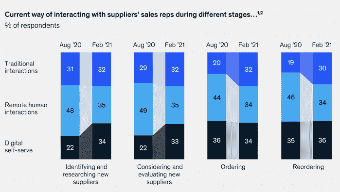

# 远程销售和营销:用 10 个步骤将您的业务转移到网上

> 原文：<http://web.archive.org/web/20230307163032/https://www.netguru.com/blog/remote-sales-and-marketing>

 将业务转移到网上不再是需要考虑的事情——你应该问的是如何去做。在网上经营业务对零售公司来说尤其重要，因为网上业务的存在，他们可以享受到客户群的显著增长、更低的维护成本和更大的品牌曝光率。

中小型企业越来越多地将他们的产品转移到网上，新冠肺炎疫情只是加快了这一进程。这种转变不是暂时的:消费者在网上购买产品和服务更加方便，因此企业必须适应这一趋势。

你如何开始远程销售？没有明确的方案，但我们已经设法确定了一个将您的业务转移到网上的 10 个步骤。在本文中，我们解释:

*   以促进业务增长的方式将业务转移到网上并建立网上业务的最佳策略是什么？
*   如何利用网络营销策略实现网络销售最大化？
*   远程工作的核心原则是什么，使得这些操作能够顺利进行？

一句警告:有很多工作要做，所以让我们直接开始吧！

## 构建您的数字形象

网上购物是全球最受欢迎的网上活动之一。要成功地将你的业务转移到网上，你必须确保你的业务能被发现。这需要将你当前的营销策略转化为数字世界的新需求。为此，请按照下列步骤操作:

### 1.研究在线市场

很可能，你的竞争对手已经上线了。列出直接竞争对手及其具体产品，分析他们的存在以及他们如何宣传自己的产品或服务。还要研究你的现有和潜在的新客户，他们喜欢你竞争对手产品的什么。

也许你还会发现他们错过了什么？关键是，你的在线营销活动必须满足真正的客户需求，而不是重复你的竞争对手已经提供的东西。

### 2.找到您的品牌差异化优势

它也被称为独特卖点(USP)，但你可能已经熟悉这个术语了。当你完成市场调查后，指出你的公司与竞争对手的不同之处，即使这种差异很细微。

也许你的竞争对手中没有一个在你所在的地区销售特定的在线服务？你的数字存在必须集中在满足市场需求和传达你的品牌提供了什么而其他人没有。

### 3.想象你的品牌体验

这是关于将你对品牌的研究和建立转化为设计。为什么重要？因为你需要将你的产品转化为连贯的品牌体验元素:标识、字体、颜色，甚至是将出现在你的网站和社交媒体上的图像和图标。

在您打算使用的所有渠道中保持这些特性的一致性至关重要。否则，当你的客户离开你的网站并开始探索社交媒体时，你可能会让他们感到困惑，这可能会吓跑他们。

### 4.建立强大的数字存在

从零开始创造东西的有趣部分来了:你需要建立相关渠道，最大化你的在线存在，并作为你新的销售引擎(我们将在下一节深入探讨)。这些应包括但不限于:

*   **服务网站或网店**——研究相关平台，如 Shopify、[大商业](/web/20221007090351/https://www.netguru.com/services/bigcommerce-development)、 [Magento](/web/20221007090351/https://www.netguru.com/services/magento-development) 、Wix、Squarespace。不要忘记购买一个与你的品牌相关的域名！
*   社交媒体账户 -他们说‘当你没有社交媒体账户时，你就不存在了’，这对企业来说仍然有效。根据你销售的产品，不同的平台会更相关(例如，零售的脸书，B2B 服务的 LinkedIn，生活产品的 Instagram)。

### 5.准备在线营销发展计划

你不能仅仅建立你的在线形象——你还需要确保它积极地增长并持续吸引新的线索。考虑一个 SEO 策略来增加流量，并在在线搜索排名中定位你的品牌。博客可能是实现这一目的的绝佳工具。

此外，强大的社交媒体战略为每个渠道量身定制内容，也将帮助你吸引消费者访问你的网站。在线推广现场活动、折扣、在线活动、直播——所有这些元素都可以帮助你扩大客户群。

### 6.确保与客户沟通顺畅

这一点是关于在任何需要的时候随时提供支持。有很多工具可以在这方面为用户提供很大的支持:网站聊天，网站支持区，你可以在那里包括像 FAQ或表格这样的东西。

这一策略的一部分是在网站上公布你的退货和退款政策，这样人们就可以找到大多数常见问题的答案，而不必问你——消费者肯定会希望澄清他们的权利。有了实时聊天和自动化机器人，技术至少可以为你处理这个过程的一部分。

现在你已经把你的公司上线了，是时候进入正题开始销售了！下面是需要记住的内容的概述。

## 不断增长的在线销售

电子商务已经成为全球零售业不可或缺的一部分。[这份 Statista 2020 年调查](http://web.archive.org/web/20221007090351/https://www.statista.com/statistics/379046/worldwide-retail-e-commerce-sales/)显示2020 年全球电子商务销售额达到 4.28 万亿美元，预计到 2022 年将增长到 5.4 万亿美元！你不能忽视这些数字。以下是你需要知道的网上销售的正确开始。

### 7.准备一个在线广告策略

明智地选择投放广告的位置——这关系到了解你的潜在客户在哪里。举例来说:化妆品和服装制造商可以利用 Instagram，而 LinkedIn 可能不一定适合他们。

此外，不要忘记谷歌广告的整个不同的世界！这些将允许你运行整个活动，但在开始这个复杂的过程之前做你的研究。当你发布新产品并想让现有客户了解它们时，电子邮件营销也是一个很好的广告工具。

### 8.提供无缝的全渠道体验

消费者期望卓越的客户体验，这并不奇怪——他们可能是在花自己的血汗钱，所以他们期望最高的标准。这就是无缝全渠道体验对他们的意义。

据麦肯锡称，[全渠道已经成为标准](http://web.archive.org/web/20221007090351/https://www.mckinsey.com/business-functions/marketing-and-sales/our-insights/omnichannel-in-b2b-sales-the-new-normal-in-a-year-that-has-been-anything-but)，不再是例外。超过 60%的消费者喜欢远程人机交互或数字自助服务，这种服务为客户提供了寻求和找到问题答案的机会。

全渠道成为标准。来源: [麦肯锡&公司:B2B 销售中的全渠道。](http://web.archive.org/web/20221007090351/https://www.mckinsey.com/business-functions/marketing-and-sales/our-insights/omnichannel-in-b2b-sales-the-new-normal-in-a-year-that-has-been-anything-but)

### 9.一丝不苟地管理数据

你需要有一个(CRM)系统来处理与客户的每一种关系和互动:从潜在的线索，通过销售，到退货和退款。这是关于选择正确的软件，所以研究一个最适合你的提供商(例如 Oracle、ZOHO、Hubspot、SAP)。

拥有合适的系统对于确保您的团队保持组织有序、跟踪销售渠道并能够始终为所有客户提供卓越的客户服务至关重要。现代客户关系管理系统还支持销售线索挖掘和销售预测。

### 10.确保在线支付安全

这可能是这个策略最重要的元素。在线支付系统必须保护客户数据，这是建立和维护客户信任不可或缺的因素。系统中的一个漏洞都会对您的业务造成严重损害:从财务损失，到潜在的罚款和失去客户群。

选择一个安全的在线支付平台，它还提供快速便捷的支付流程。您可以选择将系统直接嵌入销售平台(如 Shopify、Magento)，或者将第三方提供商整合到您的网站中。

## 通过远程工作最大化网上展示和销售

完成上述步骤后，将业务转移到网上并管理远程销售和营销不会就此结束。你还需要有一个在线管理这些活动的计划。

想想与客户在线联系的更广泛的沟通策略。知道在需要的时候到哪里寻求即时的 IT 支持——你不能让你的网上商店长时间不可用。选择一个单一的在线平台来存储您的业务资源，以便所有员工可以从每个位置轻松访问它们。

如有必要，培训你自己和你的员工在家里使用这些系统来消除困难，确保完全专注于在线销售，并最大限度地提高你的数字存在。