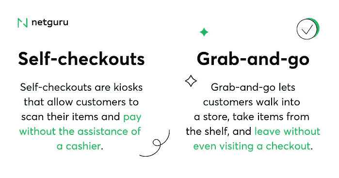

# 忘记自助结账，使用“拿了就走”:衡量改变零售业的下一项技术

> 原文：<http://web.archive.org/web/20230307163032/https://www.netguru.com/blog/self-checkouts-vs-grab-and-go>

 就在几年前，自助结账似乎还是零售业的一大飞跃。顾客能够控制他们的结账过程，这使得零售商能够降低成本，提高员工的工作效率，并改变顾客的体验。但现在，随着“拿了就走”的技术成为一个可行的提议，目标已经发生了变化，新的基准是无结账购物。让我们来看看“拿了就走”是如何改变无摩擦旅行的，以及零售技术的未来。

## 什么是自助结账和即取即用？

自助结账是一种自助服务，顾客可以在没有收银员帮助的情况下扫描商品并付款。

另一方面，“拿了就走”让顾客走进商店，从货架上拿走商品，甚至不去结账就离开。通过计算机视觉、传感器融合和深度学习的结合，支付被自动计算和接受——所有客户需要的通常是一部智能手机。

自助结账已被零售商广泛采用，在连锁超市如 Tesco、Sainsbury's、Lidl 和 Aldi 中尤其流行。在 Harris Poll 最近的一项调查中，71%的顾客透露他们曾使用过自助结账，70%的人认为这让购物变得更容易了。

相比之下，拿了就走的方式要新得多，在同一项调查中，只有 26%的受访者体验过全自动结账流程。鉴于目前提供“拿了就走”服务的商店数量很少，这个结果是可以理解的，尽管人们的兴趣正在迅速增加。该技术的早期采用者包括欧洲和巴西的家乐福、波兰的 Zabka 和美国的 Amazon Go。

## 抢了就走的优势

在零售业引入技术的好处是巨大的。只要流程中涉及到一个人，业务的成本和风险就会呈指数级增长，而自助结账和拿了就走这两种方式都会显著降低零售商的成本。

尽管自助结账大大减少了人际互动，但它并没有完全消除这种互动。系统总是有可能出现错误，客户将不得不等待工作人员的帮助。除了这一限制，我们展望未来，即拿即走将比自助结账更有优势。

> “拿了就走大大降低了消费者对某种形式的数字能力的需求”

Netguru 的创新咨询主管 Jinder Kang 解释道。“虽然最初的障碍可能是登录应用程序的能力，但一旦设置完成，剩下的就很简单了。自助结账的衰落在于它在年纪大得多的人群中的潜力。”

“取而代之的另一个好处是可以访问数据，并能够描绘出客户的真实情况。金德说:“然后，你可以把它运用到忠诚度计划、参与度和体验式设计中。

## 在什么情况下使用“拿了就走”有意义？

对于销售人员的角色并不重要的细分市场，如食品杂货和快时尚，以及排队是购物体验中的一个痛点的细分市场，“拿了就走”是理想的选择。“如果我们不需要同情或理解，我们就不需要销售助理，”金德解释道。

抢了就走的做法取决于零售商专注于哪个细分市场。“在快速消费品(FMCG)领域，拿了就走非常有意义，但如果我是一家奢侈品零售商，我不一定会考虑这些选择。相反，我会授权给我的销售助理，”他说。

就目标群体而言，打包带走可能对年轻消费者更有吸引力。你越年轻，你就越珍惜时间，所以任何自然使用和节省时间的解决方案都是显而易见的。

疫情还提高了购物者和员工对安全的考虑，抓取即走允许顾客在不与他人直接接触的情况下购物。“这是创造无摩擦旅程的理想解决方案，这甚至在疫情之前就是零售业的主要目标，”金德说。

## 如何实现“抓了就走”

最大化任何新技术的好处的关键是在市场上测试它。尽可能多地尝试，找出解决方案与哪一组客户最相关。“对一个市场的零售商而言，正确的解决方案可能不适合不同市场的同一零售商，”Jinder 补充道。

“作为零售商，我会同时考虑理性因素和情感体验，”金德说。“因此，举例来说，速度和方便，但也可能是安全和隐私，这可能是一些人的担忧。至于情感体验，你可以关注沉浸式体验和社交体验。”

考虑数据收集以及它如何帮助改进运营也很重要。[你可以实时监控产品](/web/20221201172427/https://www.netguru.com/services/computer-vision)的情况，这样你就能准确知道产品需要在何时何地上架。

金德补充道:“你可以通过诸如有效期等东西来跟踪产品，这有助于减少浪费，能够预测需求，并在正确的时间订购库存。”“收集这些数据是一个巨大的好处。”

## 展望未来

虽然我们同意无结账购物是零售业未来的重要组成部分，但我们也想知道用户的想法。我们在推特上做了一个调查:五年后，哪一项会成为购物标准？自助结账，拿了就走，扫描就走，还是老收银员好？

将近 300 人投票，你们中有 50%的人相信未来是一去不复返的。25%的人选择自助结账，只有 17%的人选择扫一扫就走，8%的人选择优秀的老收银员。

但这并不意味着收银员或自助结账的终结。顾客仍将广泛使用辅助结账。这就是为什么你应该规划整个服务，把重点放在你给顾客带来的价值上，并决定自助结账和辅助结账的平衡。

金德对此表示赞同。

> “合并一些自助检验使那些愿意使用它们的人能够这样做。那些想使用收银台的人也会有一个稍微改善的旅程。实质上，您改善了这两种细分市场的旅程，”

他说。

虽然有些人质疑技术进步是否会导致失业，但我并不真的相信会。重要的是要记住，虽然所有商店的职责都会有巨大的变化，但这将是一个渐进的变化，而不是一场革命。根据品牌战略，员工可能会接受再培训，并负责不同的领域，例如，作为个人顾问。

在不久的将来，由于目标群体和价值，一些连锁店将保持不变。然而，无论是现在还是未来，零售商成功的关键将是跳出框框思考，并确定他们可以在哪里创造改变游戏规则的价值。