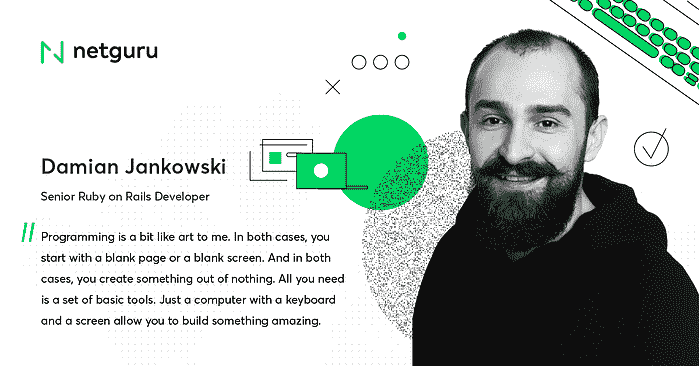

# 作为高级开发人员在 Ruby on Rails 中的成功:Damian 的故事

> 原文：<http://web.archive.org/web/20230307163032/https://www.netguru.com/blog/senior-ruby-on-rails-damians-success-story>

 有时候，我们对完美工作的梦想并没有实现，然而我们最终做的事情比我们认为我们想要做的事情更合适。Damian 的故事有点像:他打算学习艺术，但没有，现在他非常高兴成为一名高级 Ruby on Rails 开发人员。他已经做了大约 10 年了，在过去的 4 年里，他完全是在远程工作。我们与 Damian 谈论了他的职业生涯、未来职业发展计划以及他在 Netguru 的日常工作。

## 见见 Damian，我们的高级 Ruby on Rails 开发人员

达米安作为一名高级开发人员加入了 Netguru 的团队，并立即开始负责一个大项目。这是一个具有挑战性商业模式的电子学习平台。另外两个高级开发人员离开了项目团队，达米安只有一周的时间来接管应用程序的后端。

"The code was written very well, so I didn’t have much trouble," he reports. "Honestly, I’d say it’s in the top five best examples of code I’ve seen in my entire career."

负责一个直播应用仍然很有压力。Damian 必须监督错误修复、开发、维护和部署。还有虫子。达米安说他的担心持续了大约两个月。然后他更加熟悉代码，更加融入团队。“部署进展顺利，我们进行了大量测试。这个项目实际上已经接近尾声。我在等着看我的下一个挑战会是什么，”达米安说。

作为一名高级开发人员，他的工作是领导整个项目走向成功。他为团队规划任务，为客户准备成本估算，实现代码并将其部署到生产中。从本质上来说，它既是实践性的，也是管理性的。达米安说这是意料之中的。“如果你有一个写得很好的应用程序和维护得很好的服务器，作为一名高级开发人员，你也需要为较少的技术任务做好准备。我很高兴在职业生涯的这个阶段拥有技术项目负责人的经验。”当然，每个高级开发人员都要从某个地方开始。在达米安的案例中，**的起点是一本书。**

## 从有抱负的艺术家到软件开发人员

从创作艺术到编写代码似乎是一个巨大的转变，但达米安不这么认为。他说:“编程对我来说有点像艺术。“在这两种情况下，你都是从空白页面或空白屏幕开始的。在这两种情况下，你都是无中生有。你所需要的只是一套基本工具。只要一台带键盘和屏幕的电脑，就能让你做出令人惊叹的东西。”达米安反映说，这个创作过程肯定是最初引起他注意的东西。让软件开发成为他的职业所需要的只是一个小小的推动:一个朋友给了他一本关于编程的书。“在那之前，我真的不知道什么是编程，”达米安说。“但随着时间的推移，我发现我真的很享受这个过程。热爱它很重要，因为它占据了我工作日的很大一部分。如果我讨厌它或者对它不感冒，我就无法保持动力。”项目可能会持续数年。有些以失败告终。达米安应对压力的方法是关注一个人在这个过程中可以学到的所有东西。

Damian 的职业生涯围绕 Ruby on Rails 展开，他已经做了大约十年的 RoR 开发者。他参与了许多不同行业的项目，从医疗保健、房地产和金融科技，到电子商务和价格比较平台，再到为旅游公司、寻求全渠道体验的购物中心和数据驱动型企业提供技术支持软件。Damian 大约 90%的时间用于后端，其余时间用于前端功能。

他于 2018 年 12 月加入 Netguru，担任高级 Ruby on Rails 开发者。“我知道这家公司很多年了，因为它在市场上和 Ruby 社区里都有很好的评价，”Damian 说。“几年前我就想在这里申请一份工作，但我认为自己还不够好，所以没有这样做。在完成了柏林的一个项目后，我终于抓住了这个机会。一个 Netguru 的招聘人员在 Linkedin 上联系我，一个月后我已经是一名员工了！”

## Ruby on Rails 的成功之路

达米安作为 RoR 开发人员的成功不是一夜之间发生的。他最初是作为一名 C#开发人员开始工作的，薪水比他的预期要低一些。当时，软件开发人员并不像今天这样吃香，因为这个行业还处于早期。沿着达米安居住的波兰海岸线，软件开发员的工作并不流行，也没有几家国际公司提供好职位。对初学者的支持也非常缺乏。”我阵脚大乱。达米安说:“通常，我会因为缺乏经验而把事情做得完全错误。"然后我遇到了另一个障碍:我必须服兵役，这需要 9 个月。"

出狱后，Damian 学习了不同的语言:Perl 和 PHP。他为一家旅游公司做了一个 PHP 项目，这是他们面向客户的主要网络平台。他回忆说，这份工作是第一份将有趣的挑战摆在他面前并让他学习的工作。这样做了几年后，Damian 得到了他的第一份 Ruby on Rails 工作。在那家公司的两年里，他学到了很多关于 Ruby、Rails 和良好团队合作的知识。他的几个同事是来自德国的远程工作者。他们保持着日常沟通和有效协作。这一经历向 Damian 展示了远程合作在某些情况下是可行的。

大约六年前，达米安从波兰北部搬到克拉科夫，在那里他在一家拥有独立 Ruby on Rails 部门的大公司工作。回到 Tricity，Damian 的家乡，Ruby 社区很小，被低估了。但是克拉科夫不一样。这座城市有许多国际公司，它们愿意支付给开发商更高的薪水。“我记得一天收到十多份工作邀请，其中一些很遥远，”达米安回忆道。

他的下一份工作给他带来了职业生涯中最大的挑战。达米安开发了一个巨大的软件，负责向斯堪的纳维亚半岛的数百万人发送短信。该公司的客户，如 PizzaHut 和麦当劳，用这种方式与他们的客户沟通。可悲的是，旧版本的软件有不可修复的问题，所以公司选择用 Ruby on Rails 重写。让达米安的任务更有压力的是，应用程序必须在第一次尝试时就工作——将无法解释数百万条不正确的文本。

## 远程工作和弹性工作时间

达米安的下一份工作意味着要搬到英国，这是一个新的沟通挑战:在工作和日常生活中使用第二语言。他在英国呆了六个月，然后回到波兰，远程工作了一年半。这使得良好的沟通对他的成功更加重要。“我发现与英国人和挪威人一起工作非常愉快，”达米安说。“他们对截止日期有一种非常轻松的态度——也就是说，他们不会为了截止日期而强制执行截止日期，并且理解延迟的发生。他们也很善良，乐于助人。奇怪的是，Netguru 的团队也有这些特征。

远程工作在刚推出时可能是一个很大的挑战，但有了今天的工具和技术，它可以非常舒适。“在 Netguru，我们使用 Slack、屏幕共享、Google Meet 和吉拉等工具进行项目管理。我们保持日常沟通，比如通过空闲通话进行站立交流。它的效果非常好，”达米阿斯说。“Netguru 还允许我安排自己的工作日。我尽量在 8 点或 9 点左右开始工作，但只要我参加计划好的电话会议和站立会议，我是否在屏幕前呆上 8 个小时或休息一下都没关系。这些每天不超过两个小时。”Damian 和 Netguru 团队的其他成员利用这种额外的灵活性来围绕他们的日常职责规划他们的工作。对于他们来说，中午带着他们的狗去散步，或者陪他们的配偶去看医生是很平常的事情。只要他们让他们的团队提前知道他们会离开，没有人会眨一下眼睛。

“如果我要离开更长时间，我会尽量在前一天或一大早让我的团队知道，”Damian 说。在这里，这并不令人不快。许多公司声称给他们的员工这种自由，但 Netguru 是我见过的唯一一个让它发挥作用的地方。只要我做好自己的工作，我就不需要担心什么时候会发生。”

## 加入 Netguru -招聘流程

为了达到 Damian 今天的位置，他必须申请高级开发人员的职位。他知道 Netguru，并在就业市场上跟踪它。他担心申请很长一段时间，但在一个完成的项目形式的另一个职业生涯里程碑后，他做出了跳跃。经过一个月的招聘，他成为了一名 Netguru 员工。

“招聘过程非常快速高效。最重要的是非常愉快，”达米安报告说。招聘的第一阶段是介绍性的谈话。然后是时候与 Netguru 的一位专家进行更技术性的谈话了。达米安愉快地回忆起这件事。“我们用英语交谈，讨论了几个用例。在特定的情况下我会怎么做，我对某类问题有什么经验。没有任何让我犯错的花招，我自始至终都很开心。”

成为 Netguru 团队的一员

一到这里，Damian 就对 Netguru 团队对代码质量的重视程度感到非常惊讶。他还高兴地注意到，人际关系保持在非常高的水平。“我们有一个很好的氛围，几乎没有与工作相关的压力，团队成员之间有很好的沟通，我们总是可以依靠彼此的帮助，”Damian 说。“我从来没有加入过如此匹配的团队。在招聘过程中筛选候选人的很大一部分是确保有文化契合度。结果是由志同道合的个人构建的环境完全符合他们的需求。”

## 当团队成员遇到与工作相关的挑战时，他们会得到所需的支持。有专门的 Slack 知识分享渠道，前辈可以把自己的知识传授给年轻的同事。“如果你寻求帮助，人们总会为你抽出时间，”达米安说。“我以前只在英国遇到过一次这种现象。这种团结和支持。就算我真的搞砸了，团队也不会指指点点。相反，人们会尽力帮忙。”

根据达米安的说法，网络大师和他在英国经历的工作文化没有太大的不同。“我在两家公司都遇到了很棒的人。在 Netguru，我们通过下班后的选择或午餐时的聊天来共度时光，我们使用 Slack 频道根据我们的兴趣组建较小的社区。我遇到的其他工作文化，甚至是美国和斯堪的纳维亚的文化，我们要正式得多，涉及的个人互动也更少。”

Netguru(与英国公司相比)的不同之处在于，这里的人们更愿意提供帮助。达米安说:“如果我请人帮忙，他们很可能会抽出一些时间来确保我的问题得到解决。“我在英格兰的时候，我的同事们需要更多的相互独立解决问题的机会。如果我向他们寻求帮助，他们会给我指出正确的方向，告诉我在哪里可以找到解决问题所需的信息，但除此之外，他们不会经常介入。”这种方法有其利弊:建立良好的团队关系与效率和时间管理。虽然可以说帮助某人解决难题帮助他们和公司节省了时间。

面临高层挑战

达米安对 Netguru 开发人员表现出的专业水平感到满意。“我喜欢流动，。我们将 GitHub 与 CodeClimate 集成在一起，并使用它来监控代码质量。如果我们遇到错误，我们会尝试修复它们，并尽可能地提高我们的代码分数，同时牢记项目的截止日期和我们工作的效率。我们还试图在我们的堆栈中始终使用最新版本的语言、框架和库。”

达米安警告说，优先更新工具和改进工作代码并不总是最好的。他的一个项目包括一个冗余的 Elasticsearch 库，以及一个 PostgreSQL 库。围绕这两个库工作意味着浪费一些时间，但应用程序工作正常，客户端当时没有处理大量流量。因此，Damian 决定推迟改进。“该项目目前确实运行良好。移除 Elasticsearch 可以帮助避免未来的问题并提高性能，但这并不符合客户的最佳利益。数据库深深嵌入在应用程序的架构中。根除它需要大量的工作，所以我们采取了务实的态度。”

如果确实出现了问题，我们会相应地处理，但目前来说，进行大规模返工是没有意义的。团队很乐意这样做，但从商业角度来看，这是一笔不必要的成本，在流程结束时没有任何明显的价值，”Damian 说。许多开发人员更喜欢立即更新他们的工作，使用他们工具的最新版本，并返工他们的代码直到它变得完美(剧透:它永远不会)。但是通常情况下，这种方法对客户没有任何好处，反而增加了项目成本。具有 Damian 经验的开发人员需要能够看到这一点。

## 专业发展

大四了，达米安没有以前那么大的成长空间了。他利用内部培训机会和知识分享会议。他也分享他所知道的，通过谈话或写信息文章。这个团队中有许多拥有丰富知识和经验的专家，所以总会有人比你更了解某些领域。

公司通过内部程序和辅助手段促进持续增长。每位员工都有增长预算，可用于参加活动、参加课程或购买学习材料。每个团队成员都有一个领导，帮助他们决定个人发展计划，完成季度目标。“我目前正在学习 Python 和机器学习，”达米安说。“我的领导和我安排了每三个月一次的会谈，以回顾我的进步并决定进一步的目标。如果我坚持朝着这些目标努力，我每六个月就会加薪。只要我的目标与公司的目标有所一致，我在决定我想关注什么方面有很大的自由。我在工作时间进行一些学习，这意味着我学习实际上是有报酬的。”

软件开发人员专业成长的速度和方向取决于他们从事的项目。如果他们参与一个大型项目，有很多困难的挑战，大量的用户，等等，他们可以在短时间内学到很多。达米安说:“最棒的是，当你感觉停滞不前时，你总能在项目之间切换。“这不是一蹴而就的事情，因为在你的旧项目中，一定会有其他地方出现空缺，有人接替你的工作，但这种事情一直在发生。你只需要和你的领导谈谈，他们会帮你在公司内部找到更好的发展机会。”

## 作为一名高年级学生，Damian 可以在他的项目中做出有意义的决定，这让他有了进一步发展的空间。他目前是他的项目中唯一的高级开发人员，所以他可以选择任何他想要的工具，只要它们符合 Netguru 对质量、效率和安全性的一般要求。“我只是需要我的选择背后的论证。证明我想做的事会成功。我不能提出一些疯狂的事情:使用更流行的工具和技术来避免未来的维护问题是一个很好的做法。但是 Netguru 的堆栈是巨大的。此外，如果我真的想，我可以尝试一些更不寻常的东西，作为我个人成长目标的一部分。”

达米安的故事并没有到此结束。他正准备着手一个新项目，并获得人事和项目管理方面的经验。我们希望看到他超越自己的期望，与团队的其他成员分享他来之不易的知识。庆祝和分享经验是建立一个真正优秀团队的关键一步。

**The company promotes constant growth through internal procedures and aids.** Every employee has a growth budget that can be used to attend events, participate in courses or procure learning materials. Each team member has a leader who helps them decide on a personal development plan, complete with quarterly goals. “I’m learning Python and Machine Learning at the moment,” says Damian. “My leader and I have scheduled talks every three months to review my progress and decide on further goals. If I’m consistent in working towards these goals, I get a pay bump every six months. And I get a lot of freedom in deciding what I want to focus on, as long as my goals align somewhat with the goals of the company. I do some of that learning during working hours, which means I’m effectively getting paid to learn.”

The speed and direction of a software developer’s professional growth depends on the projects they work on. If they take part in a large project, with plenty of difficult challenges, large numbers of users, and so on, they can learn a lot in a short amount of time. “What’s great is that you can always switch between projects when you feel like you’re stagnating,” Damian says. “It’s not an instant thing, as there has to be an opening somewhere else and someone to take over your job in your old project, but it happens all the time. All you need to do is talk to your leader and they’ll help you find a better growth opportunity within the company.”

**As a senior, Damian gets to make meaningful decisions in his projects, allowing him further room to grow.** He’s currently the only senior dev in his project, so he can choose any tools he wants, as long as they match Netguru’s general requirements for quality, efficiency and security. “I just need to have the argumentation behind my choice. Proof that what I want to do will work. And I can’t propose something crazy: it’s a good practice to use more popular tools and technologies to avoid maintenance issues in the future. But Netguru’s stack is huge. Besides, if I really want to, I can experiment with something more unusual as part of my personal growth goals.”

Damian’s story doesn’t end here. He’s preparing to move onto a new project, and gaining experience in people and project management. We hope to watch him grow beyond his own expectations, sharing his hard-earned knowledge with the rest of the team. Celebrating and sharing experience is a crucial step in building a truly outstanding team.