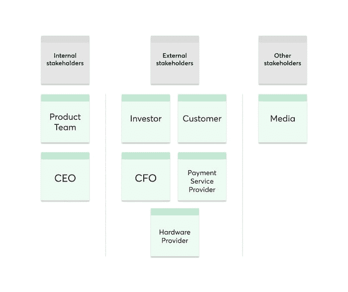
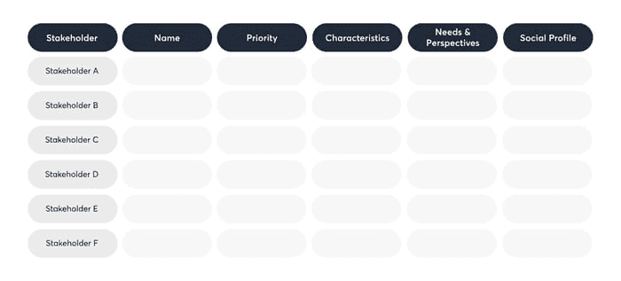
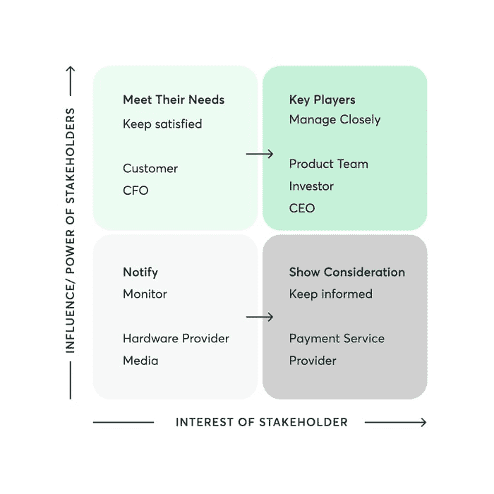
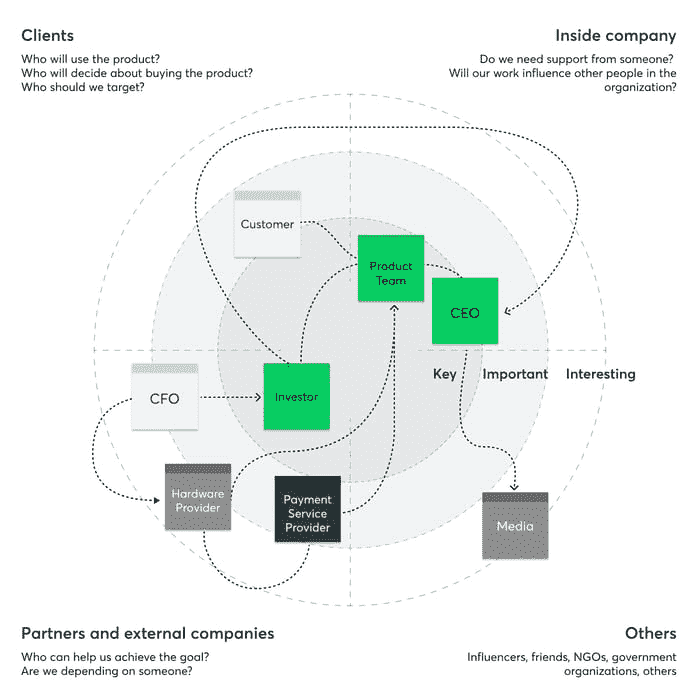
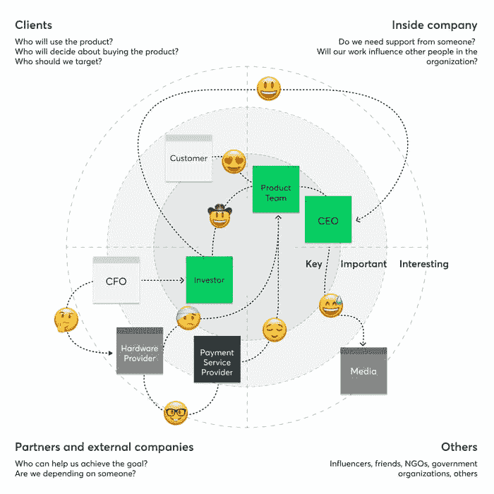

# 通过利益相关者映射画布了解影响您产品的人

> 原文：<http://web.archive.org/web/20230307163032/https://www.netguru.com/blog/stakeholder-mapping-canvas>

 成功地管理产品需要彻底理解影响产品旅程不同阶段的利益相关者的需求。

如果没有这些知识，产品经理就无法定义价值主张和产品成功，并可能在浏览不同用户群的不同兴趣以及不断变化的市场需求时迷失方向。

与多个利益相关方一起开发[数字产品](/web/20221027122022/https://www.netguru.com/blog/steps-in-building-digital-product-from-scratch)的产品经理肯定会从利益相关方绘图画布中受益——这是一种有助于识别和绘制对给定产品或计划感兴趣的个人、团体或组织的模型。此外，它允许产品经理了解特定利益相关者或群体的兴趣或需求程度，并随后更有效地规划他们的参与策略。

## 什么是利益相关者映射画布？

涉众映射画布是影响给定项目的涉众网络的可视化表示。它阐明了哪些涉众具有高优先级，哪些对给定的项目不太感兴趣。这是从多个角度合作的产物。

了解并组织利益相关者及其需求，使产品经理能够建立[有意义的合作关系](http://web.archive.org/web/20221027122022/https://www.netguru.com/blog/ecosystem-mapping-canvas)并实现相关的认同，以确保项目轻松、有效、按时地展开。它帮助产品经理确定目标，并定义任何项目中的成功，为实现目标提供必要的清晰性。

在规划相关利益相关方时，我们应该特别关注哪些决策者？有四个关键领域需要考虑:

### 客户

或者，更广义地说:目标群体——那些将决定购买产品的人，以及那些我们想说服从我们这里购买的人。我们可以查看特定的客户和用户，以及整个细分市场。

### 内部利益相关者(工作人员)

我们需要谁的支持，在整个产品开发过程中我们支持谁？考虑项目对销售、营销、产品、研究、设计、工程、数据、项目管理、客户成功、支持、人员/人力资源、法律、安全团队和任何其他你认为相关的方面有什么影响。这些部门是如何影响项目的？尽可能广泛地思考。

### 合作伙伴和外部利益攸关方

这个团队包括任何能够帮助我们实现产品相关目标的实体或个人。考虑项目所依赖的赞助商、投资者、主题专家、关键业务和技术合作伙伴以及供应商。

### 其他利益相关方

该团队包括竞争对手、有影响力的人、非政府组织、政府机构、政党、社区，甚至朋友和家人——任何可能受到产品或项目影响但不一定能帮助我们塑造它的人。

负责[创建正确产品](/web/20221027122022/https://www.netguru.com/services/product-management)的产品经理和整个产品团队对利益相关者映射图特别感兴趣——一方面满足客户需求并解决每个客户群中的问题，另一方面满足业务需求。

## 使用利益相关者映射画布的好处

每个产品通常都是由对其有既得利益的多个人和实体形成的。不同程度的影响增加了画面的复杂性——一些利益相关者会有很高的兴趣，而其他的则相对较低。利益相关者映射画布可以帮助:

*   组织和管理期望和相关的风险
*   发展对围绕产品并要求成功的人和组织的理解
*   确定主题专家
*   识别实际的和潜在的支持者，以及那些可能破坏项目和产品本身的人
*   创建有意义和相关的伙伴关系
*   执行有效的参与战略和沟通计划，最终最大化成功的可能性
*   通过更容易地了解我们应该何时与谁合作，显著加快产品交付

## 利益相关者映射解决了哪些挑战？

产品经理可能会面临与不同的利益相关者协商某些需求、计划和要求的挑战。画布是探索利益相关者特征和制定对他们影响最大的沟通计划的最佳方式。它提供:

1.  直接和间接影响产品的人和实体的易于理解的视觉识别
2.  洞察利益相关者的需求和要求
3.  洞察这种影响对每个利益相关者或利益相关者群体的重要性
4.  开发和发布产品不可或缺的合作伙伴、供应商和第三方服务列表
5.  不同利益相关者之间联系的可视化地图

## 管理利益相关者风险

利益相关者地图不仅仅是为了管理期望和建立相关的有意义的伙伴关系。识别和管理项目风险也很重要。这些通常包括:

*   沟通风险:当产品团队不完全了解谁应该被告知关键进展以及原因时，就会出现这种风险。让相关的内部团队始终保持最新状态，并创建对项目和[产品目标](http://web.archive.org/web/20221027122022/https://www.netguru.com/blog/now-next-later-framework-product-roadmap)的共同理解是必不可少的。
*   **知识风险:**描绘利益相关者将有助于你在利益相关者不在的情况下抓住缺失的空白。另一方面，它也有助于准确地认识到交付产品需要什么样的专业知识。
*   **信息过载:**画布将帮助您计划和优先安排适当数量的会议，并组织信息，以便以全面的方式分发。此外，它还明确了信息发布的责任。
*   **可用性风险:**有了利益相关者的地图，你的团队将不必搜索信息，并知道随时向谁寻求材料或访问。
*   **资源风险:**画布有助于识别、计划和保护完成项目或扩大产品规模所需的资源。

## 创建利益相关者映射画布-一步一步

到目前为止，您可能已经决定了一个利益相关者映射画布是您所需要的。你从哪里开始？遵循这四个步骤，你一定会增加产品成功的机会。

## 第一步:识别

首先列出所有对你的业务重要的利益相关者，以及那些最有可能影响产品目标和整体成功的利益相关者。请注意，随着您环境的发展，这些利益相关者可能会发生变化。您可以用一组便笺来可视化数据(每个涉众一张)。

第二步:分析

分析每个利益相关者的类型、与业务的相关性、他们的需求以及他们可以提供的观点。这将有助于你理解他们与产品以及彼此之间的关系。

## 根据每个利益相关者对产品和相关项目的重要性，为他们分配优先级。您可以将这些数据可视化在一个简单的二维电子表格中，列出所有利益相关者及其相关信息。

第三步:优先排序

利用在分析阶段收集的信息，您现在可以创建一个影响/利益矩阵。选择不同的颜色来标识您应该一直密切合作的关键人物。

那些为了满足他们的需求而应该满足他们的人，那些应该被告知和咨询项目如何展开的人，以及最后，那些从项目的角度来看最不重要的、可以被监控的涉众。要有战略眼光，要清楚你要和谁交往，为什么交往。

第四步:映射

## 将参与者应用到利益相关者地图模板，牢记您在前面步骤中确定的内容。这将指明最需要参与的利益相关者以及如何参与。将利益相关者放在画布上可以清楚地显示出对产品的影响程度。

产品经理必须确保产品满足“关键”玩家的要求，并考虑“重要”玩家的需求。所有剩余的利益相关者都属于“感兴趣”的类别，对产品来说不太重要，所以他们的需求不必满足。

这个练习可以让你了解谁是关键的利益相关者，并对他们进行相互评估。找出并绘制它们之间的关系。

在本练习中，以下问题可能会有所帮助:

哪些利益相关方已经建立了联系？

## 哪些利益相关者尚未建立联系，尽管他们本应建立联系？

谁影响谁？

谁分享相似的兴趣和议程？

谁可能反对对方，谁可能当守门人？

他们在项目的哪个阶段做决策？

*   我如何获得更多关于他们如何做出这些决定的信息？
*   用线连接利益相关者。你也可以使用表情符号来形象化他们可能代表的关系类型或情绪。几个表情符号就够了，配上一个图例来解释它们的意思。可视化将帮助您理解所有利益相关者之间的复杂动态，以及潜在问题和风险的动态。
*   Who influences whom?
*   Who shares similar interests and agendas?
*   这最后一步有助于将在分析阶段定义的标准中创建的问题和关系的复杂相互作用可视化。
*   利益相关方面临的挑战

既然您已经确定了利益相关方，我们想指出您可能会注意到的该系统的几个问题:

根据环境的不同，涉众在产品中的角色可能会突然改变。画布是一个活的工具，随着产品旅程的展开，你可能需要定期修改。

你有时可能会错过重要的关键人物。在画布上与公司内部和外部利益相关者的跨职能小组一起工作，甚至是那些起初看起来不相关的人。这保证了评估是以一种更加知情和全面的方式进行的。

关于产品的几个方面、目标和细节，可能会有误解。与利益相关者反复澄清它们以避免误解。

我们的最终建议

如果你在项目的最开始就准备好一张利益相关者地图，那将是最有帮助的，这样你就可以在早期有效地与关键人物建立信任。彻底了解利益相关者的关系及其动态最终有助于节省时间和金钱。以下是如何最大限度地发挥利益相关方绘图画布的优势:

## 对于关键利益相关者，你可能希望创建具有详细特征和信息的人物角色，如他们的职位、公司、照片和社交资料。

定期修订利益相关者地图。随着时间的推移，利益相关者及其观点会发生变化。重新审视地图，找出最有可能出现的情况，尤其是在即将做出关键决策的时候。

研究每个利益相关群体对项目的看法。他们是积极支持、不确定、怀疑还是反对这个项目？理解他们的态度将有助于你决定采取什么行动来将不利的情绪转移到积极的一面。

*   通过以上内容，您将能够设计有效的参与策略和相关的沟通渠道，从而在整个产品之旅中最大限度地提高成功几率。
*   You may sometimes miss out on important key players. Work on the canvas with a cross-functional group of company’s internal and external stakeholders, even those that may seem irrelevant at first. This guarantees the assessment is carried out in a more informed and thorough manner.
*   There may be a miscommunication with regards to several areas of the product, its goals and details. Clarify them with the stakeholders repeatedly to avoid misunderstandings.

## Our final tips

A Stakeholder Mapping Canvas will be most helpful if you prepare it at the very outset of the project, so that you can build trust with key players effectively, early on. Having a thorough understanding of the stakeholder relationships and their dynamics ultimately helps to save both time and money. Here’s how to maximize the benefits of the Stakeholder Mapping Canvas:

*   For the key stakeholders, you might want to create personas with detailed characteristics and information like their position, company, photo and social profile.
*   Revise the Stakeholder Mapping Canvas on a regular basis. Over time, stakeholders and their points of view change. Revisit the map to figure out what the most likely scenarios are, especially when critical decisions are about to be made.
*   Research the sentiment of each stakeholder group towards the project. Are they actively supportive, unsure, skeptical, or perhaps against the project? Understanding their attitude will help you determine what actions to take in order to shift unfavorable sentiments to the positive side.

With the above, you will be able to design an effective engagement strategy and relevant communication channels that will maximize the chances of success throughout the product journey.