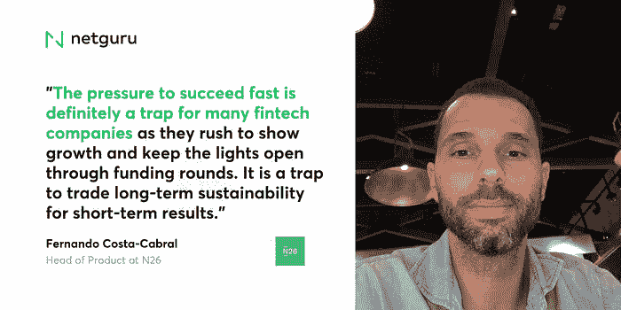
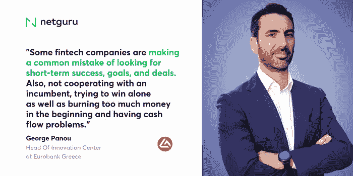
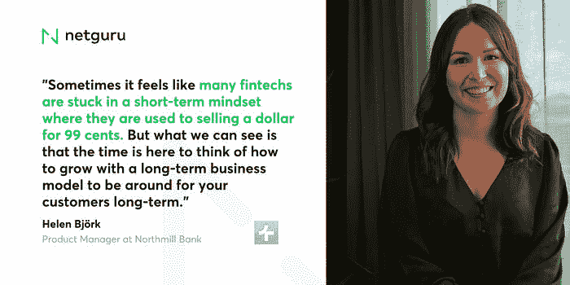
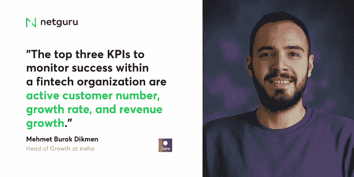

# 在金融科技领域，成功的定义是什么？

> 原文：<http://web.archive.org/web/20230307163032/https://www.netguru.com/blog/success-in-the-fintech-world>

 2007 年金融危机后，金融科技公司开始更大规模地发展，导致人们对传统金融机构的信心下降。从那时起，由于(但不限于)新技术让许多企业获得了竞争优势，该行业已经发展成为最具竞争力的行业之一:

区块链、人工智能、生物识别、RPA、大数据、新支付方式、基于基础设施的技术，以及其他。

金融科技应用这些尖端技术来改善现有的金融服务或创造新的金融服务。它们尤其具有创新性，在亚洲、非洲和拉丁美洲的发展中国家发展得最为成功，这些国家没有银行账户 [的人口比例超过 60%](http://web.archive.org/web/20221202084502/https://www.forbes.com/sites/esade/2019/07/30/the-fintech-revolution-who-are-the-new-competitors-in-banking/) ，但智能手机在这些国家非常普遍。特别是，科技让普通大众更容易获得金融服务。

这为该部门吸引了大量风险资本投资，极大地促进了其增长。2019 年，该行业估值超过[55，040 亿美元](http://web.archive.org/web/20221202084502/https://www.globenewswire.com/news-release/2020/12/17/2147264/0/en/Global-Fintech-Market-Report-2020-2025-Competition-Forecast-Opportunities.html#:~:text=The%20Global%20Fintech%20Market%20was,23.58%25%20during%20the%20forecast%20period.&text=AI%20interfaces%20and%20chatbots%20have,at%20impressive%20rate%20through%202025.) ！毫无疑问，金融科技创新已经改变了整个行业，并为现在几乎所有金融服务企业都遵循的方式铺平了道路。与此同时，没有一家公司作为主要参与者在该领域占据主导地位，部分原因是该领域监管严格。

因此，问题来了:在衡量金融科技企业的成功时，应该看什么？在竞争如此激烈的行业中，只关注财务、客户指标、内部流程和增长领域的通用指标可能还不够。对金融科技行业更全面的看法将包括以下七个指标:

*   获取，包括应用下载数量和新客户，
*   激活，表明实际开始使用你的解决方案的人数，
*   保持率，表明有多少人坚持使用你的产品，
*   推荐或客户推荐的数量是你可以看到的最佳成功指标之一，
*   每日收入和/或交易数量，
*   最适合业务的营销指标，
*   技术指标，包括页面加载时间和数据库内存使用，表明工具执行的流畅程度。

然而，金融科技初创公司应该记住，衡量金融科技行业的成功不仅仅是看指标，还要知道它们如何相互影响。为了正确分析你的金融科技业务，你必须能够绘制你的应用程序的性能、营销努力和业务结果之间的关系，以获得有意义的指标。

## 监控金融科技组织成功的主要关键绩效指标

每个金融科技企业都走不同的道路，这反映在他们衡量成功的方法上。为了了解他们是如何看待这个问题的，我们邀请了金融科技企业的专家，问了他们两个问题:

*   *如果让你选择三个最重要的 KPI 来监控组织的成功，你会选择哪三个，为什么？*
*   在你看来，金融科技企业在衡量其活动的成功时最常犯的错误是什么？

让我们来看看一些领先的技术行业参与者是如何回答的，以及这些答案背后的基本原理是什么。

I would pick:

*   订阅占客户的百分比，
*   搅动，
*   营业利润率。

第一个原因是，新银行正在颠覆现有银行的现收现付隐性费用模式，转而创造客户愿意支付的捆绑价值。流失是因为它衡量了商业模式的可持续性，因为如果客户最终离开，没有一家企业能够持续不断地注入资金来实现增长。最后是 EBIT，因为扭亏为盈标志着企业不再需要外部资金的时刻。

### 希腊欧洲银行创新中心负责人乔治·帕努

我会通过监控以下关键绩效指标来衡量金融科技公司的成功程度:

*   按季度销售的毛利率百分比。首先，在经营一家企业时，你需要明白自己是否盈利。一般来说，这种情况每年都会在公司层面上出现，但为了发展公司，领导者需要每天做出决策，因此他们必须每天都在现场获得这种信息。毛利可以在不影响其他运营的情况下，向领导者展示计算总成本后收入的剩余金额，以便他/她做出决策。一瞥眼就能看出哪些销售渠道最赚钱，哪些客户最赚钱，哪些产品最赚钱。
*   新机会与交易完成比率。对于领导和公司来说，仔细观察交易完成率是非常重要的。首先，如果比率提高了，那么你就可以看到这是否是你在团队中所做的事情的结果。将此指标作为团队的 KPI 指标[还会推动团队更加努力地工作](/web/20221202084502/https://www.netguru.com/blog/software-development-kpis-and-metrics)以达成交易。
    通过持续的销售流程，推动转化率的提高和渠道的拓展应该会增加您赢得的交易数量。
*   客户满意度也是一个重要的 KPI。领导者还会如何衡量公司的成功？客户满意度非常重要，因为它不仅衡量产品本身是否好，还会影响 NPS(净推广者得分)，这是一个客户向他人推荐产品的可能性有多大的指标；此外，客户满意度影响客户保留率。不管顺序如何，KPI 都非常重要。彼得·德鲁克说过:“你无法管理你无法衡量的东西。”

### 诺斯米尔银行的产品经理海伦·比约克

监控组织内成功的三大 KPI 是:

*   确保 KPI 不仅设置在管理层，也设置在产品团队层面。整个公司都需要知道我们的发展方向。
*   不仅要监控传统指标的成功，还要获得真实的客户反馈来衡量您的成功。
*   成功不仅在于达到你的指标，还在于你的团队感觉如何，并确保他们投入到工作中，目标是可以实现的。

团队需要确保他们也有长期的 KPI 来衡量正确的指标，而不仅仅是什么会让他们今天成长。

### [帕特里克·布鲁尔](http://web.archive.org/web/20221202084502/https://www.linkedin.com/in/patrick-breuer/)，麦克马克勒金融有限公司抵押贷款产品主管

收入增长率显示了你在给定时间内的增长速度，以及你的产品与市场的契合度。另一个 KPI 是净客户流失率。我会留意你的现有客户/老客户群是否还和你在一起。如果你的流失率太高，你的公司将达不到收入目标。

但是，此 KPI 仅对某些业务模式有意义(例如，基于订阅)。最后，还有端到端的顶级转化率。这有助于确定如何将你的销售线索转化为销售额。它很好地表明了你的效率和公司的整体成功。

在我看来，金融科技企业在衡量其活动成功与否时最常犯的错误是，大多数公司在一开始就设定了太多的关键绩效指标，然后不知道应该关注哪里。此外，一些企业关注错误的关键绩效指标。

正如我列出的前三个 KPI，并不是每个 KPI 对所有企业都有意义。你应该始终坚持最适合你的关键公司目标的 KPI。例如，作为一家早期公司，你应该只关注你的增长率，而不是任何微转化。

我认为，一些金融科技公司在衡量其活动的成功时犯了一个非常常见的错误，即只关注积极的增长，而不考虑如何从客户那里获利。

活跃客户数量非常重要，因为它们影响着我们的一切工作。如果客户积极使用我们的应用程序，我们可以向他们提供许多其他不同的服务。我们是一家成长中的金融科技公司，每月的增长率决定了我们和我们投资者的未来。提供良好的 UX、简单和酷还不足以维持我们的业务，我们必须创造可持续的收入来源并实现盈利。

金融科技公司应该与众不同，因为市场竞争日益激烈。这可以通过寻找不同的利基市场、开发新产品或提供优质服务来实现。

### [Ricardo Vidal](http://web.archive.org/web/20221202084502/https://www.linkedin.com/in/ifeelgood/) ，产品主管，金融科技顾问

在我看来，我们应该关注以下关键绩效指标:

*   NPS(净推介值)来了解您的客户对您的产品有多满意。CSAT(客户满意度)是 NPS 在不同接触点的扩展，可以提供非常全面的满意度和亲和力视图。
*   流失率/保留率，以了解您的产品与用户的相关性，而不仅仅是一次性或休眠关系。
*   额外收获:如果你创造了收入，CLV(客户终身价值)，因为它很好地概述了用户如何发展和互动。

我之前专注于客户 KPI，因为它们经常处于阴影之下。经常听说 challenger bank X 拥有 500 万客户，这是一个值得骄傲的 KPI，但实际上，其中通常只有一半左右的客户是定期活跃的。如果你只关注一笔金融交易，那很可能是第一次接触你的产品，但也很可能是最后一次，抛开未来与产品或品牌的任何密切关系。

在我看来，金融科技公司应该监控以下关键绩效指标:

*   每日活跃用户(DAU/MAU)来衡量服务的持续用户参与度。
*   付费用户的转化率(%)来衡量你的货币化策略的有效性。
*   每次安装成本(CPI)来衡量您的营销信息的有效性。
*   客户满意度–通过 NPS 和客户支持分析等各种指标来衡量。

尽管金融科技初创公司主要关注用户增长，但关键是要有证明商业模式可行性的关键绩效指标——这在基于订阅的服务中更为重要。如果这些 KPI 有意义，那么扩展业务是自然的下一步。