# 可以用于开发的 11 大 Python IDEs

> 原文：<http://web.archive.org/web/20230307163032/https://www.netguru.com/blog/top-python-ides>

 集成开发环境(IDE)是一种软件应用程序，它为计算机程序员提供软件开发的综合设施。顾名思义，ide 集成了几个专门为软件开发设计的工具。

这些工具通常包括:

*   为处理代码而设计的编辑器(例如，带有语法突出显示和自动完成功能)
*   构建、执行和调试工具
*   某种形式的源代码管理

Python IDEs 是可用于开发人员使用 Python 编程语言构建软件的应用程序。ide 是软件开发中至关重要的工具，因为它们允许开发人员快速开始编写新的应用程序，因为在安装过程中不需要手动配置和集成多个实用程序。这种速度有助于降低企业整体开发的成本，自动化和[调试能力](/web/20221002005327/https://www.netguru.com/blog/debugging-python-pdb)会产生更干净、更准确的代码。

在本文中，我们将探索最好的 Python IDEs，它们是什么，以及它们可以帮助您在软件开发中实现什么。当您读到最后时，您将能够确定帮助您构建优秀 Python 代码应用程序的最佳工具，以及各种集成开发环境的不同用例。

Python 已经在开发服务中使用了近 30 年，是当今发展最快的语言之一。众所周知，Python 是最通用的软件开发技术之一，这在一定程度上要归功于大量可用于 Python 的 ide，包括:

## 闲置的

Python IDLE(集成开发和学习环境)包含在 Windows 和 Mac 上的 Python 安装中。如果您是 Linux 用户，那么您应该能够使用您的包管理器找到并下载 Python IDLE。一旦你安装了它，你就可以使用 Python IDLE 作为交互式解释器或者文件编辑器。

****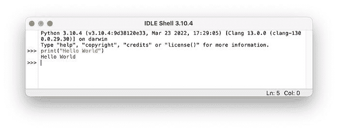**** **来源:[Python 空闲入门](http://web.archive.org/web/20221002005327/https://realpython.com/python-idle/)

IDLE 是用 Python 编写的，非常适合希望用 Python 开发来提高的开发新手。它是轻量级的，易于使用，因此您可以构建简单的项目，如 web 浏览器游戏、基本的 web 抓取应用程序和办公自动化程序。

**千年一遇**

## Thonny 也是为用 Python 写作的初学者设计的。它支持不同的代码单步执行方式、一步一步的表达式求值、调用堆栈的详细可视化以及解释引用和堆概念的模式。

Thonny is also designed for beginners writing in Python. It supports different ways of stepping through the code, step-by-step expression evaluation, detailed visualization of the call stack and a mode for explaining the concepts of references and heap.

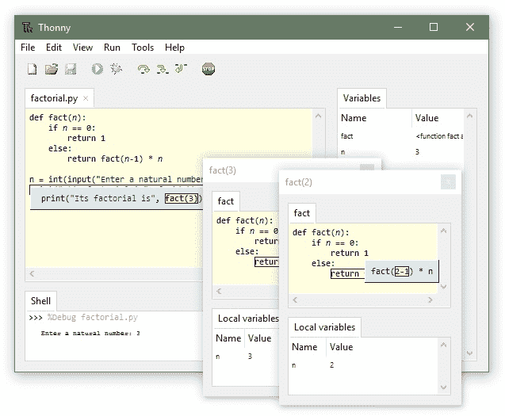

来源: [Thonny，面向初学者的 Python IDE](http://web.archive.org/web/20221002005327/https://thonny.org/)

Thonny 很棒，因为它是免费的，使用简单，但也有许多特性使它对完整的 Python 开发项目很有用。您可以通过内置的调试器助手了解代码中断的原因，该助手可以突出错误并提出改进建议。

**Atom**

## Atom 是由 GitHub 的工程师开发的开源文本编辑器。文本编辑器对于编写和记录优秀的代码至关重要，Atom 附带了专用的可插拔 Python 编译器，可以设置为 Python IDE。

Atom is an open source text editor developed by engineers at GitHub. A text editor is crucial to both writing and documenting great code, and Atom comes with a dedicated pluggable Python compiler and can be set up as a Python IDE.

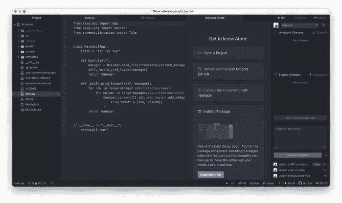

来源: [IDE-Python](http://web.archive.org/web/20221002005327/https://atom.io/packages/ide-python)

Atom 创建了一些包来添加到它的 hackable core 中，这些包提供了自动完成、代码行和代码高亮等特性。Atom 的插件通过扩展核心功能来帮助简化 Python 开发过程，开发人员可以根据自己的需求轻松定制 Atom 的各个方面。

**埃里克 Python**

## Eric 是一个全功能的 Python 编辑器和 IDE，用 Python 编写。它被设计成一个功能齐全的日常代码编辑器，但也可以用作专业的项目管理工具。Eric 应用广泛，提供了完整的开发特性，非常适合 web 应用程序和科学研究等项目。

Eric is a full featured Python editor and IDE, written in Python. It is designed as a full-featured, everyday code editor but can also be used as a professional project management tool. Eric is widely used, providing a full complement of development features, and is great for projects such as web applications and scientific research.

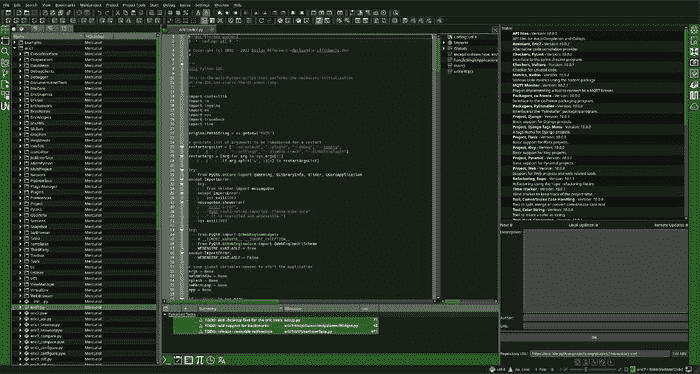

来源: [The Eric Python IDE](http://web.archive.org/web/20221002005327/https://eric-ide.python-projects.org/)

Eric 包括一个插件系统，这意味着您可以使用从网上下载的插件来扩展功能，并且与许多其他编程语言兼容，这使它成为 Python 开发的一个高度灵活和通用的工具。

翼

## Wingware 的集成开发环境 Wing Python IDE 系列是专门为 Python 编程语言创建的，支持编辑、测试、调试、检查/浏览和错误检查 Python 代码。

The Wing Python IDE family of integrated development environments from Wingware was created specifically for the Python programming language, with support for editing, testing, debugging, inspecting/browsing, and error checking Python code.

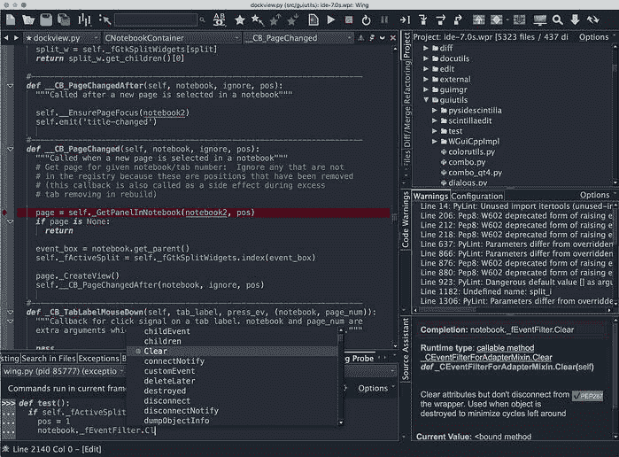

来源: [翼蟒 IDE](http://web.archive.org/web/20221002005327/https://wingware.com/)

Wing 在多进程、多线程程序上运行良好，支持远程调试。该编辑器也是通用的，因其高功能性而非常受开发人员的欢迎。它有 VI 和 emacs 模式，可以用 Python 脚本扩展。翼搏也有很好的支撑。

崇高的文本

## Sublime Text 是一个常用的文本编辑器，用于编写 Python 代码。Sublime Text 光滑的用户界面以及它在语法突出显示、源文件查找和分析代码指标方面的众多扩展，使编辑器比 Vim 和 Emacs 等其他应用程序更容易被新程序员使用。

Sublime Text is a commonly-used text editor used to write Python code. Sublime Text's slick user interface along with its numerous extensions for syntax highlighting, source file finding and analyzing code metrics make the editor more accessible to new programmers than some other applications like Vim and Emacs.

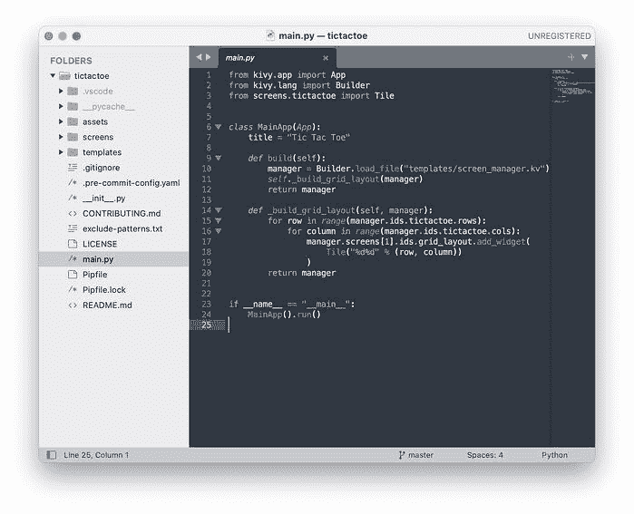

来源: [崇高文字](http://web.archive.org/web/20221002005327/https://www.sublimetext.com/)

Sublime Text 以其速度、易用性和强大的社区支持而闻名，这使它成为初学者或项目期限紧张的人的一个很好的工具。作为 Python 开发人员使用 Sublime Text 的额外好处是插件是用 Python 编写的。Python 开发者可以用他们自己的编程语言扩展崇高的文本，而不是学习一门新的语言。

PyDev

## PyDev 是 Eclipse 的第三方插件，Eclipse 是用于 Python 编程的集成开发环境。PyDev 支持代码重构、图形调试、代码分析等功能。

PyDev is a third-party plug-in for Eclipse, which is an Integrated Development Environment used for programming in Python. PyDev supports code refactoring, graphical debugging, code analysis among other features.

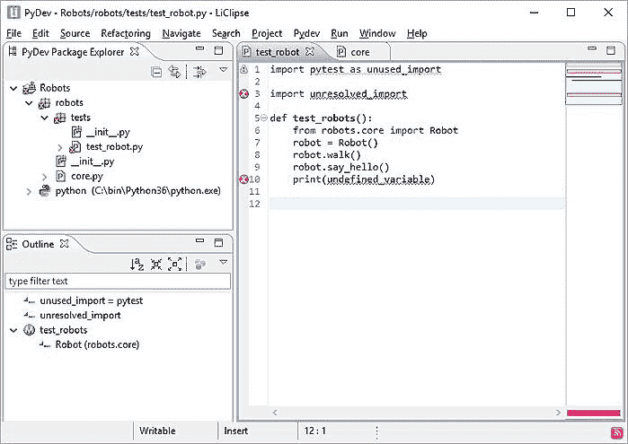

来源: [PyDev](http://web.archive.org/web/20221002005327/https://www.pydev.org/)

PyDev 深受 Python 开发人员的喜爱，因为它是免费的，易于上手，并提供了代码完成工具和高级分析，从而简化了开发过程，使程序员的生活更加轻松。它还提供了交互式控制台、代码覆盖率和基本语法突出显示。

Spyder

## Spyder 是一个跨平台的 IDE，自 2012 年以来一直由 Python 社区维护。使用 Spyder 的部分好处是它独特地结合了高级分析、编辑、调试、交互式执行和深入检查。

Spyder is a cross-platform IDE which has been maintained by the Python community since 2012\. Part of the benefit of using Spyder is its unique combination of advanced analysis, editing, debugging, interactive execution, and in-depth inspection.

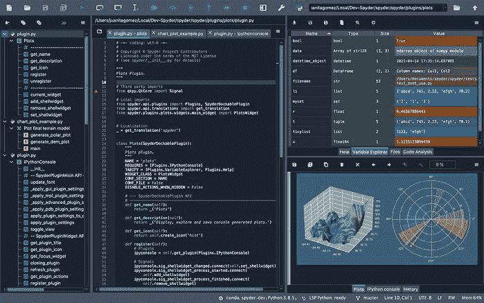

来源: [Spyder，科学的 Python 开发环境](http://web.archive.org/web/20221002005327/https://www.spyder-ide.org/)

这为开发人员提供了高级的可视化功能，如交互式控制台、文档视图、变量浏览器和其他开发工具，以及强大的社区支持。Spyder 是数据科学、工程和分析的优秀工具。

皮查姆

## PyCharm 是最流行的 Python IDEs 之一。这是因为它附带了多个模块、包和工具，可以加快 Python 开发，同时减少编写优秀代码所需的工作量。PyCharm 可以根据任何开发需求进行定制，具有图形调试、集成单元测试、版本控制系统集成支持和数据科学支持等特性。

PyCharm is one of the most popular Python IDEs. This is because it comes with multiple modules, packages, and tools to empower faster Python development while cutting down the effort required to write great code. PyCharm can be customized to any development requirement, and features graphical debugging, integrated unit testing, integration support for version control systems and support for data science.

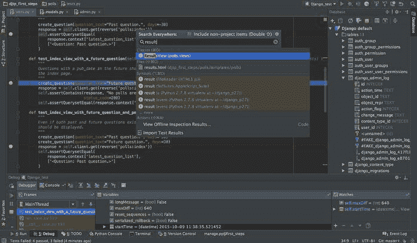

来源: [皮查姆](http://web.archive.org/web/20221002005327/https://www.jetbrains.com/pycharm/)

Python 帮助开发人员构建 Python 插件，并提供可定制的用户界面，该界面可以根据开发项目的需要进行调整。PyCharm 由 JetBrains 开发，帮助开发人员编写可维护的代码，通过 PEP8 检查、测试帮助、智能重构和大量检查来控制质量，并提供智能代码完成、即时错误检查和快速修复、轻松的项目导航等。

Visual Studio 代码

## Visual Studio 代码是一个开源的、可扩展的、轻量级的编辑器，可在所有平台上使用。它可以在 Linux、Mac 和 WIndows 上工作，使得它可以跨所有平台轻松访问，并且它包括语法突出显示、代码完成、对象定义、重构和代码导航功能。

Visual Studio Code is an open-source, extensible, light-weight editor available on all platforms. It works on Linux, Mac and WIndows, making it easily accessible across all platforms, and it includes syntax highlighting, code completion, object definition, refactoring, and code navigation abilities.

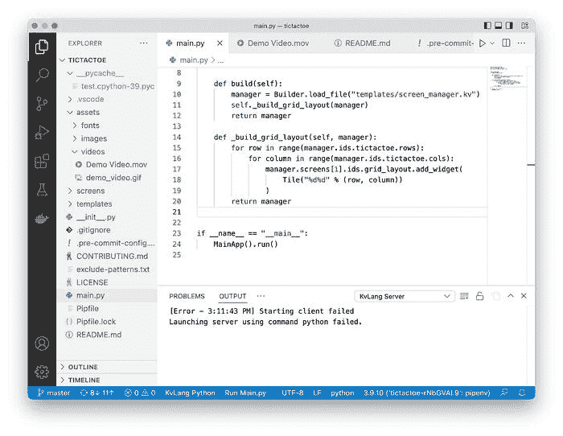

来源: [Visual Studio 代码](http://web.archive.org/web/20221002005327/https://code.visualstudio.com/docs/languages/python)

精力

## 最后但并非最不重要。Vim 是“Vi - Improved”作为 vim 的简写，是 Vi editor 的扩展版本。Vim 有一个著名的哲学“当开发人员避免把手从键盘上拿开时，他们会更有效率。”它给了爱上终端、讨厌把手从键盘上移开的开发者一种奇妙的快感。

Last but not the least. Vim is shorthand of “Vi - Improved” as vim and an extended version of Vi editor. Vim has a famous philosophy “Developers are more productive when they avoid taking their hands off the keyboard. ” It gives a wonderful thrill to developers who fall in love with the terminal and hate to move their hands off the keyboard.

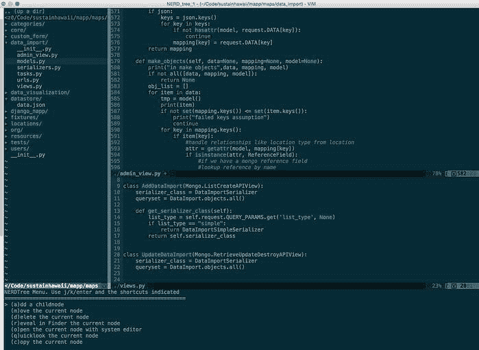

来源: [全栈 Python，Vim](http://web.archive.org/web/20221002005327/https://www.fullstackpython.com/vim.html#:~:text=The%20python%2Dmode%20project%20is,language%20for%20using%20the%20editor.)

Vim 使开发人员能够在没有 UI 选择的 Linux 服务器上编辑和调试代码。它支持各种插件，可以配置这些插件来增强作为 Python IDE 的 vim。了解有关配置 where " [Vim 和 Python 天作之合](http://web.archive.org/web/20221002005327/https://realpython.com/vim-and-python-a-match-made-in-heaven/)"的更多信息。

准备好使用 Python IDEs 了吗？

## 有了这么多的选项来帮助[增强您的 Python 应用程序开发](/web/20221002005327/https://www.netguru.com/services/python-development)，任何人都很容易开始，但是这些 ide 也帮助有经验的开发人员和程序员在编写代码和维护软件时简化他们的过程。

这些 ide 具有从语法突出显示、代码编辑器、智能代码导航和智能代码完成到[数据科学](/web/20221002005327/https://www.netguru.com/blog/python-versus-scala)功能和集成调试器工具等多种功能，包含优化您的 Python 开发并确保您向客户发布最佳应用的基本工具。

无论您是从 IDLE 开始还是利用 PyCharm 的全部功能，都很难知道哪个 IDE 适合您的特定项目。如果你在读完这篇文章后仍然不确定，今天就联系 Netguru 吧。我们有一个 Python 开发专家团队，他们很乐意帮助解决任何项目需求。

Whether you’re starting with IDLE or taking advantage of the full features of PyCharm, it can be difficult to know which IDE suits the needs of your specific project. If you’re still unsure after reading this article, get in touch with Netguru today. We have a team of expert Python developers who are happy to help with any project requirements.**