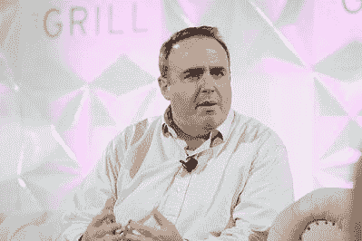

# 2020 年纽约十大科技记者

> 原文：<http://web.archive.org/web/20230307163032/https://www.netguru.com/blog/top-tech-journalists-in-new-york>

 记者在向全世界传播知识方面发挥着关键作用。

他们需要尽可能准确地报道新闻——并揭示今天正在建设的明天的创新。在这个领域，科技记者的职责是发现科技领域的下一个重大事件，并对其进行报道，以便我们都了解他们如何为世界的成功做出贡献。

以下是驻纽约的十位著名科技记者。关注他们即将推出的产品，确保你了解技术前沿发生了什么。

## 彼得·卡夫卡

信用: [Vox](http://web.archive.org/web/20220925204520/https://www.vox.com/2018/8/23/17770898/jason-hirschhorn-recode-media-peter-kafka-podcast-full-transcript)

Peter 是报道科技的知名记者之一，常驻纽约。目前，他是 Recode Media 的高级记者，这是著名的卡拉·斯威舍参与的同一个网络。Recode Media 是 Vox 网络家族的一部分。

彼得也是 Recode Code Conference(T2)的联合制作人，这是科技和新闻业最大的会议之一。众所周知，Recode 是唯一能让史蒂夫·乔布斯出来谈话的会议之一。

这个人也有相当的新闻背景。从 1997 年到 2005 年，他在《福布斯》报道科技，后来他跳槽到**硅谷内幕**成为该网站的执行主编。Peter 目前居住在纽约布鲁克林区，负责纽约市和全国的技术工作。

**最近的故事:**

[婴儿优达可不便宜](http://web.archive.org/web/20220925204520/https://www.vox.com/recode/2019/11/26/20976319/streaming-war-cost-16-billion-netflix-disney-hbo-warnermedia)

[网飞说它毕竟向权力说了实话](http://web.archive.org/web/20220925204520/https://www.vox.com/recode/2019/11/14/20965037/netflix-reed-hastings-ted-sarandos-censorship-saudi-arabia-truth-power-hasan-minhaj)

[迪士尼称其新的迪士尼+流媒体服务非常受欢迎，以至于你无法播放它](http://web.archive.org/web/20220925204520/https://www.vox.com/recode/2019/11/12/20961365/disney-streaming-outage-bamtech)

**社交媒体存在:** [推特](http://web.archive.org/web/20220925204520/https://twitter.com/pkafka)和 [LinkedIn](http://web.archive.org/web/20220925204520/https://www.linkedin.com/in/peterkafka/%27)

麦克杜斯

鸣谢: [推特](http://web.archive.org/web/20220925204520/https://twitter.com/mdudas)

## 迈克·杜达斯是一名顶级记者，专注于区块链和密码世界。他是 Block 的首席执行官，Block 是加密货币中发生的任何事情的第一个也是最后一个词。事实上，它被定位为整个加密领域的世界领先权威。

Mike 也参与了其他技术项目。根据他的 Twitter，他帮助迪士尼进行企业发展，曾是 Google Pay 推出团队的成员，也是 Button 的联合创始人，这是一种在手机上做生意的更好方式。

他的整个背景非常适合金融科技，而金融科技又非常适合总部设在纽约。为区块链项目或公司工作的创始人可能会很好地向迈克寻求故事(或仅仅是知识)。

**最近的故事:**

[早期以太坊顾问 Steven Nerayoff 因涉嫌数百万美元的加密货币勒索案被捕](http://web.archive.org/web/20220925204520/https://www.theblockcrypto.com/linked/40211/early-ethereum-advisor-steven-nerayoff-arrested-in-alleged-multi-million-dollar-cryptocurrency-extortion-scheme)

[Capital One 黑客利用一个常见的亚马逊云漏洞访问 1.06 亿个账户](http://web.archive.org/web/20220925204520/https://www.theblockcrypto.com/linked/34721/capital-one-hacker-exploits-a-common-amazon-cloud-vulnerability-to-access-106-million-accounts)

[MoneyGram 谈论 Ripple 合作伙伴关系，与 XRP 和 xRapid 一起上线，在 Q2 盈利](http://web.archive.org/web/20220925204520/https://www.theblockcrypto.com/linked/34704/moneygram-talks-up-ripple-partnership-goes-live-with-xrp-and-xrapid-in-q2-earnings)

**社交媒体存在:** [推特](http://web.archive.org/web/20220925204520/https://twitter.com/mdudas)和 [LinkedIn](http://web.archive.org/web/20220925204520/https://www.linkedin.com/in/mdudas)

露丝·里德

鸣谢: [推特](http://web.archive.org/web/20220925204520/https://twitter.com/ruthreader)

Ruth Reader 是 Fast Company 的作家，通常报道科技和健康的交集。跟随 Ruth 的好处是她非常专注于自己的领域，因为她主要负责健康技术。

因为她是一个崭露头角的作家，所以她比制片人或编辑更容易接近。这意味着她总是在健康技术领域寻找故事。虽然她常驻纽约，但她报道的是发生在她所在地之外的事情，以及科技和健康的总体趋势。

## **最近的故事:**

如果你让研究人员监视你，你的 iPhone 可以帮助追踪疾病

[Kaiser Permanente 正在重新设计医学院，从尸体开始](http://web.archive.org/web/20220925204520/https://www.fastcompany.com/90434211/kaiser-permanente-is-reinventing-medical-school-digital-cadavers-and-all)

[计划生育的新工具可以帮助浏览令人眼花缭乱的堕胎法律世界](http://web.archive.org/web/20220925204520/https://www.fastcompany.com/90429170/planned-parenthoods-new-tool-can-help-navigate-the-dizzying-world-of-abortion-laws)

**社交媒体存在:** [推特](http://web.archive.org/web/20220925204520/https://twitter.com/RuthReader)和 [LinkedIn](http://web.archive.org/web/20220925204520/https://www.linkedin.com/in/ruthreader/)

亚历克斯·康拉德

信用 : [福布斯](http://web.archive.org/web/20220925204520/https://www.forbes.com/sites/alexkonrad/#4ca403c83c5f)

亚历克斯·康拉德是《福布斯》的助理编辑，报道纽约和更大的美国生态系统的技术和风险投资。Alex 还负责运行**迈达斯列表和云 100** 。Midas 榜单是顶级风险投资家的年度排名，从 1 到 100。在硅谷，这已经成为一个相当热门的话题，因为风投们都暗暗希望自己能上榜。cloud 100 由 100 家最佳私有云公司组成，由 Alex 带领的福布斯进行排名。

这让亚历克斯在《福布斯》身负重任，他通常都能胜任。如果你去看看他的 Twitter 个人资料，你会发现他是封面故事的主角，讲述了 [UiPath](http://web.archive.org/web/20220925204520/http://www.uipath.com/) 成长为一家价值数十亿美元的公司。如果你正在**打造一款科技产品，并希望一名高调的记者**对你进行报道，亚历克斯一定会在你的名单上。

**最近的故事:**

[Product Hunt 创始人 Ryan Hoover 筹集了 1000 万美元的第二笔基金，用于更多的早期实验](http://web.archive.org/web/20220925204520/https://www.forbes.com/sites/alexkonrad/2019/11/25/product-hunt-founder-ryan-hoover-raises-10-million-second-fund/)

## [软银的愿景基金正在商谈投资一家名为 EquipmentShare 的建筑初创公司，其运营利润颇丰](http://web.archive.org/web/20220925204520/https://www.forbes.com/sites/alexkonrad/2019/11/18/softbank-looks-to-invest-equipmentshare-unicorn/)

[红杉风投 Roelof Botha 谈直接上市和软银:‘好的投资者是减震器，而不是放大器’](http://web.archive.org/web/20220925204520/https://www.forbes.com/sites/alexkonrad/2019/10/31/sequoia-vc-roelof-botha-under-30-summit/)

**社交媒体存在:** [推特](http://web.archive.org/web/20220925204520/https://twitter.com/alexrkonrad)和 [LinkedIn](http://web.archive.org/web/20220925204520/https://www.linkedin.com/in/alexrkonrad/)

宝琳娜·马里诺娃

信用 : [推特](http://web.archive.org/web/20220925204520/https://twitter.com/polina_marinova)

宝琳娜正在经营《财富》杂志的条款清单简讯。无论是在硅巷、硅谷，还是在两者之间的某个地方，宝琳娜都在寻找可以写的创始人和资助者。

宝琳娜还主持一个名为“简介”的个人时事通讯。你可以在 Substack 上找到它，这是一个新工具，允许任何人开始付费简讯。

关于宝琳娜，有趣的是她在电子邮件上花了很长时间。通过在《福布斯》做每日时事通讯和每周个人时事通讯，她为自己建立了一个长期繁荣的职业生涯。

**查找她的简讯:**

在此找到条款清单

在此找到个人资料

## **社交媒体存在:** [推特](http://web.archive.org/web/20220925204520/https://twitter.com/polina_marinova)和 [LinkedIn](http://web.archive.org/web/20220925204520/https://www.linkedin.com/in/polinamarinova/)

杰森·德尔·雷

信用: [推特](http://web.archive.org/web/20220925204520/https://twitter.com/delrey)

杰森是 Recode 的记者，主要负责报道与亚马逊有关的一切。这对读者来说很重要，因为成千上万的小企业和 D2C 品牌正在与亚马逊竞争。杰森还是巨人之地 **[播客](http://web.archive.org/web/20220925204520/https://www.voxmedia.com/about-vox-media/2019/7/22/20703356/land-of-the-giants-amazon-podcast-recode-vox-media-jason-del-rey)**的主持人，该播客深入探讨了亚马逊是如何走到今天这一步的。除了报道亚马逊，他还报道了整个电子商务行业以及科技如何改变实体体验。

最后，他还负责定期举办的系列活动 [Code Commerce](http://web.archive.org/web/20220925204520/https://events.recode.net/events/code-commerce-2019/) ，该活动邀请了互联网和商业领域的高管和创始人。Jason 在[格言](http://web.archive.org/web/20220925204520/http://adage.com/)开始了他的职业生涯，他写了一些广为流传的故事，比如 2016 年杰克·多西回归 Twitter[。](http://web.archive.org/web/20220925204520/https://www.cnbc.com/2015/10/03/jack-dorsey-is-ready-to-save-twitter.html)

**最近的故事:**

内森·拉特卡是畅销书作家和科技播客主持人。他也是骗子吗？

亚马逊将一份价值 100 亿美元的五角大楼合同输给了微软。现在它直接指责特朗普总统。

[HBO Max 想成为下一个有线电视束，而不是下一个网飞](http://web.archive.org/web/20220925204520/https://www.vox.com/recode/2019/11/18/20970066/hbo-max-netflix-streaming-cable-bundle-john-stankey-warnermedia-cord-cutting)

**社交媒体存在:** [推特](http://web.archive.org/web/20220925204520/https://twitter.com/DelRey)和 [LinkedIn](http://web.archive.org/web/20220925204520/https://www.linkedin.com/in/jasondelrey/)

詹娜·沃瑟姆

## 信用:[Createcultivate.com](http://web.archive.org/web/20220925204520/https://www.createcultivate.com/blog/cc-100-content-creator-jenna-wortham)

詹娜是《纽约时报》的特约撰稿人，也是播客《T2》的共同主持人，该播客仍在处理中她也是[黑人未来](http://web.archive.org/web/20220925204520/https://www.amazon.com/Black-Futures-Kimberly-Drew/dp/039918113X)的联合编辑，这本书讲述了当今美国黑人的生活。詹娜是全纽约最有影响力的作家之一，仅从她的推特粉丝数来看，目前已有 70 万。

詹娜还曾经为《纽约时报》的简写本**、[、比特](http://web.archive.org/web/20220925204520/https://bits.blogs.nytimes.com/author/jenna-wortham/)、撰稿。她没有直接报道科技，但她报道了科技中的文化以及这种文化如何随着科技趋势而变化。在《T4 时报》之前，她是《连线》杂志的文化记者。**

**最近的故事:**

我们研究了 HBO 的《守望者》和奉俊昊的《寄生虫》中隐藏的历史

我们研究了《小丑》、《继承》和《搏击俱乐部》中男性精神疾病的描述

社交媒体已被证明是非二胎人群寻找和塑造他们在性别谱系中独特位置的完美工具。

**社交媒体存在:** [推特](http://web.archive.org/web/20220925204520/https://twitter.com/jennydeluxe?ref_src=twsrc%5Egoogle%7Ctwcamp%5Eserp%7Ctwgr%5Eauthor)和 [LinkedIn](http://web.archive.org/web/20220925204520/https://www.linkedin.com/in/jennawortham)

史蒂夫·洛尔

信用 : [推特](http://web.archive.org/web/20220925204520/https://twitter.com/stevelohr)

史蒂夫是科技行业的巨头——他已经在《纽约时报》报道科技和商业超过 20 年了。他甚至是 2013 年因解释性报道而获得普利策奖的团队**的一员。**

## 他也没有在纽约时报工作过。史蒂夫为《大西洋月刊》和《华盛顿月刊》等出版物撰稿。

史蒂夫也是一名作家，他写了《数据主义》( data ism )( T1 ),这本书探讨了企业如何利用数据做出更好的决策。他还写了其他关于软件编程的书。

**最近的故事:**

随着大型科技的发展，初创企业转向商业市场

[超越利润](http://web.archive.org/web/20220925204520/https://www.nytimes.com/2019/11/11/business/dealbook/trust-communication-and-corporations.html?rref=collection%2Fbyline%2Fsteve-lohr)

如果有必要的话，我们应该做些什么来控制大型科技公司？

**社交媒体存在:** [推特](http://web.archive.org/web/20220925204520/https://twitter.com/SteveLohr)和 [LinkedIn](http://web.archive.org/web/20220925204520/https://www.linkedin.com/in/steve-lohr-76274523/)

娜塔莎·辛格

信用 : [纽约时报](http://web.archive.org/web/20220925204520/https://www.nytimes.com/by/natasha-singer)

娜塔莎是《纽约时报》的科技记者，报道商业、教育技术和消费者隐私。她还计划让 T2 在纽约时报学校教书，培养未来的记者和报纸记者。

虽然 Natasha 最近扩展了她的范围，但她过去非常专注于报道与数据相关的故事。这可能是因为她是致力于研究数据的非营利性研究机构[数据和社会](http://web.archive.org/web/20220925204520/https://datasociety.net/)的校友。

## **以前的故事:**

[苹果的影响力重塑医学研究](http://web.archive.org/web/20220925204520/https://www.nytimes.com/2019/11/14/technology/apple-harvard-health-studies.html?rref=collection%2Fbyline%2Fnatasha-singer)

[谷歌存储和分析数百万份健康记录](http://web.archive.org/web/20220925204520/https://www.nytimes.com/2019/11/11/business/google-ascension-health-data.html?rref=collection%2Fbyline%2Fnatasha-singer)

政府保护我们的食物和汽车。为什么不是我们的数据？

**社交媒体存在:** [推特](http://web.archive.org/web/20220925204520/https://twitter.com/natashanyt)和 [LinkedIn](http://web.archive.org/web/20220925204520/https://www.linkedin.com/in/natasha-singer-512abb81)

杰森·茨威格

信用:[leadingauthorities.com](http://web.archive.org/web/20220925204520/https://www.leadingauthorities.com/speakers/jason-zweig)

杰森是《华尔街日报》的科技记者，主要报道风险投资和天使投资方面的新闻。他还为畅销书《聪明的投资者 T2》的最新版本写了评论。

他专注于为报纸赚钱，是这家报纸更知名的作家之一。杰森开始在《财富》杂志工作，经常是《时代》和 CNN 的特约专栏作家(T2)。茨威格是与史密森尼学会有关的美国金融博物馆(T5)的董事。

**最近的故事:**

[跳过伟哥广告，财务顾问来了](http://web.archive.org/web/20220925204520/https://www.wsj.com/articles/move-over-viagra-ads-here-come-the-financial-advisers-11573833621)

[解开投资之谜](http://web.archive.org/web/20220925204520/https://www.wsj.com/articles/ironing-out-an-investing-mystery-11573228804)

## [有时股票市场需要“信仰骑士”](http://web.archive.org/web/20220925204520/https://www.wsj.com/articles/sometimes-the-stock-market-needs-knights-of-faith-11572620223)

**社交媒体存在:** [推特](http://web.archive.org/web/20220925204520/https://twitter.com/jasonzweigwsj)和 [LinkedIn](http://web.archive.org/web/20220925204520/https://www.linkedin.com/in/jason-zweig-78245616)

纽约的科技专栏作家

无论你是进入 **[创业公司、风险投资](/web/20220925204520/https://www.netguru.com/blog/top-10-startup-accelerators-nyc)、健康技术**，还是与谁在建设未来有关的任何事情，这些记者都有好东西。

他们正在努力首先发现技术世界发生了什么，并将其报告给那些依赖这些信息来指导其商业决策的人——或者只是对我们社会如此重要的一个方面感兴趣的任何人。

请关注他们的 Twitter 消息，因为新闻往往是在 Twitter 上首先发布的。快乐阅读！

**Previous stories:**

[Apple’s Reach Reshapes Medical Research](http://web.archive.org/web/20220925204520/https://www.nytimes.com/2019/11/14/technology/apple-harvard-health-studies.html?rref=collection%2Fbyline%2Fnatasha-singer)

[Google to Store and Analyze Millions of Health Records](http://web.archive.org/web/20220925204520/https://www.nytimes.com/2019/11/11/business/google-ascension-health-data.html?rref=collection%2Fbyline%2Fnatasha-singer)

[The Government Protects Our Food and Cars. Why Not Our Data?](http://web.archive.org/web/20220925204520/https://www.nytimes.com/2019/11/02/sunday-review/data-protection-privacy.html?rref=collection%2Fbyline%2Fnatasha-singer)

**Social media presence:** [Twitter](http://web.archive.org/web/20220925204520/https://twitter.com/natashanyt) and [LinkedIn](http://web.archive.org/web/20220925204520/https://www.linkedin.com/in/natasha-singer-512abb81)

## Jason Zweig

Credit: [leadingauthorities.com](http://web.archive.org/web/20220925204520/https://www.leadingauthorities.com/speakers/jason-zweig)

Jason is **a tech reporter for the Wall Street Journal**, mainly covering news in venture capital and angel investing. He has also written commentary for the updated version of the popular book [The Intelligent Investor](http://web.archive.org/web/20220925204520/https://www.amazon.com/Intelligent-Investor-Definitive-Investing-Essentials/dp/0060555661).

He focuses on all things money for the paper and is one of the outlet’s more well-known writers. Jason started at [Money magazine](http://web.archive.org/web/20220925204520/http://money.com/money/) and was often **a guest columnist for Time and CNN**. Zweig was a trustee of the [Museum of American Finance](http://web.archive.org/web/20220925204520/https://www.moaf.org/), which is related to the Smithsonian Institution.

**Recent stories:**

[Move Over Viagra Ads, Here Come the Financial Advisers](http://web.archive.org/web/20220925204520/https://www.wsj.com/articles/move-over-viagra-ads-here-come-the-financial-advisers-11573833621)

[Ironing Out an Investing Mystery](http://web.archive.org/web/20220925204520/https://www.wsj.com/articles/ironing-out-an-investing-mystery-11573228804)

[Sometimes the Stock Market Needs ‘Knights of Faith’](http://web.archive.org/web/20220925204520/https://www.wsj.com/articles/sometimes-the-stock-market-needs-knights-of-faith-11572620223)

**Social media presence:** [Twitter](http://web.archive.org/web/20220925204520/https://twitter.com/jasonzweigwsj) and [LinkedIn](http://web.archive.org/web/20220925204520/https://www.linkedin.com/in/jason-zweig-78245616)

## Tech columnists in NYC

Whether you’re into **[startups, venture capital](/web/20220925204520/https://www.netguru.com/blog/top-10-startup-accelerators-nyc), healthtech**, or anything having to do with who is building the future, these journalists have the goods.

They are doing the hard work to find out what happens in the tech world first and reporting it to those who rely on such information to guide their business decisions—or just anybody interested in such an important aspect of our society.

Stay tuned to their Twitter feeds, as news tends to break first on Twitter. Happy reading!