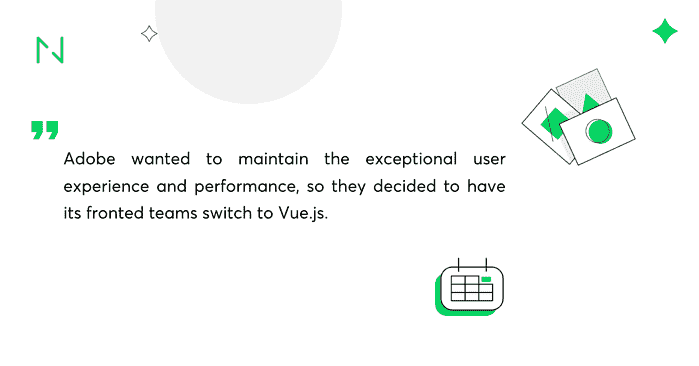
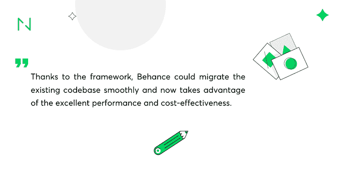

# 已经信任 Vue.js 的 15 家顶级公司–应用示例

> 原文：<http://web.archive.org/web/20230307163032/https://www.netguru.com/blog/vue-js-companies>

 Vue.js has already earned a significant spot among the most popular JavaScript frameworks and many well-known companies use Vue.js such as Facebook, Netflix or Adobe.

去年它的受欢迎程度增长惊人，而且肯定不会很快停止。

开发人员对 [Vue.js](http://web.archive.org/web/20221205215623/https://www.netguru.com/services/vue-js-development) 感兴趣已经有一段时间了，如今这个框架已经被一个活跃的爱好者社区所包围。公司开始看到 Vue.js 的潜力只是时间问题

以下是信任 [Vue.js 的 15 家公司，以及他们认为这是对他们来说最好的技术选择](http://web.archive.org/web/20221205215623/https://www.netguru.com/blog/is-vue-good-fit-for-my-project) 的理由。

## **脸书**

脸书将 Vue.js 用于其新闻订阅的一部分，证明 Vue.js 已经足够成熟，可以实现这样的用例。注意，脸书在其[news feed](http://web.archive.org/web/20221205215623/https://news.ycombinator.com/item?id=14581167)的营销端实现了 Vue.js。

## **网飞**

Vue.js 对于需要工具来构建电影流媒体界面的开发人员来说非常方便。网飞很早就抓住了这个机会——据其开发者之一[Kunal kunda je](http://web.archive.org/web/20221205215623/https://twitter.com/kunal/status/955509810413236224)——在其两个较小的内部应用中应用了 Vue.js。

## **Adobe**

Adobe 提供了一款名为 Portfolio 的产品，这是一款定制的网站构建器，旨在帮助用户展示他们的创意作品。 **Adobe 希望保持卓越的用户体验和性能**，因此他们决定让其前端团队切换到 Vue.js，并顺利迁移现有的代码库。Vue.js 被证明很容易与现有的代码库集成，并且很好地服务于 Adobe。

 

**小米**

## 作为中国最杰出的独角兽之一，小米设计、开发和销售从消费电子产品到软件的一切产品。**这家估值为 1B+美元的令人印象深刻的公司据说使用 Vue.js 来构建其出色的产品，证明了该框架在国际上的广泛采用。**

**阿里巴巴**

## Vue.js 的另一个令人印象深刻的国际采用者是阿里巴巴，一家来自中国的上市公司。与代表类似规模的巨头如百度或腾讯一起，**它相信该框架能够为其客户提供出色的体验。**

**WizzAir**

## 据说廉价航空公司 WizzAir 在其应用程序中使用 Vue.js 构建了奇妙的用户界面。不幸的是，该公司还没有分享任何关于在他们的数字产品中使用 Vue.js 的详细信息。

**欧洲新闻**

## 总部位于法国的多语言新闻媒体服务公司 Euronews 是 Vue.js 技术的另一个采用者。由于 Euronews 应用程序背后的开发人员没有分享他们实现 Vue.js 的任何细节，我们只能猜测它在该公司数字产品中的使用。

**语法**

Grammarly 的前端团队利用 Vue.js 构建了他们的标志性用户界面，该界面既简单又美观。

## 拉腊卡斯特

Laracasts 为开发者提供每天更新的简明截屏，并提供大量学习资源，帮助用户学习 web 开发。**得益于 Vue.js，Laracasts 的用户界面看起来很棒**

## **GitLab**

作为支持整个[软件开发生命周期](/web/20221205215623/https://www.netguru.com/services/software-development)的开源解决方案，GitLab 在实现和维护复杂功能方面遇到了困难，并努力扩展其 Rails + jQuery 应用。
由于 Vue.js 逐渐引入新功能，迁移旧功能是一个选项，没有重写或重构的麻烦。
Vue.js 帮助 GitLab 提升时间&成本效率。它还允许公司实现更复杂的功能，从而增加他们的销售额。 

## **代码船**

Codeship 是一个基于云的持续集成平台，它使用 Vue.js 来处理应用程序中的崩溃和冻结，并使测试变得更容易。
**自从他们实现 Vue.js 以来，他们没有遇到过一个应用程序崩溃，他们的代码更加可靠，易于维护。**
此外，Vue.js 为他们提供了一个[客户欣赏的 UX 助力](/web/20221205215623/https://www.netguru.com/services/ux-design)。

**直播风暴**

## live storm 是一个一体化的网络研讨会解决方案，帮助公司制作现场销售演示和客户培训材料。
**他们在 Vue.js 上的赌注下得很好——这个框架让他们在一周内就开始运营，每月产生 20-30%的收入增长，并得到了客户的积极反馈。**

信任飞行员

## Trustpilot 是一个来自丹麦的消费者评论网站，提供全球范围内的商业评论。它是免费的，对所有用户开放。Trustpilot 在用户页面上使用 Vue.js。

任天堂(日本电子游戏公司及其开发的电脑游戏名称)

## 任天堂是一家生产消费电子产品和视频游戏的日本公司。该公司在 Nintedo 官方网站上使用 Vue.js。它确保访问者可以无缝地浏览游戏和管理他们的用户账户。

行为

## Behance 是展示创意作品的领先平台。Behance 希望从自主开发的解决方案转向社区支持的技术，并选择了 Vue.js.
**由于该框架，Behance 可以顺利迁移现有的代码库，现在可以利用 Vue.js 带来的出色性能和成本效益。** 

Nintendo is a Japanese company producing consumer electronics and video games. The company uses Vue.js on the official Nintedo website. It makes sure that visitors can browse the games and manage their user accounts seamlessly.

## **vue . js 是你项目的正确选择吗？**

我们希望我们列出的使用 Vue.js 的 15 家公司能够帮助您更好地了解不同的企业如何利用这一工具。 **有兴趣看看更多采用 Vue.js 的公司吗？** 下面是 Github 上使用 Vue.js 的项目综合列表。

****

为工作选择合适的工具是一个重要的决定。新技术的发展速度越来越快，很难跟上它们的步伐。自然，每种新技术都有它的缺点和优点。

## 了解知名公司利用某项特定技术有助于建立你对其业务潜力的信心。

还不确定 Vue.js 是否是你项目的正确选择？乒美在[hello@netguru.com](http://web.archive.org/web/20221205215623/mailto:hello@netguru.com)；我们很乐意帮助你做出正确的决定。无论是转向 Vue.js、React 还是任何其他技术，我们都将为您提供支持。

Choosing the right tool for the job is an important decision. New technologies are evolving at an increasing pace, and it’s difficult to keep up with them. Naturally, each new technology has its drawbacks and advantages.

Knowing that recognised companies take advantage of a particular technology helps build your confidence about its potential for your business.

Still not sure whether Vue.js is the right choice for your project? Ping us at [hello@netguru.com](http://web.archive.org/web/20221205215623/mailto:hello@netguru.com); we’ll be happy to help you make the right decision. Whether it's turning to Vue.js, React, or any other technology - we’ve got you covered.