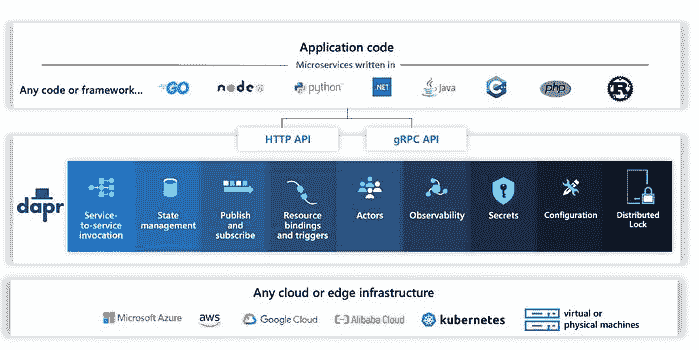
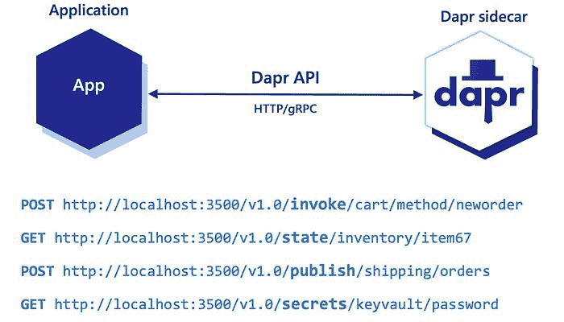

# 什么是 Dapr -分布式应用程序运行时？

> 原文：<http://web.archive.org/web/20230307163032/https://www.netguru.com/blog/what-is-dapr>

云服务提供商主导市场。如果有人想向公众发布一个应用程序，它很有可能会被托管在一个流行的云平台上。使用这些工具，企业可以轻松设置基础设施，为其使用案例选择合适的计划，并扩展应用程序以满足客户需求。

当与当今流行的模式结合时，云服务变得非常有用——本质上是分布式系统的微服务。这种架构面临许多挑战，包括[可扩展性、弹性](http://web.archive.org/web/20230109200333/https://www.netguru.com/blog/building-scalable-cloud-infrastructure)和维护成本。

解决这些问题会占用开发人员大量宝贵的时间。如果只关注业务逻辑，而把这些障碍留给其他事情，会好到哪里去呢？这就是 Dapr 发挥作用的地方。

## 什么是 Dapr？

Dapr 代表分布式应用程序运行时。这是一个自托管的开源项目，通过 API(称为构建块)为[云原生应用](http://web.archive.org/web/20230109200333/https://www.netguru.com/blog/cloud-native-applications)提供额外的功能，简化微服务连接。



实际上，该项目使用 sidecar 模式来集成我们的应用程序。随着 Dapr 边车添加到您的系统中，您可以根据需要利用任意多的构建模块。Dapr 的构造块系统与作为独立容器或进程与应用程序一起运行的组件一起工作。此解决方案意味着通信是通过本地主机完成的。



*使用边车模式的 Dapr】*

我们从中获得了什么？通过 HTTP 或 gRPC，我们可以使用所谓的 Dapr 构建块 API。这些构件提供了微服务最佳实践的实现，否则我们将不得不手工开发。

*   **服务-服务调用** -通过内置的服务发现为服务调用提供可靠和安全的服务。
*   如果我们使用高度并发的系统，我们可以使用 Actor 模式。参与者是轻量级的并发实体，它们以事件驱动的方式相互异步通信。我们为 Dapr Actors 构建块编写逻辑，系统处理可伸缩性和它们之间的通信。
*   **状态管理**——用于将键/值对保存、读取和查询到某种存储中，使您能够创建有状态的服务。
*   发布&订阅——使[微服务](http://web.archive.org/web/20230109200333/https://www.netguru.com/blog/microservices-enterprise-software)能够使用消息系统相互通信。这些 pub 子模块支持死信队列，并保证至少向每个订户发送一次消息。
*   **绑定**——API 提供了触发外部系统的方法，比如数据库、队列和文件系统。
*   Secrets-Secrets building blocks API 使开发人员更容易从 secret store 中使用应用程序机密。我们可以在 Dapr 配置文件和应用程序代码中使用查询。
*   **分布式锁**——使应用程序能够获得对发生更新的资源的独占访问。

在幕后，每个 API 都有 Dapr 组件支持。例如，状态存储可以由 AWS DynamoDb、PostgreSQL 或 Redis 等支持。这种设置很酷的一点是，如果您决定更改组件，您可以自由地这样做。代码保持不变，Dapr 将为您处理实现！

## Dapr 受欢迎吗？

尽管该项目在 2019 年才发布，并且许多组件目前都处于 alpha 状态，但 Dapr 及其构建块系统正迅速获得认可。

我们可以看到 Dapr 组件被用于不同的用例，Dapr 开始在流行趋势列表上引起注意。开发人员定期召开社区会议，甚至有一年一度的博览会，在博览会上，Dapr 社区的成员可以相互见面，谈论他们的项目。

这种运行时越来越受欢迎背后有几个原因。

### 关注业务逻辑

Dapr 旨在让开发者的生活更轻松。这是通过消除在您的应用程序和外部系统之间创建所有交互和集成的负担来实现的，这是微服务工作所必需的。

有了 Dapr 的构建模块，开发人员可以专注于业务逻辑，并使他们的代码免受 SDK 和库的影响，否则就需要 SDK 和库。在这些情况下，Dapr 系统服务几乎总是具有所需的构造块。

此外，还可以生产便携式应用。如果您从一个云提供商迁移到一个新的提供商，您可以更改您的组件，而无需修改代码。

最重要的是，Dapr 构建块提供了配置选项，使应用程序具有高响应性和数据一致性。以下是一些例子:

1.  如果我们决定使用状态管理构建块，我们可以设置想要执行的操作类型。这些选项包括一致性级别、事务和批量读取。
2.  我们可以限制并发设置，这将限制来自 Dapr 的所有请求。
3.  复原力政策有很多。我们可以定义重试、断路器和超时策略。我们可以将这些策略应用于不同的组件，让它成为绑定、发布/订阅或状态管理。

### 灵活性

Dapr 在很多方面都很灵活。如果你有一个用不同语言编写的微服务应用程序，每个团队可以设置 Dapr，因为它支持所有流行的语言和开发人员框架。

因为环境并不重要，Dapr 可以自托管，用于本地开发目的，甚至在您上线之后。此外，Dapr 可以在 Kubernetes 上运行，也可以在任何云平台上运行。

### 可观察性

开箱即用，Dapr 有许多方法来跟踪我们的应用程序。

首先，我们有日志功能。我们可以看到这个特性是由 Dapr 的内部组件在不同的粒度级别上实时完成的。我们还可以选择使用 - enable-API-logging 开关来启用 API 日志。使用这个，我们将能够看到我们的应用程序如何与 Dapr sidecar 通信。

在 Dapr 中启用概要分析将创建一个端点。从那里，我们可以获取分析会话或附加分析器来检查应用程序运行时。如果我们决定走这条路，值得一提的是 Dapr 是用 go 语言编写的，所以这需要一些专业知识。

为了获得更详细、更直观的外观，Dapr 还报告了跟踪数据。虽然最初只支持 Zipkin 格式，但新版本也已更新为支持开放式遥测采集器。

最后但同样重要的是，Dapr 也公开了一个 Prometheus 端点。它发出与 Go 相关的流程指标和与 API 相关的统计数据，包括大量的调用和延迟。

## Dapr 是用来做什么的？

在其核心，Dapr 通过其构建块 API 降低了分布式应用程序开发的复杂性。通过让 Dapr sidecars 处理常见的挑战，如服务发现、消息代理集成和服务调用，Dapr 允许为分布式应用程序构建弹性系统。

更具体地说，Dapr 实例的常见用例包括:

### 多环境应用

Dapr 的组件模型通过将您的代码从所选技术中分离出来，使企业和开发人员受益。这使得您的应用程序与宿主环境无关，并支持可移植性。

同样，Dapr 非常适合多种云场景，其中云资产、软件和应用程序分布在多个云环境中，以使用多个云计算平台来支持单个应用程序或生态系统。

### 多语言微服务架构

如前所述，Dapr 支持许多流行的编程语言，包括 C++、Go、Java、JavaScript、.Net、PHP 和 Python。可选性允许企业利用最适合其用例的语言。多语言支持也使您的分布式微服务应用程序能够使用未来的编程语言。

### 需要提供构造块的应用

使用 Dapr 在云上构建微服务从未如此简单。该项目的灵活性可以归功于 Dapr 提供的微服务。从参与者服务到服务调用或发布-订阅模块到状态管理系统，您可以选择平稳运行应用程序所需的全部或部分 Dapr sidecar 实例。

## 如何用 Java 使用 Dapr？

Java 是一种非常流行的服务器端编程语言。除了大量的库之外，它还具有性能、可读性和可维护性的完美结合。总而言之，对于微服务架构来说，这是一个很好的选择，我们可以利用 Dapr 所提供的东西。

幸运的是， [Java](http://web.archive.org/web/20230109200333/https://www.netguru.com/blog/java-17-features) 也是一种受支持的语言。除了 Spring 支持，我们还有一个官方 SDK 来与 Dapr APIs 通信，这有助于设置一些组件。

Dapr 的优势之一是摆脱了许多我们用来设置与外部系统集成的库依赖，这在用 Java 编程时大放异彩。我们不必太担心生产者和消费者处理事件；我们需要关注的只是 SDK 和业务逻辑。

一旦我们导入了 io.dapr:dapr-SDK 库，我们就可以实例化一个 DaprClient 实例。该客户端将通过默认端口上的 gRPC 与 Dapr 边车通信。如果我们在本地开发中运行多个容器，它可以用环境变量来改变。

另一个需要的库是 io.dapr:dapr-SDK-springboot。它支持对消息消费者方法使用注释。它会自动为我们的应用程序订阅我们感兴趣的主题。

有更多的方法来启动 Dapr 边车。我们可以在应用程序旁边使用 docker compose，或者在我们的机器上安装一个 Dapr CLI。要启动边车，我们需要三样东西:

*   部件规格清单(YAML 文件)，
*   标识应用程序的 id，
*   以及我们正在监听的端口。

```
 apiVersion: dapr.io/v1alpha1
kind: Component
metadata:
name: inventory-state-store
spec:
type: state.aws.dynamodb
version: v1
metadata:
  - name: table
    value: "inventory"
  - name: region
    value: "eu-central-1"
  - name: keyPrefix
    value: "none" 
```

*示例状态管理组件*

值得一提的是，尽管有很多关于如何使用 Dapr 的文档，但大多数都是特定于 Azure 的。例如，如果我们更熟悉 AWS，这可能有点陌生。

## 与 Dapr 合作:最终印象

Dapr 试图实现很多。它有许多功能，可以对我们积极工作的方式产生巨大的影响。它确实涉及到开发微服务所需的大部分方面。问题是它在现实生活中的表现如何。

当我第一次使用 Dapr 时，我对它有一个非常好的第一印象。第一个惊喜是当我开始建立我的项目时。我在考虑我将使用什么样的消息系统，以及我应该使用什么样的库。然后我突然想到，我不需要考虑这个问题；Dapr 会帮我处理的！

当然，我不得不处理一些奇怪的问题。我很难使用状态管理，因为它无法获取我预先填充的数据。原来 Dapr 对键值使用了一些前缀，这些前缀只在 Azure 文档和 Github 上有记载。我还不得不花费额外的时间来找出如何设置我的 Terraform 代码，以便与 Dapr 组件很好地工作。

总的来说，这些小的不便不会影响我整体的积极体验。我相信 Dapr 实现了它的承诺——让开发者的生活更轻松。

如果您有兴趣了解更多关于 Dapr 及其对您的用例的适用性，请不要犹豫[联系 Netguru 并讨论我们的 Java 开发服务](http://web.archive.org/web/20230109200333/https://www.netguru.com/services/web-development/java-development)。