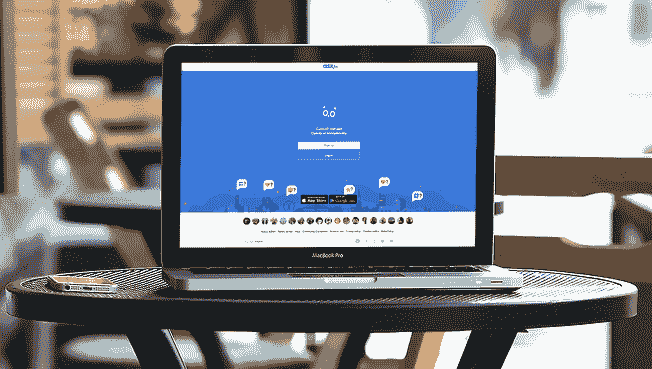
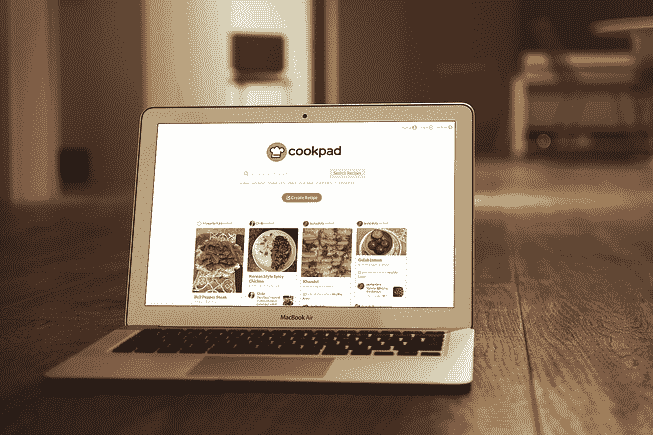
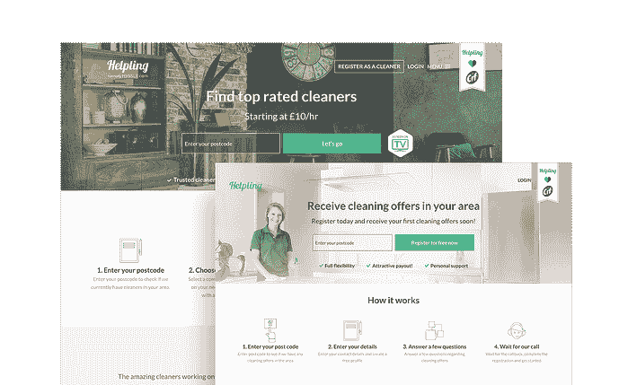
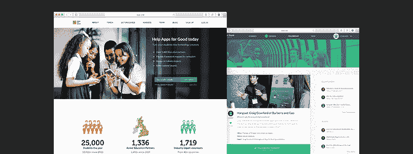
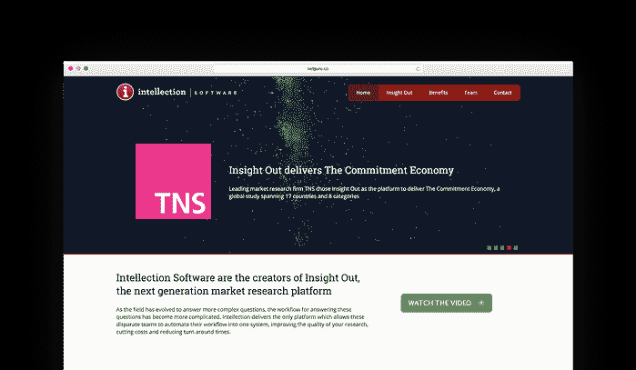
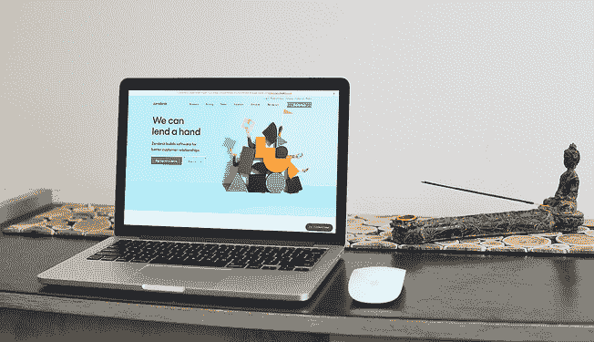
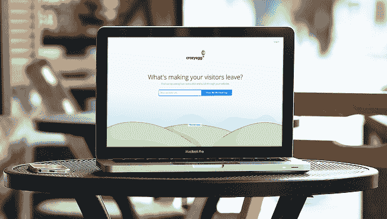

# 2021 年使用 Ruby on Rails 的前 34 家公司

> 原文：<http://web.archive.org/web/20230307163032/https://www.netguru.com/blog/what-is-ruby-on-rails-used-for>

 Ruby on Rails 为[构建高性能的 web 应用](/web/20230101060138/https://www.netguru.com/services/web-development)提供了一个优秀的开发生态系统。

它快速、可靠，并得到了一个由才华横溢的 Ruby on Rails 开发人员组成的大型社区的支持——我们在大多数 web 开发项目中利用了这项技术，为我们的客户提供了市场上最好的解决方案。

## 哪些公司使用 Ruby on Rails？

但我们不是唯一一家使用 RoR 的公司——Airbnb、GitHub、SlideShare、Dribbble、彭博、CrunchBase 和 Shopify(仅举几个例子)也信任 Ruby on Rails 并在他们的应用程序中使用它。

以下是我们对 2021 年使用 Ruby on Rails 的前 34 家公司的总结。

## 1.爱彼迎（美国短租平台）

Airbnb 是每个宁愿在舒适的房子里过夜也不愿预订酒店房间的旅行者必去的网站。Airbnb 背后的想法是将狂热的旅行者与希望向他人出租房屋空间的房东联系起来。

Airbnb 提供来自超过 191 个国家的服务，为全球超过 2 . 6 亿人提供服务，房源数量已经超过 400 万。

2.crunchbase(crunchbase)

有人称 Crunchbase 为创业公司的维基百科——如果你想找到创新公司背后的支持者或投资你最喜欢的项目，它是最终的首选网站。以前的[由最大的科技新闻门户网站之一 TechCrunch](http://web.archive.org/web/20230101060138/https://techcrunch.com/) 提供支持。

## Crunchbase 的后端是在 Ruby on Rails 上编写的，使用 Varnish 进行页面缓存，并一直在发展。

3.Ask.fm

Ask.fm 是一个基于兴趣的社交问答网站，最初是一个来自世界各地的用户向随机的人提出匿名问题的地方，也可以匿名接收回答。由于这种匿名模式，该网站因网络欺凌事件引起了很多争议，但后来改为注册个人资料模式来应对这一问题。

它于 2010 年在拉脱维亚首都里加成立，拥有 2.15 亿用户。

4.彭博

## 彭博为金融公司和组织提供金融软件工具，如分析和股票交易平台、数据服务和新闻。他们的媒体平台结合了股票指数、国际政治领域的突发新闻、技术创新等等。

彭博的流量每月超过 1 亿用户，收入高达 96 亿美元——由迈克尔彭博于 2014 年 12 月 31 日创立。

5\. Dribbble.com

我们最喜欢的设计目录之一！Dribbble.com 是一个设计师可以展示他们的作品、交换意见、收集他们最喜欢的其他艺术家的图像或寻找职业机会的社区。如果你想看看 Dribbble 是如何工作的，[看看我们的简介](http://web.archive.org/web/20230101060138/https://dribbble.com/netguru)和照片下的讨论。

该网站由丹·塞德霍尔姆和里奇·索内特于 2009 年创建，每月接待超过 400 万游客。

## 6.开源代码库

如果你是一名开发人员，这个不需要介绍。最流行的(如果不是最流行的)基于 web 的托管服务之一，用于使用 GIT 的软件开发项目。程序员的社交网络——此外，每个人似乎都喜欢 Octocat！

该网站总部位于旧金山，于 2008 年 7 月 21 日上线。

7.五元

Fiverr.com 是一个全球在线市场，提供任务和服务，被称为“gigs”，以及每份工作 5.00 美元起的微工作。它拥有 190 个国家 100 多个不同类别的 300 多万场演出。

## 该网站总部设在纽约，由米查·考夫曼和谢·威宁格于 2009 年创建。

8.黄页部分

YellowPages 是一项在线服务，允许您搜索当地的企业和联系人列表。该网站被列为美国 40 大网站之一，在美国每月有超过 6000 万的访问者。

YP 是人们用来寻找和联系当地企业的原始来源——它于 2012 年 5 月推出，整合了美国电话电报公司互动和美国电话电报公司广告解决方案。

9.烹饪垫

## COOKPAD 是日本最大的食谱网站，允许访问者上传和搜索用户原创的食谱。根据他们的说法，Cookpad 目前被将近一半 20 多岁或 30 多岁的日本女性使用。COOKPAD 共有 1 亿用户，上传了超过 400 万份食谱。

该公司由 Akimitsu Sano 于 1997 年 10 月 1 日创立，总部设在日本东京。

10.帮助别人

Helpling 是一个提供家庭清洁服务的平台，将清洁工和房主联系起来。该公司瞄准了几个市场，包括英国、德国、澳大利亚和法国。这个 Ruby on Rails 应用程序包含了广泛的功能，包括清洁工和房主的搜索工具、注册、账户管理和安全支付。

该服务覆盖全球 200 多个城市，已有超过 100，000 名客户使用。

## 11.永久应用

[Apps for Good](/web/20230101060138/https://www.netguru.com/clients/apps-for-good) 是一家非政府组织，它与教育工作者合作，向 8-18 岁的年轻人提供技术学习课程。自 2012 年以来，教师可以通过专门的电子学习平台获得其课程。

Apps for Good 每年帮助全球一千多所学校和数万名学生。

12.阿特梅斯特

[Artemest 是一家意大利电子商务网站](/web/20230101060138/https://www.netguru.com/featured/artemest-ecommerce-platform),展示由意大利顶级艺术家创作的精选家居装饰、珠宝和生活艺术。他们的使命是通过将最优秀的意大利工匠与世界各地的客户联系起来，保护他们的遗产——在许多情况下，如果不是因为通过网站赢得了更多的客户，Artemest 平台上的艺术家可能不得不关闭他们的业务。

## 他们成倍增长，围绕其业务建立了一个艺术家和策展人社区。《福布斯》、《纽约时报》和《Elle》对该平台进行了专题报道。

13.思考

Intellection 是 Kantar、TNS、益普索和 thinking Panda 等大公司的市场研究平台。该公司提供广泛的产品和工具，让客户能够在几个小时内，而不是几周内，衡量其广告的有效性，进行调查，分析结果，并验证品牌资产的强度。

基于从这些工具中得出的分析，企业可以做出明智、准确的商业决策。

14.幻灯片共享

## SlideShare.net 是一个基于 Web 2.0 的幻灯片托管服务，拥有 8000 万用户和 1.59 亿页面浏览量——用户可以上传他们的 PowerPoint、PDF 或 OpenOffice 演示文稿，并私下或公开分享。

SlideShare 成立于 2006 年 10 月，目前总部位于旧金山，归 LinkedIn Corporation 所有。

15.500 像素

500px 是一个超过 1500 万摄影师的大型社区，他们可以在平台上分享他们的作品，扩大他们的朋友、同事和导师的创意网络，学习新的技术和美学技能，并通过出售照片赚钱。

该公司成立于 2009 年 10 月，总部位于加拿大多伦多，每月接待超过 250 万游客。

## 16.Zendesk

Zendesk 是一家服务软件公司，通过更高的客户参与度和更好的客户洞察来帮助公司改善客户关系。它现在拥有 2，200 多名员工，为 160 个国家和地区的 125，000 名付费客户提供服务。

它由 Mikkel Svane 于 2007 年 8 月创立，总部位于旧金山。

17.声音云

总部位于柏林的 Soundcloud 是一个在线平台，能够发现、流式传输、录制、推广和共享来自世界各地的新兴和主流艺术家的音乐。最初，它的开发是为了让音乐家们彼此分享录音，但这个概念后来扩展成了一个完整的音乐发布工具。

## 现在，该平台拥有超过 2.72 亿注册用户，提供超过 2 亿首歌曲的访问权限，每分钟有 12 小时的音乐上传到 Soundcloud，每月有 1.75 亿独立听众。

18.清楚

Clarity 是一个在线平台，将在营销、销售、风险投资、客户获取和业务发展等领域寻求建议的人与专家和导师联系起来。用户可以浏览或搜索商务专业人士社区，找到合适的人，然后安排一个电话。

根据 Clarity 的数据，每 90 秒钟就有一家初创公司与专家通电话，已经完成了超过 73，000 次通话。

19.沙发冲浪

## Couchsurfing 是一个接待服务和社交网络网站，允许成员作为客人住在某人的家里(寄宿家庭)，招待旅客，会见其他成员，或参加活动。Couchsurfing 是礼物经济的一个很好的例子，在礼物经济中，用户没有义务为服务付费。

couchsurfing 社区规模庞大——2018 年该网站拥有 1500 万会员和 40 万活跃主机。

20.疯狂的蛋

Crazy Egg 是最受欢迎的网站热图服务提供商之一——由在线营销大师尼尔·帕特尔(Neil Patel)和希滕·沙阿(Hiten Shah)创立，Crazy Egg 使营销人员和网站所有者能够根据用户行为改善网站内容和架构。

Crazy Egg 附带了四个强大的工具，可以帮助直观地识别给定页面最受欢迎的区域，查看页面的哪些部分可以工作，哪些部分不可以工作，检查 Google Analytics 不提供的全面分析，并了解用户在网站页面上做什么。

## 21.Groupon

Groupon 是一个全球性的电子商务市场，通过在超过 28 个国家提供活动、旅游、商品和服务，将用户与当地商家联系起来。它主要帮助小企业吸引和留住客户，为他们提供营销工具和服务，以触及潜在客户并实现业务的盈利增长。

Groupon 服务于全球 500 多个城市，在任何时候都拥有 5300 万活跃用户，在全球范围内有超过 425，000 笔活跃交易。

22.Indiegogo

Indiegogo 是一个国际众筹网站，帮助有创造力的发明家寻找资源来资助他们的想法。企业家可以发起众筹活动，并进入一个巨大的社区，帮助他们筹集资金。即使在没有目标和期限限制的活动结束后，也可以筹集资金。除此之外，它还附带了一些有用的工具和服务，如制造和物流咨询。

## Creators 已经从超过 1100 万名捐助者的 80 多万个项目中筹集了超过 16 亿美元——它在 230 多个国家和地区开展业务。

23.Kickstarter

Kickstarter 是我们名单上的另一个众包服务，它帮助许多创意项目筹集资金来资助他们的想法——这是一个超过 1000 万用户的社区，他们提出项目想法或捐赠资金来实现它们。

自 2009 年 4 月 28 日启动以来，1800 万人支持了一个项目，承诺了 50 亿美元，18.8 万个项目成功获得了资助。

24.Pixlr

## Pixlr 是一套基于云的图片工具，用于照片编辑和分享。最初，该套件针对的是非专业人士，但现在这些应用程序涵盖了从简单到高级的照片修改——它为台式电脑和移动设备提供了工具。

Pixlr 由 Ola Sevandersson 于 2008 年在瑞典创立，这款手机应用已经安装了超过 1 亿次。

25.Scribd

Scribd 是一个基于订阅模式的数字图书馆，用户可以访问超过一百万本电子书和有声读物。在基本计划中，用户每月可以访问 x3 书籍、x1 有声书籍以及无限制地访问杂志和文档。

Scribd 现在有 1 亿活跃用户，被称为“图书的网飞”——它于 2007 年 3 月在旧金山成立，在 194 个国家有售。

## 26.MyFitnessPal

MyFitnessPal 提供了一个免费的网络和移动应用程序，通过记录用户吃的食物和运动量来帮助用户减肥。它提供了超过 500 万种食物的营养和卡路里数据库。

MyFitnessPal 被评为最佳免费应用，其总体满意度为 83 ，在维护、卡路里意识和食物多样性方面得分最高——它于 2005 年发布。

27\. Shopify

Shopify 是一个电子商务软件平台，用于在线商店和零售销售点系统在线销售其产品。由于漂亮和可定制的主题，它为企业创建自己的电子商务商店提供了一个简单的解决方案。该公司报告称，使用其平台的商家超过 820，000 家，商品总交易额超过 610 亿美元。

## 该加拿大网站由 Tobias Lütke 于 2008 年 4 月创建。

28.城市词典

《城市词典》是一个众包的在线俚语词典，成立于 1999 年，是对 Dictionary.com 和 Vocabulary.com 的模仿，作为所有俚语的“首选”之地，它获得了巨大的人气。

《城市词典》每月拥有 7500 万独立读者，由亚伦·佩卡姆于 1999 年在旧金山创办。

29\. Whitepages

## Whitepages 是最大的在线目录，包含超过 90%的美国成年人的联系信息和公共记录，它提供了对人、电话号码、地址和您可能需要的所有其他联系信息的访问。

它成立于 1997 年，最初是亚历克斯·阿尔加德的一个爱好——现在每个月都有超过 5000 万的独立用户！

30.Yammer

Yammer 是一个免费的企业社交网络服务，用于组织内部的私人交流。它有助于加入和创建小组，即使在你不确定该问谁的时候也能获得问题的答案，与承包商、客户或姐妹公司合作，并通过将所有文件、照片和视频添加到对话中来保持它们的上下文——Yammer 附带了一个用于 iOS 和 Android 的移动应用程序。

它是由大卫·o·萨克斯和亚当·皮索尼在 2008 年创立的，其母公司是微软公司。

## 31.Twitch.tv

转播所有比赛！Twitch 是游戏玩家的视频平台和社区，每月有超过 3800 万的访客——该网站通过允许他们在任何地方播放、观看和聊天来连接世界各地的游戏玩家。

该网站于 2011 年 6 月由联合创始人作为 Justin.tv 的子公司推出，Twitch 总部位于旧金山。

32.我们喜欢它

We Heart 是一个基于照片的社交网络——它是一个支持静态图像、动态 gif 和视频的可视化平台。他们把自己描述为“灵感之家”和“组织和分享你喜欢的东西”的地方。

## 我们知道它于 2007 年 12 月在巴西正式成立，现在公司总部位于旧金山。

33.好阅读

Goodreads 是世界上最大的读者和书籍推荐网站，用户可以看到他们朋友的书架，了解他们对所有书籍的看法。

Goodreads 于 2007 年 1 月推出，公司位于(惊喜，惊喜！)在旧金山。

34.主题森林

## ThemeForest 是一个专注于网站模板和 Wordpress 主题的在线市场，有超过 10，000 个主题可供选择。该平台于 2008 年推出，是 Envato 的产品，Envato 是一家自筹资金的初创公司，运营着一系列数字市场，为网页设计师出售创意资产，包括主题、图形、视频、音频、摄影和 3D 模型。

它的总部位于澳大利亚墨尔本，每月有超过 240 万的独立访客。

Groupon serves more than 500 cities worldwide and has 53 million active users at any time – it features more than 425,000 active deals globally.

## 我们列出了在 web 应用程序中使用 Ruby on Rails 的 34 家公司。

我们错过了什么吗？

我们当然有！RoR 是一个非常受大企业和小公司欢迎的框架。

它提供了一个[可靠的框架、快速的应用开发、](http://web.archive.org/web/20230101060138/https://www.netguru.com/blog/how-to-deliver-software-fast-with-ruby-on-rails)以及来自社区的出色支持——这就是为什么这么多公司信任 RoR 的原因。

Netguru 拥有一支经验丰富的 RoR 开发团队——如果你有一个用 Ruby [构建的系统，今天就联系我们免费进行代码审查](http://web.archive.org/web/20230101060138/https://www.netguru.com/services/ruby-on-rails-development)。

## 23\. Kickstarter

Kickstarter is another crowdsourcing service on our list that helped many creative projects raise money to fund their ideas – it’s a community of over 10 million users who pitch project ideas or donate funds to bring them to life.

Since their launch on April 28, 2009, 18 million people have backed a project, $5 billion has been pledged, and 188 thousand projects have been successfully funded.

## 24\. Pixlr

Pixlr is a cloud-based set of image tools for photo editing, and sharing. Initially, the suite was targeted at non-professionals but now the apps range from simple to advanced photo revamping – it offers tools for both desktop computers and mobile devices.

Pixlr was founded in Sweden in 2008 by Ola Sevandersson – the mobile app has been installed over 100 million times.

## 25\. Scribd

Scribd is a digital library based on a subscription model in which users have access to a pool of over one million eBooks and audiobooks. In the basic plan a user gets access to x3 books, x1 audiobook and unlimited access to magazines and documents each month.

Scribd has now 100 million active users and has been dubbed “the Netflix for books” – it’s available in 194 countries and was founded in March 2007 in San Francisco.

## 26\. MyFitnessPal

MyFitnessPal offers a free app for both web and mobile that helps users lose weight by keeping track of the foods they eat and how much they exercise. It provides access to a nutrition and calorie database with over 5 million foods.

[MyFitnessPal was rated the best free app](http://web.archive.org/web/20230101060138/http://www.prnewswire.com/news-releases/consumer-reports-rates-diet-plans-myfitnesspal-a-free-app-and-website-more-satisfying-than-weight-watchers-185440082.html) with an overall satisfaction score of 83 and top marks for maintenance, calorie awareness, and food variety – it released in 2005.

## 27\. Shopify

[Shopify is an e-commerce software platform for online stores and retail point-of-sale systems to sell their products online. It provides an easy solution for businesses to create their own ecommerce stores thanks to beautiful and customisable themes.](/web/20230101060138/https://www.netguru.com/services/shopify-development) The company reports that it has more than 820,000 merchants using its platform with total gross merchandise volume exceeding $61 billion.

This Canadian site was founded by Tobias Lütke in April 2008\.

## 28\. Urban Dictionary

Urban Dictionary is a crowdsourced online dictionary of slang words and phrases– it was founded in 1999 as a parody of Dictionary.com and Vocabulary.com and has gained massive popularity as the ‘go to’ place for all things slang.

Urban Dictionary has 75 million unique readers every month – it was founded in San Francisco by Aaron Peckham in 1999.

## 29\. Whitepages

Whitepages is the largest online directory with contact information and public records for over 90% of US adults – it provides access to people, telephone numbers, addresses, and all the other contact information you might need.

Founded in 1997, it started out as a hobby by Alex Algard – it now has over 50 million unique users every month!

## 30\. Yammer

Yammer is a freemium enterprise social networking service used for private communication within organisations. It facilitates joining and creating groups, getting answers to questions even when you’re not sure whom to ask, collaborating with contractors, customers or sister companies and keeping all the docs, photos and videos in context by adding them to conversations – Yammer comes with a mobile app for iOS and Android.

It was founded in 2008 by David O. Sacks and Adam Pisoni, parented by Microsoft Corporation.

## 31\. Twitch.tv

Broadcast all the games! Twitch is the video platform and community for gamers with more than 38 million visitors per month – the site connects gamers around the world by allowing them to broadcast, watch, and chat from anywhere they play.

The website was launched in June 2011 as a subsidiary of Justin.tv by their co-founders – Twitch is headquartered in San Francisco.

## 32\. We Heart It

We Heart is a photo-based social network – it’s a visual platform that supports still images, animated GIFs, and video. They describe themselves as the ‘home of inspiration’ and the place to ‘organize and share the things you love’.

We Heart It was officially formed in December 2007 in Brazil – the company is now based in San Francisco.

## 33\. GoodReads

Goodreads is the world’s largest site for readers and book recommendations – users can see their friends’ bookshelves and learn about what they thought of all their books.

Goodreads launched in January 2007, and the company is located (surprise, surprise!) in San Francisco.

## 34\. ThemeForest

ThemeForest is an online marketplace specialising in website templates and Wordpress themes with over 10,000 themes to choose from. The platform launched in 2008 and is the product of Envato, a self-funded startup that operates a group of digital marketplaces that sell creative assets for web designers, including themes, graphics, video, audio, photography and 3D models.

It’s headquartered in Melbourne, Australia and has over 2.4 million unique visitors per month.

That about wraps things up on our list of the top 34 companies using Ruby on Rails in their web applications.

Have we missed any?

Of course we have! RoR is an extremely popular framework for big enterprises and small companies.

It provides a [reliable framework, fast app development,](http://web.archive.org/web/20230101060138/https://www.netguru.com/blog/how-to-deliver-software-fast-with-ruby-on-rails) and brilliant support from the community – that’s why so many companies have trusted RoR.

Netguru has a veteran team of RoR developers – if you have a system built with Ruby [contact us for a free code review](http://web.archive.org/web/20230101060138/https://www.netguru.com/services/ruby-on-rails-development) today.

**This article was originally published on the 18th of May, 2018 with the title ‘Top 34 Companies Using Ruby on Rails in Their Web Applications 2018’.**