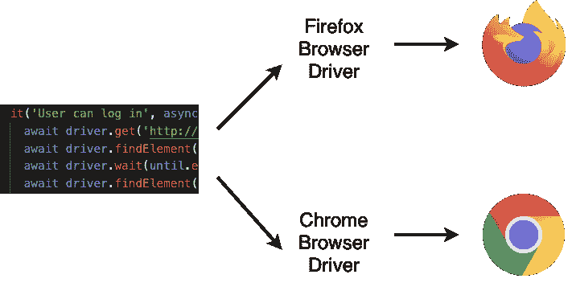
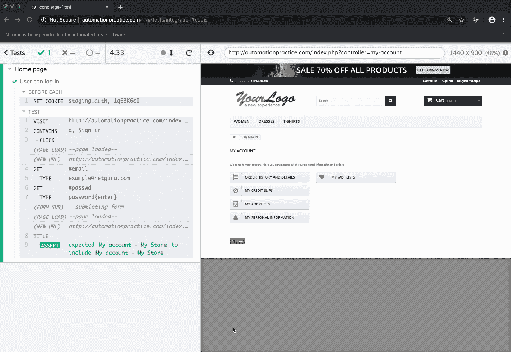
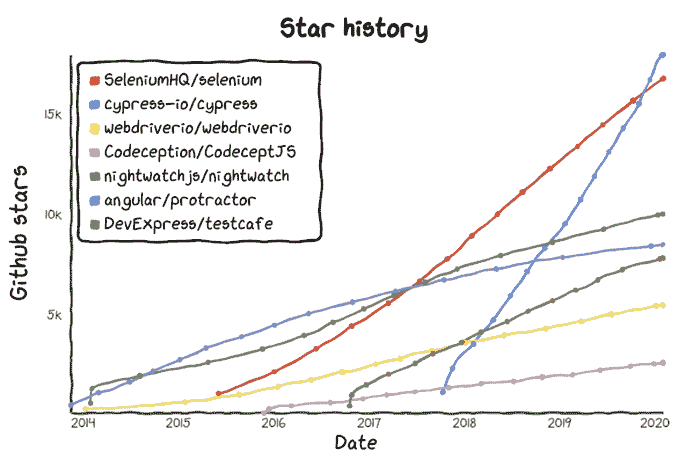

# 2020 年用哪个 JavaScript UI 测试框架？

> 原文：<http://web.archive.org/web/20230307163032/https://www.netguru.com/blog/which-javascript-ui-testing-framework-to-use-in-2020>

 现在，大多数网页都是基于 JavaScript 的。因此，使用相同的语言来编写测试是合乎逻辑的。前端开发人员可以维护测试，执行脚本，与页面自然交互，但是应该使用哪个 JS 框架呢？

市场上有这么多可用的工具，你们中的很多人可能已经在脑海中问过这个问题。有一些老的和众所周知的解决方案需要大量的配置才能启动，也有一些新奇的技术用五分钟的设置和清晰的文档吸引着我们。

我将尽我所能来回顾一些最受欢迎的，并提供一个总结，每一个的利弊。我将专注于端到端(E2E) UI 测试，因为这是我的专业领域。

## **Selenium web driver+JavaScript**

您可能已经听说过 Selenium WebDriver。它是最受欢迎的开源测试框架，经常为其他自动化框架提供动力。它的一些最大的优点是它是通用的、健壮的，并且可以和任何浏览器一起使用。除此之外，它有一个庞大的活跃用户社区，你可以很容易地在互联网上找到问题的答案。另一方面，它不是很快，需要更多的知识来正确设置。要获得漂亮的包装函数，您需要自己编写它们。

 

**利弊**

*   多种浏览器支持
*   大社区
*   高度可配置

**缺点**

*   陡峭的学习曲线
*   需要大量的设置
*   不是最快的一个

**示例包括登录**

```
 it('User can log in', async () => {
  await driver.get('http://automationpractice.com/index.php');
  await driver.findElement(By.xpath('//div[@class="header_user_info"]')).click()
  await driver.wait(until.elementLocated(By.id('email')));
  await driver.findElement(By.id('email')).sendKeys('example@netguru.com')
  await driver.findElement(By.id('passwd')).sendKeys('password', Key.RETURN)
  await driver.wait(until.titleContains("My account"));
  driver
    .getTitle()
    .then(title => {
      expect(title).toEqual('My account - My Store');
    });
}); 
```

## **柏树**

Cypress 在 2017 年出现时在市场上相当新鲜，其受欢迎程度正在稳步增长。它提供了一个一体化的解决方案，需要很少的设置，并且不基于 Selenium。阅读它的文档，你可以知道它是为了方便用户而设计的。有一个优秀的、极简的运行器，你可以在上面观看你的测试一页一页地进行，你甚至可以偷看每一步。与 Selenium 相比，一个最重要的缺点是仅限于基于 Chromium 的浏览器和 Firefox，这是最近才添加的支持。一些功能仍然不是内置的，需要工作区和库，比如文件上传。

**优点**

Cypress offers convenient runner

易于设置和编写

测试运行器使调试变得简单明了

*   良好的文档记录
*   **缺点**
*   仅支持基于 Chromium 的浏览器和 Firefox

缺少一些功能

*   需要付费才能解锁完整版
*   **例子**
*   **WebdriverIO**

WebdriverIO 于 2015 年首次推出。它提供了 Selenium WebDriver API 的定制实现。主要优势是通过使用 Appium 同时支持 web 和移动。按照解释每个步骤的精心编写的文档进行设置是非常容易的。该网站列出了许多样板文件，包括大多数流行的框架，如 Cucumber、Jasmine 和 Mocha。它还支持 Selenium 支持的所有浏览器。然而，它不像这里介绍的其他框架那样受欢迎，也不是所有的东西都能在 Google 上找到。API 文档不完整。

```
 it('User can log in', () => {
  cy.visit('http://automationpractice.com/index.php')
  cy.contains('a', 'Sign in').click()
  cy.get('#email').type('example@netguru.com')
  cy.get("#passwd").type('password{enter}')
  cy.title().should('include', 'My account - My Store')
}) 
```

## **优点**

易于设置

专用社区

*   Appium 支持

*   **缺点**

*   **例子**

**CodeceptJS**

利用许多其他框架，CodeceptJS 可能是这个列表中最通用的工具。配置允许用 WebDriverIO、量角器、Nightmare 和木偶助手运行测试。都共享同一个 API，所以写的代码都是一样的。您首先会注意到的是特定的语法；测试是场景驱动的开箱即用。代码可以被非技术人员阅读和理解，允许他们帮助编写测试。一切都有很好的文档记录，而且，与 Cypress 类似，甚至有一个测试 UI，您可以在其中看到每个测试步骤的快照，并轻松地调试它。

```
 it('User can log in', () => {
    browser.url('http://automationpractice.com/index.php')
    $('a=Sign in').click()
    $('#email').setValue('example@netguru.com')
    $('#passwd').setValue('password')
    browser.keys('Enter')
    const title = browser.getTitle()
    assert.strictEqual(title, 'My account - My Store')
}) 
```

## **优点**

**缺点**

**例如**

Nightwatch.js

当我进入 E2E 测试时，Nightwatch.js 这个框架吸引了我的注意。当时，设置和简洁的语法是我的主要优势。现在，安装仍然很快，但是文档并没有包含你需要的所有信息，其他框架已经做得更好了。它还使用 Selenium Webdriver，因此您可以访问所有浏览器。该框架提供了所有需要的功能，但都处于平均水平。根据您的用例，您可能想要使用另一个工具。

```
 Scenario('User can log in', (I) => {
  I.amOnPage('http://automationpractice.com/')
  I.click('Sign in')
  I.fillField('#email', 'example@netguru.com')
  I.fillField('#passwd', 'password')
  I.pressKey('Enter')
  I.seeInTitle('My account - My Store')
}); 
```

## **优点**

**缺点**

弱文档

有限的功能

*   缓慢的性能

*   **例子**

*   量角器

量角器是本文中提到的最古老的框架之一。它是由 AngularJS 的创建者专门用来测试 Angular 应用程序的，但它也可以用于其他页面。它曾经广受欢迎和推荐，但现在却因为其他工具而不再受欢迎。它使用 Selenium，因此它提供了多种浏览器支持，甚至可以并行运行这些测试。适合角度应用，它包括有用的选择器和功能。设置很容易，但调试可能需要一些时间，对新手来说可能很难。它没有其他框架提供的内置等待功能。就个人而言，在这个时候，如果你的应用程序不使用 Angular，我不会为此而烦恼，即使这样，我也会考虑其他选择。

```
 'User can log in': function (browser) {
  browser
    .url('http://automationpractice.com/')
    .waitForElementVisible('body')
    .click('a.login')
    .setValue('#email', 'example@netguru.com')
    .setValue('#passwd', 'password')
    .click('#SubmitLogin')
    browser.assert.title("My account - My Store")
    .end()
}
```

## **优点**

**缺点**

难以调试

人气下降

*   **例子**
*   测试咖啡馆

TestCafe 类似于 Cypress 与其他框架相比非常新鲜。还有，就像柏树一样，它不是建立在硒元素上的。它提供了一个名为 TestCafe IDE 的测试运行程序，但它不仅仅是一个 Cypress runner。您可以在那里构建测试，完全跳过编写代码。不幸的是，这是一个付费的解决方案——你可以免费使用 30 天，费用是每年 250 美元。

```
 it('User can log in', function() {
  var EC = protractor.ExpectedConditions;
  browser.waitForAngularEnabled(false);
  browser.get('http://automationpractice.com')
  element(by.linkText('Sign in')).click()
  browser.wait(EC.presenceOf(element(by.css('body'))), 5000)
  element(by.id('email')).sendKeys('example@netguru.com')
  element(by.id('passwd')).sendKeys('password')
  element(by.id('SubmitLogin')).click()
  expect(browser.getTitle()).toEqual('My account - My Store')
}); 
```

## 与 Cypress 相比，TestCafe 提供了多种浏览器支持，包括移动版本，并且它几乎可以开箱即用。我不必下载或安装任何浏览器驱动程序或特定的浏览器版本。我只是用不同的参数运行了一个命令，它成功了。还有智能断言查询机制，它自动等待更改发生并重试检查。当测试运行时，一个大的指针显示哪个元素正在被交互。唯一的缺点可能是语法，事实上您仍然需要考虑 JS 异步性，Cypress 巧妙地包装了它，允许您编写同步代码。

**优点**

**缺点**

摘要

所有的框架都有其优点和缺点。对我来说，最重要的是可达性。使用像 Cypress 和 TestCafe 这样的现代工具，你可以感觉到它们是为了解决上一代测试软件的问题而设计的。我重视的另一件事是我的测试同行的社区和支持。让我们来看看下面的图表，它显示了 GitHub 上每个存储库的星级数。

## Summary

All frameworks have their pros and cons. For me, the most important thing is accessibility. With modern tools like Cypress and TestCafe, you can feel they were made to address the pains of the previous generation of testing software. Another thing I value is the community and support of my testing peers. Let's take a look at the graph below which shows the number of stars for each repository on GitHub over time.

正如你所看到的，代表柏树的蓝线正在快速上升，最近甚至超过了硒。在我看来，这证明了它与平易近人相结合的有用性。是因为 Cypress 被开发人员和测试人员广泛接受和喜欢。因此，它也是我向几乎所有人推荐的首选。如果你不要求支持更多的浏览器，你应该试一试。

Graph by [https://star-history.t9t.io/](http://web.archive.org/web/20221007200214/https://star-history.t9t.io/)

第二名是 TestCafe，因为它也完全跳过了 Selenium，你可能知道也可能不知道，Selenium 有时很不稳定。TestCafe 感觉像一个健壮而完整的包。IDE 是一个不错的选择，但是没有必要编写测试。

第三名，我想说，是 Codecept，因为它独特的方法和对浏览器和移动应用程序的支持。唯一让我担心的是它不够普及。

是硒时代的终结吗？还没有，但是我认为我们正在到达那里。我在总结中不推荐 Selenium，因为我认为它最好与其他语言一起使用，比如 Java 或 Python。虽然，如果你正在寻找一个低风险的企业解决方案，它可能适合你。

自动化快乐！

照片由金奎大·斯蒂文斯拍于T4【Unsplash】上

Happy automating!

* * *

Photo by Daan Stevens on [Unsplash](http://web.archive.org/web/20221007200214/https://unsplash.com/?utm_source=unsplash&utm_medium=referral&utm_content=creditCopyText)