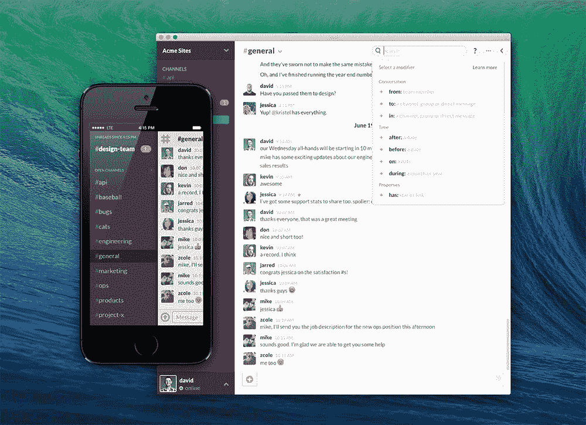
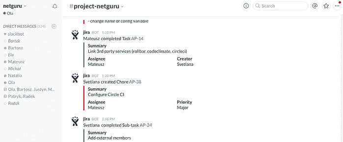
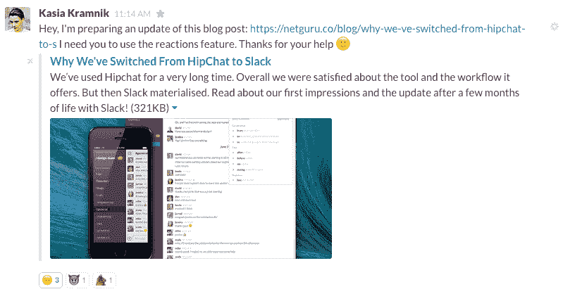

# 为什么我们从 HipChat 转向 Slack

> 原文：<http://web.archive.org/web/20230307163032/https://www.netguru.com/blog/why-we-ve-switched-from-hipchat-to-s>

 我们使用 Hipchat 已经很长时间了。总的来说，我们对该工具及其提供的工作流程感到满意。但随后懈怠变成了现实。

我们已经听说了很多关于在公司里用松弛的方式进行交流的革命性方法，所以我们决定试一试。在试用期间，我们迁移了几个与客户端无关的房间(只是为了测试和使用它),我们很快就习惯了——以至于我们不想再回到 Hipchat。在本帖中，我们想分享我们对 Netguru 使用的这个新工具有多高兴。

最重要的事情是:简单的用户列表管理，基本的工具集成，OS X 应用和支持。我们从私人 Skype 对话、电子邮件标签、群组等方面尝试了许多解决方案。，但似乎没有什么对我们来说是完美的。

当我们尝试 Slack 时，一切都变了。首先，我们终于找到了一种简单的方法来管理用户列表，而不是手动邀请用户，我们进行了批量导入。然后，我们用不到 30 秒的时间添加了基本的**集成**和我们使用的工具！我们喜欢开箱即用附加软件:Airbrake、CircleCI、CodeClimate、Dropbox、Github、Google Drive、Hangouts、IFTTT 等等。刚刚成功了！Slack 也有网络、移动和桌面应用。我们也喜欢非常方便的受限账户、访客账户和完整账户管理。

使用他们提供的一个基本工具，我们**将所有同事导入到应用程序**中，我们的项目管理团队对他们的客户做了同样的事情。我们还创建了单独的项目通道，使用约定的“项目名称”,这使我们可以轻松地在不同的组之间进行操作和切换。

所有这些都促使我们完全迁移到 Slack。我们从一开始就在 3 天内全面投入运营。

## 透明度

我们非常重视 netguru 的透明度和开放合作。一旦我们迁移到 Slack，我们决定**在内部开放我们的渠道**，这样每个团队成员都可以访问项目的房间。对于我们的流程，这意味着开发人员可以快速加入项目，并且不需要管理(或请求)权限。通过完全访问聊天历史，从一个项目切换到另一个项目的过程前所未有地顺畅:从能够阅读边缘案例及其解决方案，到快速进行无障碍对话。

我们的项目管理、devops 和其他房间对其他人开放，这样每个人都可以作为团队成功的一员**。开发人员没有从其他团队中分离出来——我们都平等地合作。很酷，是吧？**

 **## 现成的集成

我们并没有意识到 Slack 会节省我们多少时间，但是一旦我们开始使用集成，这是显而易见的！每个项目的渠道都有自己独特的集成，可以满足客户和开发人员的需求。

### 绕圈圈圈圈圈圈圈圈圈圈圈圈圈圈圈圈圈圈圈圈圈圈圈圈圈圈圈圈圈圈圈圈圈圈圈圈圈圈圈圈圈圈圈圈圈圈圈圈

其中大多数都添加了 [CircleCI](http://web.archive.org/web/20221007083131/https://circleci.com/) 集成。每次我们将代码部署到临时或生产服务器时，开发人员和客户都会在聊天室中得到红色或绿色的通知**。这为我们节省了时间！只要一切顺利，开发人员就不必等待在 CircleCI 网站上检查构建状态。如果失败了，通知将作为一个松散的聊天消息发送，并带有一个到构建的直接链接。**

你可能知道，我们使用[吉拉](http://web.archive.org/web/20221007083131/https://www.netguru.com/blog/why-we-switched-from-pivotal-tracker-to-jira)来帮助我们将项目目标和问题组织成任务(故事)。这是一个简单的工具，但是占用了开发者的时间来检查评论、拒绝故事等等。当我们将吉拉与 Slack 整合在一起时，我们不再需要检查一切。一旦票证被 QA 团队成员解决或有人重新打开，我们就会收到通知。很简单。

共同气候

还有更严重的用例，如服务器问题和异常通知。如果某个应用程序由于某种原因无法访问或者出现了错误，显然我们知道得越早，修复得就越快。这就是使用这种集成将操作时间从几分钟缩短到几秒钟的原因。每个人都得到通知，有人可以快速反应。我们还集成了 [CodeClimate](http://web.archive.org/web/20221007083131/https://codeclimate.com/) 。这有助于客户和我们这些开发人员了解为什么代码质量会提高或降低，这样我们就能始终保持项目的完美状态。

### 构建定制集成

我们花时间开发内部工具，让我们的工作更快乐、更快捷。这就是为什么我们有一个用于代码审查的内部应用程序，它保持项目中的所有提交都得到审查(阅读[为什么我们要进行代码审查](http://web.archive.org/web/20221007083131/https://www.netguru.com/blog/a-quick-guide-to-peer-code-review))。一旦我们迁移到 Slack，我们编写了一个基本的 Rails API，它返回基本的数据，比如*多少提交需要被审查*或者*你应该联系谁来检查你的项目*。多亏了 Slack，将你的应用与这样的 API 集成起来变得很简单。我们定义了一些关键词，比如:触发应用程序发出 API 请求并等待响应的“交易项目名称”，然后将请求发送到聊天室。

## 我们只花了 3 个小时就完成了这件事。我们还有一个名为 PropsApp 的开源项目的专用集成。这是一个基本的应用程序，让你以一种极客的方式说“谢谢”。该应用程序使用一个简单的 gem[‘slack-notifier’](http://web.archive.org/web/20221007083131/https://github.com/stevenosloan/slack-notifier)。从开发人员的角度来看，这只是 2 行代码的问题，我们在公共频道上有很好的适当通知。

更新！使用 Slack 几个月

几个月过去了，我们越来越习惯于在 Slack 启动屏幕上用一句可爱的引言开始我们的一天。我们很高兴使用这个应用程序进行我们的内部对话，并与客户或合作团队合作。一些事情保持不变，而另一些随着时间的推移而演变。

## 像项目支持者一样偷懒

从一开始，我们就喜欢 Slack 的灵活性。每当你需要问一个与你在某个特定时刻正在解决的问题相关的问题时，你可以很容易地在不同的渠道之间转换。你是一个需要一些开发者建议的测试人员吗？没问题- **跳转到专用频道！**您在准备研讨会或网上研讨会时需要帮助吗？简单地邀请你的家人到一个频道并开始对话。好的一面是，你可以随时随地快速建立你的频道。这非常方便，例如在研讨会或网络研讨会期间。

## 要知道 Slack 里的沟通工具有两个层次:**渠道和组织。**一个组织可以拥有多个渠道。我们也为特定的目的使用组织，例如，如果我们想将关于开源项目的讨论与其他讨论分开。它帮助您保持所有通道有序，并防止在消息过载中丢失。

此外，Slack 是将大多数工具粘在一起的粘合剂。我们一直在使用具有不同功能的工具的集成:

文件存储:Google Drive 和 Dropbox

对于项目进度跟踪:Pivotal Tracker，Trello

*   对于代码质量检查:CircleCI，GitHub，Code Climate
*   对于营销和销售活动:HubSpot
*   只工作不娱乐……团队建设停滞不前
*   我上面提到的听起来非常实际，也应该如此，但是我们也有**集成，让我们保持有趣和相互支持的网络大师精神。**每天，我们都会通过 [IFTTT](http://web.archive.org/web/20221007083131/https://ifttt.com/) 从 Tumblr 获得[每日 Devops 反应](http://web.archive.org/web/20221007083131/http://devopsreactions.tumblr.com/) gif，以便在早上开怀大笑。此外，我们继续使用我们的道具应用程序的内部集成。在 Netguru，你可以用极客的方式感谢！

## 此外，我们可以用**自定义表情符号:**和新的**反应功能**来表达我们的情绪——你可以在消息下添加任何表情符号作为对它的反应。他们的工作与脸书相似。在我们的黑客马拉松中，我们也集成了 HipBot。这只是另一个集成，可以响应用户关于笑话、天气或任何你想要的信息。

What I mentioned above sounds very practical, and it should, but we also have **integrations that let us maintain the Netguru spirit of fun and mutual support.** Every day, we get a [Daily Devops Reaction](http://web.archive.org/web/20221007083131/http://devopsreactions.tumblr.com/) gif from Tumblr via [IFTTT](http://web.archive.org/web/20221007083131/https://ifttt.com/) to have a few laughs in the morning. Also, we keep using an internal integration with our Props app. At Netguru, you can thank in a geeky way!

What's more, we can express our emotions with **custom emojis :)** and the new **reactions feature** - you can add any emoji under a message as a reaction to it. They work similarly to Facebook likes. During our hackathon, we integrated HipBot as well. It's just another integration that responds to user messages about jokes, weather or whatever you want.

看看帖子下面的图标！

你想在你的公司引入 Slack 吗？很棒的选择！或者您有过一些使用经验，想分享一下您的观察结果？欢迎在评论中留言。

Check out the icons under the post!

Are you tempted to introduce Slack in your company? Great choice! Or maybe you’ve had some experience in using it and want to share your observations? Feel free to drop a line in a comment.**